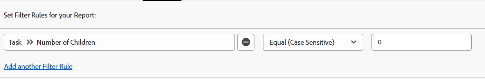

# 筛选器：显示父级任务

<!--Audited: 10/2024-->

您可以应用下面的任务筛选器以显示工作任务。 工作任务是可以独立工作的任务，不是其他任务的父级任务。 在一个示例中，过滤器标识了可能是父任务的子任务。 在这种情况下，他们无法执行任务。

>[!TIP]
>
>* 如果您考虑向报表中添加多个筛选器，我们建议您在添加所有其他筛选器规则后，使用Report Builder界面并单击切换到文本模式来添加所有筛选器。 然后，您可以添加父任务过滤器的代码，如上所述。 
>* 我们还建议您为项目名称添加分组，以使报告更易于阅读。 有关向报表中添加分组的更多信息，请参阅Adobe Workfront中的[分组概述](../../../reports-and-dashboards/reports/reporting-elements/groupings-overview.md)一文。
>

## 访问要求

+++ 展开以查看本文中各项功能的访问要求。

您必须具有以下权限才能执行本文中的步骤：

<table style="table-layout:auto"> 
 <col> 
 <col> 
 <tbody> 
  <tr> 
   <td role="rowheader">Adobe Workfront计划</td> 
   <td> <p>任何</p> </td> 
  </tr> 
  <tr> 
   <td role="rowheader">Adobe Workfront许可证*</td> 
   <td> 
    <p>新增：</p>
   <ul><li><p>修改过滤器的参与者 </p></li>
   <li><p>用于修改报告的标准</p></li> </ul>

<p>当前：</p>
   <ul><li><p>请求修改筛选器 </p></li>
   <li><p>计划修改报告</p></li> </ul></td> 
  </tr> 
  <tr> 
   <td role="rowheader">访问级别配置</td> 
   <td> <p>编辑对报告、功能板和日历的访问权限以修改报告</p> <p>编辑对筛选器、视图和分组的访问权限以修改筛选器</p> </td> 
  </tr> 
  <tr> 
   <td role="rowheader">对象权限</td> 
   <td> <p>管理报表的权限</p>  </td> 
  </tr> 
 </tbody> 
</table>

*有关信息，请参阅Workfront文档中的[访问要求](/help/quicksilver/administration-and-setup/add-users/access-levels-and-object-permissions/access-level-requirements-in-documentation.md)。

+++

## 显示没有子级的任务（它们可以有父级）

可将以下过滤器应用于任务报告，以显示无子代的任务。 他们可以有自己的父母，也可以做其他工作的子女。

1. 从右上角的&#x200B;**主菜单** 或左上角的&#x200B;**主菜单** （如果可用），单击&#x200B;**报表**。

1. 单击&#x200B;**新建报告**。
1. 选择&#x200B;**任务报告**。
1. 单击&#x200B;**筛选器**。
1. 单击&#x200B;**添加筛选器规则**。
1. 在&#x200B;**开始键入字段名称……**&#x200B;行中，开始键入&#x200B;**子项数**，然后在子项数显示在列表中时单击&#x200B;**任务>>子项数**。

1. 为您的修饰符选择&#x200B;**等于（区分大小写）**，然后为子项数输入&#x200B;**0**。\
   

   或

   单击&#x200B;**切换到文本模式**，然后在文本编辑窗口中复制并粘贴以下文本

   ```
   numberOfChildren=0
   numberOfChildren_Mod=eq
   ```


1. 单击&#x200B;**保存+关闭**。

   这会拉出系统中正在执行任务的所有任务的报告。 其中一些任务可以具有父级任务，但它们本身不是父级任务。

## 与父项（他们可能有子项）显示任务

您可以将以下过滤器应用于任务报告，以显示带有父级的任务，即父级任务为子级任务。 但是，这些任务也可能具有自己的子项，因为过滤器不排除其子项。 作为其他任务的父项的子项任务不被视为工作任务。

1. 从右上角的&#x200B;**主菜单** 或左上角的&#x200B;**主菜单** （如果可用），单击&#x200B;**报表**。

1. 单击&#x200B;**新建报告**。
1. 选择&#x200B;**任务报告**。
1. 单击&#x200B;**筛选器**。
1. 单击&#x200B;**添加筛选器规则**。
1. 在&#x200B;**开始键入字段名称……**&#x200B;行中，开始键入&#x200B;**父项ID**，然后在父项ID显示在列表时选择&#x200B;**任务>>父项ID**。
1. 为您的修饰符选择&#x200B;**Is Not Blank**。

   

   或

   单击&#x200B;**切换到文本模式**，然后在文本编辑窗口中复制并粘贴以下文本： 

   `parentID_Mod=notblank`

1. 单击&#x200B;**保存+关闭**。

   这会拉出系统中具有父任务且是这些父任务的子任务的所有任务的报告。 其中一些任务本身可能是父任务。

## 显示没有子项和父项的任务（独立任务）

可将以下过滤器应用于任务报告，以显示独立的工作任务。 这些任务没有父项，也没有自己的子项。

1. 从右上角的&#x200B;**主菜单** 或左上角的&#x200B;**主菜单** （如果可用），单击&#x200B;**报表**。

1. 单击&#x200B;**新建报告**。
1. 选择&#x200B;**任务报告**。
1. 单击&#x200B;**筛选器**。
1. 单击&#x200B;**添加筛选器规则**。
1. 在&#x200B;**开始键入字段名称……**&#x200B;行开始键入&#x200B;**子项数**，然后从列表中选择&#x200B;**任务>>子项数**。
1. 为您的修饰符选择&#x200B;**等于（区分大小写）**，然后为子项数输入&#x200B;**0**。
1. 单击&#x200B;**添加另一个筛选器规则**。
1. 在&#x200B;**开始键入字段名称……**&#x200B;行开始键入&#x200B;**父ID**，然后从列表中选择&#x200B;**任务>>父ID**。
1. 为修饰符选择&#x200B;**Is Blank**。

   

   或

   不是步骤6-10 <!--ensure steps above stay accurate-->，请单击&#x200B;**切换到文本模式**，然后在文本编辑窗口中，复制并粘贴以下文本：

   ```
   numberOfChildren=0
   numberOfChildren_Mod=eq
   parentID_Mod=isblank
   ```

1. 单击&#x200B;**保存+关闭**。

   这会拉出系统中所有没有父代或子代的任务的报告。 这些是独立的工作任务。
