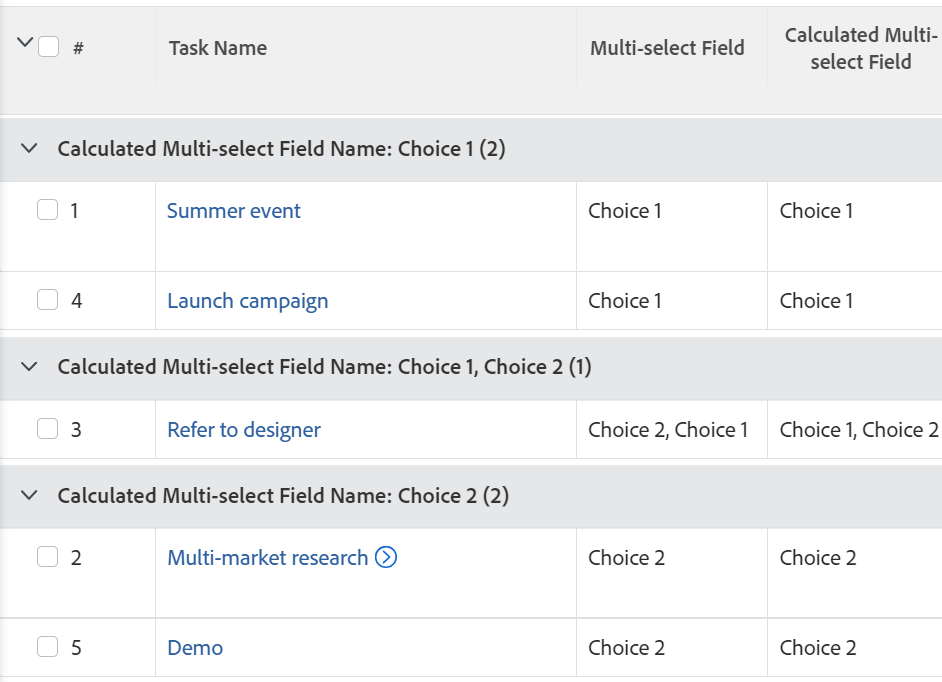

# 按多选自定义字段对报表分组

您只能使用文本模式，在Adobe Workfront报表的多选自定义字段中按值分组。

多选自定义字段的示例包括：

* 复选框
* 多选下拉菜单

有关使用文本模式的信息，请参阅文章 [文本模式概述](../../../reports-and-dashboards/reports/text-mode/understand-text-mode.md).

## 按多选自定义字段分组时的注意事项

* 不能绘制使用文本模式分组的报表图表。 您需要创建一个参考多选自定义字段的附加计算字段，以便按照多选自定义字段的值绘制报表的图表。

  有关更多信息，请参阅 [按多选自定义字段绘制报表图表](../../../reports-and-dashboards/reports/custom-view-filter-grouping-samples/chart-report-by-multi-select-custom-field.md).
* 具有任何选定选项的项目仅被计数一次。

  例如，如果您有一个复选框自定义字段，其中选项1和选项2为选项，并且您将表单附加到任务，则同时选择了选项1和选项2的任务与仅选择了选项1或选项2的任务分开分组。

## 访问要求

您必须具有以下权限才能执行本文中的步骤：

<table style="table-layout:auto"> 
 <col> 
 <col> 
 <tbody> 
  <tr> 
   <td role="rowheader">Adobe Workfront计划*</td> 
   <td> 
任何
 </td> 
  </tr> 
  <tr> 
   <td role="rowheader">Adobe Workfront许可证*</td> 
   <td> 
请求修改分组 

   
计划修改报告
 </td> 
  </tr> 
  <tr> 
   <td role="rowheader">访问级别配置*</td> 
   <td> 
编辑对报告、功能板和日历的访问权限以修改报告
 
编辑对筛选器、视图和分组的访问权限以修改分组
 
<b>注释</b>

如果您仍然没有访问权限，请咨询Workfront管理员是否对您的访问级别设置了其他限制。 有关Workfront管理员如何修改您的访问级别的信息，请参阅 <a href="../../../administration-and-setup/add-users/configure-and-grant-access/create-modify-access-levels.md" class="MCXref xref">创建或修改自定义访问级别</a>.
 </td>
</tr>  
  <tr> 
   <td role="rowheader">对象权限</td> 
   <td> 
管理报表的权限
 
有关请求其他访问权限的信息，请参阅 <a href="../../../workfront-basics/grant-and-request-access-to-objects/request-access.md" class="MCXref xref">请求访问对象 </a>.
 </td> 
  </tr> 
 </tbody> 
</table>

*要了解您拥有的计划、许可证类型或访问权限，请联系您的Workfront管理员。

## 按多选自定义字段对报表进行分组

要按多选自定义字段进行分组，您必须满足以下先决条件：

* 在自定义表单中构建多选自定义字段。\
  有关构建自定义表单以及向其中添加自定义字段的信息，请参阅文章 [创建或编辑自定义表单](../../../administration-and-setup/customize-workfront/create-manage-custom-forms/create-or-edit-a-custom-form.md).

* 将自定义表单附加到对象。
* 在每个对象上使用值填充多选自定义字段。 

要在报表中按多选自定义字段分组，请执行以下操作：

1. 创建一个报表或编辑一个现有的报表，您要在该报表中为多选自定义字段添加分组。\
   有关创建报告的信息，请参阅文章 [创建自定义报表](../../../reports-and-dashboards/reports/creating-and-managing-reports/create-custom-report.md).

1. 选择 **分组** 选项卡。
1. 单击 **切换到文本模式**.

1. 选择以下文件中的文本 **对您的报告进行分组** 框并将其替换为以下代码：

   <pre>
   group.0.displayname=多选自定义字段名称group.0.valueexpression={DE：多选自定义字段名称} group.0.valueformat=HTML组。0.textmode=true
   </pre>

1. 将“多选自定义字段名称”替换为您在Workfront中显示的多选自定义字段的实际名称。
1. 单击 **保存并关闭**.

   报告中的对象按多选自定义字段的值分组。

   

   报表分组的名称是多选自定义字段的名称，后跟在该字段中选择的值。

<!--

<h2>Chart a report by multi-select Custom Fields</h2>

(NOTE: this moved to its own article, linked in the Note above!)

You cannot build a chart in a report by referencing a multi-select custom field. Instead, you can create a calculated field that records the values of the multi-select custom field on a given object and group by the calculated field.&nbsp;

<ul>
<li><a href="#build-a-calculated-custom-field-that-references-a-multi-select-custom-field" class="MCXref xref">Build a calculated custom field that references a multi-select custom field</a> </li>
<li><a href="#build-a-chart-that-references-a-calculated-custom-field" class="MCXref xref">Build a chart that references a calculated custom field</a> </li>
</ul>

<strong>Build a calculated custom field that references a multi-select custom field</strong>

To be able to build a calculated field that references a multi-select custom field, you must have the following prerequisites:

<ul>
<li>Build the multi-select custom field in a custom form. For information about building custom forms and adding custom fields to them, see the article <a href="../../../administration-and-setup/customize-workfront/create-manage-custom-forms/create-or-edit-a-custom-form.md" class="MCXref xref">Create or edit a custom form</a>.</li>
<li>Attach the custom form to objects.</li>
<li>Populate the multi-select custom field with a value on each object.</li>
</ul>

To build the calculated custom field that references the multi-select custom field:

<ol>
<li value="1">Create a custom form, or edit an existing one. For information about creating custom forms, see the article <a href="../../../administration-and-setup/customize-workfront/create-manage-custom-forms/create-or-edit-a-custom-form.md" class="MCXref xref">Create or edit a custom form</a>.</li>
<li value="2">Click<strong>Add a Field</strong>, then <strong>Calculated</strong> to add the multi-select custom field to the form.</li>
<li value="3">In the <strong>Label</strong> box, name the new calculated field to indicate that it references the multi-select custom field. For example: "Calculated Multi-select Field."</li>
<li value="4"> 
In the <strong>Calculation</strong> box, enter the following code:
<pre>{DE:Multi-select Custom Field}</pre> 
    
 </li>
<li value="5">Replace "Multi-select Custom Field" with the actual name of your multi-select custom field, as it appears in Workfront.</li>
<li value="6"> 
(Optional) If the multi-select custom field is already on this form and if this form is already attached to objects, enable the <strong>Update previous calculations</strong>&nbsp;option.
 
This ensures that the new field is automatically populated with the value from the multi-select custom field as it is added to the forms attached to the objects already.
 </li>
<li value="7">Click <strong>Done</strong>.</li>
<li value="8">Click <strong>Save +Close</strong>.</li>
</ol>

<strong>Build a chart that references a calculated custom field</strong>

<ol>
<li value="1"> Go to the report where you want to add the chart for the calculated field that references the multi-select custom field. </li>
<li value="2"> (Optional) To ensure that all the calculated fields that you want to chart by are populated with values, select all the objects in your report, then click <strong>Edit</strong>. </li>
<li value="3"> 
 (Optional and conditional) Enable the <strong>Recalculate Custom Expressions</strong> field, then click <strong>Save Changes</strong>.
 
    
 </li>
<li value="4"> Click <strong>Report Actions</strong>, then <strong>Edit</strong>. </li>
<li value="5">Select the <strong>Groupings</strong> tab, then click <strong>Add Grouping</strong>. </li>
<li value="6">Add the<strong>Calculated Multi-select Field</strong> you created as your grouping. </li>
<li value="7"> 
Select the <strong>Chart</strong> tab, and add a chart to your report.
 
For information about adding a chart to a report, see the section <a href="../../../reports-and-dashboards/reports/creating-and-managing-reports/create-custom-report.md#add-a-chart" class="MCXref xref">Add a chart to a report</a> in the article <a href="../../../reports-and-dashboards/reports/creating-and-managing-reports/create-custom-report.md" class="MCXref xref">Create a custom report</a>. 
 </li>
<li value="8">Select the <strong>Calculated Multi-select Field</strong> as one of the fields to display in the chart. </li>
<li value="9"> 
Click <strong>Save + Close</strong>.
 
The report displays the results grouped by the Calculated Multi-select Field in a chart. 
 </li>
</ol>

-->
