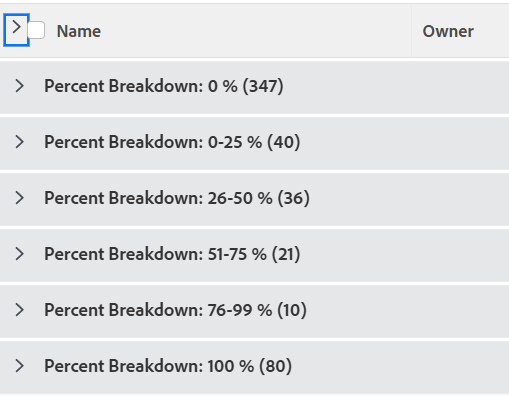

# 分组：项目百分比细分1

<!--Audited: 10/2024-->

在此自定义项目分组中，您可以显示按项目完成百分比值范围分组的项目。 划分显示25%点增量的完成百分比值：0-25%、26-50%、51-75%等。

以下分组按完成百分比值将项目组织到以下分组之一：

* 0%
* 1-25%
* 26-50%
* 51-75%
* 76-99%
* 100%



## 访问权限要求

+++ 展开可查看本文所述功能的访问权限要求。 

<table style="table-layout:auto"> 
 <col> 
 <col> 
 <tbody> 
  <tr> 
   <td role="rowheader">Adobe Workfront 包</td> 
   <td> <p>“任一”</p> </td> 
  </tr> 
  <tr> 
   <td role="rowheader">Adobe Workfront许可证</td> 
   <td> 
   <p>用于修改过滤器的参与者或请求 </p>
   <p>用于修改报表的标准或计划</p>
  </tr> 
  <tr> 
   <td role="rowheader">访问级别配置</td> 
   <td> <p>编辑对报表、功能板、日历的访问权限以修改报表</p> <p>编辑对筛选器、视图、分组的访问权限以修改筛选器</p> </td> 
  </tr> 
  <tr> 
   <td role="rowheader">对象权限</td> 
   <td> <p>管理对报告的权限</p>  </td> 
  </tr> 
 </tbody> 
</table>

有关此表中信息的更多详细信息，请参阅Workfront文档中的[访问要求](/help/quicksilver/administration-and-setup/add-users/access-levels-and-object-permissions/access-level-requirements-in-documentation.md)。

+++

## 按项目百分比细分分组

要应用此分组，请执行以下操作：

1. 转到项目列表。
1. 从&#x200B;**分组**&#x200B;下拉菜单中选择&#x200B;**新建分组**。

1. 单击&#x200B;**切换到文本模式**。
1. 删除框中的文本，并将以下代码粘贴到可用空间：

   ```
   group.0.linkedname=direct
   group.0.name=Percent Breakdown
   group.0.notime=false
   group.0.valueexpression=IF({percentComplete}=0,"0 %",IF({percentComplete}<=26,"0-25 %",IF({percentComplete}<=51,"26-50 %",IF({percentComplete}<=76,"51-75 %",IF({percentComplete}<100,"76-99 %","100 %")))))
   group.0.valueformat=string
   ```

1. 单击&#x200B;**完成** > **保存分组**。
1. （可选）更新分组的名称，然后单击&#x200B;**保存分组**。
