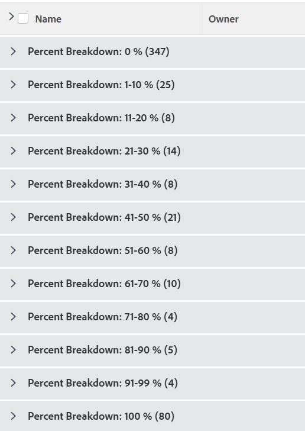

# 分组：项目百分比细分2

<!--Audited: 10/2024-->

在此自定义项目分组中，您可以显示按完成百分比值范围分组的项目。 细分显示完成百分比值10%点增量：0-10%、11-20%、21-30%等。

以下分组按完成百分比值将项目组织到这些分组之一：

* 0%
* 1-10%
* 11-20%
* 21-30%
* 31-40%
* 41-50%
* 51-60%
* 61-70%
* 71-80%
* 81-90%
* 91-99%
* 100%



## 访问权限要求

+++ 展开可查看本文所述功能的访问权限要求。 

<table style="table-layout:auto"> 
 <col> 
 <col> 
 <tbody> 
  <tr> 
   <td role="rowheader">Adobe Workfront 包</td> 
   <td> <p>“任一”</p> </td> 
  </tr> 
  <tr> 
   <td role="rowheader">Adobe Workfront许可证</td> 
   <td> 
   <p>修改过滤器的参与者或请求 </p>
   <p>用于修改报告的标准或计划</p>
  </tr> 
  <tr> 
   <td role="rowheader">访问级别配置</td> 
   <td> <p>编辑报表、仪表板、日历的访问权限以修改报表</p> <p>编辑筛选器、视图、组的访问权限以修改筛选器</p> </td> 
  </tr> 
  <tr> 
   <td role="rowheader">对象权限</td> 
   <td> <p>管理对报告的权限</p>  </td> 
  </tr> 
 </tbody> 
</table>

有关此表中的信息的更多详细信息，请参阅Workfront文档中的[访问要求](/help/quicksilver/administration-and-setup/add-users/access-levels-and-object-permissions/access-level-requirements-in-documentation.md)。

+++

## 按项目百分比细分分组

要应用此分组，请执行以下操作：

1. 转到项目列表。
1. 从&#x200B;**分组**&#x200B;下拉菜单中，选择&#x200B;**新建分组**。

1. 单击&#x200B;**切换到文本模式**。
1. 移除框中的文本，并将以下代码粘贴到可用空间中：

   ```
   group.0.linkedname=direct
   group.0.name=Percent Breakdown
   group.0.notime=false
   group.0.valueexpression=IF({percentComplete}=0,"0 %",IF({percentComplete}<=11,"1-10 %",IF({percentComplete}<=21,"11-20 %",IF({percentComplete}<=31,"21-30 %",IF({percentComplete}<41,"31-40 %",IF({percentComplete}<51,"41-50 %",IF({percentComplete}<61,"51-60 %",IF({percentComplete}<71,"61-70 %",IF({percentComplete}<81,"71-80 %",IF({percentComplete}<91,"81-90 %",IF({percentComplete}<100,"91-99 %","100 %")))))))))))
   textmode=true
   ```

1. 单击&#x200B;**完成** > **保存分组**。
1. （可选）更新组的名称，然后单击&#x200B;**保存组**。
