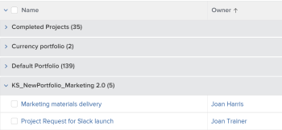

# 分組：編輯分組中的顯示名稱

您可以將群組重新命名為使用者更熟悉的名稱。

例如，將標準Portfolio名稱分組套用至專案清單時，分組的名稱會顯示為 *Portfolio：名稱：`<name of portfolio>`*.


您可以使用文字模式來修改此群組，以顯示更易於閱讀的名稱。


## 存取需求

您必須具有下列存取權才能執行本文中的步驟：

<table style="table-layout:auto"> 
 <col> 
 <col> 
 <tbody> 
  <tr> 
   <td role="rowheader">Adobe Workfront計畫*</td> 
   <td> <p>任何</p> </td> 
  </tr> 
  <tr> 
   <td role="rowheader">Adobe Workfront授權*</td> 
   <td> <p>請求修改群組 </p>
   <p>計畫修改報告</p> </td> 
  </tr> 
  <tr> 
   <td role="rowheader">存取層級設定*</td> 
   <td> <p>編輯報告、儀表板、行事曆的存取權以修改報告</p> <p>編輯對篩選器、檢視、群組的存取權以修改群組</p> <p><b>注释</b>

如果您仍然沒有存取權，請詢問您的Workfront管理員是否對您的存取層級設定了其他限制。 如需有關Workfront管理員如何修改您的存取層級的資訊，請參閱 <a href="../../../administration-and-setup/add-users/configure-and-grant-access/create-modify-access-levels.md" class="MCXref xref">建立或修改自訂存取層級</a>.</p> </td>
</tr>  
  <tr> 
   <td role="rowheader">物件許可權</td> 
   <td> <p>管理報表的許可權</p> <p>如需請求其他存取許可權的詳細資訊，請參閱 <a href="../../../workfront-basics/grant-and-request-access-to-objects/request-access.md" class="MCXref xref">要求物件的存取權 </a>.</p> </td> 
  </tr> 
 </tbody> 
</table>

&#42;若要瞭解您擁有的計畫、授權型別或存取權，請聯絡您的Workfront管理員。

## 編輯群組中的顯示名稱

若要變更專案群組中的顯示名稱：

1. 前往專案清單。
1. 從 **分組**&#x200B;下拉式功能表，選取 **新群組**.

1. 按一下 **新增群組**，並開始輸入「Portfolio名稱」 **首先由：** 欄位，然後在清單中顯示時選取它。

1. 按一下 **切換至文字模式**.
1. 完成下列任一項作業：

   * 將下列程式碼新增至中可用的現有文字 **將報表分組** 方塊：

      ```
      group.0.displayname=Your
      ```

      ```
      Value
      ```

      或者，在此案例中：

      ```
      group.0.displayname=Portfolio
      ```

   * 移除群組文字模式介面中所有含有「name」字樣的行，然後新增該行：

      ```
      group.0.name=Your Value
      ```

      或者，在此案例中：

      ```
      group.0.name=Portfolio
      ```

      您也可以將

      ```
      group.0.name
      ```

      行空白，在這種情況下，分組會顯示您分組依據的值名稱。

      

1. 按一下 **完成**，則 **儲存群組**.
