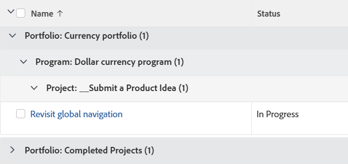

# 分组：按项目组合、项目和项目分类的任务

<!--Audited: 10/2024-->

使用此任务分组可以按项目组合、项目群以及与其关联的项目对任务进行分组。



## 访问要求

+++ 展开以查看本文中各项功能的访问要求。 

<table style="table-layout:auto"> 
 <col> 
 <col> 
 <tbody> 
  <tr> 
   <td role="rowheader">Adobe Workfront包</td> 
   <td> <p>任何</p> </td> 
  </tr> 
  <tr> 
   <td role="rowheader">Adobe Workfront许可证</td> 
   <td> 
   <p>修改过滤器的参与者或请求 </p>
   <p>用于修改报告的标准或计划</p>
  </tr> 
  <tr> 
   <td role="rowheader">访问级别配置</td> 
   <td> <p>编辑对报告、功能板和日历的访问权限以修改报告</p> <p>编辑对筛选器、视图和分组的访问权限以修改筛选器</p> </td> 
  </tr> 
  <tr> 
   <td role="rowheader">对象权限</td> 
   <td> <p>管理报表的权限</p>  </td> 
  </tr> 
 </tbody> 
</table>

有关此表中信息的更多详细信息，请参阅Workfront文档中的[访问要求](/help/quicksilver/administration-and-setup/add-users/access-levels-and-object-permissions/access-level-requirements-in-documentation.md)。

+++

## 按项目组合、项目和项目对任务进行分组

要应用此分组，请执行以下操作：

1. 转到任务列表。
1. 从&#x200B;**分组**&#x200B;下拉菜单中，选择&#x200B;**新建分组**。
1. 单击&#x200B;**添加分组**。

1. 单击&#x200B;**切换到文本模式**。
1. 删除&#x200B;**分组依据**&#x200B;区域中的文本。
1. 将文本替换为以下代码：

   ```
   group.0.linkedname=project
   group.0.namekey=portfolio
   group.0.notime=false
   group.0.valuefield=project:portfolio:name
   group.0.valueformat=string
   group.1.linkedname=project
   group.1.namekey=program
   group.1.notime=false
   group.1.valuefield=project:program:name
   group.1.valueformat=string
   group.2.name=Project
   group.2.valuefield=project:name
   group.2.valueformat=HTML
   textmode=true
   ```

1. 单击&#x200B;**完成** > **保存分组**。
1. （可选）更新分组名称，然后单击&#x200B;**保存分组**。

