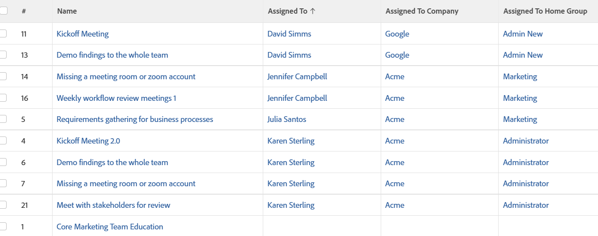

# 视图：已分配用户的公司和主组

此任务视图显示任务的主要所有者的公司和主组。 这些值在标准界面中不可用，但可通过文本模式访问。

## 访问要求

您必须具有以下权限才能执行本文中的步骤：

<table style="table-layout:auto"> 
 <col> 
 <col> 
 <tbody> 
  <tr> 
   <td role="rowheader">Adobe Workfront计划*</td> 
   <td> 
任何
 </td> 
  </tr> 
  <tr> 
   <td role="rowheader">Adobe Workfront许可证*</td> 
   <td> 
请求修改视图 

   
计划修改报告
 </td> 
  </tr> 
  <tr> 
   <td role="rowheader">访问级别配置*</td> 
   <td> 
编辑对报告、功能板和日历的访问权限以修改报告
 
编辑对筛选器、视图和分组的访问权限以修改视图
 
<b>注释</b>

如果您仍然没有访问权限，请咨询Workfront管理员是否对您的访问级别设置了其他限制。 有关Workfront管理员如何修改您的访问级别的信息，请参阅<a href="../../../administration-and-setup/add-users/configure-and-grant-access/create-modify-access-levels.md" class="MCXref xref">创建或修改自定义访问级别</a>。
 </td>
</tr> 
  <tr> 
   <td role="rowheader">对象权限</td> 
   <td> 
管理报表的权限
 
有关请求其他访问权限的信息，请参阅<a href="../../../workfront-basics/grant-and-request-access-to-objects/request-access.md" class="MCXref xref">请求访问对象</a>。
 </td> 
  </tr> 
 </tbody> 
</table>

&#42;要了解您拥有什么计划、许可证类型或访问权限，请与Workfront管理员联系。

## 查看已分配用户的公司和主组

1. 转到任务列表。
1. 从&#x200B;**视图**&#x200B;下拉菜单中，选择&#x200B;**新建视图**。

1. 在&#x200B;**列预览**&#x200B;区域，除一个列外，请删除所有列。
1. 单击其余列的标题，然后单击&#x200B;**切换到文本模式**。
1. 将鼠标悬停在文本模式区域上，然后单击&#x200B;**单击以编辑文本**。
1. 删除在&#x200B;**文本模式**&#x200B;框中找到的文本，然后将其替换为以下代码：
   <pre>column.0.descriptionkey=name  column.0.link.linkproperty.0.name=ID  column.0.link.linkproperty.0.valuefield=ID  column.0.link.linkproperty.0.valueformat=int  column.0.link.lookup=link.view  column.0.link.valuefield=objCode  column.0.link.valueformat=val  column.0.linkdname=direct  column.0.listort=string(name){name)  column.column.0.namekey=name.abbr  column.0.querysort=name  column.0.shortview=false  column.0.stretch=100  column.0.valuefield=name  column.0.valueformat=HTML  column.0.width=150  column.1.descriptionkey=assignedto  column.1.link.link.name.name=ID  column.link.link.link.link.linkproperty.0.valueproperty.0.valuevalueproperty.valueid field=assignedTo：ID  column.1.link.linkproperty.0.valueformat=int  column.1.link.lookup=link.view  column.1.link.valuefield=assignedTo：objCode  column.1.link.valueformat=val  column.1.linkedname=assignedTo  column.1.listsort=nested(assignedTo)。string(name)  column(name)  column.1.querysort=assignedTo：name  column.1.shortview=false  column.1.stretch=0  column.1.valuefield=assignedTo：name  column.1.valueformat=HTML HTML  column.1.width=150  column.2.description=Assigned To Company  column.2.linkedname=assignedTo：company  column.liststable sort=nested(assignedTo：company)。string(name)  column.2.namekey=assignedto  column.2.querysort=assignedTo:company:name  column.2.shortview=false  column.2.stretch=0  column.2.valuefield=assignedTo:company:name  column.2.valueformat=150  column.column.description=分配给主组{4 5} column.3.displayname=分配给主组  column.3.linkedname=assignedTo：homeGroup  column.3.listsort=nested(assignedTo：homeGroup)。string(name)  column.3.namekey=assignedto  column.3.querysort=assignedTo:homeGroup:name  column.3.short=false  column.3.stretch=0  column=0  column 4}name  column.3.valueformat=HTML  column.3.width=150  :homeGroup:</pre>

1. 单击&#x200B;**保存更改**。
