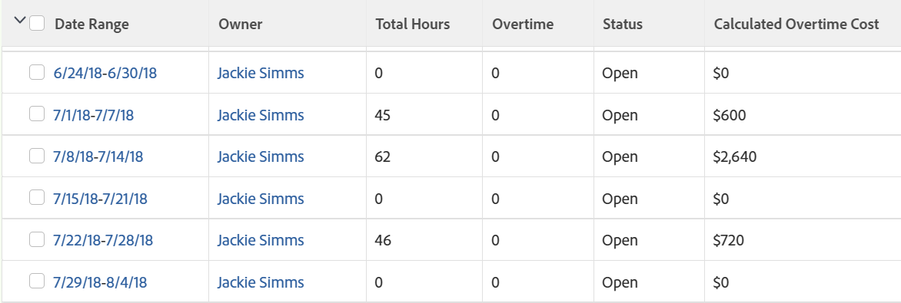

# 视图：在工时单视图中计算加班成本

<!--Audited: 11/2024-->

默认情况下，在Adobe Workfront中不计算加班，但您可以创建计算加班工时单报告。

如果用户与其配置文件中的每小时成本费率相关联，您还可以计算该用户加班的成本。\
有关将用户与每小时成本费率关联的信息，请参阅文章[配置我的设置](../../../workfront-basics/manage-your-account-and-profile/configuring-your-user-profile/configure-my-settings.md)。

>[!NOTE]
>
>在列表或报告中可以添加到时间表视图的“加班”字段，显示时间表的“加班”字段中的信息。 此信息由有权修改工时单的用户手动更新。 有关工时单中“加班”字段的详细信息，请参阅文章[工时单布局概述](../../../timesheets/timesheets/timesheet-layout.md)。



## 访问权限要求

+++ 展开可查看本文所述功能的访问权限要求。 

<table style="table-layout:auto"> 
 <col> 
 <col> 
 <tbody> 
  <tr> 
   <td role="rowheader">Adobe Workfront 包</td> 
   <td> <p>“任一”</p> </td> 
  </tr> 
  <tr> 
   <td role="rowheader">Adobe Workfront许可证</td> 
   <td> 
   <p>投稿人或请求修改筛选器 </p>
   <p>标准或计划修改报告</p>
  </tr> 
  <tr> 
   <td role="rowheader">访问级别配置</td> 
   <td> <p>编辑报表、仪表板、日历的访问权限以修改报表</p> <p>编辑筛选器、视图、组的访问权限以修改筛选器</p> </td> 
  </tr> 
  <tr> 
   <td role="rowheader">对象权限</td> 
   <td> <p>管理对报告的权限</p>  </td> 
  </tr> 
 </tbody> 
</table>

有关此表中的信息的更多详细信息，请参阅Workfront文档中的[访问要求](/help/quicksilver/administration-and-setup/add-users/access-levels-and-object-permissions/access-level-requirements-in-documentation.md)。
+++

## 在工时单视图中计算加班成本

要将计算的加班列添加到工时单视图，请执行以下操作：

1. 转到时间表列表。

1. 单击&#x200B;**视图**&#x200B;下拉菜单，然后单击&#x200B;**新建视图**。

1. 单击&#x200B;**添加列**。
1. 单击&#x200B;**切换到文本模式**，然后单击&#x200B;**编辑文本模式**。
1. 在&#x200B;**编辑文本模式**&#x200B;框中，删除框中的文本，然后复制并粘贴以下文本模式代码：

   ```
   displayname=Calculated Overtime Cost
   linkedname=direct
   namekey=totalHours
   querysort=totalHours 
   textmode=true
   valueexpression=IF({totalHours}>40,({totalHours}-40)*{user}.{costPerHour},{totalHours}*{user}.{costPerHour})
   valueformat=currencyStringCurrencyRounded
   ```

   >[!NOTE]
   >
   >此计算假定用户通常每周工作40小时。

1. 单击&#x200B;**完成**，然后为新视图命名，并在时间表列表中单击&#x200B;**保存视图**。

   每个用户的加班成本显示在&#x200B;**已计算的加班成本**&#x200B;列中。


