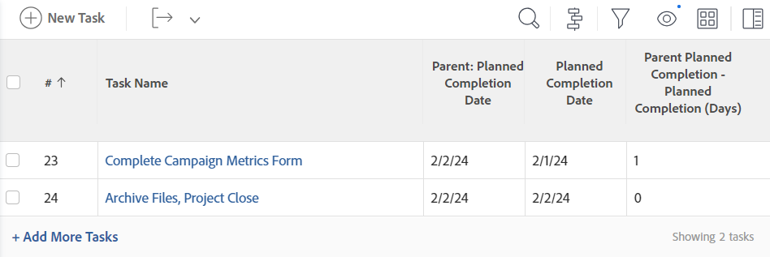

# 查看：计算时间和日期差异

<!-- Audited: 1/2024 -->

>[!IMPORTANT]
>
>在Adobe Workfront中，您无法计算同一类型的两个不同对象之间的时间和日期差异。 例如，您无法计算两个不同项目、任务或问题中两个日期之间的时间和日期差异。

您可以计算以下各项之间的差异：

* 同一对象中两个日期字段之间的时间和日期差异
* 对象上的字段与父对象上的另一个字段之间的时间和日期差异

>[!TIP]
>
>这些计算显示了两个日期之间的天数。 结果以天为单位显示。 日期字段上的时间戳也会考虑在内，如果时间戳不匹配，天数可能会后跟小数。 如果任务延迟完成，则天数显示为负值。

## 访问要求

+++ 展开以查看本文中各项功能的访问要求。

您必须具有以下权限才能执行本文中的步骤：

<table style="table-layout:auto"> 
 <col> 
 <col> 
 <tbody> 
  <tr> 
   <td role="rowheader">Adobe Workfront计划</td> 
   <td> <p>任何</p> </td> 
  </tr> 
  <tr> 
   <td role="rowheader">Adobe Workfront许可证</td> 
   <td> <p>新增： </p><ul><li><p>修改视图的参与者 </p></li><li>
   <p>用于修改报告的标准</p></li></ul><p>或</p><p>当前：</p><ul><li><p>请求修改视图 </p></li><li>
   <p>计划修改报告</p> </li><ul></td> 
  </tr> 
  <tr> 
   <td role="rowheader">访问级别配置</td> 
   <td> <p>编辑对报告、功能板和日历的访问权限以修改报告</p> <p>编辑对筛选器、视图和分组的访问权限以修改视图</p> </td> 
  </tr>  
  <tr> 
   <td role="rowheader">对象权限</td> 
   <td> <p>管理报表的权限</p>  </td> 
  </tr> 
 </tbody> 
</table>

有关此表中信息的更多详细信息，请参阅Workfront文档中的[访问要求](/help/quicksilver/administration-and-setup/add-users/access-levels-and-object-permissions/access-level-requirements-in-documentation.md)。

+++

## 计算同一对象中两个日期字段之间的时间和日期差异

例如，您可以计算任务的计划完成日期与实际完成日期之间的差值。


1. 转到任务列表。
1. 从&#x200B;**视图**&#x200B;下拉菜单中，单击&#x200B;**新建视图**。

1. 单击&#x200B;**添加列**&#x200B;并开始在&#x200B;**显示在此列**&#x200B;字段中键入“规划完成日期”，然后当它显示在列表中时将其选定。

1. 单击&#x200B;**添加列**&#x200B;并开始在&#x200B;**显示在此列**&#x200B;字段中键入“实际完成日期”，然后当它显示在列表中时将其选定。

1. 单击&#x200B;**添加列**，然后单击&#x200B;**切换到文本模式**。

1. 将鼠标悬停在文本模式区域上，然后单击&#x200B;**单击以编辑文本**。
1. 删除在&#x200B;**文本模式**&#x200B;框中找到的文本，然后将其替换为以下代码：

   ```
    displayname=Planned-Actual Completion Date
    linkedname=direct
    querysort=plannedCompletionDate
    textmode=true
    valueexpression=ROUND(DATEDIFF({plannedCompletionDate},{actualCompletionDate}),2)
    valueformat=HTML
   ```

1. 单击&#x200B;**保存**，然后单击&#x200B;**保存视图**。

## 计算对象上的字段和父对象上另一个字段之间的时间和日期差异

有关对象及其父项的列表，请参阅[了解Adobe Workfront中的对象](../../../workfront-basics/navigate-workfront/workfront-navigation/understand-objects.md)中的“了解对象的相互依赖性和层次结构”部分。\
例如，您可以计算任务的计划完成日期与其父任务或任务所在项目的计划完成日期之间的差值。



1. 转到任务列表。
1. 从&#x200B;**视图**&#x200B;下拉菜单中，单击&#x200B;**新建视图**。

1. 单击&#x200B;**添加列**&#x200B;并开始在&#x200B;**在此列显示**&#x200B;字段中键入“项目计划完成日期”或“父级完成日期”，然后当它显示在列表中时将其选中。

1. 单击&#x200B;**添加列**&#x200B;并开始在&#x200B;**显示在此列**&#x200B;字段中键入“规划完成日期”，然后当它显示在列表中时将其选定。

1. 单击&#x200B;**添加列**，然后单击&#x200B;**切换到文本模式**。

1. 将鼠标悬停在文本模式区域上，然后单击&#x200B;**单击以编辑文本**。
1. 删除您在&#x200B;**文本模式**&#x200B;框中找到的文本，然后将其替换为以下代码之一：

   * 要显示项目计划完成日期与任务计划完成日期之间的差异，请执行以下操作：

     ```
      displayname=Project Planned Completion - Task Planned Completion (Days)
      textmode=true
      valueexpression=ROUND(DATEDIFF({project}.{plannedCompletionDate},{plannedCompletionDate}),2)
      valueformat=HTML
     ```

   * 要显示父任务的计划完成日期与任务的计划完成日期之间的差异，请执行以下操作：

     ```
      valueexpression=ROUND(DATEDIFF({parent}.{plannedCompletionDate},{plannedCompletionDate}),2)
      textmode=true<br>valueformat=HTML
      displayname=Parent Planned Completion - Planned Completion (Days)
     ```

1. 单击&#x200B;**保存**，然后单击&#x200B;**保存视图**。
