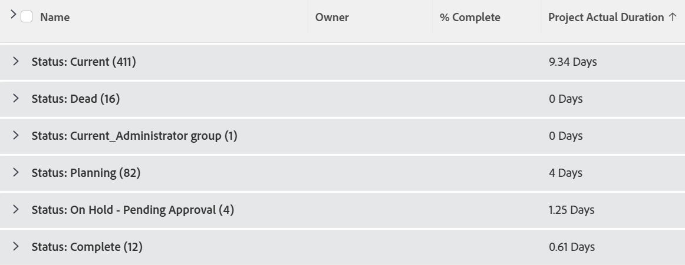

# 查看和分组：显示项目实际持续时间按分组中的平均值汇总

您可以在项目报表中添加以下列，以将累计的实际持续时间显示为分组中的平均值。

## 访问要求

您必须具有以下访问权限才能执行本文中的步骤：

<table style="table-layout:auto"> 
 <col> 
 <col> 
 <tbody> 
  <tr> 
   <td role="rowheader">Adobe Workfront计划*</td> 
   <td> 
任意
 </td> 
  </tr> 
  <tr> 
   <td role="rowheader">Adobe Workfront许可证*</td> 
   <td> 
计划 
 </td> 
  </tr> 
  <tr> 
   <td role="rowheader">访问级别配置*</td> 
   <td> 
编辑对报表、功能板、日历的访问
 
编辑对过滤器、视图、分组的访问权限
 
注意：如果您仍然没有访问权限，请咨询Workfront管理员，他们是否在您的访问级别设置了其他限制。 有关Workfront管理员如何修改访问级别的信息，请参阅 <a href="../../../administration-and-setup/add-users/configure-and-grant-access/create-modify-access-levels.md" class="MCXref xref">创建或修改自定义访问级别</a>.
 </td> 
  </tr> 
  <tr> 
   <td role="rowheader">对象权限</td> 
   <td> 
管理报表的权限
 
有关请求其他访问权限的信息，请参阅 <a href="../../../workfront-basics/grant-and-request-access-to-objects/request-access.md" class="MCXref xref">请求对对象的访问 </a>.
 </td> 
  </tr> 
 </tbody> 
</table>

&#42;要了解您拥有的计划、许可证类型或访问权限，请联系您的Workfront管理员。

## 显示项目实际持续时间按分组中的平均值汇总

要将此列添加到项目视图，请执行以下操作：

1. （推荐）要获得最佳结果并查看实际持续时间的累计平均值，您必须在项目列表或报表中添加一个分组。\
   有关创建分组的更多信息，请参阅文章 [Adobe Workfront中的分组概述](../../../reports-and-dashboards/reports/reporting-elements/groupings-overview.md).

1. 转到现有项目视图。
1. 展开“视图”下拉菜单，然后选择 **自定义视图**.
1. 单击 **添加列**.
1. 单击 **切换到文本模式**.
1. 将鼠标悬停在 **在此列中显示** ，然后单击 **单击以编辑文本**.

1. 删除“文本模式”框中的所有文本，并将其替换为以下代码：

   <pre>congregator.displayformat=compound  aggregator.function=AVG  regator.namekey=view.relatedcolumn  aggreator.namekeyargkey=actualduration  aggregator.valuefield=actualDurationMinutes  congregator.valueformat=val  displayname=项目实际持续时间  durationunitfield=durationUnit.value  linkedname=project  namekey=actualduration  namekeyargkey=actuluration  querysort=actualDurationMinutes  textmode=true  valuefield=actualDurationMinutes  valueformat=compound#M:D  viewalias=actualduration</pre>

1. 单击 **保存视图**.
