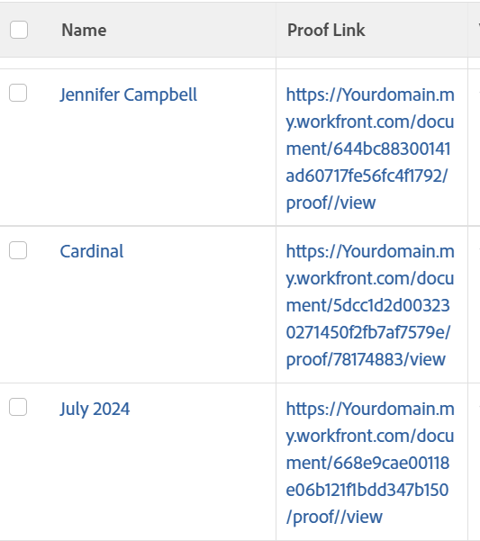

# 查看：文档报告，带有指向验证的链接

<!--Audited: 11/2024-->

在此文档视图中，您可以插入指向文档当前版本的验证的链接。



## 访问要求

+++ 展开以查看本文中各项功能的访问要求。

您必须具有以下权限才能执行本文中的步骤：

<table style="table-layout:auto"> 
 <col> 
 <col> 
 <tbody> 
  <tr> 
   <td role="rowheader">Adobe Workfront计划</td> 
   <td> <p>任何</p> </td> 
  </tr> 
  <tr> 
   <td role="rowheader">Adobe Workfront许可证*</td> 
   <td> 
    <p>新增：</p>
   <ul><li><p>修改过滤器的参与者 </p></li>
   <li><p>用于修改报告的标准</p></li> </ul>

<p>当前：</p>
   <ul><li><p>请求修改筛选器 </p></li>
   <li><p>计划修改报告</p></li> </ul></td> 
  </tr> 
  <tr> 
   <td role="rowheader">访问级别配置</td> 
   <td> <p>编辑对报告、功能板和日历的访问权限以修改报告</p> <p>编辑对筛选器、视图和分组的访问权限以修改筛选器</p> </td> 
  </tr> 
  <tr> 
   <td role="rowheader">对象权限</td> 
   <td> <p>管理报表的权限</p>  </td> 
  </tr> 
 </tbody> 
</table>

*有关信息，请参阅Workfront文档中的[访问要求](/help/quicksilver/administration-and-setup/add-users/access-levels-and-object-permissions/access-level-requirements-in-documentation.md)。

+++

## 查看文档报告，其中包含指向验证的链接

要应用此视图，请执行以下操作：

1. 转到文档列表。
1. 从&#x200B;**视图**&#x200B;下拉菜单中，选择&#x200B;**新建视图**。
1. 单击&#x200B;**添加列**。
1. 单击&#x200B;**切换到文本模式**，然后单击&#x200B;**编辑文本模式**。
1. 删除在&#x200B;**编辑文本模式**&#x200B;框中找到的文本，然后将其替换为以下代码：

   ```
   displayname=Proof Link
   shortview=true
   textmode=true
   valueexpression=CONCAT("https://Your domain.my.workfront.com/document/",{currentVersion}.{ID},"/proof/",{currentVersion}.{proofID},"/view")
   valueformat=HTML
   ```

   >[!TIP]
   >
   >将“您的域”替换为您的实际Workfront域。 例如，如果贵公司的Workfront URL是&#x200B;*Company.my.workfront.com*，则您的域是“公司”。

1. 单击&#x200B;**完成**，然后单击&#x200B;**保存视图**。
1. （可选）更新视图名称，然后单击&#x200B;**保存视图**。
1. （可选）要确保只显示带验证的文档，请执行以下操作来添加过滤器：

   1. 单击&#x200B;**筛选器**&#x200B;下拉菜单，然后单击&#x200B;**新建筛选器**。
   1. 单击&#x200B;**添加筛选器规则**&#x200B;并开始键入“校样所有者”，然后当它在列表中显示时，选择&#x200B;**校样所有者ID**。
   1. 为筛选器修饰符选择&#x200B;**Is Not Blank**。
   1. 单击&#x200B;**保存筛选器**。
   1. （可选）更新筛选器名称，然后单击&#x200B;**保存筛选器**。

1. 单击验证链接列中的链接可访问文档最新版本的验证。
