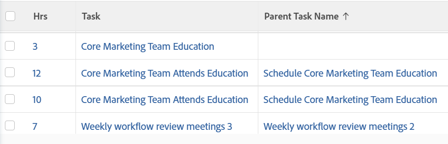

# View: hours with parent task information

<!--Audited: 11/2024-->

This hour view displays the name of the task where the hours were logged as well as the name of the parent task.



## 访问权限要求

+++ 展开可查看本文所述功能的访问权限要求。

<table style="table-layout:auto"> 
 <col> 
 <col> 
 <tbody> 
  <tr> 
   <td role="rowheader">Adobe Workfront 包</td> 
   <td> <p>“任一”</p> </td> 
  </tr> 
  <tr> 
   <td role="rowheader">Adobe Workfront许可证</td> 
   <td> 
   <p>投稿人或修改视图的请求 </p>
   <p>标准或计划修改报告</p>
  </tr> 
  <tr> 
   <td role="rowheader">访问级别配置</td> 
   <td> <p>编辑报表、仪表板、日历的访问权限以修改报表</p> <p>编辑对筛选器、视图、组的访问权限以修改视图</p> </td> 
  </tr> 
  <tr> 
   <td role="rowheader">对象权限</td> 
   <td> <p>管理对报告的权限</p>  </td> 
  </tr> 
 </tbody> 
</table>

有关此表中的信息的更多详细信息，请参阅Workfront文档中的[访问要求](/help/quicksilver/administration-and-setup/add-users/access-levels-and-object-permissions/access-level-requirements-in-documentation.md)。


+++

## View hours with parent task information

1. 转到小时列表。
1. 从&#x200B;**视图**&#x200B;下拉菜单中，选择&#x200B;**新建视图**。

1. 在&#x200B;**列预览**&#x200B;区域中，删除除一列之外的所有列。
1. Click the header of the remaining column, then click **Switch to Text Mode**.
1. Click **Edit Text Mode**.
1. 删除在&#x200B;**编辑文本模式**&#x200B;框中找到的文本，并将其替换为以下代码：


   ```
   column.0.aggregator.displayformat=doubleAsString
   column.0.aggregator.function=SUM
   column.0.aggregator.namekey=hours
   column.0.aggregator.valuefield=hours
   column.0.aggregator.valueformat=doubleAsDouble
   column.0.descriptionkey=hours
   column.0.link.linkproperty.0.name=ID
   column.0.link.linkproperty.0.valuefield=ID
   column.0.link.linkproperty.0.valueformat=int
   column.0.link.lookup=link.view
   column.0.link.valuefield=objCode
   column.0.link.valueformat=val
   column.0.linkedname=direct
   column.0.listsort=doubleAsDouble(hours)
   column.0.namekey=hours.abbr
   column.0.querysort=hours
   column.0.shortview=false
   column.0.stretch=100
   column.0.valuefield=hours
   column.0.valueformat=doubleAsString
   column.0.width=150
   column.1.descriptionkey=task
   column.1.link.linkproperty.0.name=ID
   column.1.link.linkproperty.0.valuefield=task:ID
   column.1.link.linkproperty.0.valueformat=int
   column.1.link.lookup=link.view
   column.1.link.valuefield=task:objCode
   column.1.link.valueformat=val
   column.1.linkedname=task
   column.1.listsort=nested(task).string(name)
   column.1.namekey=task
   column.1.querysort=task:name
   column.1.shortview=false
   column.1.stretch=0
   column.1.valuefield=task:name
   column.1.valueformat=HTML
   column.1.width=150
   column.2.description=Parent Task Name
   column.2.link.linkproperty.0.name=ID
   column.2.link.linkproperty.0.valuefield=task:parent:ID
   column.2.link.linkproperty.0.valueformat=int
   column.2.link.lookup=link.view
   column.2.link.valuefield=task:objCode
   column.2.link.valueformat=val
   column.2.linkedname=task
   column.2.listsort=nested(task:parent).string(name)
   column.2.name=Parent Task Name
   column.2.querysort=task:parent:name
   column.2.shortview=false
   column.2.stretch=0
   column.2.valuefield=task:parent:name
   column.2.valueformat=HTML
   column.2.width=150
   ```

1. Click **Done**, then **Save View**.

