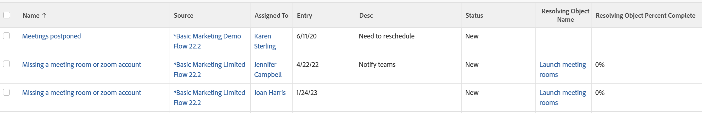

# 视图：解析对象详细信息时出现问题

<!--Audited: 11/2024-->

此问题视图显示问题的解决对象的名称和完成百分比，允许问题创建者使insight进入问题进程，即使无法访问解决任务或项目。

此视图使用`sharecol=true`标记在同一列标题下组合多个字段。 有关`sharecol`标记的详细信息，请参阅[视图：合并一个共享列中多个列的信息](../../../reports-and-dashboards/reports/custom-view-filter-grouping-samples/view-merge-columns.md)。



## 访问要求

+++ 展开以查看本文中各项功能的访问要求。

<table style="table-layout:auto"> 
 <col> 
 <col> 
 <tbody> 
  <tr> 
   <td role="rowheader">Adobe Workfront包</td> 
   <td> <p>任何</p> </td> 
  </tr> 
  <tr> 
   <td role="rowheader">Adobe Workfront许可证</td> 
   <td> 
   <p>修改视图的参与者或请求 </p>
   <p>用于修改报告的标准或计划</p>
  </tr> 
  <tr> 
   <td role="rowheader">访问级别配置</td> 
   <td> <p>编辑对报告、功能板和日历的访问权限以修改报告</p> <p>编辑对筛选器、视图和分组的访问权限以修改视图</p> </td> 
  </tr> 
  <tr> 
   <td role="rowheader">对象权限</td> 
   <td> <p>管理报表的权限</p>  </td> 
  </tr> 
 </tbody> 
</table>

有关此表中信息的更多详细信息，请参阅Workfront文档中的[访问要求](/help/quicksilver/administration-and-setup/add-users/access-levels-and-object-permissions/access-level-requirements-in-documentation.md)。


+++

## 查看有关解析对象详细信息的问题

1. 转到问题列表。
1. 从&#x200B;**视图**&#x200B;下拉菜单中，选择&#x200B;**新建视图**。

1. 在&#x200B;**列预览**&#x200B;区域，除一个列外，请删除所有列。
1. 单击其余列的标题，单击&#x200B;**切换到文本模式**，然后单击&#x200B;**编辑文本模式**。
1. 删除在&#x200B;**编辑文本模式**&#x200B;框中找到的文本，然后将其替换为以下代码：

   ```
   column.0.querysort=name
   column.0.stretch=0
   column.0.valuefield=name
   column.0.valueformat=HTML
   column.0.width=150
   column.1.descriptionkey=sourceobject
   column.1.linkedname=direct
   column.1.listsort=nested(referenceObject).HTML(name)
   column.1.namekey=sourceobject.abbr
   column.1.shortview=false
   column.1.stretch=0
   column.1.valuefield=referenceObject:name
   column.1.valueformat=HTML
   column.1.viewalias=source
   column.1.width=100
   column.2.descriptionkey=assignedto
   column.2.link.linkproperty.0.name=ID
   column.2.link.linkproperty.0.valuefield=assignedTo:ID
   column.2.link.linkproperty.0.valueformat=int
   column.2.link.lookup=link.view
   column.2.link.valuefield=assignedTo:objCode
   column.2.link.valueformat=val
   column.2.linkedname=assignedTo
   column.2.listsort=nested(assignedTo).string(name)
   column.2.namekey=assignedto
   column.2.querysort=assignedTo:name
   column.2.shortview=false
   column.2.stretch=25
   column.2.valuefield=assignedTo:name
   column.2.valueformat=HTML
   column.2.width=150
   column.3.descriptionkey=entrydate
   column.3.linkedname=direct
   column.3.listsort=atDateAsAtDate(entryDate)
   column.3.namekey=entrydate.abbr
   column.3.querysort=entryDate
   column.3.shortview=false
   column.3.stretch=0
   column.3.valuefield=entryDate
   column.3.valueformat=atDate
   column.3.width=150
   column.4.descriptionkey=description
   column.4.linkedname=direct
   column.4.listsort=string(description)
   column.4.namekey=description.abbr
   column.4.querysort=description
   column.4.shortview=false
   column.4.stretch=75
   column.4.valuefield=description
   column.4.valueformat=HTML
   column.4.width=150
   column.5.descriptionkey=status
   column.5.enumclass=com.attask.common.constants.OpTaskStatusEnum
   column.5.linkedname=direct
   column.5.listsort=string(status)
   column.5.namekey=status.abbr
   column.5.querysort=status
   column.5.shortview=false
   column.5.stretch=0
   column.5.type=enum
   column.5.valuefield=status
   column.5.valueformat=val
   column.5.width=150
   column.6.displayname=Resolving Object Name
   column.6.linkedname=resolveTask
   column.6.namekey=view.relatedcolumn
   column.6.namekeyargkey.0=resolveTask
   column.6.namekeyargkey.1=name
   column.6.querysort=resolveTask:name
   column.6.sharecol=true
   column.6.textmode=true
   column.6.valuefield=resolveTask:name
   column.6.valueformat=HTML
   column.7.displayname=
   column.7.linkedname=resolveOpTask
   column.7.namekey=view.relatedcolumn
   column.7.namekeyargkey.0=resolveOpTask
   column.7.namekeyargkey.1=name
   column.7.querysort=resolveOpTask:name
   column.7.sharecol=true
   column.7.textmode=true
   column.7.valuefield=resolveOpTask:name
   column.7.valueformat=HTML
   column.8.displayname=
   column.8.linkedname=resolveProject
   column.8.namekey=view.relatedcolumn
   column.8.namekeyargkey.0=resolveProject
   column.8.namekeyargkey.1=name
   column.8.querysort=resolveProject:name
   column.8.textmode=true
   column.8.valuefield=resolveProject:name
   column.8.valueformat=HTML
   column.9.displayname=Resolving Object Percent Complete
   column.9.textmode=true
   column.9.valueexpression=IF(ISBLANK({resolveTask}.{ID}),{resolveProject}.{percentComplete},IF(ISBLANK({resolveProject}.{ID}),{resolveTask}.{percentComplete},''))
   column.9.valueformat=doubleAsPercentRounded
   ```

1. 单击&#x200B;**完成** > **保存视图**。
1. （可选）更新视图名称，然后单击&#x200B;**保存视图**。
