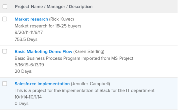

# 视图：多行项目视图

<!--Audited: 11/2024-->

在此项目视图中，您可以：

* 以多行格式显示项目信息。\
  视图使用`sharecol=true`标记在同一列标题下组合多个字段。 要了解有关此标记的更多信息，请参阅[视图：合并一个共享列中多个列的信息](../../../reports-and-dashboards/reports/custom-view-filter-grouping-samples/view-merge-columns.md)。

* 使用包含HTML换行符(`<br>`)的占位符列，强制在项目名称下方显示描述，例如。
* 在项目名称后面的括号中显示项目所有者。
* 将项目名称显示为指向项目的链接。



## 访问要求

+++ 展开以查看本文中各项功能的访问要求。

<table style="table-layout:auto"> 
 <col> 
 <col> 
 <tbody> 
  <tr> 
   <td role="rowheader">Adobe Workfront包</td> 
   <td> <p>任何</p> </td> 
  </tr> 
  <tr> 
   <td role="rowheader">Adobe Workfront许可证</td> 
   <td> 
   <p>修改视图的参与者或请求 </p>
   <p>用于修改报告的标准或计划</p>
  </tr> 
  <tr> 
   <td role="rowheader">访问级别配置</td> 
   <td> <p>编辑对报告、功能板和日历的访问权限以修改报告</p> <p>编辑对筛选器、视图和分组的访问权限以修改视图</p> </td> 
  </tr> 
  <tr> 
   <td role="rowheader">对象权限</td> 
   <td> <p>管理报表的权限</p>  </td> 
  </tr> 
 </tbody> 
</table>

有关此表中信息的更多详细信息，请参阅Workfront文档中的[访问要求](/help/quicksilver/administration-and-setup/add-users/access-levels-and-object-permissions/access-level-requirements-in-documentation.md)。

+++

## 构建多行项目视图

1. 转到项目列表。
1. 从&#x200B;**视图**&#x200B;下拉菜单中，单击&#x200B;**新建视图**。
1. 移除视图中的所有列（除一列外）。
1. 选择其余列，然后单击&#x200B;**切换到文本模式**，然后单击&#x200B;**编辑文本模式**。
1. 删除&#x200B;**编辑文本模式**&#x200B;中的文本，然后将下面的文本模式复制并粘贴到列中：

   ```
   column.0.linkedname=direct
   column.0.link.valueformat=val
   column.0.link.linkproperty.0.name=ID
   column.0.link.linkproperty.0.valuefield=ID
   column.0.link.linkproperty.0.valueformat=int
   column.0.link.valuefield=objCode
   column.0.link.lookup=link.view
   column.0.sharecol=true
   column.0.descriptionkey=name
   column.0.width=150
   column.0.querysort=name
   column.0.valuefield=name
   column.0.name=Project Name / Manager / Description
   column.0.shortview=false
   column.0.stretch=100
   column.0.textmode=true
   column.0.listsort=string(name)
   column.0.valueformat=HTML
   column.1.valueexpression=CONCAT(" (",{owner}.{name},")")
   column.1.listsort=nested(owner).string(name)
   column.1.width=1
   column.1.linkedname=direct
   column.1.querysort=owner:name
   column.1.textmode=true
   column.1.shortview=false
   column.1.stretch=0
   column.1.valueformat=HTML
   column.1.sharecol=true
   column.2.width=1
   column.2.value=
   column.2.shortview=false
   column.2.sharecol=true
   column.2.stretch=0
   column.2.textmode=true
   column.2.valueformat=HTML
   column.3.styledef.style=font-color:#ccc;
   column.3.descriptionkey=description
   column.3.linkedname=direct
   column.3.valuefield=description
   column.3.listsort=string(description)
   column.3.querysort=description
   column.3.namekey=description.abbr
   column.3.textmode=true
   column.3.sharecol=true
   column.3.stretch=0
   column.3.shortview=false
   column.3.valueformat=HTML
   column.3.width=1
   column.4.shortview=false
   column.4.value=
   column.4.sharecol=true
   column.4.width=1
   column.4.textmode=true
   column.4.valueformat=HTML\
   column.4.stretch=0
   column.5.name=Planned Dates / Duration
   column.5.width=150
   column.5.querysort=plannedStartDate
   column.5.sharecol=true
   column.5.stretch=0
   column.5.textmode=true
   column.5.shortview=false
   column.5.linkedname=direct
   column.5.listsort=atDateAsAtDate(plannedStartDate)
   column.5.valuefield=plannedStartDate
   column.5.valueformat=atDate
   column.6.sharecol=true
   column.6.stretch=0
   column.6.width=1
   column.6.textmode=true
   column.6.value=-
   column.6.valueformat=HTML
   column.6.shortview=false
   column.7.namekey=plannedcompletiondate.abbr
   column.7.width=1
   column.7.sharecol=true
   column.7.shortview=false
   column.7.stretch=0
   column.7.listsort=atDateAsAtDate(plannedCompletionDate)
   column.7.linkedname=direct
   column.7.descriptionkey=plannedcompletiondate
   column.7.textmode=true
   column.7.querysort=plannedCompletionDate
   column.7.valueformat=atDate
   column.7.valuefield=plannedCompletionDate
   column.8.value=
   column.8.width=1
   column.8.textmode=true
   column.8.sharecol=true
   column.8.valueformat=HTML
   column.8.stretch=0
   column.9.textmode=true
   column.9.listsort=intAsInt(durationMinutes)
   column.9.stretch=0
   column.9.valuefield=durationFieldLong
   column.9.descriptionkey=duration
   column.9.viewalias=duration
   column.9.querysort=durationMinutes
   column.9.sharecol=true
   column.9.width=100
   column.9.shortview=false
   column.9.namekey=duration.abbr
   column.9.linkedname=direct
   column.9.valueformat=compound
   column.10.textmode=true
   column.10.stretch=0
   ```


1. 单击&#x200B;**完成** > **保存视图**。
