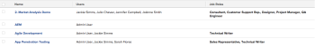

# 查看：包含所有项目团队用户和角色的项目

此项目视图显示分配给项目团队的用户和作业角色列表。

>[!NOTE]
>
>如果作业角色与用户列在同一行，则并不意味着用户正在项目中填写该角色，也不意味着用户在其配置文件中被分配了该角色。

## 访问要求

您必须具有以下访问权限才能执行本文中的步骤：

<table style="table-layout:auto"> 
 <col> 
 <col> 
 <tbody> 
  <tr> 
   <td role="rowheader">Adobe Workfront计划*</td> 
   <td> 
任意
 </td> 
  </tr> 
  <tr> 
   <td role="rowheader">Adobe Workfront许可证*</td> 
   <td> 
计划 
 </td> 
  </tr> 
  <tr> 
   <td role="rowheader">访问级别配置*</td> 
   <td> 
编辑对报表、功能板、日历的访问
 
编辑对过滤器、视图、分组的访问权限
 
注意：如果您仍然没有访问权限，请咨询Workfront管理员，他们是否在您的访问级别设置了其他限制。 有关Workfront管理员如何修改访问级别的信息，请参阅 <a href="../../../administration-and-setup/add-users/configure-and-grant-access/create-modify-access-levels.md" class="MCXref xref">创建或修改自定义访问级别</a>.
 </td> 
  </tr> 
  <tr> 
   <td role="rowheader">对象权限</td> 
   <td> 
管理报表的权限
 
有关请求其他访问权限的信息，请参阅 <a href="../../../workfront-basics/grant-and-request-access-to-objects/request-access.md" class="MCXref xref">请求对对象的访问 </a>.
 </td> 
  </tr> 
 </tbody> 
</table>

&#42;要了解您拥有的计划、许可证类型或访问权限，请联系您的Workfront管理员。

## 查看包含所有项目团队用户和角色的项目

1. 转到项目列表。
1. 从 **查看** 下拉菜单，选择 **新建视图**.

1. 在&#x200B;**列预览** ，则排除除一列之外的所有列。
1. 单击剩余列的标题，然后单击 **切换到文本模式**.
1. 将鼠标悬停在文本模式区域上，然后单击 **单击以编辑文本**.
1. 删除您在 **文本模式** ，并将其替换为以下代码：
   <pre>column.0.link.linkproperty.0.name=ID column.0.link.linkproperty.0.valuefield=ID column.0.link.linkproperty.0.valueformat=int column.0.link.lookup=link.view column.0.link.valuefield=objCode column.0.link.valueformat=val column.0.linkedname=direct column.0.listsort=string(name) column.0.namekey=name.abbr column.0.querysort=name column.0.shortview=false column.0.stretch=60 column.0.valuefield=name column.0.valueformat=HTML column.0.width=150 column.1.description=团队用户 column.1.link.linkproperty.0.name=ID column.1.link.linkproperty.0.valuefield=userID column.1.link.linkproperty.0.valueformat=int column.1.link.page=/userView.cmd column.1.listdelimiter= column.1.listmethod=nested(projectUsers)。lists column.1.namekey=user.plural column.1.stretch=30 column.1.type=interate column.1.valuefield=user.name column.1.valueformat=HTML column.1.width=150 column.2.description=团队角色 column.2.link.linkproperty.0.name=ID column.2.link.linkproperty.0.valuefield=ID column.2.link.linkproperty.0.valueformat=int column.2.link.page=/roleView.cmd column.2.listdelimiter= column.2.listmethod=nested(roles)lists column.2.namekey=jobrole.plural column.2.stretch=10 column.2.type=interate column.2.valuefield=name column.2.valueformat=HTML column.2.width=150.stretch=0</pre>

1. 单击 **保存视图**.
