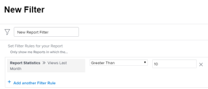

# 查看报告使用情况

<!--

(NOTE: : *** DO NOT CHANGE, REMOVE, CHANGE LINK, RENAME THIS ARTICLE- IT IS LINKED TO THE PENDO GUIDE FOR THE MAIN REPORTS AREA***)

-->

要了解系统中报告的使用范围，您可以在报告列表中查看以下信息：

* 最近10位查看报告的用户
* 在指定的时间范围内查看计数

  >[!NOTE]
  >
  >Adobe Workfront每天计算每个用户一次视图。 如果您每天多次访问同一报表，Workfront会将此报表计为一次该报表的查看。 如果同一报表被同一用户在同一天访问，Workfront会将此视为第二用户的新视图。

* 上一个查看日期
* 上次由用户查看
* 包含该报告的功能板列表\
  有关显示可能在报告列表中添加报告的报告的控制板名称的更多信息，请参阅文章[了解如何在信息板上组织报告](../../../reports-and-dashboards/reports/report-usage/understand-how-organize-reports-dashboard.md)。

您可以构建报表列表视图，以便在其中显示此信息。\
您可以按照其中的某些字段过滤报表列表。\
有关可按哪些字段筛选报告的详细信息，请参阅文章[按使用情况信息筛选报告列表](#filter-a-report-list-by-usage-information)。

## 访问要求

+++ 展开以查看本文中各项功能的访问要求。 

<table style="table-layout:auto"> 
 <col> 
 <col> 
 <tbody> 
  <tr> 
   <td role="rowheader">Adobe Workfront包</td> 
   <td> 
任何
 </td> 
  </tr> 
  <tr> 
   <td role="rowheader">Adobe Workfront许可证</td> 
   <td> 
   
标准

   
规划 
 </td> 
  </tr> 
  <tr> 
   <td role="rowheader">访问级别配置</td> 
   <td> 
编辑对报告、功能板和日历的访问权限
 
编辑对筛选器、视图、分组的访问权限
</td> 
  </tr> 
  <tr> 
   <td role="rowheader">对象权限</td> 
   <td> 
管理报表的权限
</td> 
  </tr> 
 </tbody> 
</table>

有关此表中信息的更多详细信息，请参阅Workfront文档中的[访问要求](/help/quicksilver/administration-and-setup/add-users/access-levels-and-object-permissions/access-level-requirements-in-documentation.md)。

+++

## 在报告列表视图中显示报告使用情况信息

1. 单击Workfront右上角的&#x200B;**主菜单**&#x200B;图标，然后单击&#x200B;**报表**。

1. 在报表列表中，单击&#x200B;**查看**&#x200B;下拉菜单。
1. （可选）选择&#x200B;**报告使用情况**&#x200B;视图以显示最常见的报告使用情况信息。\
   或

1. 单击&#x200B;**新建视图**&#x200B;以创建自定义视图。
1. 单击&#x200B;**添加列**。
1. 开始键入以下任何字段，并在这些字段出现在&#x200B;**Report**&#x200B;对象下的列表中时将其选中，以将其添加到新列：

   * **最近10个用户**：显示最近10个查看报告的用户的名称。
   * **查看次数**：显示以下任一时间范围内的查看次数：

      * **本月、季度、年**
      * **上个月、季度、年**
      * **所有视图**：显示报告上所有视图的总数

   * **上次查看者**：显示上次查看报告的用户的相关信息
   * **上次查看日期**：显示上次查看报告的日期

1. 单击&#x200B;**保存视图**。\
   有关报表的使用情况信息显示在添加到视图的列中。\
   您还可以为报表对象构建报表，并在报表中使用此视图。\
   有关生成报告的详细信息，请参阅文章[创建自定义报告](../../../reports-and-dashboards/reports/creating-and-managing-reports/create-custom-report.md)。\
   要构建报告，您必须具有访问级别的“编辑”报告访问权限。\
   有关访问报告的详细信息，请参阅文章[授予对报告、功能板和日历的访问权限](../../../administration-and-setup/add-users/configure-and-grant-access/grant-access-reports-dashboards-calendars.md)。

## 按使用情况信息过滤报表列表 {#filter-a-report-list-by-usage-information}

1. 单击Workfront右上角的&#x200B;**主菜单**&#x200B;图标，然后单击&#x200B;**报表**。
1. 在报表列表中，单击&#x200B;**筛选器**&#x200B;下拉菜单。
1. 单击&#x200B;**新建筛选器**，然后单击&#x200B;**添加筛选器规则**。
1. 开始键入以下任何字段，并在这些字段出现在&#x200B;**Report**&#x200B;对象下的列表中时将其选中，以将其添加为新的筛选规则：

   * **查看次数**：显示以下任一时间范围内的查看次数：

      * **本月、季度、年**
      * **上个月、季度、年**
      * **所有视图**

   * **上次查看者**：显示上次查看报告的用户的相关信息
   * **上次查看日期**：显示上次查看报告的日期

1. 为您的字段选择修饰符，然后在出现提示时指定一个值。\
   

1. 单击&#x200B;**保存筛选器**。\
   这将显示符合您定义的使用情况信息的报告列表。\
   您还可以为报表对象构建报表，并在报表中使用此过滤器。\
   有关生成报告的详细信息，请参阅文章[创建自定义报告](../../../reports-and-dashboards/reports/creating-and-managing-reports/create-custom-report.md)。 要构建报告，您必须具有访问级别的“编辑”报告访问权限。\
   有关访问报告的详细信息，请参阅文章[授予对报告、功能板和日历的访问权限](../../../administration-and-setup/add-users/configure-and-grant-access/grant-access-reports-dashboards-calendars.md)。

## 查看报表使用情况信息时出现异常

>[!IMPORTANT]
>
>自2018年3月以来，已收集了报告使用情况信息。 在此日期之前的任何信息均不可用。

处理报告使用情况信息时，应注意以下例外情况：

* 每次在功能板或自定义选项卡上显示报告时，都将被计为一个视图。 在仪表板上显示该报告的用户将显示为“最后查看者：姓名”用户，而显示仪表板的日期将显示为“最后查看日期”日期。
* Workfront不会收集内置报表的使用信息。\
  有关Workfront内置报告的详细信息，请参阅文章[使用Adobe Workfront内置报告](../../../reports-and-dashboards/reports/using-built-in-reports/use-workfront-built-in-reports.md)。

* Workfront不会收集有关已传送报表的使用信息。 已交付的报表不计为一个视图。\
  有关已传送报表的更多信息，请参阅文章[报表传送概述](../../../reports-and-dashboards/reports/creating-and-managing-reports/set-up-report-deliveries.md)。

* 当系统或组管理员以其他用户身份登录时，系统或组管理员将计算这些视图，并将其与系统或组管理员关联。
* Workfront不按自定义季度收集报表的使用信息。 报告使用情况字段中仅引用标准内置季度。
* Workfront不会收集公开共享和查看的报表的使用信息。 当他人未登录Workfront查看公共报告时，报告查看次数不计算在内。\
  有关共享报表的更多信息，请参阅文章[在Adobe Workfront中共享报表](../../../reports-and-dashboards/reports/creating-and-managing-reports/share-report.md)。
