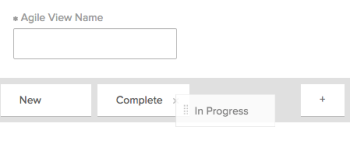

# 在Adobe Workfront中创建或编辑视图

您可以使用视图自定义在屏幕上显示的信息类型。 您可以在Adobe Workfront中使用多种类型的视图。

本文介绍了如何创建和编辑列表和报告标准视图，以及如何创建Agile视图。 有关更多信息，请参阅 [Adobe Workfront中的视图概述](../../../reports-and-dashboards/reports/reporting-elements/views-overview.md).

## 访问要求

您必须具有以下权限才能执行本文中的步骤：

<table style="table-layout:auto"> 
 <col> 
 <col> 
 <tbody> 
  <tr> 
   <td role="rowheader"><strong>Adobe Workfront计划*</strong></td> 
   <td> 
任何
 </td> 
  </tr> 
  <tr> 
   <td role="rowheader"><strong>Adobe Workfront许可证*</strong></td> 
   <td> 
请求或更高版本
 </td> 
  </tr> 
  <tr> 
   <td role="rowheader"><strong>访问级别配置*</strong></td> 
   <td> 
编辑对筛选器、视图、分组的访问权限
 
编辑对报告、功能板、日历的访问权限以在报告中创建视图
 
注意：如果您仍然没有访问权限，请咨询Workfront管理员是否对您的访问级别设置了其他限制。 有关Workfront管理员如何修改您的访问级别的信息，请参阅 <a href="../../../administration-and-setup/add-users/configure-and-grant-access/create-modify-access-levels.md" class="MCXref xref">创建或修改自定义访问级别</a>.
 </td> 
  </tr> 
  <tr> 
   <td role="rowheader"><strong>对象权限</strong></td> 
   <td> 
管理对报告的权限以创建或编辑报告中的视图
 
管理视图的权限以编辑它
 
有关请求其他访问权限的信息，请参阅 <a href="../../../workfront-basics/grant-and-request-access-to-objects/request-access.md" class="MCXref xref">请求访问对象 </a>.
 </td> 
  </tr> 
 </tbody> 
</table>

&#42;要了解您拥有的计划、许可证类型或访问权限，请联系您的Workfront管理员。

## 创建或自定义视图

创建或自定义视图的过程因您是创建或自定义标准视图还是Agile视图而异。

* [创建或自定义标准视图](#create-or-customize-a-standard-view)
* [创建或自定义敏捷视图](#create-or-customize-an-agile-view)

### 创建或自定义标准视图 {#create-or-customize-a-standard-view}

您可以创建新的标准视图，也可以自定义之前创建的现有标准视图。

1. 单击 **视图** 要创建或自定义视图的任何列表中的下拉菜单。
1. （可选）要自定义现有视图，请选择要自定义的标准视图。\
   标准视图可在Workfront的任何类型的列表（如报告、项目列表或任务列表）中使用。
1. 单击 **视图** 下拉菜单，然后单击 **自定义视图** 或 **新建视图**.\
   此 **自定义视图** 对话框随即显示。

1. 在 **列预览** 部分，执行以下任一操作：

   * 通过单击列标题并选择新字段来修改任何列的值。
   * 通过单击添加列 **添加列**，开始键入要添加列的名称，然后在它出现在下拉列表中时单击它。
   * 通过将列标题拖动到新位置来调整列的显示顺序。

      * （可选）在 **列设置** 区域，单击 **此列的汇总方式** 下拉列表，然后选择用于汇总信息的可用选项之一。 选择此选项时，列中的信息将按报表的分组进行汇总。\
        对于日期字段，您可以通过以下选项汇总值：

         * 最大
         * 最小

        对于数字和币种字段，您可以按以下选项汇总值：

         * 计数
         * Sum
         * 平均
         * 最大
         * 最小

        >[!NOTE]
        >
        >在分组中聚合以下字段的值时，以下例外适用于父对象（例如，父任务）：
        >   
        >   * 除“实际小时数”（例如，“计划/实际劳力成本”、“计划/实际费用成本”、“计划/实际成本”、“计划小时数”）之外的所有数字和货币字段仅汇总子任务和独立任务的值。 它们不会聚合父任务的值或父任务的父值。
        >   * 实际小时数聚合主父级任务和独立任务的值；它们不会聚合父级任务或子级任务的父级任务的数量。
        >   * 数字和货币值的自定义数据字段汇总所有任务：父任务、子任务、父任务的父任务和独立任务。
        >   
        >

        有关在报表中使用分组的更多信息，请参阅文章 [Adobe Workfront中的分组概述](../../../reports-and-dashboards/reports/reporting-elements/groupings-overview.md).

      * （可选）单击 **高级选项** 要为列指定以下信息：

        <table style="table-layout:auto"> 
         <col> 
         <col> 
         <tbody> 
          <tr> 
           <td role="rowheader"><strong>自定义列标签</strong></td> 
           <td>
指定列的自定义标签。 此标签将替换默认标签。
</td> 
          </tr> 
          <tr> 
           <td role="rowheader"><strong>字段格式</strong></td> 
           <td>选择您希望为列中的字段显示值的格式。</td> 
          </tr> 
          <tr> 
           <td role="rowheader"><strong>在仪表板上显示此列</strong></td> 
           <td>
当报告与其他报告并排显示时，选择此选项可在功能板上显示此列。 如果未选择此选项，则在报告并排显示的功能板上查看报告时，不会显示此列。
</td> 
          </tr> 
          <tr> 
           <td role="rowheader"><strong>列规则</strong></td> 
           <td>
单击 <strong>为此列添加规则</strong> 以定义列的规则。 添加规则后，您可以定义字段和文本样式，以显示与该规则匹配的字段。 单击 <strong>添加规则</strong> 完成规则定义之后。
</td> 
          </tr> 
         </tbody> 
        </table>

        有关在报表中有条件地设置视图格式的更多信息，请参阅文章 [在文本模式下使用条件格式](../../../reports-and-dashboards/reports/text-mode/use-conditional-formatting-text-mode.md).

1. （视情况而定）如果您单击 **高级选项**，单击 **完成**.

1. 单击 **保存视图** 创建新视图，或将当前视图替换为您所做的更改。\
   或\
   单击 **另存为新视图** 以将更改另存为新视图。

   >[!TIP]
   >
   >此 **另存为新视图** 是自定义内置Workfront视图时唯一可用的选项。

   您的访问权限规定了视图的保存方式。 如果最初创建了该视图，则可以保存更改；否则，系统会提示您保存版本。 请记住，您对视图所做的更改会影响与其共享该视图的用户。

### 创建或自定义敏捷视图 {#create-or-customize-an-agile-view}

您可以创建Agile视图或自定义之前创建的现有Agile视图。

>[!IMPORTANT]
>
>Agile视图仅在查看项目时可用。

有关Agile视图的更多信息，请参阅文章 [在Agile视图中管理项目](../../../manage-work/projects/manage-projects/manage-projects-in-agile-view.md).

>[!NOTE]
>
>此过程仅适用于旧版Agile视图，不适用于项目的展示板视图。

创建或自定义Agile视图：

1. 转到项目中的任务列表。
1. 单击 **展示板** 图标 ，然后单击 **使用旧版Agile** 在展示板视图中。

1. （视情况而定）要自定义现有Agile视图，请执行以下操作：

   1. 单击 **视图** 下拉菜单，然后选择要自定义的Agile视图。\
      您无法自定义默认的Agile视图。

   1. 单击 **视图** 再次显示下拉菜单，然后单击 **自定义视图**.\
      

1. （视情况而定）要新建Agile视图，请单击 **新建视图**.\
   此 **自定义Agile视图** 对话框随即显示。

1. 在 **自定义Agile视图** 对话框中，指定Agile视图的名称。\
   我们建议您在视图名称中包含“Agile”一词，以便用户知道这是一个Agile视图。\
   此名称显示在 **视图** 选择视图时显示的下拉菜单。

1. 定义要在敏捷视图的故事板上显示的状态列。 这些是由Workfront管理员定义的任务状态，如中所述 [创建或编辑状态](../../../administration-and-setup/customize-workfront/creating-custom-status-and-priority-labels/create-or-edit-a-status.md).

   只有系统状态可用于Agile故事板。 如果状态仅适用于您所属的单个组，则状态在敏捷故事板上不可用。 此外，在Agile视图中查看项目时，状态为仅对自定义组可用的任务不可见。

   用户可以在敏捷故事板上的这些状态列之间移动故事。\
   在定义状态列时，可以执行以下操作：

   <table style="table-layout:auto"> 
    <col> 
    <col>
    <tbody> 
     <tr> 
      <td role="rowheader"><strong>重新排序状态列：</strong> </td> 
      <td> 将状态列拖至所需的显示顺序。 </td> 
     </tr> 
     <tr> 
      <td role="rowheader"><strong>删除状态列：</strong> </td> 
      <td>单击要删除的列上的(x)图标。 除非已向视图添加自定义状态，并且该自定义状态等于“新建”，否则无法移除“新建”状态。 有关创建自定义状态的信息，请参阅 <a href="../../../administration-and-setup/customize-workfront/creating-custom-status-and-priority-labels/create-or-edit-a-status.md" class="MCXref xref">创建或编辑状态</a>.</td> 
     </tr> 
     <tr> 
      <td role="rowheader"><strong>添加状态列：</strong> </td> 
      <td> 
单击 <strong>加号</strong> 图标，然后选择要添加的状态。 将显示所有默认系统状态以及与您共享的任何自定义状态。 您最多可以配置10个要显示的状态。
</td> 
     </tr> 
    </tbody> 
   </table>

   <!--
        
(NOTE FOR ADD STATUS COLUMNS: research this and add: [! What if the status has been shared with me or a group I'm in (so I can see it here), but the status hasn't been shared with another user who also has access to a project where I later apply this view? Can that user still see this status on the project?]) 

       -->

1. 在 **将卡片颜色关联到** 区域，从以下选项中选择：

   <table style="table-layout:auto"> 
    <col> 
    <col>
    <tbody> 
     <tr> 
      <td role="rowheader"><strong>故事：</strong> </td> 
      <td>任何子任务均与父任务的颜色匹配，因此任何给定泳道中所有故事的颜色均相同。 如果任务没有任何子任务或没有父任务，则颜色在创建时随机分配给任务。</td> 
     </tr> 
     <tr> 
      <td role="rowheader"><strong>自由格式：</strong> </td> 
      <td> 默认情况下，所有信息卡都会显示为蓝色，直到用户手动更改颜色为止，如文章中所述 <a href="../../../agile/use-scrum-in-an-agile-team/scrum-board/categorize-stories-by-color.md" class="MCXref xref">在Scrum展示板上按颜色分类故事</a>. </td> 
     </tr> 
     <tr> 
      <td role="rowheader"><strong>优先级：</strong> </td> 
      <td> 
 颜色与文章优先级相关联，如下所示：
 
       <ul> 
        <li>高=红色</li> 
        <li>中=黄色</li> 
        <li>低=绿色 如果您的Workfront管理员已经为Workfront系统配置了自定义优先级，则最高优先级为红色，次高为黄色，其余为绿色。</li> 
       </ul> </td> 
     </tr> 
     <tr> 
      <td role="rowheader"><strong>任务所有者：</strong> </td> 
      <td> 具有相同主要被分配人的所有故事都具有相同的颜色。 主要被分配者是首次分配至任务的用户。 </td> 
     </tr> 
    </tbody> 
   </table>

1. 在 **敏捷** 部分，在 **其他字段** 区域，单击 **添加字段**，然后选择要添加到故事卡的字段。 （在创建自定义视图或创建报表列时，可以添加这些字段。）\
   重复此过程以向故事卡添加最多三个其他字段。\
   将字段添加到故事卡时，字段为仅查看字段，并且仅在填充字段时才显示。

   默认情况下，故事卡上会显示以下类型的数据：

   * 带有直接指向任务链接的故事名称
   * 带有直接项目链接的项目名称\
     此链接仅在开发周期上使用敏捷视图时显示；在项目上使用敏捷视图时未显示。
   * 任务描述
   * 当前承诺
   * 通过调整完成百分比本身或通过调整完成点数或小时数，查看和编辑完成百分比
   * 已分配的用户

   您可以在故事卡上显示其他数据（包括自定义数据）。 出于各种原因，您可能希望在故事卡上显示其他字段。 例如，如果您正在为项目中的多个客户处理故事，则可能需要显示客户ID，或者您可能需要显示任务开始日期。

1. 单击&#x200B;**保存**。\
   您的访问权限规定了视图的保存方式。 如果最初创建了该视图，则可以保存更改；否则，系统会提示您保存版本。 请记住，您对视图所做的更改会影响与其共享该视图的用户。

1. （可选）单击 **列表** 图标，以返回任务列表。
