# 在Adobe Workfront中创建或编辑过滤器

<!-- Audited: 11/2024 -->

您可以使用过滤器限制显示在屏幕上的项目列表中的信息量。 您可以根据有关对象的特定信息来定义某些标准，并且只显示满足这些标准的对象。

您可以在Adobe Workfront中应用以下类型的过滤器：

* 对象列表中的快速过滤器，使用关键字查找项目。 这些是临时过滤器，您无法保存以供将来使用。

  有关快速滤镜的信息，请参阅[将快速滤镜应用于列表](../../../workfront-basics/navigate-workfront/use-lists/apply-quick-filter-list.md)。

* 永久过滤器，您可以在多个列表和报告中多次保存和使用。 本文介绍如何创建永久筛选器或编辑列表或报告中现有的筛选器。

* Workfront其他区域中的筛选器，列表和报告除外。

  有关Workfront中的所有筛选器以及可应用这些筛选器的区域的列表，请参阅[筛选器概述](../../../reports-and-dashboards/reports/reporting-elements/filters-overview.md)。

## 访问权限要求

+++ 展开可查看本文所述功能的访问权限要求。

<table style="table-layout:auto"> 
 <col> 
 <col> 
 <tbody> 
  <tr> 
   <td role="rowheader">Adobe Workfront 包</td> 
   <td> 
“任一”
 </td> 
  </tr> 
  <tr> 
   <td role="rowheader">Adobe Workfront许可证</strong></td> 
   <td> 
    
用于修改过滤器的参与者或请求

    
用于修改报表中过滤器的标准或计划

   </td>
  </tr> 
  <tr> 
   <td role="rowheader">访问级别配置</td> 
   <td> 
对筛选器、视图、组的编辑访问权限
 
对报告、仪表板、日历的编辑访问权限

   </td> 
  </tr> 
  <tr> 
   <td role="rowheader">对象权限</td> 
   <td> 
管理筛选器的权限

   </td> 
  </tr> 
 </tbody> 
</table>

有关此表中信息的更多详细信息，请参阅Workfront文档中的[访问要求](/help/quicksilver/administration-and-setup/add-users/access-levels-and-object-permissions/access-level-requirements-in-documentation.md)。

+++

## 过滤器构建界面的类型

您可以使用下表所述的过滤器构建器类型来创建过滤器：

<table style="table-layout:auto">
<col>
<col>
<col>
<tbody>
<tr>
<td><strong>生成器类型</strong></td>
<td><strong>筛选对象</strong></td>
<td><strong>可用位置</strong></td>
</tr>
<tr>
<td>Standard Builder</td>
<td>
<ul>
<li> 
项目
 </li>
<li> 
任务 
 </li>
<li> 
问题
 </li>
<li> 
项目组合
 </li>
<li> 
项目群
 </li>
<li> 
用户
 </li>
<li> 
模板
 </li>
<li> 
组
 </li>
</ul>
</td>
<td>
<ul>
<li> 
列表 
 </li>
</ul>
<ul>
<li> 
方案规划器中的项目列表
 
Scenario Planner需要额外的许可证。 有关Workfront Scenario Planner的信息，请参阅<a href="../../../scenario-planner/scenario-planner-overview.md">Scenario Planner概述</a>。 
 </li>
</ul>

<b>注意：</b>
 
筛选器的标准生成器不适用于报告。
</td>
</tr>
<tr>
<td>旧版生成器</td>
<td>所有对象 </td>
<td>列表和报表</td>
</tr>
</tbody>
</table>

有关Workfront对象的信息，请参阅[了解Adobe Workfront中的对象](/help/quicksilver/workfront-basics/navigate-workfront/workfront-navigation/understand-objects.md)。

在使用不同界面创建过滤器时，请考虑以下事项：

* 您可以在上面表格中所列区域的旧版过滤器界面所在的相同位置找到标准生成器。
* 标准生成器是所有可用区域的默认体验。 若要切换到旧版筛选器生成器，请单击&#x200B;**筛选器**&#x200B;旁边的&#x200B;[!UICONTROL **更多**]&#x200B;菜单，然后选择&#x200B;[!UICONTROL **返回旧版筛选器**]。

  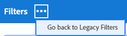

* 保存的过滤器在两个构建器中均可用，无论您最初使用哪个体验构建它们。 例如，如果使用旧版生成器创建筛选器，则也可以在标准生成器界面中查找并修改该筛选器。

  >[!TIP]
  >
  >“全部”筛选器未包含在标准生成器中，因为未应用筛选器时会显示所有列表项。 单击生成器右上角的&#x200B;[!UICONTROL **全部清除**]&#x200B;可清除所有活动的筛选器并显示所有项目。 如果&#x200B;[!UICONTROL **全部清除**]&#x200B;灰显，则不会应用任何筛选器。

* 在构建组合了AND和OR运算符的多语句过滤器时，标准构建器和旧版构建器的语法略有不同。 因此，当您从一个生成器切换到另一个生成器时，这些筛选器的显示可能会有所不同。

  >[!INFO]
  >
  >存在以下方案：
  >
  >1. 使用标准生成器可创建具有以下语法的过滤器：
  >
  >      `(A OR B) AND C`
  >
  >1. 切换到旧版生成器，并使用旧版生成器的语法编辑筛选器，如本文的“在旧版生成器中创建或编辑筛选器”[节中所述。 ](#create-filter-in-legacy-builder)旧版生成器的语法显示过滤器语句如下：
  >
  >      `A AND C`
  >      `OR`
  >      `B AND C`
  >
  >1. 对旧版界面中的过滤器进行更改。
  >1. 切换回标准生成器。 filter语句将根据旧版生成器中支持的逻辑显示，如上所述。
  >
  >      标准生成器界面中会显示该过滤器，如下所示：
  >  
  >      `A AND C`
  >      `OR`
  >      `B AND C`
  > 
  >      发生这种情况是因为在旧版界面中修改了过滤器。

## 在标准生成器中创建或编辑过滤器

您可以使用标准生成器界面通过以下方式创建过滤器：

* 从头开始
* 编辑现有过滤器
* 复制现有过滤器
* 复制现有筛选器，编辑现有筛选器并将其另存为新筛选器

使用标准生成器界面创建过滤器：

1. 转到要创建过滤器或包含要自定义的过滤器的列表。
1. 单击&#x200B;**筛选器**&#x200B;图标以打开生成器界面。

   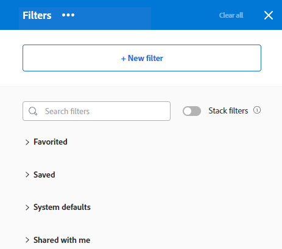

1. 查看以下过滤器列表：

   <table style="table-layout:auto">
   <col>
   <col>
   <tbody>
   <tr>
   <td role="rowheader"><strong>已收藏</strong></td>
   <td>您标记为收藏的过滤器。 当您收藏某个过滤器时，其原始位置将显示在过滤器名称下方，并且除非将其作为收藏删除，否则它将在原始列表中隐藏。</td>
   </tr>
   <tr>
   <td role="rowheader"><strong>已保存</strong></td>
   <td>您自己构建并保存的过滤器。 默认情况下，此列表以最近保存的顺序显示保存的筛选器，但可以拖动筛选器名称手动重新排序列表。</td>
   </tr>
   <tr>
   <td role="rowheader"><strong>系统默认值</strong></td>
   <td>Workfront系统默认滤镜和Workfront管理员在系统级别或在版面模板中添加到滤镜列表的滤镜。</td>
   </tr>
   <tr>
   <td role="rowheader"><strong>已与我共享</strong></td>
   <td>其他人创建并与您共享或在系统范围内共享的过滤器。</td>
   </tr>
   </tbody>
   </table>

1. 执行下列操作之一：

   * 单击&#x200B;**新建筛选器**&#x200B;以从头开始创建筛选器。
   * 将光标悬停在您有权管理的现有筛选器上，单击&#x200B;**编辑**&#x200B;图标以对其进行编辑。

     或

     将光标悬停在您有权查看的现有筛选器上，单击&#x200B;**更多**&#x200B;菜单，然后单击&#x200B;**复制**&#x200B;以复制现有筛选器并编辑副本。

   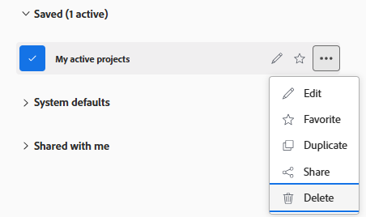

1. （条件）根据要查找与过滤器组中的所有语句匹配还是与其中任何语句匹配的对象，从下列选项中进行选择：

   <table style="table-layout:auto">
   <col>
   <col>
   <tbody>
   <tr>
   <td role="rowheader"><strong>在所有项为 true 时包含</strong></td>
   <td>过滤器找到的对象必须符合过滤器组中的所有过滤器条件。 在这种情况下，filter语句通过AND运算符连接。 这是默认选项。</td>
   </tr>
   <tr>
   <td role="rowheader"><strong>在任意项为 true 时包含</strong></td>
   <td>过滤器找到的对象必须与过滤器组中的任意过滤器条件匹配。 在这种情况下，过滤器语句通过OR运算符连接。</td>
   </tr>
   </tbody>
   </table>

   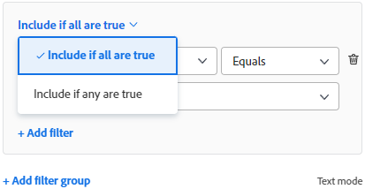

   有关筛选器运算符的详细信息，请参阅[筛选器概述](/help/quicksilver/reports-and-dashboards/reports/reporting-elements/filters-overview.md)。

1. 单击字段下拉菜单可查看最近使用的字段以及作为筛选依据的建议字段的列表。 建议的字段当前显示在您正在过滤的列表中。

   您还可以选择&#x200B;**浏览字段**&#x200B;以查看可按其筛选的所有字段的列表。 高级搜索中的字段按对象类别分组。

   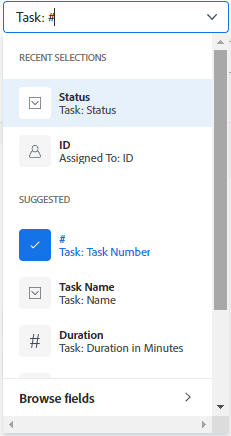

1. 单击修改量下拉菜单以选择修改量。 默认修饰符为“Equals”。

   有关详细信息，请参阅[筛选器和条件修饰符](/help/quicksilver/reports-and-dashboards/reports/reporting-elements/filter-condition-modifiers.md)。

   >[!TIP]
   >
   >构建筛选条件时，结果会立即显示在列表中。 如果过滤器面板覆盖列表，则可以关闭它以查看显示内容。 再次打开面板时，输入的信息将保留在生成器中。

1. 开始键入要作为筛选依据的字段值。 例如，如果要按`Issue:Name`筛选，则开始键入问题的名称。 选择显示在列表中的值。

   >[!TIP]
   >
   >根据您选择的修改量，您可以选择多个值。

1. 单击&#x200B;**添加筛选器**&#x200B;以选择另一个字段，并将筛选条件添加到筛选器语句中。
1. （可选）单击&#x200B;**删除**&#x200B;图标以删除现有的筛选器语句。

   或

   单击&#x200B;**全部清除**&#x200B;可清除所有筛选条件。

1. （可选）单击&#x200B;**添加筛选器组**&#x200B;以添加另一组筛选条件。 集合之间的默认运算符是&#x200B;**和**。 单击运算符以将其更改为&#x200B;**OR**。

   >[!TIP]
   >
   >当您希望组通过过滤器语句中的运算符以外的其他运算符连接时，您可能希望使用另一个过滤器组。

   >[!INFO]
   >
   >当您筛选名称中包含“营销”且未完成且未处于暂停状态的项目时，您可以使用以下多个筛选条件组：
   >`(Project: Name Contains Marketing AND Project: Percent Complete Does not equal 100)`
   >`OR`
   >`(Project: Name Contains Marketing AND Project: Status Does not equal On Hold)`
   >在这种情况下，每个过滤器语句都由AND连接，过滤器组由OR连接。

1. （可选）单击&#x200B;**文本模式**&#x200B;以继续使用文本模式生成筛选器。

   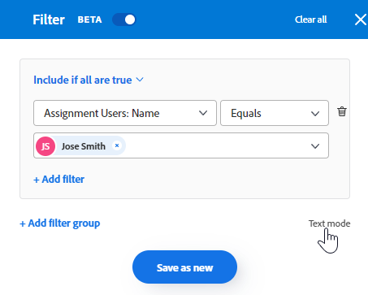

   此时将打开文本模式界面。

   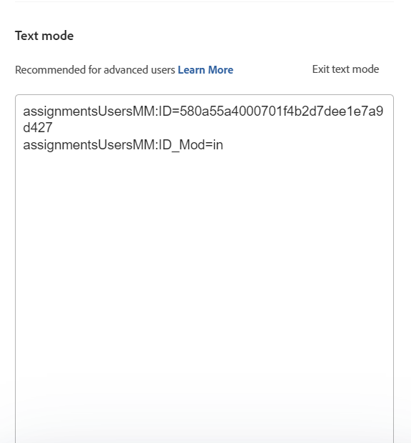

   >[!TIP]
   >
   >如果您必须修改仅在文本模式下支持的筛选器，我们建议使用标准生成器界面并仅使用文本模式构建尽可能多的筛选器。

   有关使用文本模式界面创建过滤器的详细信息，请参阅[使用文本模式编辑过滤器](/help/quicksilver/reports-and-dashboards/reports/text-mode/edit-text-mode-in-filter.md)。

1. 单击&#x200B;**退出文本模式**&#x200B;以返回标准生成器界面。

   >[!WARNING]
   >
   >标准生成器或旧版界面不支持某些文本模式语句。 创建这些类型的语句后，退出文本模式可能会生成警告消息。

1. （可选）单击&#x200B;**应用**&#x200B;将筛选器应用于列表并查看结果。

   如果过滤器未生成任何结果，则列表为空。

1. 单击&#x200B;**另存为新筛选器**&#x200B;以保存筛选器以供将来使用。

   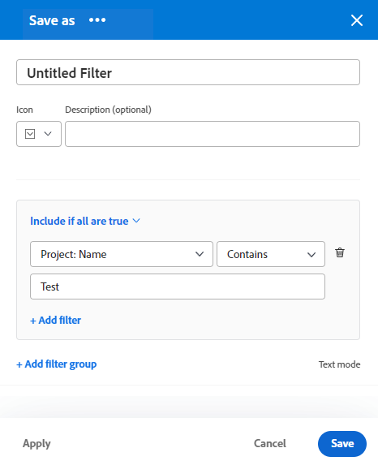

1. 选择&#x200B;**无标题的筛选器**，然后键入新筛选器的名称。

   >[!TIP]
   >
   >确保命名该过滤器，以便稍后可以找到。 如果不命名滤镜，则它在系统中称为“无标题滤镜”。

1. 从&#x200B;**图标**&#x200B;下拉菜单中选择新筛选器的图标。

   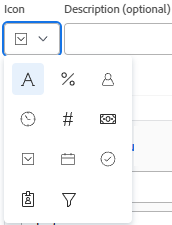

1. （可选）为过滤器添加说明，以指明过滤器的独特之处。 描述显示在筛选器列表中的筛选器名称下。

   >[!TIP]
   >
   >随时单击&#x200B;**取消**&#x200B;将返回过滤器构建区域。

1. 单击&#x200B;**保存**。 该过滤器将保存在“已保存”列表中，并应用于项目列表。
1. （可选）要将滤镜移至“已收藏”列表，请将鼠标悬停在滤镜抽屉中的任意滤镜上，然后单击&#x200B;**收藏夹**&#x200B;图标。

   或

   将鼠标悬停在筛选器抽屉中的任意筛选器上，单击“更多”菜单，然后单击“**收藏”**。

1. （可选）单击&#x200B;**栈叠筛选器**&#x200B;按钮以激活栈叠筛选器。 此选项允许您应用多个已保存的过滤器。 筛选规则会按照您选择它们的顺序进行应用。

   >[!TIP]
   >
   >您可以选择的过滤器数量没有限制。
   >
   >选择多个筛选器时，必须同时满足其所有条件才能显示匹配结果。

   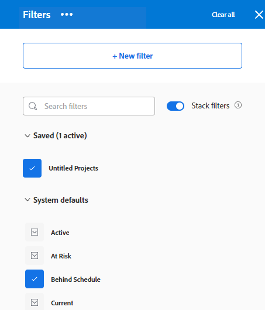

   您选择的过滤器数显示在项目列表顶部的过滤器图标旁边。

   已选择

1. （可选）执行以下操作之一：

   * 与他人共享滤镜，或使其在系统范围内可用。 有关详细信息，请参阅[共享筛选器、视图或分组](/help/quicksilver/reports-and-dashboards/reports/reporting-elements/share-filter-view-grouping.md)。

   * 如果过滤器不再有效或重复，请将其删除。 您只能删除自己拥有的过滤器。 您可以删除与您共享的过滤器。 有关信息，请参阅[删除筛选器、视图和分组](/help/quicksilver/reports-and-dashboards/reports/reporting-elements/remove-filters-views-groupings.md)。

## 在旧版生成器中创建或编辑筛选器 {#create-filter-in-legacy-builder}

您可以通过以下方式在列表和报表中创建旧版过滤器：

* 从头开始
* 编辑现有筛选器并将其另存为新筛选器

无论使用何种方法创建过滤器，从头开始或从现有过滤器创建过滤器都是类似的。

1. 转到包含要自定义的过滤器的列表或报表。
1. 单击&#x200B;**筛选器**&#x200B;图标，然后单击&#x200B;**更多**&#x200B;图标，然后单击&#x200B;**返回旧版筛选器**。

   >[!TIP]
   >
   >报表创建者必须允许编辑过滤器，才能查看报表上的过滤器下拉列表。 默认情况下，报告默认过滤器会应用于报告。 只有在编辑报告时才能自定义“报告默认”过滤器。

1. 单击筛选器列表顶部的&#x200B;**+“新建筛选器”**。

   或

   将鼠标悬停在要修改的筛选器上，然后单击&#x200B;**编辑**&#x200B;图标。

   将启动用于自定义筛选器的生成器。

1. 执行以下任一操作：

   * 通过单击现有规则并选择新选项来修改现有筛选器规则。
   * 通过单击&#x200B;**添加其他筛选器规则**&#x200B;来添加筛选器规则，在&#x200B;**开始键入字段名称**&#x200B;框中开始键入要为其添加规则的选项的名称，然后当它出现在下拉列表中时单击它。

     与筛选器对象关联的字段列在&#x200B;**开始键入字段名称**&#x200B;框中。

   * 添加筛选规则时，单击&#x200B;**AND**&#x200B;或&#x200B;**OR**。\
     添加过滤器规则时，使用过滤器修饰符建立过滤器的条件。 有关筛选器修饰符的详细信息，请参阅[筛选器和条件修饰符](../../../reports-and-dashboards/reports/reporting-elements/filter-condition-modifiers.md)。

     >[!NOTE]
     >
     >当通过多个OR语句连接一组AND语句时，必须为每个语句组重复在OR语句之间没有更改的字段。
     >
     >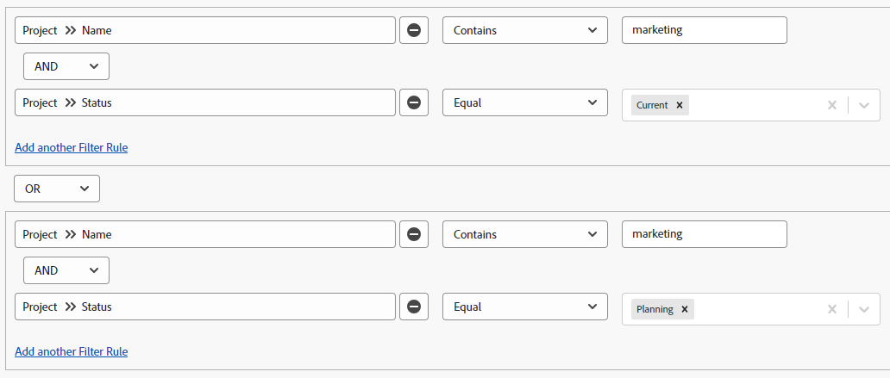
     >
     >在为包含“营销”一词、且处于当前或Planning状态的项目中的任务构建过滤器时，您必须具有以下过滤器规则：
     >
     >`Task: Name Contains Marketing`
     >`AND`
     >`Project: Status Equals Current`
     >`OR`
     >`Task: Name Contains Marketing`
     >`AND`
     >`Project: Status Equals Planning`
     >
     >虽然任务：名称包含“营销”在两个AND过滤器组之间不会发生更改，但在第二个过滤器中必须重复该名称。

   * 单击“X”图标删除现有筛选规则。

1. （可选）单击&#x200B;**切换到文本模式**&#x200B;以使用文本模式界面添加筛选器。

   有关使用文本模式界面创建筛选器的详细信息，请参阅[使用文本模式编辑筛选器](../../../reports-and-dashboards/reports/text-mode/edit-text-mode-in-filter.md)。

1. 单击&#x200B;**保存筛选器**&#x200B;可创建筛选器，或将所选筛选器替换为您的更改。

   或

   单击&#x200B;**另存为新过滤器**，以根据选定的过滤器创建新过滤器。

   新筛选器将显示在筛选器列表中，并且会自动应用于您选择的列表或报表。

1. （可选）执行以下操作之一：

   * 与其他用户共享您创建的滤镜，或使其在系统范围内可用。 有关信息，请参阅[共享筛选器、视图或分组](/help/quicksilver/reports-and-dashboards/reports/reporting-elements/share-filter-view-grouping.md)。
   * 删除不再希望在列表中显示的筛选器。 有关信息，请参阅[删除筛选器、视图和分组](/help/quicksilver/reports-and-dashboards/reports/reporting-elements/remove-filters-views-groupings.md)。

