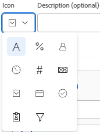

# 在Adobe Workfront中创建或编辑筛选器

请注意，在“预览”环境中，增强型过滤器体验（以前称为“beta”）现在为默认设置。 这些增强型过滤器现在是“标准”过滤器，而更早的过滤器体验是“旧版”。

您可以通过过滤器限制在屏幕上显示的项目列表中的信息量。 您可以根据有关对象的特定信息段定义特定标准，并仅显示符合这些标准的对象。

您可以在Adobe Workfront中应用以下类型的过滤器：

* 快速筛选对象列表，以使用关键字查找项目。 这些是临时过滤器，您无法保存以供将来使用。

   有关快速筛选器的信息，请参阅 [将快速过滤器应用于列表](../../../workfront-basics/navigate-workfront/use-lists/apply-quick-filter-list.md).

* 永久过滤器，可节省并在多个列表和报告上使用大量时间。 本文介绍了如何创建永久过滤器或编辑列表或报表中的现有过滤器。

* Workfront其他区域中的筛选器，列表和报告除外。

   有关Workfront中所有过滤器的列表以及可应用这些过滤器的区域，请参阅 [Adobe Workfront中的过滤器概述](../../../reports-and-dashboards/reports/reporting-elements/filters-overview.md).

## 访问要求

您必须具有以下权限才能执行本文中的步骤：

<table style="table-layout:auto"> 
 <col> 
 <col> 
 <tbody> 
  <tr> 
   <td role="rowheader"><strong>Adobe Workfront计划*</strong></td> 
   <td> 
任意
 </td> 
  </tr> 
  <tr> 
   <td role="rowheader"><strong>Adobe Workfront许可证*</strong></td> 
   <td> 
请求或更高版本
 </td> 
  </tr> 
  <tr> 
   <td role="rowheader"><strong>访问级别配置*</strong></td> 
   <td> 
编辑对筛选器、视图和分组的访问权限
 
注意：如果您仍然没有访问权限，请咨询Workfront管理员是否对您的访问级别设置了其他限制。 有关Workfront管理员如何修改您的访问级别的信息，请参阅 <a href="../../../administration-and-setup/add-users/configure-and-grant-access/create-modify-access-levels.md" class="MCXref xref">创建或修改自定义访问级别</a>.
 </td> 
  </tr> 
  <tr> 
   <td role="rowheader"><strong>对象权限</strong></td> 
   <td> 
管理筛选器的权限
 
有关请求其他访问权限的信息，请参阅 <a href="../../../workfront-basics/grant-and-request-access-to-objects/request-access.md" class="MCXref xref">请求访问对象 </a>.
 </td> 
  </tr> 
 </tbody> 
</table>

&#42;要了解您拥有什么计划、许可证类型或访问权限，请联系您的Workfront管理员。

## 过滤器构建界面的类型

您可以使用下表所述的过滤器生成器类型创建过滤器：

<table style="table-layout:auto">
<col>
<col>
<col>
<tbody>
<tr>
<td><strong>生成器类型</strong></td>
<td><strong>筛选对象</strong></td>
<td><strong>可用位置</strong></td>
</tr>
<tr>
<td>标准生成器</td>
<td>所有对象 </td>
<td>列表和报告</td>
</tr>
<tr>
<td>测试版生成器</td>
<td>
<ul>
<li> 
项目
 </li>
<li> 
任务 
 </li>
<li> 
问题
 </li>
<li> 
项目组合
 </li>
<li> 
项目群
 </li>
<li> 
用户
 </li>
<li> 
模板
 </li>
<li> 
组
 </li>
</ul>
</td>
<td>
<ul>
<li> 
列表 
 </li>
</ul>
<ul>
<li> 
Scenario Planner中的项目列表
 
Scenario Planner需要额外的许可证。 有关Workfront Scenario Planner的信息，请参阅 <a href="../../../scenario-planner/scenario-planner-overview.md">Scenario Planner概述</a>. 
 </li>
</ul>

注意：筛选器的测试版生成器不可在报表中使用。
</td>
</tr>
</tbody>
</table>

有关Workfront对象的信息，请参阅 [了解Adobe Workfront中的对象](/help/quicksilver/workfront-basics/navigate-workfront/workfront-navigation/understand-objects.md).

## 在标准生成器中创建或编辑过滤器 {#create-filter-in-standard-builder}

您可以通过以下方式在列表和报告中创建过滤器：

* 从头开始
* 编辑现有筛选器并将其另存为新筛选器

无论使用何种方法创建过滤器，从头开始或从现有过滤器创建过滤器都是类似的。

1. 转到包含要自定义的过滤器的列表或报表。
1. 单击 **筛选条件** 图标 .

   >[!TIP]
   >
   >报告创建者必须允许编辑过滤器，才能查看报告上的过滤器下拉列表。 默认情况下，“报表默认”筛选器应用于报表。 仅当您编辑报告时，才能自定义报告默认筛选条件。

   

1. 单击 **新建筛选器** 在筛选器列表顶部

   或

   将鼠标悬停在要修改的过滤器上，然后单击 **编辑** 图标 .

   用于自定义筛选器的生成器启动。

1. 执行以下任一操作：

   * 通过单击现有规则并选择新选项来修改现有过滤器规则。
   * 通过单击添加筛选规则 **添加其他筛选规则**，开始键入要为其添加规则的选项的名称 **开始键入字段名称** 框，然后当它出现在下拉列表中时单击它。

      与筛选器对象关联的字段列在 **开始键入字段名称** 盒子。

   * 单击 **和** 或 **或** 添加新的筛选规则时。\
      添加过滤器规则时，请使用过滤器修饰符建立过滤器的条件。 有关过滤器修饰符的详细信息，请参阅 [过滤器和条件修饰符](../../../reports-and-dashboards/reports/reporting-elements/filter-condition-modifiers.md).

      >[!NOTE]
      >
      >通过多个OR语句连接一组AND语句时，必须为每个语句组重复在OR语句之间不更改的字段。
      >
      >
      >
      >为包含“营销”一词的任务构建过滤器时，如果任务处于当前或Planning状态，则必须具有以下过滤器规则：
      >
      >`Task: Name Contains Marketing`
      >`AND`
      >`Project: Status Equals Current`
      >`OR`
      >`Task: Name Contains Marketing`
      >`AND`
      >`Project: Status Equals Planning`
      >
      >尽管任务：名称包含“营销”在两个“与”筛选器组之间不会发生更改，但在第二个筛选器组中必须重复此操作。

   * 单击“X”图标可删除现有筛选规则。

1. （可选）单击 **切换到文本模式** 以使用“文本模式”界面添加过滤器。

   有关使用文本模式界面创建过滤器的详细信息，请参阅 [使用文本模式编辑筛选器](../../../reports-and-dashboards/reports/text-mode/edit-text-mode-in-filter.md).

1. 单击 **保存筛选器** 以创建新过滤器，或将选定的过滤器替换为您所做的更改。

   或

   单击 **另存为新筛选器** 以从选定的过滤器创建新过滤器。

   新筛选器显示在筛选器列表中，并自动应用于您选择的列表或报告。

1. （可选）执行以下操作之一：

   * 将您创建的过滤器与其他用户共享，或使其在系统范围内可用。 有关信息，请参阅 [共享筛选器、视图或分组](/help/quicksilver/reports-and-dashboards/reports/reporting-elements/share-filter-view-grouping.md).
   * 删除您不再希望在列表中显示的过滤器。 有关信息，请参阅 [删除筛选器、视图和分组](/help/quicksilver/reports-and-dashboards/reports/reporting-elements/remove-filters-views-groupings.md).

## 在Beta版生成器中创建或编辑过滤器

在使用不同界面创建过滤器时，请考虑以下事项：

* 您可以在上面表格中所列区域的标准过滤器界面所在的相同位置找到测试版生成器。
* 您可以在标准版和测试版生成器界面之间来回切换，其中测试版选项可用。
* 在一个区域中启用测试版生成器后，它是所有可用区域的默认体验。 例如，如果在项目列表中启用测试版生成器，那么它也是列表中生成任务和问题过滤器的默认体验。
* 您可以通过以下方式使用Beta版生成器界面创建过滤器：

   * 从头开始
   * 编辑现有筛选器
   * 复制现有筛选器
   * 复制现有筛选器，编辑该筛选器并将其另存为新筛选器

* 无论最初使用哪个体验构建过滤器，保存的过滤器都可在两个构建器中使用。 例如，如果您使用标准生成器创建了一个过滤器，则还可以在测试版生成器界面中查找并修改它。

   >[!TIP]
   >
   >“全部”筛选器未包含在测试版生成器中，因为未应用筛选器时会显示所有列表项。 单击 **全部清除** ，可清除任何活动的筛选器并显示所有项目。 如果 **全部清除** 灰显，则不会应用过滤器。

* 在构建组合AND和OR运算符的多语句过滤器时，标准构建器和测试版构建器的语法略有不同。 因此，当您从一个生成器切换到另一个生成器时，这些筛选器的显示可能会有所不同。

   >[!INFO]
   >
   >存在以下方案：
   >
   >1. 使用测试版生成器可创建具有以下语法的过滤器：
   >
   >   `(A OR B) AND C`
   >
   >1. 切换回标准生成器，然后使用标准生成器的语法编辑过滤器，如 [在标准生成器中创建或编辑过滤器](#create-filter-in-standard-builder) 章节。 标准生成器的语法按以下方式显示filter语句：
   >
   >   `A AND C`
   >   `OR`
   >   `B AND C`
   >
   >1. 在标准界面中更改筛选器。
   >1. 切换回测试版生成器。 过滤器语句根据标准生成器中支持的逻辑显示，如上所述。

   >
   >   该过滤器将显示在测试版生成器界面中，如下所示：
   >  
   >   `A AND C`
   >   `OR`
   >   `B AND C`
   > 
   >   发生此情况是因为在标准界面中修改了过滤器。

使用Beta版生成器界面创建过滤器：

1. 转到要创建过滤器或包含要自定义的过滤器的列表。
1. 单击 **筛选条件** 图标 ，然后启用 **测试版设置**  以访问测试版生成器。 默认情况下处于禁用状态。

   接下来，根据需要同意测试版协议。 您只需同意一次，测试版生成器将保持启用状态。

   这将打开测试版过滤器生成器界面。

   >[!TIP]
   >
   >启用测试版生成器后，过滤器生成器界面的标题将变为蓝色。 启用测试版生成器界面后，Workfront会使其在所有可用区域保持启用状态。

   

1. 查看以下筛选器列表：

   <table style="table-layout:auto">
   <col>
   <col>
   <tbody>
   <tr>
   <td role="rowheader"><strong>已收藏</strong></td>
   <td>您标记为收藏的过滤器。 当您收藏某个过滤器时，其原始位置将显示在过滤器名称下方，并且除非将其作为收藏项删除，否则该过滤器将从原始列表中隐藏。</td>
   </tr>
   <tr>
   <td role="rowheader"><strong>已保存</strong></td>
   <td>您自己构建和保存的过滤器。</td>
   </tr>
   <tr>
   <td role="rowheader"><strong>系统默认值</strong></td>
   <td>Workfront系统默认过滤器，以及Workfront管理员添加到您的过滤器列表中的过滤器（在系统级别或布局模板中）。</td>
   </tr>
   <tr>
   <td role="rowheader"><strong>已与我共享</strong></td>
   <td>其他人创建并与您共享的过滤器或在系统范围内共享的过滤器。</td>
   </tr>
   </tbody>
   </table>

1. 执行下列操作之一：

   * 单击 **新建筛选器** 从头开始创建过滤器。
   * 将鼠标悬停在您有权管理的现有过滤器上，然后单击 **编辑** 图标  以编辑它。

      或

      将鼠标悬停在您有权查看的现有筛选器上，单击 **更多** 菜单 ，然后单击 **复制** 以复制现有筛选器并编辑副本。
   

1. （视情况而定）根据您是要查找与筛选器组中的所有语句或任意语句匹配的对象，从以下选项中选择：

   <table style="table-layout:auto">
   <col>
   <col>
   <tbody>
   <tr>
   <td role="rowheader"><strong>在所有项为 true 时包含</strong></td>
   <td>过滤器找到的对象必须匹配过滤器组中的所有过滤器条件。 在这种情况下，过滤器语句通过AND运算符连接。 这是默认选项。</td>
   </tr>
   <tr>
   <td role="rowheader"><strong>在任意项为 true 时包含</strong></td>
   <td>过滤器找到的对象必须与过滤器组中的任意过滤器条件匹配。 在这种情况下，过滤器语句通过OR运算符连接。</td>
   </tr>
   </tbody>
   </table>

   

   有关过滤器运算符的更多信息，请参阅 [Adobe Workfront中的过滤器概述](/help/quicksilver/reports-and-dashboards/reports/reporting-elements/filters-overview.md).

1. 单击字段下拉菜单可查看最近使用的字段列表以及要作为筛选依据的建议字段。 建议的字段当前显示在您正在筛选的列表中。

   您还可以选择 **浏览字段** 要查看可按其筛选的所有字段的列表。 高级搜索中的字段按对象类别分组。

   

1. 单击修改量下拉菜单以选择修改量。 默认修饰符为“Equals”。

   有关更多信息，请参阅 [过滤器和条件修饰符](/help/quicksilver/reports-and-dashboards/reports/reporting-elements/filter-condition-modifiers.md).

   >[!TIP]
   >
   >构建过滤器时，结果会立即显示在列表中。 如果过滤器面板覆盖列表，则可以将其关闭以查看显示内容。 再次打开面板时，您输入的信息仍会保留在测试版生成器中。

1. 开始键入要作为筛选依据的字段值。 例如，如果要按筛选，则开始键入问题的名称 `Issue:Name`. 当该值显示在列表中时，选择该值。

   >[!TIP]
   >
   >根据您选择的修改量，您可以选择多个值。

1. 单击 **添加筛选器** 以选择另一个字段并将新的筛选条件添加到filter语句。
1. （可选）单击 **删除** 图标  以删除现有的filter语句。

   或

   单击 **全部清除** 以清除所有筛选条件。

1. （可选）单击 **添加筛选器组** 以添加另一组筛选条件。 集合之间的缺省运算符为AND。 单击运算符可将其更改为OR。

   >[!TIP]
   >
   >当您希望组通过过滤器语句中的运算符以外的运算符连接时，您可能希望使用另一个过滤器组。

   >[!INFO]
   >
   >当您筛选名称中包含“营销”且未完成且未处于暂停状态的项目时，您可以使用以下多个筛选条件组：
   >`(Project: Name Contains Marketing AND Project: Percent Complete Does not equal 100)`
   >`OR`
   >`(Project: Name Contains Marketing AND Project: Status Does not equal On Hold)`
   >在这种情况下，每个过滤器语句通过AND连接，过滤器组通过OR连接。

1. （可选）单击 **文本模式** 以继续使用文本模式构建过滤器。

   

   打开文本模式界面。

   

   >[!TIP]
   >
   >我们建议使用Beta版生成器界面并仅在必须修改仅受文本模式支持的过滤器时才使用文本模式来生成尽可能多的过滤器。

   有关使用文本模式界面创建过滤器的详细信息，请参阅 [使用文本模式编辑筛选器](/help/quicksilver/reports-and-dashboards/reports/text-mode/edit-text-mode-in-filter.md).

1. 单击 **退出文本模式** 以返回测试版生成器界面。

   >[!WARNING]
   >
   >测试版生成器或标准界面不支持某些文本模式语句。 创建这些类型的语句后退出文本模式可能会生成警告消息。

1. （可选）单击 **应用** 将过滤器应用于列表并查看结果。

   如果筛选条件未生成任何结果，则列表将为空。

1. 单击 **另存为新项** 以保存过滤器以供将来使用。

   

1. 选择 **无标题的筛选器** 并键入新筛选器的名称。

   >[!TIP]
   >
   >请务必命名该过滤器，以便稍后查找。 如果不命名过滤器，则系统中会将其称为“无标题过滤器”。

1. 从中选择新过滤器的图标 **图标** 下拉菜单。

   

1. （可选）添加过滤器描述以指示该过滤器的独特之处。 描述显示在过滤器列表中的过滤器名称下。

   >[!TIP]
   >
   >点击 **取消** 您随时可以返回过滤器构建区域。

1. 单击 **保存**. 该过滤器将保存在保存的列表中，并应用于项目列表。
1. （可选）要将过滤器移到“收藏”列表，请将光标悬停在过滤器抽屉中的任意过滤器上，然后单击“收藏”图标 .

   或

   将鼠标悬停在过滤器抽屉中的任意过滤器上，单击“更多”菜单 ，然后单击 **收藏**.

1. （可选）单击 **栈叠筛选器** 按钮激活栈叠过滤器。 此选项允许您应用多个已保存的过滤器。 筛选规则将按您选择它们的顺序应用。

   >[!TIP]
   >
   >您可以选择的过滤器数量没有限制。
   >
   >选择多个筛选器时，必须同时满足其所有条件才能显示匹配的结果。

   

   您选择的过滤器数显示在项目列表顶部的过滤器图标旁边。

   

1. （可选）执行以下操作之一：

   * 与其他人共享该过滤器，或使其在系统范围内可用。 有关更多信息，请参阅 [共享筛选器、视图或分组](/help/quicksilver/reports-and-dashboards/reports/reporting-elements/share-filter-view-grouping.md).

   * 如果该过滤器不再有效或重复，请将其删除。 您只能删除自己拥有的过滤器。 您可以删除与您共享的过滤器。 有关信息，请参阅 [删除筛选器、视图和分组](/help/quicksilver/reports-and-dashboards/reports/reporting-elements/remove-filters-views-groupings.md).

