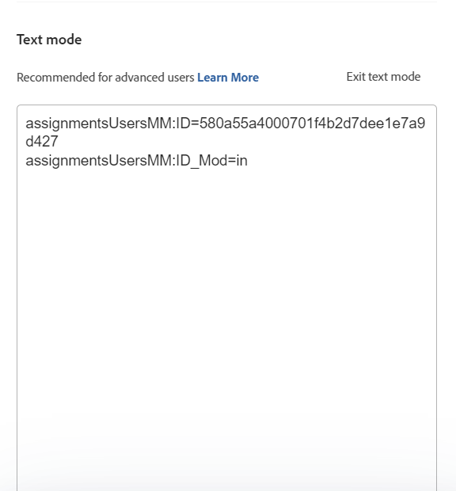
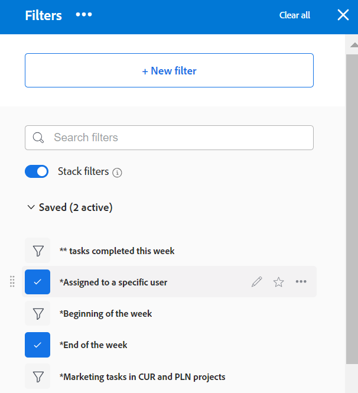

# 在Adobe Workfront中创建或编辑过滤器

您可以使用过滤器限制在项目列表的屏幕上显示的信息量。 您可以根据对象的特定信息定义特定条件，并仅显示满足这些条件的对象。

您可以在Adobe Workfront中应用以下类型的过滤器：

* 在对象列表中快速筛选以使用关键字查找项目。 这些是临时过滤器，您无法保存这些过滤器供将来使用。

   有关快速过滤器的信息，请参阅 [将快速过滤器应用到列表](../../../workfront-basics/navigate-workfront/use-lists/apply-quick-filter-list.md).

* 您可以保存并在多个列表和报表中使用大量时间的永久过滤器。 本文介绍了如何创建永久过滤器或编辑列表或报表中的现有过滤器。

* Workfront其他区域（列表和报表外）的过滤器。

   有关Workfront中所有过滤器以及可应用这些过滤器的区域的列表，请参阅 [过滤器Adobe Workfront概述](../../../reports-and-dashboards/reports/reporting-elements/filters-overview.md).

## 访问要求

您必须具有以下访问权限才能执行本文中的步骤：

<table style="table-layout:auto"> 
 <col> 
 <col> 
 <tbody> 
  <tr> 
   <td role="rowheader"><strong>Adobe Workfront计划*</strong></td> 
   <td> 
任意
 </td> 
  </tr> 
  <tr> 
   <td role="rowheader"><strong>Adobe Workfront许可证*</strong></td> 
   <td> 
请求或更高版本
 </td> 
  </tr> 
  <tr> 
   <td role="rowheader"><strong>访问级别配置*</strong></td> 
   <td> 
编辑对过滤器、视图和分组的访问权限
 
注意：如果您仍然没有访问权限，请咨询Workfront管理员，他们是否在您的访问级别设置了其他限制。 有关Workfront管理员如何修改访问级别的信息，请参阅 <a href="../../../administration-and-setup/add-users/configure-and-grant-access/create-modify-access-levels.md" class="MCXref xref">创建或修改自定义访问级别</a>.
 </td> 
  </tr> 
  <tr> 
   <td role="rowheader"><strong>对象权限</strong></td> 
   <td> 
管理过滤器的权限
 
有关请求其他访问权限的信息，请参阅 <a href="../../../workfront-basics/grant-and-request-access-to-objects/request-access.md" class="MCXref xref">请求对对象的访问 </a>.
 </td> 
  </tr> 
 </tbody> 
</table>

&#42;要了解您拥有的计划、许可证类型或访问权限，请联系您的Workfront管理员。

## 过滤器构建界面的类型

您可以使用下表所述的过滤器生成器类型创建过滤器：

<table style="table-layout:auto">
<col>
<col>
<col>
<tbody>
<tr>
<td><strong>生成器类型</strong></td>
<td><strong>筛选对象</strong></td>
<td><strong>可用位置</strong></td>
</tr>
<tr>
<td>标准生成器</td>
<td>
<ul>
<li> 
项目
 </li>
<li> 
任务 
 </li>
<li> 
问题
 </li>
<li> 
项目组合
 </li>
<li> 
项目群
 </li>
<li> 
用户
 </li>
<li> 
模板
 </li>
<li> 
组
 </li>
</ul>
</td>
<td>
<ul>
<li> 
列表 
 </li>
</ul>
<ul>
<li> 
方案计划器中的项目列表
 
方案计划员需要附加许可证。 有关Workfront方案规划器的信息，请参阅 <a href="../../../scenario-planner/scenario-planner-overview.md">方案计划员概述</a>. 
 </li>
</ul>

注意：过滤器的标准生成器在报表中不可用。
</td>
</tr>
<tr>
<td>旧版生成器</td>
<td>所有对象 </td>
<td>列表和报表</td>
</tr>
</tbody>
</table>

有关Workfront对象的信息，请参阅 [了解Adobe Workfront中的对象](/help/quicksilver/workfront-basics/navigate-workfront/workfront-navigation/understand-objects.md).

使用不同的界面创建过滤器时，请考虑以下事项：

* 在找到上表所列区域的旧版过滤器界面的相同位置，您可以找到标准生成器。
* 标准生成器是所有可用区域的默认体验。 要切换到旧版过滤器生成器，请单击 **更多** 菜单 [!UICONTROL **过滤器**] 选择 [!UICONTROL **返回到旧版过滤器**].

   

* 保存的过滤器在两个生成器中都可用，无论您最初使用哪个体验来构建它们。 例如，如果您使用旧版生成器创建了过滤器，则也可以在标准生成器界面中查找和修改该过滤器。

   >[!TIP]
   >
   >标准生成器中不包含“全部”过滤器，因为当未应用过滤器时，将显示所有列表项。 单击 [!UICONTROL **全部清除**] ，以清除任何活动过滤器并显示所有项目。 如果 [!UICONTROL **全部清除**] 灰显，则不会应用任何滤镜。

* 在构建组合AND和OR运算符的多语句过滤器时，标准生成器和旧版生成器的语法略有不同。 因此，当您从一个生成器切换到另一个生成器时，这些过滤器的显示方式可能会有所不同。

   >[!INFO]
   >
   >存在以下方案：
   >
   >1. 使用标准生成器创建具有以下语法的过滤器：
   >
   >   `(A OR B) AND C`
   >
   >1. 切换到旧版生成器，然后使用旧版生成器的语法编辑过滤器，如 [在旧版生成器中创建或编辑过滤器](#create-filter-in-legacy-builder) 章节。 旧版生成器的语法会按如下方式显示filter语句：
   >
   >   `A AND C`
   >   `OR`
   >   `B AND C`
   >
   >1. 更改旧版界面中的过滤器。
   >1. 切换回标准生成器。 筛选器语句将根据旧版生成器中支持的逻辑显示，如上所述。

   >
   >   该过滤器显示在标准生成器界面中，如下所示：
   >  
   >   `A AND C`
   >   `OR`
   >   `B AND C`
   > 
   >   之所以出现这种情况，是因为过滤器已在旧版界面中修改。

## 在标准生成器中创建或编辑过滤器

您可以通过以下方式使用标准生成器界面创建过滤器：

* 从头开始
* 编辑现有过滤器
* 复制现有过滤器
* 复制现有过滤器，对其进行编辑，然后将其另存为新过滤器

使用标准生成器界面创建过滤器：

1. 转到要创建过滤器或包含要自定义过滤器的列表。
1. 单击 **过滤器** 图标  打开生成器界面。

   

1. 查看以下过滤器列表：

   <table style="table-layout:auto">
   <col>
   <col>
   <tbody>
   <tr>
   <td role="rowheader"><strong>已收藏</strong></td>
   <td>标记为收藏的过滤器。 当您收藏某个过滤器时，该过滤器的原始位置将显示在该过滤器名称的下方，并且该过滤器在原始列表中处于隐藏状态，除非您将其作为收藏进行删除。</td>
   </tr>
   <tr>
   <td role="rowheader"><strong>已保存</strong></td>
   <td>您自己构建并保存的过滤器。</td>
   </tr>
   <tr>
   <td role="rowheader"><strong>系统默认值</strong></td>
   <td>Workfront系统默认过滤器，以及Workfront管理员添加到过滤器列表的过滤器（无论是在系统级别还是在布局模板中）。</td>
   </tr>
   <tr>
   <td role="rowheader"><strong>已与我共享</strong></td>
   <td>其他人创建并与您共享的过滤器，或在系统范围内共享的过滤器。</td>
   </tr>
   </tbody>
   </table>

1. 执行下列操作之一：

   * 单击 **新建过滤器** 从头开始创建过滤器。
   * 将鼠标悬停在您有权管理的现有过滤器上，然后单击 **编辑** 图标  来编辑。

      或

      将鼠标悬停在您有权查看的现有过滤器上，单击 **更多** 菜单 ，然后单击 **复制** 复制现有过滤器并编辑副本。
   

1. （视情况而定）根据您是否要查找与过滤器组中的所有语句或任何语句匹配的对象，从以下选项中进行选择：

   <table style="table-layout:auto">
   <col>
   <col>
   <tbody>
   <tr>
   <td role="rowheader"><strong>在所有项为 true 时包含</strong></td>
   <td>过滤器找到的对象必须匹配过滤器组中的所有过滤器条件。 在这种情况下，filter语句由AND运算符连接。 这是默认选项。</td>
   </tr>
   <tr>
   <td role="rowheader"><strong>在任意项为 true 时包含</strong></td>
   <td>过滤器找到的对象必须与过滤器组中的任何过滤器条件相匹配。 在这种情况下，filter语句由OR运算符连接。</td>
   </tr>
   </tbody>
   </table>

   

   有关过滤器运算符的更多信息，请参阅 [过滤器Adobe Workfront概述](/help/quicksilver/reports-and-dashboards/reports/reporting-elements/filters-overview.md).

1. 单击字段下拉菜单可查看最近使用的字段的列表以及要过滤的建议字段。 建议的字段当前显示在要筛选的列表中。

   您还可以选择 **浏览字段** 要查看可按过滤的所有字段的列表。 高级搜索中的字段按对象类别分组。

   

1. 单击修饰符下拉菜单以选择修饰符。 默认修饰符为“等于”。

   有关更多信息，请参阅 [过滤器和条件修饰符](/help/quicksilver/reports-and-dashboards/reports/reporting-elements/filter-condition-modifiers.md).

   >[!TIP]
   >
   >构建过滤器时，结果会立即显示在列表中。 如果过滤器面板覆盖列表，则可以将其关闭以查看显示。 再次打开面板时，您输入的信息会保留在生成器中。

1. 开始键入要过滤的字段的值。 例如，如果要按 `Issue:Name`. 当值显示在列表中时，选择该值。

   >[!TIP]
   >
   >根据您选择的修饰符，您可以选择多个值。

1. 单击 **添加过滤器** ，以选择其他字段并将新的筛选条件添加到filter语句。
1. （可选）单击 **删除** 图标  删除现有filter语句。

   或

   单击 **全部清除** 以清除所有筛选条件。

1. （可选）单击 **添加过滤器组** 添加另一组筛选条件。 集之间的默认运算符为AND。 单击运算符将其更改为OR。

   >[!TIP]
   >
   >当您希望组由与filter语句中的运算符不同的运算符连接时，您可能希望使用另一个过滤器组。

   >[!INFO]
   >
   >当您过滤名称中包含“营销”且未完成且未处于暂挂状态的项目时，可以使用以下多个过滤器组：
   >`(Project: Name Contains Marketing AND Project: Percent Complete Does not equal 100)`
   >`OR`
   >`(Project: Name Contains Marketing AND Project: Status Does not equal On Hold)`
   >在这种情况下，每个filter语句都通过AND连接，而过滤器组则通过OR连接。

1. （可选）单击 **文本模式** 以继续使用文本模式构建过滤器。

   

   将打开文本模式界面。

   

   >[!TIP]
   >
   >我们建议您尽可能多地使用标准生成器界面来构建过滤器，并仅在您必须修改文本模式下仅支持的过滤器时使用文本模式。

   有关使用文本模式界面创建过滤器的更多信息，请参阅 [使用文本模式编辑过滤器](/help/quicksilver/reports-and-dashboards/reports/text-mode/edit-text-mode-in-filter.md).

1. 单击 **退出文本模式** 返回到标准生成器界面。

   >[!WARNING]
   >
   >标准生成器或旧版界面不支持某些文本模式语句。 创建这些类型的语句后退出文本模式可能会生成警告消息。

1. （可选）单击 **应用** 将过滤器应用到列表并查看结果。

   如果过滤器未生成任何结果，则列表将为空。

1. 单击 **另存为新** 以保存过滤器以供将来使用。

   

1. 选择 **无标题过滤器** 并键入新过滤器的名称。

   >[!TIP]
   >
   >请务必命名过滤器，以便您稍后能够找到它。 如果未命名过滤器，则在系统中将其称为“无标题过滤器”。

1. 从 **图标** 下拉菜单。

   

1. （可选）为过滤器添加描述，以指示其唯一性。 描述显示在过滤器列表的过滤器名称下。

   >[!TIP]
   >
   >单击 **取消** 随时会返回过滤器构建区域。

1. 单击 **保存**. 该过滤器保存在“保存的”列表中，并应用于项目列表。
1. （可选）要将过滤器移动到“已收藏”列表，请将鼠标悬停在过滤器抽屉中的任意过滤器上，然后单击“收藏”图标 .

   或

   将鼠标悬停在过滤器抽屉中的任意过滤器上，单击“更多”菜单 ，然后单击 **收藏**.

1. （可选）单击 **堆栈过滤器** 按钮以激活堆叠的过滤器。 此选项允许您应用多个保存的过滤器。 过滤器规则按您选择的顺序应用。

   >[!TIP]
   >
   >您可以选择的过滤器数量没有限制。
   >
   >选择多个过滤器时，必须同时满足其所有条件才能显示匹配结果。

   

   您选择的过滤器数量显示在项目列表顶部的过滤器图标旁边。

   

1. （可选）执行以下操作之一：

   * 与他人共享该过滤器，或在全系统范围内提供该过滤器。 有关更多信息，请参阅 [共享过滤器、查看或分组](/help/quicksilver/reports-and-dashboards/reports/reporting-elements/share-filter-view-grouping.md).

   * 如果过滤器不再有效或重复，请删除该过滤器。 您只能删除您拥有的过滤器。 您可以删除与您共享的过滤器。 有关信息，请参阅 [删除过滤器、视图和分组](/help/quicksilver/reports-and-dashboards/reports/reporting-elements/remove-filters-views-groupings.md).

## 在旧版生成器中创建或编辑过滤器 {#create-filter-in-legacy-builder}

您可以通过以下方式在列表和报表中创建旧版过滤器：

* 从头开始
* 编辑现有过滤器，并将其另存为新过滤器

无论您使用哪种方法创建过滤器，从头开始或从现有过滤器创建过滤器都是相似的。

1. 转到包含要自定义的过滤器的列表或报表。
1. 单击 **过滤器** 图标 .

   >[!TIP]
   >
   >报表创建者必须允许编辑过滤器，才能查看报表上的过滤器下拉列表。 默认情况下，报表默认过滤器会应用于报表。 仅当您编辑报表时，才可自定义报表默认过滤器。

   

1. 单击 **新建过滤器** 中。

   或

   将鼠标悬停在要修改的过滤器上，然后单击 **编辑** 图标 .

   用于自定义过滤器启动项的生成器。

1. 执行以下任一操作：

   * 通过单击现有规则并选择新选项来修改现有过滤器规则。
   * 通过单击 **添加其他过滤器规则**，开始键入要在 **开始键入字段名称** 框中，然后在下拉列表中显示时单击该图标。

      与过滤器对象关联的字段列在 **开始键入字段名称** 框中。

   * 单击 **和** 或 **或** 添加新过滤器规则时。\
      添加过滤器规则时，请使用过滤器修饰符来建立过滤器的条件。 有关过滤器修饰符的详细信息，请参阅 [过滤器和条件修饰符](../../../reports-and-dashboards/reports/reporting-elements/filter-condition-modifiers.md).

      >[!NOTE]
      >
      >当通过多个OR语句连接一组AND语句时，必须对每组语句重复在OR语句之间不变的字段。
      >
      >
      >
      >在为包含“营销”字样且项目状态为“当前”或“计划”的任务构建过滤器时，必须具有以下过滤器规则：
      >
      >`Task: Name Contains Marketing`
      >`AND`
      >`Project: Status Equals Current`
      >`OR`
      >`Task: Name Contains Marketing`
      >`AND`
      >`Project: Status Equals Planning`
      >
      >尽管任务：名称包含“营销”在两个“与”过滤器组之间不会发生更改，因此必须在第二个组中重复此操作。

   * 单击“X”图标以删除现有过滤器规则。

1. （可选）单击 **切换到文本模式** 使用文本模式界面添加过滤器。

   有关使用文本模式界面创建过滤器的更多信息，请参阅 [使用文本模式编辑过滤器](../../../reports-and-dashboards/reports/text-mode/edit-text-mode-in-filter.md).

1. 单击 **保存过滤器** 创建新过滤器，或将所选过滤器替换为您所做的更改。

   或

   单击 **另存为新过滤器** 以根据所选过滤器创建新过滤器。

   新过滤器会显示在过滤器列表中，并且会自动应用于您选择的列表或报表。

1. （可选）执行以下操作之一：

   * 与其他用户共享您创建的过滤器，或在系统范围内使用这些过滤器。 有关信息，请参阅 [共享过滤器、查看或分组](/help/quicksilver/reports-and-dashboards/reports/reporting-elements/share-filter-view-grouping.md).
   * 删除您不希望再在列表中显示的过滤器。 有关信息，请参阅 [删除过滤器、视图和分组](/help/quicksilver/reports-and-dashboards/reports/reporting-elements/remove-filters-views-groupings.md).

