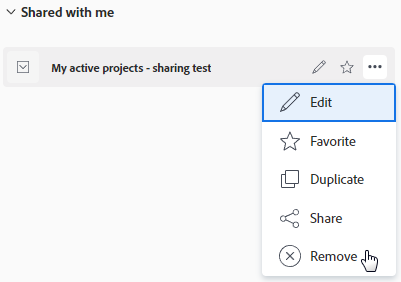

# 删除过滤器、视图和分组

如果您创建了过滤器、视图或组，或者已与您共享了过滤器、视图或组，则可以从列表和报表中删除它们。 您无法删除默认过滤器、视图或分组。

## 访问要求

您必须具备以下条件：

<table style="table-layout:auto"> 
 <col> 
 </col> 
 <col> 
 </col> 
 <tbody> 
  <tr> 
   <td role="rowheader"><strong>Adobe Workfront计划*</strong></td> 
   <td> 
任意 
 </td> 
  </tr> 
  <tr> 
   <td role="rowheader"><strong>Adobe Workfront许可证*</strong></td> 
   <td> 
请求或更高版本
 </td> 
  </tr> 
  <tr> 
   <td role="rowheader"><strong>访问级别配置*</strong></td> 
   <td> 
查看或更高权限访问过滤器、视图、分组
 
注意：如果您仍然没有访问权限，请咨询Workfront管理员，他们是否在您的访问级别设置了其他限制。 有关Workfront管理员如何修改访问级别的信息，请参阅 <a href="../../../administration-and-setup/add-users/configure-and-grant-access/create-modify-access-levels.md" class="MCXref xref">创建或修改自定义访问级别</a>.
 </td> 
  </tr> 
  <tr> 
   <td role="rowheader"><strong>对象权限</strong></td> 
   <td> 
查看有权共享到要删除的过滤器、查看或分组的权限
 
有关请求其他访问权限的信息，请参阅 <a href="../../../workfront-basics/grant-and-request-access-to-objects/request-access.md" class="MCXref xref">请求对对象的访问 </a>.
 </td> 
  </tr> 
 </tbody> 
</table>

&#42;要了解您拥有的计划、许可证类型或访问权限，请联系您的Workfront管理员。

## 使用标准生成器删除或删除过滤器

您可以使用标准生成器界面从项目、任务或问题列表中删除与您共享的过滤器。 标准生成器界面不适用于任何其他对象，或视图或分组。

您还可以使用标准生成器界面从项目、任务或问题列表中删除您拥有的过滤器。

无法删除或删除系统默认过滤器。

### 有关使用标准生成器删除过滤器的注意事项

使用标准生成器删除或删除过滤器时，会出现以下情况：

* 如果与您共享了过滤器，并且您将其删除，则该过滤器将仅为您删除。 最初创建该过滤器的用户以及之前与其共享的任何其他用户仍有权访问过滤器。
* 如果您拥有该过滤器并将其删除，则该过滤器将从Workfront系统中删除。 过滤器不再可供您之前与其共享该过滤器的任何用户使用。
* 如果您是Workfront管理员，则可以删除该过滤器，该过滤器将被永久删除，供所有用户使用，包括所有者。

### 使用标准生成器删除过滤器

1. 转到项目、任务、问题、项目组合、项目、用户、模板或组的列表。
1. 单击 **过滤器** 图标 .
1. 将鼠标悬停在 **与我共享**，请单击 **更多** 菜单 ，然后单击 **删除**.

   

1. 选择 **删除** 在确认消息中，永久删除过滤器。

### 使用标准生成器删除过滤器

1. 转到项目、任务、问题、项目组合、项目、用户、模板或组的列表。
1. 单击 **过滤器** 图标 .
1. 将鼠标悬停在您有权删除的过滤器上，单击 **更多** 菜单 ，然后单击 **删除**.

   

1. （可选）单击 **取消** ，以避免删除并返回过滤器列表。
1. 单击 **删除** ，以确认删除。

   此过滤器将为您和所有拥有该过滤器权限的用户而删除。

## 使用旧版生成器删除过滤器、视图或分组

您可以使用旧版生成器界面删除所有对象列表的过滤器、视图或分组。

### 有关使用旧版生成器删除过滤器、视图和分组的注意事项

删除报表元素的方式取决于您最初是创建报表元素，还是与您共享了报表元素。

删除过滤器、查看或分组时，会出现以下情况：

* **如果您创建了该元素并将其删除**，则会从Workfront系统中删除该元素。 它不再可供您之前与之共享的任何用户使用。
* **如果已与您共享该元素，并且您将其删除**，则仅会为您删除该元素。 最初创建该报表包的用户以及与其共享的任何其他用户仍有权访问该报表包。

### 使用旧版生成器删除过滤器、视图或分组

1. 转到对象列表或报表。
1. （视情况而定）在列表中，单击 **过滤器**, **查看**&#x200B;或 **分组** 图标，然后将鼠标悬停在要删除的过滤器、视图或分组上，单击 **更多** 图标 ，则 **删除**. 过滤器、视图或分组将被删除。
1. （视情况而定）在报表中，单击 **分组**, **过滤器**&#x200B;或 **查看** 下拉菜单，然后选择 **删除分组**, **删除过滤器**&#x200B;或 **删除视图**.

   的 **我的分组**, **我的过滤器，** 或 **我的观点** 对话框。

   您有权删除的所有报表元素都可以删除。 其他报表元素将显示为灰显。

1. 单击 **x** 图标。
1. （视情况而定）单击 **是，删除它** 如果您选择删除您创建的过滤器、视图或组，然后与他人共享该过滤器、视图或组。 这会从Workfront系统中删除过滤器、查看或分组。

   >[!TIP]
   >
   >如果删除您创建的过滤器、视图或分组而不与他人共享，则会将其从系统中删除，而无需请求确认。

1. 单击 **完成**.

