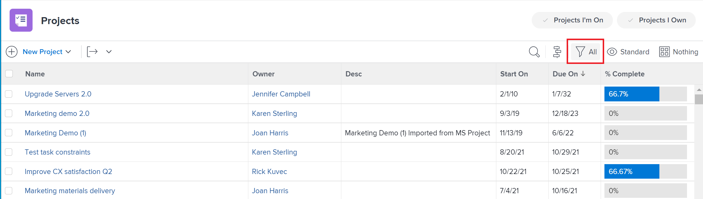

# 报表元素：过滤器、视图和分组

<!--

AL: Add information here about all the different kinds of FVGs: in reports, in lists, beta, etc // OR: this article should be a high-level overview of reporting elements. Then, each type of element should have:

- overview for Filters

- create a filter

- share a filter

ALL in Reporting elements but the Shared ones should be linked to Basics> Sharing; some of the articles in the Basics> Navigation> Use lists might beed to link here as well

-->

在Adobe Workfront中，有几个元素可以创建列表或报表。 每个列表和报表都必须具有的主要元素是过滤器、视图和分组。 每个元素在任何报表中提供不同的信息。

## 有关报表元素的注意事项

使用过滤器、视图和分组时，请考虑以下事项：

* 报表元素可用作报表的构建块。 它们定义报表或列表的外观以及报表或列表中包含的信息。
* Workfront中的报表特定于一个对象。 您必须先为报表定义主对象，然后才能构建报表。 因此，所有报表元素都是特定于对象的。
* 您的Workfront管理员必须授予您在访问级别中访问过滤器、视图和分组的权限，才能在列表和报表中查看或编辑它们。

   有关授予对过滤器、视图和分组的访问权限的信息，请参阅 [授予对过滤器、视图和分组的访问权限](../../../administration-and-setup/add-users/configure-and-grant-access/grant-access-fvg.md).

* 您的Workfront管理员必须授予您访问权限级别中的报表、功能板和日历的权限，才能查看或编辑报表。

   有关授予对报表、功能板和日历的访问权限的信息，请参阅 [授予对报表、功能板和日历的访问权限](../../../administration-and-setup/add-users/configure-and-grant-access/grant-access-reports-dashboards-calendars.md).

* 如果您在报表或列表上选择过滤器、查看或分组，则即使在您注销或关闭浏览器后，Workfront仍会为该对象的列表保留此选择。 例如，如果为任务报表选择特定视图，则会为其他任务列表（如项目上的任务列表）显示该选择。

## 过滤器

过滤器控制报表中显示的结果，通常将结果从常规范围缩小到特定范围。 它的工作方式就像一个筛子，它只获取您需要的信息并将该信息返回到您的报告中。

例如，如果您只想查看分配给登录用户的任务，则可以创建标题为“我的任务”的过滤器，定义过滤器必须满足的条件并运行报表，以便仅查看分配给登录用户的任务。

过滤器的某些属性包括：

* 默认情况下，Workfront会为各种对象提供大量过滤器。
* 您可以自定义您拥有或管理的过滤器。

   有关过滤器的更多信息，请参阅文章 [过滤器Adobe Workfront概述](../../../reports-and-dashboards/reports/reporting-elements/filters-overview.md).

## 视图

通过定义报表视图，可定义报表中包含的信息。 与所有报表元素一样，视图也基于一种对象类型。\
例如，任务报表的视图可显示到期日，包括关键财务详细信息（如成本），或用于显示分配和交货日期详细信息。 视图可用于提供有关报表中数据的各种详细信息。

视图的一些属性包括：

* 您可以使用默认的Workfront视图，也可以创建自己的视图。
* 运行报表后，您可以从“视图”下拉字段中应用其他视图。
* 其他视图会临时替换创建报告时定义的视图；但是，下次返回报表时，将显示默认视图。

   有关视图的更多信息，请参阅文章 [视图Adobe Workfront概述](../../../reports-and-dashboards/reports/reporting-elements/views-overview.md).

## 分组

分组控制您组织数据的方式，从而更便于阅读和理解。 在整个报表中，分组会创建水平条，以显示按常用属性一起列出的结果。 您可以定义在创建分组时如何对报表结果进行分组的标准。

例如，按项目名称对跨多个项目的任务列表进行分组，会根据该名称组织属于单个项目的所有相应任务。

分组的一些属性包括：

* 如果要稍后向报表中添加图表，则分组是强制性的报表元素。
* 分组在结果中显示聚合值&#x200B;。
* 分组决定图表中的轴。
* 分组可确定矩阵报表中的标题标识。\
   有关矩阵报表的更多信息，请参阅文章 [创建矩阵报表](../../../reports-and-dashboards/reports/creating-and-managing-reports/create-matrix-report.md).

* 分组有助于构建报表的“摘要”选项卡，从而提供报表的汇总值。
* 默认情况下，Workfront会为不同的对象提供多个分组。
* 您可以自定义您拥有或管理的分组。

   有关分组的更多信息，请参阅 [Adobe Workfront中的分组概述](../../../reports-and-dashboards/reports/reporting-elements/groupings-overview.md).

## 其他报表元素

除了过滤器、视图和分组之外，您还可以向报表添加以下元素：

* **提示**:每次运行报表时，可以按不同方式自定义和应用的打开过滤器。\
   有关提示的详细信息，请参阅文章 [向报表添加提示](../../../reports-and-dashboards/reports/creating-and-managing-reports/add-prompt-report.md).

* **图表**:您可以通过向报表添加图表并以可视方式显示信息来增强报表。\
   有关报告中图表的详细信息，请参阅文章 [将图表添加到报表](../../../reports-and-dashboards/reports/creating-and-managing-reports/add-chart-report.md).
