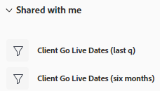

# 共享过滤器、查看或分组

<!--

(NOTE: CONSIDER SPLITTING THIS in three articles for each reporting element?)

(NOTE: This is linked from the TOC article in WF Basics > permissions section)&nbsp;

-->

您的Adobe Workfront管理员在用户分配访问级别时，会授予用户查看或编辑对象的权限。 有关授予对对象的访问权限的更多信息，请参阅 [创建或修改自定义访问级别](../../../administration-and-setup/add-users/configure-and-grant-access/create-modify-access-levels.md).

除了授予用户的访问级别之外，您还可以授予他们查看或编辑您创建或有权共享的特定对象的权限。 有关访问级别和权限的更多信息，请参阅 [访问级别和权限如何协同工作](../../../administration-and-setup/add-users/access-levels-and-object-permissions/how-access-levels-permissions-work-together.md).

您可以与其他用户共享您有权查看的过滤器、视图和分组。

与您共享过滤器、视图或分组时，您可以将该过滤器、视图或分组应用到您的列表。 根据您获得的访问权限，您可能能够修改该权限并与其他用户共享该权限。

有关如何创建过滤器、查看或分组的信息，请参阅以下文章：

* [过滤器Adobe Workfront概述](../../../reports-and-dashboards/reports/reporting-elements/filters-overview.md)
* [视图Adobe Workfront概述](../../../reports-and-dashboards/reports/reporting-elements/views-overview.md)
* [Adobe Workfront中的分组概述](../../../reports-and-dashboards/reports/reporting-elements/groupings-overview.md)

## 访问要求

您必须具备以下条件：

<table style="table-layout:auto"> 
 <col> 
 <col> 
 <tbody> 
  <tr> 
   <td role="rowheader"><strong>Adobe Workfront计划*</strong></td> 
   <td> 
任意 
 </td> 
  </tr> 
  <tr> 
   <td role="rowheader"><strong>Adobe Workfront许可证*</strong></td> 
   <td> 
请求或更高版本
 </td> 
  </tr> 
  <tr> 
   <td role="rowheader"><strong>访问级别配置*</strong></td> 
   <td> 
查看或更高权限访问过滤器、视图、分组
 
注意：如果您仍然没有访问权限，请咨询Workfront管理员，他们是否在您的访问级别设置了其他限制。 有关Workfront管理员如何修改访问级别的信息，请参阅 <a href="../../../administration-and-setup/add-users/configure-and-grant-access/create-modify-access-levels.md" class="MCXref xref">创建或修改自定义访问级别</a>.
 </td> 
  </tr> 
  <tr> 
   <td role="rowheader"><strong>对象权限</strong></td> 
   <td> 
具有共享到视图、过滤器或分组的访问权限的查看或更高权限
 
有关请求其他访问权限的信息，请参阅 <a href="../../../workfront-basics/grant-and-request-access-to-objects/request-access.md" class="MCXref xref">请求对对象的访问 </a>.
 </td> 
  </tr> 
 </tbody> 
</table>

&#42;要了解您拥有的计划、许可证类型或访问权限，请联系您的Workfront管理员。

## 共享过滤器、查看或分组

<!--

(NOTE: when the beta filters/ groupings come out either consider splitting this in different kinds of FVGs or splitting this article in FVGs for showing sharing on each one of them??)

-->

在选定列表中共享过滤器的方式因您用于从哪个界面共享过滤器而有所不同：标准或旧版。 有关过滤器构建界面类型的信息，请参阅 [在Adobe Workfront中创建或编辑过滤器](/help/quicksilver/reports-and-dashboards/reports/reporting-elements/create-filters.md).

您只能在旧版界面中共享视图和分组。

### 使用标准生成器界面共享过滤器

您可以在标准界面中从项目、任务、问题、项目组合、项目、用户、模板或组列表共享过滤器。 过滤器的标准生成器界面不适用于任何其他对象，或者视图或分组。

使用标准生成器界面共享过滤器：

1. 转到项目、任务或问题列表。
1. 单击 **过滤器** 图标 .

   

1. 查看以下过滤器列表：

   <table style="table-layout:auto">
   <col>
   <col>
   <tbody>
   <tr>
   <td role="rowheader"><strong>已收藏</strong></td>
   <td>标记为收藏的过滤器。 当您收藏某个过滤器时，该过滤器的原始位置将显示在该过滤器名称的下方，并且该过滤器在原始列表中处于隐藏状态，除非您将其作为收藏进行删除。</td>
   </tr>
   <tr>
   <td role="rowheader"><strong>已保存</strong></td>
   <td>您自己构建并保存的过滤器。</td>
   </tr>
   <tr>
   <td role="rowheader"><strong>系统默认值</strong></td>
   <td>Workfront系统默认过滤器，以及Workfront管理员添加到过滤器列表的过滤器（无论是在系统级别还是在布局模板中）。</td>
   </tr>
   <tr>
   <td role="rowheader"><strong>已与我共享</strong></td>
   <td>其他人创建并与您共享的过滤器，或在系统范围内共享的过滤器。</td>
   </tr>
   </tbody>
   </table>

1. 将鼠标悬停在您至少有权访问和共享的过滤器上，然后单击 **更多** 菜单 ，然后单击 **共享**.

   

   此时会显示过滤器共享框。

1. 启用 **查看系统范围** 设置。 这会为Workfront中的任何人授予查看过滤器的权限。

   >[!IMPORTANT]
   >
   >请谨慎使用此设置。 为所有用户添加多个过滤器会使过滤器体验变得混乱，并使查找过滤器变得更加困难。

   或者，开始在中键入要与其共享的用户、团队、角色、组或公司的名称 **授予** 字段。

   

1. （可选）单击实体名称旁边的向右箭头以编辑其对过滤器的权限，然后启用 **查看** 或 **管理** 选项。 **查看** 为默认值。

   

1. （可选）通过执行以下操作之一，启用或禁用实体的附加权限：

   1. 单击 **查看** 并禁用 **共享** 选项。 默认情况下处于启用状态。
   1. 单击 **管理** 和禁用 **共享** 或 **删除** 选项。 默认情况下，会启用这些设置。

      >[!NOTE]
      >
      >如果启用使用删除选项管理访问权限，则这些用户将能够从所有用户中删除过滤器，即使他们不拥有该过滤器。
   >[!TIP]
   >
   >用户无法获得比其访问级别更高的权限。 如果他们在访问级别无权访问“编辑”过滤器，则无法接收管理过滤器的权限。 Workfront会为这些用户禁用“管理”选项，并且该选项会变暗。

1. 单击 **共享**. 过滤器将与您指定的实体共享。

   >[!TIP]
   >
   >与群组共享后，过滤器即有权访问群组成员和所有子组的成员。

   您共享的过滤器显示在 **与我共享** 中的“属性”(A)。

   

### 使用旧版界面共享过滤器、视图和分组

在旧版界面中共享过滤器、视图和分组是相同的。

1. 转到对象列表或报表。
1. （视情况而定）在列表中，单击 **过滤器**, **查看**&#x200B;或 **分组** 图标，然后将鼠标悬停在要共享的过滤器、视图或分组上，单击 **更多** 图标 ，则 **共享**.

   在报表中，单击 **过滤器**, **查看**&#x200B;或 **分组** 下拉菜单，然后选择要共享的过滤器、视图或分组。

1. （视情况而定）如果从报表共享，请单击 **过滤器**, **查看**&#x200B;或 **分组** 下拉菜单，然后单击 **共享过滤器**, **共享视图**&#x200B;或 **共享分组**.\
   的 **过滤器访问**, **查看访问**&#x200B;或 **分组访问** 对话框。

   

1. 根据要与谁共享，完成以下任一操作：

   **要与个人用户、团队、角色、组或公司共享，请执行以下操作：** 在提供的字段中，开始键入要与其共享的用户、团队、角色、组或公司的名称，然后在下拉列表中显示该名称时，单击该名称。\
   重复此过程，以便与多个用户、团队、角色、组或公司共享访问权限。

   >[!TIP]
   >
   >与群组共享后，过滤器、查看或分组的权限将分配给群组成员和所有子群组的成员。

   **要与系统中的所有用户共享，请执行以下操作：** 单击 **设置** 图标，然后单击 **在系统范围内使此可见**.\
   您的管理员必须选择共享系统范围的选项，才能使此选项可用。 有关更多信息，请参阅 [创建或修改自定义访问级别](../../../administration-and-setup/add-users/configure-and-grant-access/create-modify-access-levels.md) 和 [共享报表、功能板和日历](../../../workfront-basics/grant-and-request-access-to-objects/permissions-reports-dashboards-calendars.md).

1. （视情况而定）如果您与个人用户、团队、角色、组或公司共享，请单击下拉菜单以定义要授予的访问级别。

   您可以从以下选项中进行选择：

   <table style="table-layout:auto"> 
    <col> 
    <col> 
    <tbody> 
     <tr> 
      <td role="rowheader"><strong>查看它</strong></td> 
      <td> 
选择此选项可允许共享收件人仅使用共享的过滤器、查看或分组。 选择此选项后，收件人将无法对共享项目进行任何修改。
 </td> 
     </tr> 
     <tr> 
      <td role="rowheader"><strong>管理它</strong></td> 
      <td> 
选择此选项可允许共享收件人使用和修改共享的过滤器、查看或分组。
 </td> 
     </tr> 
     <tr> 
      <td role="rowheader"><strong>共享</strong></td> 
      <td> 
单击 <strong>高级设置</strong>，然后选择或清除 <strong>共享</strong> 选项，具体取决于您是否希望收件人能够与他人共享。
 </td> 
     </tr> 
    </tbody> 
   </table>

1. 单击&#x200B;**保存**。

   与您共享过滤器、查看或分组的用户可以通过单击 **过滤器**, **查看**&#x200B;或 **分组** 下拉菜单或图标，然后向下滚动到 **与我共享** 中。

