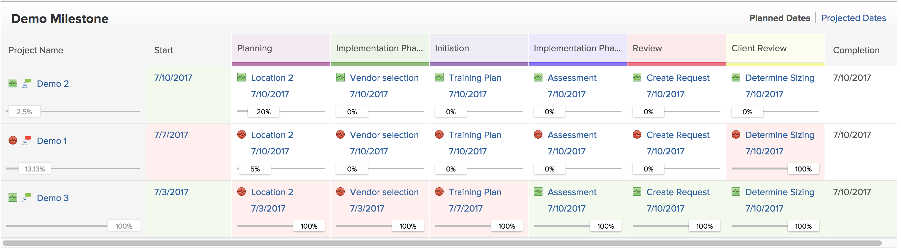

# 使用里程碑视图

<!-- Audited: 11/2024 -->

您可以将“里程碑”视图应用于项目列表或报告。

在使用里程碑视图之前，需要配置里程碑，需要向项目添加里程碑路径，并且里程碑需要与任务关联，如文章[创建里程碑路径](../../../administration-and-setup/customize-workfront/configure-approval-milestone-processes/create-milestone-path.md)和[将里程碑与任务关联](../../../manage-work/tasks/manage-tasks/associate-milestones-with-tasks.md)中所述。

查看项目列表或项目报告时，里程碑视图可用。 以下各节介绍如何查看和使用里程碑视图。

## 访问要求

+++ 展开以查看本文中各项功能的访问要求。

您必须具有以下权限才能执行本文中的步骤：

<table style="table-layout:auto"> 
 <col> 
 </col> 
 <col> 
 </col> 
 <tbody> 
  <tr> 
   <td role="rowheader"><strong>Adobe Workfront计划</strong></td> 
   <td> 
任何
 </td> 
  </tr> 
  <tr> 
   <td role="rowheader"><strong>Adobe Workfront许可证</strong></td> 
   <td> 
      
新增：

         <ul>
         <li>
标准
</li>
         </ul>
      
当前：

         <ul>
         <li>
工作或更高
</li>
         </ul>
   </td>
  </tr> 
  <tr> 
   <td role="rowheader"><strong>访问级别配置*</strong></td> 
   <td> 
查看或更高的报告、功能板和日历访问权限
</td> 
  </tr> 
  <tr> 
   <td role="rowheader"><strong>对象权限</strong></td> 
   <td> 
查看权限到项目报告以将里程碑视图应用于报告
 </td> 
  </tr> 
 </tbody> 
</table>

有关此表中信息的更多详细信息，请参阅Workfront文档中的[访问要求](/help/quicksilver/administration-and-setup/add-users/access-levels-and-object-permissions/access-level-requirements-in-documentation.md)。

+++

## 切换到里程碑视图 {#switch-to-the-milestone-view}

{{step1-to-projects}}

1. 单击&#x200B;**视图**&#x200B;下拉菜单，然后单击&#x200B;**里程碑**。

   该列表或报告将显示在“里程碑”视图中。

   有关里程碑视图的信息，请参阅本文中的[里程碑视图概述](#milestone-view-overview)部分。

## 里程碑视图概述 {#milestone-view-overview}

里程碑视图在项目列表和项目报告中可用。 利用此视图，可快速查看与您正在查看的项目中的任务关联的所有里程碑。

>[!NOTE]
>
>里程碑视图在以下区域不可用：
>
>* 时间表，在添加项目时显示在项目列表中。

有关如何切换到里程碑视图的信息，请参阅本文中的[切换到里程碑视图](#switch-to-the-milestone-view)部分。

具有里程碑视图的

### 里程碑视图部分

将里程碑视图应用于项目列表时，项目显示在以下部分：

* 与里程碑路径关联的项目首先显示，并在其各自的里程碑路径名称下列出。

  Workfront按以下标准对第一部分中的项目排序，顺序如下：

   1. 里程碑路径ID。 您可以在里程碑路径报表中查看里程碑路径ID。

   2. 在选择“里程碑”视图之前，在先前应用于项目列表的视图中选择作为项目列表第一个排序字段的字段。

* 未与里程碑路径关联的项目显示在下一部分，即未分配部分。 在您选择“里程碑”视图之前，Workfront会按在之前应用于项目列表的视图中为项目列表选择的第一个排序字段来排序未分配分区中的项目。

### 里程碑视图中的项目信息

在“里程碑”视图中查看项目列表或项目报告时，可以使用以下信息：

* **计划日期或预计日期：**&#x200B;指定您希望在“里程碑”视图中显示计划日期还是预计日期。\
  将显示开始日期和完成日期，以及里程碑路径中每个里程碑的日期。\
  如果您查看的是计划日期，并且您还拥有项目的“管理”访问权限，则可以直接从“里程碑”视图中编辑以下日期：（如果您查看的是预计日期，则无法编辑日期，因为预计日期已经计算并且无法手动更改。）

   * **项目开始日期：**&#x200B;如果从开始日期开始安排项目，则可以手动更改项目的开始日期，然后计算完成日期。
   * **项目完成日期：**&#x200B;如果从完成日期开始安排项目，则可以手动更改项目的完成日期，然后计算开始日期。
   * **任务完成日期：**&#x200B;您可以直接从里程碑视图中手动更新任务的完成日期。

* **完成百分比：**&#x200B;显示每个任务和项目的完成百分比。\
  您可以禁用显示完成百分比，如本文中[配置里程碑视图](#configure-what-information-displays-in-the-milestone-view)中显示的信息部分所述。\
  您可以直接从“里程碑”视图中调整完成百分比，如本文中“里程碑”视图](#adjust-percent-complete-for-tasks-in-the-milestone-view)中任务的[调整完成百分比部分所述。

* **任务状态图标：**&#x200B;里程碑视图中的每个项目和任务旁边会显示一个状态图标。

   * 准时\
     

   * 滞后\
     

   * 处于风险中\
     

   * 迟到\
     

  您可以禁止显示这些状态图标，如本文中[配置里程碑视图](#configure-what-information-displays-in-the-milestone-view)中显示的信息部分所述。\
  有关每种状态类型的更多详细信息，请参阅文章[任务进度状态概述](../../../manage-work/tasks/task-information/task-progress-status.md)。

* **已完成任务的任务状态着色**：将任务标记为“完成”后，任务的背景将在“里程碑”视图中着色，以指示任务是按时完成还是延迟完成：

   * **任务列**&#x200B;的红色底纹：当进度状态为&#x200B;**延迟**&#x200B;时，任务的背景为红色。

   * **任务列**&#x200B;的绿色底纹：当进度状态为&#x200B;**开启时间**&#x200B;时，任务的背景为绿色。

* **项目开始和完成列的项目状态底纹**：

   * **项目开始列**：只有在填充了实际开始日期时，项目开始列的背景才显示为红色或绿色：

      * **项目开始列的红色底纹**：当项目的进度状态为&#x200B;**延迟**&#x200B;时，项目开始列的背景为红色。

      * **项目开始列的绿色底纹**：当项目的进度状态为&#x200B;**开启时间**&#x200B;时，项目开始列的背景为绿色。

   * **项目完成列**：只有在填充了实际完成日期时，“项目完成”列的背景才显示为红色或绿色：

      * **项目完成列的红色底纹**：当项目的进度状态为&#x200B;**延迟**&#x200B;时，项目完成列的背景为红色。

      * **项目完成列的绿色底纹**：当项目的进度状态为&#x200B;**开启时间**&#x200B;时，项目完成列的背景为绿色。

   * 当任务的进度状态为“风险”或“落后”时，不会为“开始”和“完成”列分配颜色底纹。

  

* **项目名称**：显示项目名称时带有指向项目的链接。
* **项目完成情况图标**：项目名称旁边会显示一个图标，指示项目的完成情况。

## 配置里程碑视图中显示的信息 {#configure-what-information-displays-in-the-milestone-view}

您可以配置是否在里程碑视图中显示以下元素：

* 进度状态图标
* 项目和任务的完成百分比

默认情况下，将显示项目状态图标和项目完成百分比。

您对这些选项所做的任何更改仅适用于您；其他用户不会受到影响。 您所做的更改将在下次登录到Adobe Workfront时保留。

要配置是否显示项目状态图标和项目的完成百分比，请执行以下操作：

{{step1-to-projects}}

1. 单击&#x200B;**视图**&#x200B;下拉菜单，然后单击&#x200B;**里程碑**。\
   如果要查看Portfolio或项目群内的项目列表，请选择&#x200B;**里程碑**&#x200B;子选项卡。

1. 单击里程碑视图右上角的&#x200B;**选项**。\
   

1. 从以下选项中选择：

   <table style="table-layout:auto"> 
    <col> 
    <col> 
    <tbody> 
     <tr> 
      <td role="rowheader">进度状态</td> 
      <td> 
选择此选项可在每个项目和任务旁边显示进度状态图标。
 
此选项默认处于启用状态。
 </td> 
     </tr> 
     <tr> 
      <td role="rowheader">完成百分比</td> 
      <td> 
选择此选项可在每个项目和任务旁边显示完成百分比。
 
此选项默认处于启用状态。
 </td> 
     </tr> 
    </tbody> 
   </table>

## 调整“里程碑”视图中任务的完成百分比 {#adjust-percent-complete-for-tasks-in-the-milestone-view}

您可以在“里程碑”视图中调整任务的完成百分比。 您无法调整父任务（包含子任务的任务）的完成百分比。

要在“里程碑”视图中调整任务的完成百分比，请执行以下操作：

{{step1-to-projects}}

1. 单击&#x200B;**视图**&#x200B;下拉菜单，然后单击&#x200B;**里程碑**。

1. （视情况而定）如果“里程碑”视图中当前未显示完成百分比，请单击“里程碑”视图右上角的&#x200B;**选项**，然后确保启用了&#x200B;**完成百分比**。

1. 单击任务下方的完成百分比，指定新百分比，然后按Enter键。
