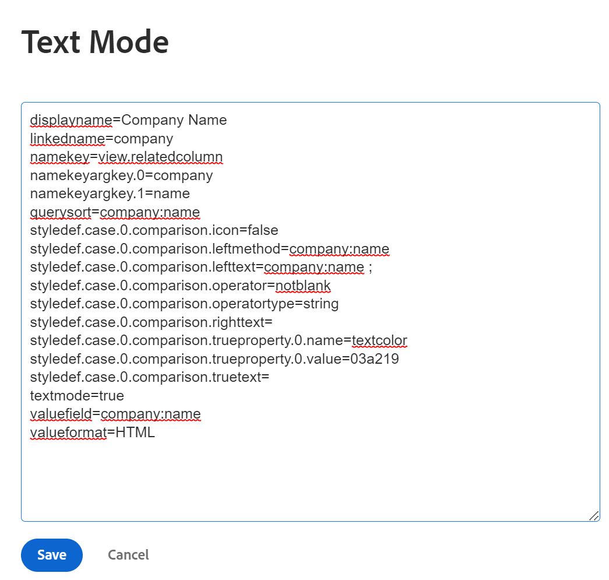
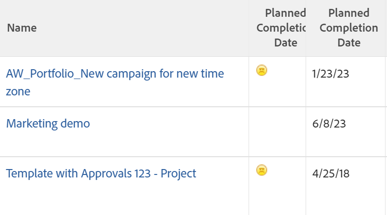

# 在文本模式下使用条件格式

<!--Audited: 01/2025-->

在创建报表元素时，标准界面生成器提供了大量灵活性以满足贵组织的需求。

您可以使用标准界面在视图中应用条件格式。\
有关将条件格式应用于视图的详细信息，请参阅[在视图中使用条件格式](../../../reports-and-dashboards/reports/reporting-elements/use-conditional-formatting-views.md)。

## 访问要求

+++ 展开以查看本文中各项功能的访问要求。

您必须具备以下条件：

<table style="table-layout:auto"> 
 <col> 
 <col> 
 <tbody> 
  <tr> 
   <td role="rowheader">Adobe Workfront计划</td> 
   <td> <p>任何</p> </td> 
  </tr> 
  <tr> 
   <td role="rowheader">Adobe Workfront许可证</td> 
   <td> 
      <p>新增：</p>
         <ul>
         <li><p>标准</p></li>
         </ul>
      <p>当前：</p>
         <ul>
         <li><p>计划</p></li>
         </ul>
   </td>
  </tr> 
  <tr> 
   <td role="rowheader">访问级别配置</td> 
   <td> <p>编辑对筛选器、视图、分组的访问权限</p> <p>编辑对报告、功能板和日历的访问权限以编辑报告中的视图</p> </td> 
  </tr> 
  <tr> 
   <td role="rowheader">对象权限</td> 
   <td> <p>管理对报告的权限以编辑报告中的视图</p> <p>管理视图的权限以编辑它</p> </td> 
  </tr> 
 </tbody> 
</table>

有关信息，请参阅Workfront文档中的[访问要求](/help/quicksilver/administration-and-setup/add-users/access-levels-and-object-permissions/access-level-requirements-in-documentation.md)。

+++

## 文本模式中的条件格式

文本模式允许您使用标准界面中不可用的字段，从而创建更复杂的视图、筛选器、分组和提示。

有关所有可报告字段的完整列表，请参阅[API资源管理器](../../../wf-api/general/api-explorer.md)。

有关使用文本模式语法的详细信息，请参阅[文本模式语法概述](../../../reports-and-dashboards/reports/text-mode/text-mode-syntax-overview.md)。

也可以使用文本模式设置报告和列表中的视图格式。 使用条件格式，您可以通过更改报表中结果的字体类型和背景以及图标和标志来更改报表的视图。 我们建议您始终首先使用标准界面构建视图，并且仅在绝对必要时才切换到文本模式界面。

>[!NOTE]
>
> 不支持使用CSS样式来自定义条件格式。 相反，您必须使用Adobe Workfront中提供的预先设计的格式选项。

## 向视图添加条件格式

有关在标准生成器界面中将条件格式应用于视图的详细信息，请参阅[在视图中使用条件格式](../../../reports-and-dashboards/reports/reporting-elements/use-conditional-formatting-views.md)。

要在文本模式界面中为视图添加条件格式，请执行以下操作：

1. 转到对象列表。
1. 展开要向其添加条件格式化的视图的下拉菜单。
1. 单击&#x200B;**自定义视图**。
1. 单击要应用条件格式化的视图中的列。
1. 单击&#x200B;**切换到文本模式**。
1. 在&#x200B;**显示在此列：**&#x200B;区域中，单击&#x200B;**单击以编辑文本**。
1. 在所选列的文本底部添加在[使用文本模式](#format-views-using-text-mode)设置视图格式中提供的代码示例。
1. 单击&#x200B;**保存**，然后单击&#x200B;**保存视图**。

## 使用文本模式设置视图格式 {#format-views-using-text-mode}

可将以下组件添加到视图中的列，以有条件地将其设置为文本模式的格式：

* [列设置](#column-settings)
* [列规则](#column-rules)
* [有条件地设置值表达式的格式](#conditionally-format-a-valueexpression)

### 列设置 {#column-settings}

您必须熟悉文本模式界面，然后才能向视图添加条件格式。

在视图中使用条件格式时，您可以自定义列的以下元素：

* [列标题](#column-headers)
* [设置日期格式](#format-dates)
* [设置数字格式](#format-numbers)

#### 列标题 {#column-headers}

要更改显示的列标题，请将以下代码添加到列： `displayname= [Name of column]`。 例如，要将列命名为“项目所有者”，文本代码如下所示：

`displayname=Project Owner`

#### 设置日期格式 {#format-dates}

日期可以配置为以各种格式显示。

有关详细信息，请参阅[文本模式报表中的日期格式](../../../reports-and-dashboards/reports/text-mode/format-dates-in-text-mode-reports.md)。

#### 设置数字格式 {#format-numbers}

您可以设置数字值的格式，以显示最适合您的报告需求的信息。

有关详细信息，请参阅[文本模式报表中的数字、货币和百分比值的格式](../../../reports-and-dashboards/reports/text-mode/format-numbers-in-text-mode-reports.md)。

### 列规则 {#column-rules}

列规则允许在视图中添加图像、颜色、格式和文本覆盖。 列规则可以单独建立，也可以包含列的多个条件。

* [条件格式](#conditional-formatting)
* [多个条件格式](#multiple-conditional-formats)
* [应用文本](#apply-text)
* [应用行格式](#apply-row-formats)
* [应用图像](#apply-images)

#### 条件格式化 {#conditional-formatting}

在合并颜色或设置文本格式时，必须应用特定的文本模式语句。

>[!NOTE]
>
>合并的列可能不支持条件格式。\
>有关使用文本模式合并列的详细信息，请参阅[视图：合并一个共享列中多个列的信息](../../../reports-and-dashboards/reports/custom-view-filter-grouping-samples/view-merge-columns.md)。

在要添加条件格式的任何列中插入以下代码：

```
styledef.case.0.comparison.leftmethod= [field name]
styledef.case.0.comparison.lefttext= [field name]
styledef.case.0.comparison.righttext= [field value]
styledef.case.0.comparison.operator= [qualifier]
styledef.case.0.comparison.operatortype= [data type]
styledef.case.0.comparison.icon=false
styledef.case.0.comparison.truetext= 
styledef.case.0.comparison.trueproperty.0.name= [format option]
styledef.case.0.comparison.trueproperty.0.value= [format style]
```

>[!NOTE]
>
>除非使用图标，否则`styledef.case.0.comparison.icon`行始终为false。
>
>在处理覆盖文本之前，`styledef.case.0.comparison.truetext`行始终留空。
>
>当限定符不为空时，`styledef.case.0.comparison.righttext`行为空。

例如，如果我们想在项目报告中以绿色文本显示公司名称，您可以使用以下代码：

```
styledef.case.0.comparison.leftmethod=company:name
styledef.case.0.comparison.lefttext=company:name ;
styledef.case.0.comparison.righttext= 
styledef.case.0.comparison.operator=notblank
styledef.case.0.comparison.operatortype=string
styledef.case.0.comparison.icon=false
styledef.case.0.comparison.truetext=
styledef.case.0.comparison.trueproperty.0.name=textcolor
styledef.case.0.comparison.trueproperty.0.value=03a219
```

>[!NOTE]
>
>* 虽然此语句可以应用于“公司名称”列，但它也可以应用于报表上的任何其他列。 仅当项目具有关联的公司时，才会显示绿色文本。 请记住`[field name]`、`[value]`和`[qualifier]`驱动器，无论条件是否最终显示在列上。
>* 在使用限定符时，我们建议使用`cicontains`而不是`equal`。 默认情况下，`equal`会查找ID号。 使用`cicontains`限定符，您可以按其名称访问项目。

{width="500"}


{width="400"}

无论文本颜色、对齐方式、字体样式还是背景颜色应用于文本模式，都会使用相同的语句（如上所示）。

必须修改以下行以反映列所需的相应格式：

```
styledef.case.0.comparison.trueproperty.0.name= [format option]
styledef.case.0.comparison.trueproperty.0.value= [format style]
```

使用下表确定必须修改哪些行以及应指定哪些值来定义列的格式样式：

| **文本颜色** | **行： textcolor=** |
|---|---|
| 黑色 | `000000` |
| 深蓝色 | `0c6aca` |
| 蓝绿色 | `1b878c` |
| 绿色 | `03a219` |
| 紫色 | `6408c4` |
| 灰色 | `767676` |
| 红色 | `d30519` |
| 黄色 | `e19503` |

{style="table-layout:auto"}

| **对齐方式** | **行： align=** |
|---|---|
| 左对齐 | `left` |
| 右对齐 | `right` |
| 居中对齐 | `center` |

{style="table-layout:auto"}

| 字体 | 行： ***fontstyle=*** |
|---|---|
| 粗体 | `bold` |
| 斜体 | `italic` |

{style="table-layout:auto"}

| **背景颜色** | **行： bgcolor=** |
|---|---|
| 蓝绿色 | `dcf6f7` |
| 绿色 | `def6e2` |
| 灰色 | `e8e8e8` |
| 蓝色 | `e8f1ff` |
| 紫色 | `e9def4` |
| 红色 | `eac6c9` |
| 黄色 | `feecc8` |
| 白色 | `ffffff` |

{style="table-layout:auto"}

#### 多个条件格式 {#multiple-conditional-formats}

您可以对语句应用多个格式样式。 核心语句将保持不变，并将任何其他格式表达式添加到该语句中。

例如，使用以前的语句以绿色粗体文本包括公司名称。 语句将使用以下代码编写：

```
styledef.case.0.comparison.leftmethod=company:name
styledef.case.0.comparison.lefttext=company:name
styledef.case.0.comparison.righttext=
styledef.case.0.comparison.operator=notblank
styledef.case.0.comparison.operatortype=string
styledef.case.0.comparison.icon=false
styledef.case.0.comparison.truetext= 
styledef.case.0.comparison.trueproperty.0.name=textcolor
styledef.case.0.comparison.trueproperty.0.value=03a219
styledef.case.0.comparison.trueproperty.1.name=fontstyle
styledef.case.0.comparison.trueproperty.1.value=bold
```

>[!NOTE]
>
>当包含多个条件格式表达式时，必须在数值上标识语句中的每个表达式。 请注意，已标识表达式0和表达式1。

#### 应用文本 {#apply-text}

如果要使用您选择的值替换列中填充的默认值，则可以在将文本应用到列时使用该值。

例如，在项目报告中，将计划开始日期列值设置为不显示项目的计划开始日期，而是显示文本“非今天”。 对“计划的开始日期”列使用以下代码：

```
case.0.comparison.leftmethod=plannedStartDate
case.0.comparison.lefttext=plannedStartDate
case.0.comparison.righttext=2013-04-10T10:45:00:000
case.0.comparison.operator=ne
case.0.comparison.operatortype=date
case.0.comparison.icon=false
case.0.comparison.truetext=not today
styledef.case.0.comparison.leftmethod=plannedStartDate
styledef.case.0.comparison.lefttext=plannedStartDate
styledef.case.0.comparison.righttext=2013-04-10T10:45:00:000 
styledef.case.0.comparison.operator=ne
styledef.case.0.comparison.operatortype=date&
styledef.case.0.comparison.icon=false
styledef.case.0.comparison.truetext=not today
```

>[!NOTE]
>
>以`case.0.`开头的行用于标识文本的使用情况。 以`styledef.case.0.`开头的行是早期的条件格式语句，我们通过`truetext`表达式来标识文本的使用。 确保将`truetext`设置为值，而不是将其留空。

{width="500"}

{width="400"}

#### 应用行格式 {#apply-row-formats}

如果要将条件应用于整行，请使用以下代码和列代码：

```
styledef.case.0.comparison.icon=false
styledef.case.0.comparison.isrowcase=true
styledef.case.0.comparison.leftmethod= [field name]
styledef.case.0.comparison.lefttext= [field name]
styledef.case.0.comparison.operator= [qualifier]
styledef.case.0.comparison.operatortype= [data type]
styledef.case.0.comparison.righttext= [field value]
styledef.case.0.comparison.trueproperty.0.name= [format option]
styledef.case.0.comparison.trueproperty.0.value= [format style]
styledef.case.0.comparison.truetext=
row.0.styledef.applyallcases=true
row.0.styledef.case.0.comparison.icon=false
row.0.styledef.case.0.comparison.isrowcase=true
row.0.styledef.case.0.comparison.leftmethod= [field name]
row.0.styledef.case.0.comparison.lefttext= [field name]
row.0.styledef.case.0.comparison.operator= [qualifier]
row.0.styledef.case.0.comparison.operatortype= [data type]
row.0.styledef.case.0.comparison.righttext= [field value]
row.0.styledef.case.0.comparison.trueproperty.0.name= [format option]
row.0.styledef.case.0.comparison.trueproperty.0.value= [format style]
row.0.styledef.case.0.comparison.truetext=
```

#### 应用图像 {#apply-images}

与文本格式类似，图像也可用于在报表中显示信息。 Workfront有许多内置图像，用于在报表设置中传递可视信息。 要在条件格式设置中使用图像，需要以下语句：

```
image.case.0.comparison.leftmethod= [field name]
image.case.0.comparison.lefttext= [field name]
image.case.0.comparison.righttext= [field value]
image.case.0.comparison.operator= [qualifier]
image.case.0.comparison.operatortype= [data type]
image.case.0.comparison.icon=true
image.case.0.comparison.truetext=
```

例如，在项目报告上，要构建一个列，在该列中，您会看到不等于今天日期的每一个规划完成日期的皱眉脸。 使用以下文本模式代码将图标添加到列：

```
image.case.0.comparison.leftmethod=plannedCompletionDate
image.case.0.comparison.lefttext=plannedCompletionDate
image.case.0.comparison.righttext=2013-04-10T13:00:00:000 
image.case.0.comparison.operator=ne 
image.case.0.comparison.operatortype=date
image.case.0.comparison.icon=true
image.case.0.comparison.truetext=/interface/images/v4_redux/icons/casebuilder/emoticon_frown.gif
```

>[!NOTE]
>
>请注意，语句使用`icon=true`表达式。 此语句与其他条件格式语句的不同之处在于，它不使用`style.def`格式，而是使用唯一的图像格式。

{width="500"}

{width="400"}

要使用可用的图像，请应用以下代码和值：

| **图标** | **行： image.case.0.comparison.truetext=** |
|---|---|
| 皱眉脸 | =`/interface/images/v4_redux/icons/casebuilder/emoticon_frown.gif` |
| 快乐的脸 | =`/interface/images/v4_redux/icons/casebuilder/emoticon_smile.gif` |
| 蓝色标志 | =`/interface/images/v4_redux/icons/casebuilder/flag_blue.gif` |
| 绿色标志 | =`/interface/images/v4_redux/icons/casebuilder/flag_green.gif` |
| 红色标志 | =`/interface/images/v4_redux/icons/casebuilder/flag_red.gif` |
| 黄色标志 | =`/interface/images/v4_redux/icons/casebuilder/flag_yellow.gif` |
| 黑色圆圈 | =`/interface/images/v4_redux/icons/casebuilder/light_black.gif` |
| 蓝色圆圈 | =`/interface/images/v4_redux/icons/casebuilder/light_blue.gif` |
| 灰色圆圈 | =`/interface/images/v4_redux/icons/casebuilder/light_grey.gif` |
| 绿色圆圈 | =`/interface/images/v4_redux/icons/casebuilder/light_green.gif` |
| 橙色圆圈 | =`/interface/images/v4_redux/icons/casebuilder/light_orange.gif` |
| 粉红色圆圈 | =`/interface/images/v4_redux/icons/casebuilder/light_pink.gif` |
| 紫色圆圈 | =`/interface/images/v4_redux/icons/casebuilder/light_purple.gif` |
| 红色圆圈 | =`/interface/images/v4_redux/icons/casebuilder/light_red.gif` |
| 白色圆圈 | =`/interface/images/v4_redux/icons/casebuilder/light_white.gif` |
| 黄色圆圈 | =`/interface/images/v4_redux/icons/casebuilder/light_yellow.gif` |

{style="table-layout:auto"}

### 有条件地设置`valueexpression`的格式 {#conditionally-format-a-valueexpression}

要在列中显示计算值，可将列中的`valuefield`行代码替换为`valueexpression`。 计算值允许您根据同一对象上两个现有字段之间的计算来显示对象的新值。

有关如何设置`valueexpression line`格式的更多信息，请参阅[文本模式语法概述](../../../reports-and-dashboards/reports/text-mode/text-mode-syntax-overview.md)。

不能有条件地格式化包含`valueexpression`行代码的列。 而是可以将计算自定义字段添加到自定义表单，并将其与报表中显示的对象相关联。 然后，您可以有条件地格式化显示此字段的列。

有关计算自定义字段的详细信息，请参阅[将计算字段添加到表单](/help/quicksilver/administration-and-setup/customize-workfront/create-manage-custom-forms/form-designer/design-a-form/add-a-calculated-field.md)。

## 在文本模式列中添加聚合器值

我们建议您先在生成器界面中生成列，并在其中添加聚合器值，然后在文本模式下编辑该列。

在文本模式下将聚合器添加到列时，请考虑以下事项：

* 列中的值必须具有可以汇总的格式。 例如，它们必须具有以下格式之一：

   * 数字
   * 日期
   * 货币

* 您可以将聚合器添加到显示计算的列中。 聚合的值显示在视图或报表的分组中。 有关详细信息，请参阅[分组：显示分组](../../../reports-and-dashboards/reports/custom-view-filter-grouping-samples/grouping-calculation-between-two-fields-aggregated-in-grouping.md)中多个计算值的聚合结果。
* 用于定义列的代码行必须与引入聚合器的代码行相同，并且前面必须加上“聚合”。 例如，如果您有一列在项目中显示计划小时数，则该列主行的文本模式为：

```
  valuefield=workRequired
  valueformat=compound
```

如果要聚合视图分组中所有行的值，我们可以添加以下代码来添加聚合器值：

`aggregator.valuefield=workRequired` （`aggregator.valuefield`行必须与描述该列的`valuefield`相同）

`aggregator.valueformat=compound` （`aggregator.valueformat`行必须具有与描述该列的`valueformat`相同的值）

`aggregator.function=SUM` （这是指示您希望如何聚合列的强制行，在这种情况下，您希望将所有单独的计划小时数添加到分组行中的一个数字）

`aggregator.displayformat=minutesAsHoursString` (因为小时数在Workfront中以分钟为单位存储，所以我们希望在`displayformat`以分钟为单位存储时表示该小时数)
