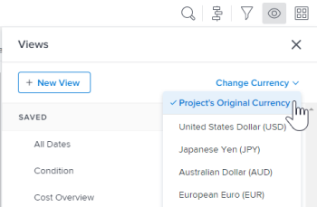

# 报表常见问题解答

<!--

(NOTE: Alina: ***This is the ONE anchor article for all FAQs about Reporting. Add a new FAQ in the TOC at the top first, then add the answer as a section at the bottom.)

-->

以下是有关报表的常见问题解答。

## 访问要求

您必须具有以下访问权限才能执行本文中的步骤：

<table style="table-layout:auto"> 
 <col> 
 </col> 
 <col> 
 </col> 
 <tbody> 
  <tr> 
   <td role="rowheader">Adobe Workfront计划*</td> 
   <td> 
任意
 </td> 
  </tr> 
  <tr> 
   <td role="rowheader">Adobe Workfront许可证*</td> 
   <td> 
计划，工作
 </td> 
  </tr> 
  <tr> 
   <td role="rowheader">访问级别配置*</td> 
   <td> 
编辑对报表、功能板、日历的访问
 
注意：如果您仍然没有访问权限，请咨询Workfront管理员，他们是否在您的访问级别设置了其他限制。 有关Workfront管理员如何修改访问级别的信息，请参阅 <a href="../../../administration-and-setup/add-users/configure-and-grant-access/create-modify-access-levels.md" class="MCXref xref">创建或修改自定义访问级别</a>.
 </td> 
  </tr> 
  <tr> 
   <td role="rowheader">对象权限</td> 
   <td> 
管理报表的权限
 
有关请求其他访问权限的信息，请参阅 <a href="../../../workfront-basics/grant-and-request-access-to-objects/request-access.md" class="MCXref xref">请求对对象的访问 </a>.
 </td> 
  </tr> 
 </tbody> 
</table>

&#42;要了解您拥有的计划、许可证类型或访问权限，请联系您的Workfront管理员。

## 为什么我的小时差自定义计算在列中没有显示正确的结果？

在项目报表中，我的计算是从计划小时数(4)中减去实际小时数(2)。 我得到的结果是120，而它应该是2。\
我的计算是：
<pre>valueexpression=SUB(workRequired，actualWorkRequired)</pre>

### 回答

在Workfront中使用小时的字段以分钟为单位进行存储。 在计算中使用字段时，结果将以分钟为单位。 若要在小时内得到结果，必须将计算结果除以60。

正确的计算是：

<pre>valueexpression=SUB(workRequired，actualWorkRequired)/60</pre>

## 为什么报表中每个图表元素的值没有显示在图表上？

### 回答

如果报表图表中有50个以上的图表元素，则图表中不会显示每个元素的值。

当图表中的元素少于50个时，图表中会显示每个元素的值。 考虑添加过滤器或修改报表中的分组，以限制您在图表每个元素中显示的项目数量。

## 为什么我的报表返回的结果过多，无法显示图表？

当我运行一个包含图表的报表时，我看到错误消息“哇，哇，哇，哇，哇，哇，哇，哇，哇，哇，哇，哇，哇，哇，哇，哇，哇，哇，哇，哇，哇，哇，哇，哇，哇，哇，哇，哇，哇，哇，哇，哇，哇，哇，哇，哇，哇，哇，哇，哇，哇，哇，哇，哇，哇，哇，哇，哇，哇，哇，哇，哇，哇，哇，哇，哇，哇，哇，哇，哇，哇，哇，哇，哇，哇，哇，哇，哇，哇，哇，哇，哇，哇，哇，哇，哇，哇，哇，哇，哇，哇，哇，哇，哇，哇，哇，哇，哇，哇，哇，哇，哇，哇，哇，哇，哇，哇，哇，哇，哇，哇，哇，哇，哇，哇，哇，哇，哇，哇，哇，哇，哇，哇，哇，哇，哇，哇，哇，此报表返回了大量数据，这使图表不可读。 请考虑通过添加过滤器或更改图表中的分组来缩小结果范围。”

### 回答

此错误表示您的图表最多包含618个不同结果 — 例如，条形图中超过618条条。 要解决显示问题，您需要通过修改当前过滤器和分组选择来优化结果。

有关修改过滤器和分组的信息，请参阅文章 [过滤器Adobe Workfront概述](../../../reports-and-dashboards/reports/reporting-elements/filters-overview.md) 和 [Adobe Workfront中的分组概述](../../../reports-and-dashboards/reports/reporting-elements/groupings-overview.md).

## 当我与同事访问同一报表（或日历）时，为什么我会看到任务（或问题），而他们却看到了任务？

### 回答

报表或日历可能具有通配符过滤器变量，该变量指向已登录的用户。 在这种情况下，报表会根据登录用户显示相应信息。 调整过滤器以删除指向已登录用户的通配符。\

有关基于用户的通配符过滤器变量的完整列表，请参阅 [通配符过滤器变量](../../../reports-and-dashboards/reports/reporting-elements/understand-wildcard-filter-variables.md).

## 为什么我的报表中的数据似乎不完整？

### 回答

大多数情况下，如果您具有有限的访问权限，阻止您查看系统中的项目，则可能会发生这种情况。 此外，您要查看的项目不会与您共享。

报表的创建者可以编辑报表，以使用系统管理员或任何有权查看数据的计划用户的访问权限来运行报表。

有关更多信息，请参阅 [运行并提交具有其他用户访问权限的报表](../../../reports-and-dashboards/reports/creating-and-managing-reports/run-deliver-report-access-rights-another-user.md).

## 如何报告分配给我的任务（或问题），无论我是否是任务的所有者？

### 回答

要查看分配给您的所有任务或问题(无论您是否是责任人（或主要受分派人）)，请在任务或问题报表中使用以下过滤器：

1. 访问任务或问题报告。
1. 在 **过滤器** ，单击 **添加过滤器规则**.

1. 在 **开始键入字段名称……** 字段，开始键入 **分配用户名**，然后在列表中显示时将其选中。

   >[!NOTE]
   >
   >请勿使用 **分配给名称** 字段，因为此字段仅过滤您是主要任务负责人或所有者的任务和问题。

1. 选择 **等于** 修饰符。
1. 开始键入 *$USER.ID* ，然后从显示的下拉列表中选择它。\
   这可确保您看到分配给已登录用户的所有任务和问题。 您可以将通配符替换为特定用户名。\
   

1. 单击 **保存并关闭**.

## 为什么在项目的“问题和任务”列表的底部没有显示“添加问题/添加任务”链接？

### 回答

首先，确保您拥有向项目添加问题和任务的正确访问权限和权限。 在这种情况下，您应会看到 **添加问题** 和 **添加任务** 位于 **问题** 和 **任务** 列表。

但是，有一些因素可能会阻止显示这些链接：

* 如果将快速过滤器应用于这些列表，则不会显示这些链接。 删除快速过滤器，此时应会显示链接，以便您能够向项目添加问题和任务。\
   有关快速过滤器的信息，请参阅 [开始使用Adobe Workfront中的列表](../../../workfront-basics/navigate-workfront/use-lists/view-items-in-a-list.md).

* 如果您有 **分组** 应用于这些列表时，不会显示链接。 删除 **分组** 此时应会显示相应的链接，以便向项目添加问题和任务。\
   有关创建分组的信息，请参阅 [Adobe Workfront中的分组概述](../../../reports-and-dashboards/reports/reporting-elements/groupings-overview.md).

* 如果您有 **查看** 如果这些列表选择了项目默认货币以外的货币，则不会显示链接。 更改 **查看** to **项目的原始货币** 此时应会显示相应的链接，以便向项目添加问题和任务。\
   有关在视图中更改货币的详细信息，请参阅 [使用独特的汇率创建财务数据报表](../../../reports-and-dashboards/reports/creating-and-managing-reports/create-financial-data-reports-unique-exchange-rates.md).

## 我的报表或功能板中的信息是否会自动刷新？

### 回答

报表或功能板中的信息不会自动刷新。

可在缓存的报表中手动刷新信息。\
有关刷新缓存报表的更多信息，请参阅 [运行报表](../../../reports-and-dashboards/reports/creating-and-managing-reports/run-report.md).

在缓存的功能板中，可以手动刷新信息。\
有关刷新已缓存功能板的更多信息，请参阅部分 [显示功能板](../../../reports-and-dashboards/dashboards/understanding-dashboards/get-started-dashboards.md#running-dashboards) 在文章中 [功能板入门](../../../reports-and-dashboards/dashboards/understanding-dashboards/get-started-dashboards.md).

## 我可以更改报表的所有者吗？

### 回答

您无法更改报表的所有者。 但是，创建报表的用户可以允许其他用户编辑报表。 允许用户编辑报表的方式取决于您的用户类型。

* 系统管理员可以通过配置“报表”行中的“编辑”选项来允许具有计划许可证的用户编辑报表，以包含创建报表的访问权限。\
   有关更多信息，请参阅 [授予对报表、功能板和日历的访问权限](../../../administration-and-setup/add-users/configure-and-grant-access/grant-access-reports-dashboards-calendars.md).

* 任何有权创建和共享报表的最终用户都可以允许其他人员通过共享单个报表并授予其他用户“管理”权限来编辑这些报表。\
   有关更多信息，请参阅 [在Adobe Workfront中共享报表](../../../reports-and-dashboards/reports/creating-and-managing-reports/share-report.md).

如果您有权查看或管理报表，则还可以制作报表副本，默认情况下，您将是该报表的所有者。 要了解有关复制报表的更多信息，请参阅 [创建报表副本](../../../reports-and-dashboards/reports/creating-and-managing-reports/create-copy-report.md).

## 为什么我无法访问已停用用户拥有的报表？

### 回答

有时，报表的所有者也是 **使用以下访问权限运行此报表：** 字段。 如果 **使用以下访问权限运行此报表：** 用户已停用，则对于与其共享了报表的用户，将不再显示报表。 发生此情况时，您可以将 **运行具有以下访问权限的此报表：** 留空或在字段中输入活动用户。

要进一步了解 **运行具有以下访问权限的此报表：** 字段，请参阅 [运行并提交具有其他用户访问权限的报表](../../../reports-and-dashboards/reports/creating-and-managing-reports/run-deliver-report-access-rights-another-user.md). 有关识别已停用用户拥有的所有报表的信息，请参阅 [创建报告活动报告](../../../reports-and-dashboards/reports/report-usage/create-report-reporting-activities.md).

## 如何访问包含已删除用户拥有的报表的功能板？

### 回答

在删除用户时，您仍然可以访问他们创建的任何报表，但是，包含该报表的所有功能板也会被删除。 这意味着您无法再访问以下内容：

* 包含报表的功能板
* 包含报表功能板的自定义部分

要详细了解删除用户的影响，请参阅 [删除用户](../../../administration-and-setup/add-users/create-and-manage-users/delete-a-user.md).

如果您有权查看报表，则可以执行以下操作：

1. 创建报表副本。\
   要了解如何创建报表副本，请参阅 [创建报表副本](../../../reports-and-dashboards/reports/creating-and-managing-reports/create-copy-report.md).

1. 更新功能板以包含复制的报表。\
   要了解如何编辑功能板，请参阅 [编辑功能板](../../../reports-and-dashboards/dashboards/creating-and-managing-dashboards/edit-dashboard.md).
