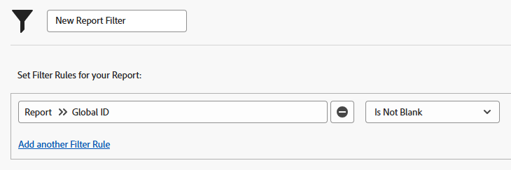

# 使用Adobe Workfront内置报告

<!--Audited: 07/2024-->

Adobe Workfront提供了大量可使用的内置报告。

Workfront管理员可以隐藏内置报告，这样用户就无权访问它们。

有关如何隐藏内置报告的详细信息，请参阅[隐藏内置报告](../../../administration-and-setup/manage-workfront/configure-reports/hide-built-in-reports.md)。

## 访问要求

+++ 展开以查看本文中各项功能的访问要求。

<table style="table-layout:auto"> 
 <col> 
 <col> 
 <tbody> 
  <tr> 
   <td role="rowheader">Adobe Workfront计划</td> 
   <td> 
任何
 </td> 
  </tr> 
  <tr> 
   <td role="rowheader">Adobe Workfront许可证*</td> 
   <td> 
新文档：参与者或更高版本
  
   
当前：请求或更高版本
 </td> 
  </tr> 
  <tr> 
   <td role="rowheader">访问级别配置</td> 
   <td> 
编辑对筛选器、视图、分组的访问权限
 
查看或更高的报告、功能板和日历访问权限
 </td> 
  </tr> 
  <tr> 
   <td role="rowheader">对象权限</td> 
   <td> 
管理报表的权限以在报表中添加或编辑筛选器
 
管理筛选器的权限以在列表中编辑它
 </td> 
  </tr> 
 </tbody> 
</table>

*有关信息，请参阅Workfront文档中的[访问要求](/help/quicksilver/administration-and-setup/add-users/access-levels-and-object-permissions/access-level-requirements-in-documentation.md)。

+++

## 内置报告概述 {#overview-of-built-in-reports}

您可以自定义内置报表并将其另存为新报表。 有关自定义内置报表的详细信息，请参阅[创建自定义报表](../../../reports-and-dashboards/reports/creating-and-managing-reports/create-custom-report.md)。

以下报表随Workfront包提供。 对于在访问级别中至少拥有内置报告查看权限的所有用户，报表均可用。

<table style="table-layout:auto"> 
 <col> 
 <col> 
 <thead> 
  <tr> 
   <th><strong>报表名称</strong> </th> 
   <th><strong>报告说明</strong> </th> 
  </tr> 
 </thead> 
 <tbody> 
  <tr> 
   <td>按照项目群所算得的实际项目组合成本</td> 
   <td>显示项目计划成本和实际成本的项目报告。 报告按项目群名称分组，按Portfolio名提示，并包含一个图表。</td> 
  </tr> 
  <tr> 
   <td>按照项目所算得的实际项目组合成本</td> 
   <td>显示项目计划成本和实际成本的项目报告。 报告按项目名称分组，按Portfolio名称提示，并包括图表。</td> 
  </tr> 
  <tr> 
   <td>按照项目群所算得的实际项目组合收入</td> 
   <td>显示项目计划收入和实际收入的项目报告。 报告按项目群名称分组，按Portfolio名提示，并包含一个图表。</td> 
  </tr> 
  <tr> 
   <td>按照项目所算得的实际项目组合收入</td> 
   <td>显示项目计划收入和实际收入的项目报告。 报告按项目名称分组，按Portfolio名称提示，并包括图表。</td> 
  </tr> 
  <tr> 
   <td>按公司实际收入</td> 
   <td>显示项目实际收入和公司的项目报告。 此报表按公司名称分组，并包含一个图表。</td> 
  </tr> 
  <tr> 
   <td>按组实际收入</td> 
   <td>显示项目实际收入和组的项目报告。 报告按组名分组，并包含一个图表。</td> 
  </tr> 
  <tr> 
   <td>所有未结工时表</td> 
   <td>显示未结时间表的时间表报告。 该报表显示以下字段：日期范围、所有者名称、总小时数、加班时间、审批者名称和工时表的状态。</td> 
  </tr> 
  <tr> 
   <td>批准工时表 (已提示)</td> 
   <td>显示批准者已提交或已拒绝时间表的时间表报告。 该报表显示以下字段：日期范围、所有者、总小时数、加班时间、审批者姓名和时间表状态。 报告提示自：时间表开始日期、时间表结束日期、时间表批准者姓名和用户名。</td> 
  </tr> 
  <tr> 
   <td>存在风险的项目</td> 
   <td>显示有风险或存在问题的当前和计划项目的项目报告。 此报表显示以下字段：项目的说明、计划完成日期、预计完成日期、完成百分比、状态和优先级。 报告按Portfolio名称分组。</td> 
  </tr> 
  <tr> 
   <td>按公司列出帐面收入</td> 
   <td>显示项目公司和记帐收入的项目报告。 此报表按公司名称分组，并包含一个图表。</td> 
  </tr> 
  <tr> 
   <td>按组列出帐面收入</td> 
   <td>显示项目记帐收入和组的项目报告。 报告按组名分组，并包含一个图表。</td> 
  </tr> 
  <tr> 
   <td>按月列出帐面收入</td> 
   <td>显示项目名称、项目开单收入和开单记录开单日期的开单记录报告。 该报告按开票记录的开票日期月份分组，并包括图表。</td> 
  </tr> 
  <tr> 
   <td>按周完成问题</td> 
   <td>显示问题实际完成日期的问题报告。 报告按问题的实际完成日期所在的周分组，并包括图表。</td> 
  </tr> 
  <tr> 
   <td>按周按用户完成问题</td> 
   <td>显示问题实际完成日期和分配的问题报告。 该报表按主要被分配人和问题实际完成日期所在的周分组，并包括图表。</td> 
  </tr> 
  <tr> 
   <td>当前项目</td> 
   <td>显示所有当前项目的项目报告。 此报表显示以下字段：项目的说明、计划完成日期、预计完成日期、完成百分比、状态和优先级。</td> 
  </tr> 
  <tr> 
   <td>按月和用户列出的小时成本</td> 
   <td>显示记录的小时数及其实际成本的矩阵小时报告。 报告按所有者名称和小时数输入日期的月份分组。</td> 
  </tr> 
  <tr> 
   <td>按用户时数</td> 
   <td>显示记录的小时数的小时报告。 报告按所有者名称分组并包括图表。</td> 
  </tr> 
  <tr> 
   <td>按星期和用户列出的小时</td> 
   <td>显示过去四周记录的小时数和小时数输入日期的矩阵小时报告。 该报告由小时数的输入日期提示，并按所有者名称和小时数输入日期的月份分组。</td> 
  </tr> 
  <tr> 
   <td>按状态问题</td> 
   <td>显示问题状态的问题报告。 报告按问题状态分组，并包含一个图表。</td> 
  </tr> 
  <tr> 
   <td>由状态和项目发出</td> 
   <td>显示当前项目中问题状态和项目名称的矩阵问题报告。 报告按项目名称和问题状态分组。</td> 
  </tr> 
  <tr> 
   <td>劳力与按投资组合列出的费用成本</td> 
   <td>显示项目计划劳力成本、实际劳力成本、计划费用成本和实际费用成本的项目报告。 报告按Portfolio名称分组，并包含一个图表。</td> 
  </tr> 
  <tr> 
   <td>劳力与按程序列出的费用成本</td> 
   <td>显示项目计划劳力成本、实际劳力成本、计划费用成本和实际费用成本的项目报告。 该报告按Portfolio名称和项目群名称分组，并包含一个图表。</td> 
  </tr> 
  <tr> 
   <td>按项目每月项目组合计划成本与实际成本</td> 
   <td>显示项目分配日期、计划成本总计、实际成本总计和成本差异总计的矩阵项目（财务数据）报告。 此报表按项目名称、分配日期的季度和月份分组。</td> 
  </tr> 
  <tr> 
   <td>按项目每月项目组合计划收入与实际收入</td> 
   <td>显示项目分配日期、计划收入总计、实际收入总计和收入差异总计的矩阵项目（财务数据）报告。 此报表按项目名称、分配日期的季度和月份分组。</td> 
  </tr> 
  <tr> 
   <td>每月项目计划成本与实际成本</td> 
   <td>显示项目分配日期、计划成本总计、实际成本总计和成本差异总计的矩阵项目（财务数据）报告。 此报表按项目名称、分配日期的季度和月份分组，并按项目名称提示。</td> 
  </tr> 
  <tr> 
   <td>每月项目计划收入与实际收入</td> 
   <td>显示项目分配日期、计划收入总计、实际收入总计和收入差异总计的矩阵项目（财务数据）报告。 此报表按项目名称、分配日期的季度和月份分组，并按项目名称提示。</td> 
  </tr> 
  <tr> 
   <td>我的文档</td> 
   <td>显示由登录用户上传的文档的文档报告。 此报表显示以下字段：“Owner Name（所有者名称）”、“Modified Date（修改日期）”、“Size（大小）”、“Version Count（版本计数）”、“Source”和“Type of the documents（文档类型）”。</td> 
  </tr> 
  <tr> 
   <td>我的收藏夹</td> 
   <td>显示由登录用户标记为收藏夹的对象列表的收藏夹报告。 报告显示以下字段：“对象类型”和“收藏夹名称”。</td> 
  </tr> 
  <tr> 
   <td>我的问题</td> 
   <td>显示分配给登录用户的未完成问题的问题报告。 此报表显示以下字段：“Source名称”、“问题类型”、“主要受分配人”、“输入日期”、“状态”和“问题优先级”。</td> 
  </tr> 
  <tr> 
   <td>我的项目组合</td> 
   <td>显示登录用户是Portfolio管理员的活动Portfolio的Portfolio报告。</td> 
  </tr> 
  <tr> 
   <td>我的项目群</td> 
   <td>显示登录用户为项目群经理的项目群及其说明的项目群报告。</td> 
  </tr> 
  <tr> 
   <td>我的项目中未结问题</td> 
   <td>显示项目团队包含登录用户的项目中未完成问题的问题报告。 此报表显示以下字段：“Source名称”、“问题类型”、“主要受分配人”、“输入日期”、“状态”和“问题优先级”。</td> 
  </tr> 
  <tr> 
   <td>我的项目</td> 
   <td>显示其项目团队包含登录用户的当前项目的项目报告。 此报表显示以下字段：项目的说明、计划完成日期、预计完成日期、完成百分比、状态和优先级。</td> 
  </tr> 
  <tr> 
   <td>我提交的问题</td> 
   <td>显示由登录用户提交的、在过去三个月已关闭或当前开放的问题的问题报告。 此报表显示以下字段：Source名称、问题类型、输入日期、状态和问题优先级。</td> 
  </tr> 
  <tr> 
   <td>我的任务</td> 
   <td>显示当前项目中分配给登录用户的未完成任务的任务报告。 此报表显示以下字段：任务的计划持续时间、项目名称、主要任务接受者、计划开始、计划完成、完成百分比和优先级。</td> 
  </tr> 
  <tr> 
   <td>我的工时表</td> 
   <td>显示登录用户所有时间表的时间表报告。 该报表显示以下字段：日期范围、所有者名称、总小时数、加班时间、审批者名称和工时表的状态。</td> 
  </tr> 
  <tr> 
   <td>我的未分派问题</td> 
   <td>显示分配给或未分配给登录用户的任意工作角色的未完成问题的问题报告。 此报表显示以下字段：Source名称、问题类型、输入日期、状态和问题优先级。</td> 
  </tr> 
  <tr> 
   <td>我的未分配任务</td> 
   <td>显示分配给或未分配给登录用户的任意工作角色的未完成任务的任务报告。 此报表显示以下字段：任务的计划持续时间、项目名称、主要被分配人、计划开始日期、计划完成日期、完成百分比和优先级。</td> 
  </tr> 
  <tr> 
   <td>我的近期任务</td> 
   <td>显示应在接下来的两周内开始、在当前项目中且被分配到登录用户的未完成任务的任务报告。 此报表显示以下字段：项目名称、计划完成日期、预计完成日期、完成百分比和任务状态。</td> 
  </tr> 
  <tr> 
   <td>未结工时表 (已提示)</td> 
   <td>显示未结时间表的时间表报告。 该报表显示以下字段：日期范围、所有者、总小时数、加班时间、审批者姓名、时间表状态。 报告提示自：时间表开始日期、时间表结束日期、时间表批准者姓名和用户名。</td> 
  </tr> 
  <tr> 
   <td>按照项目组合所算得的超出预算项目</td> 
   <td>显示项目计划成本和实际成本的项目报告。 报告按Portfolio名称分组。</td> 
  </tr> 
  <tr> 
   <td>按照项目群所算得的计划项目组合成本</td> 
   <td>显示项目计划成本和实际成本的项目报告。 该报告按Portfolio名称（按项目群名称分组）提示，并包含一个图表。</td> 
  </tr> 
  <tr> 
   <td>按照项目所算得的计划项目组合成本</td> 
   <td>显示项目计划成本和实际成本的项目报告。 报告按Portfolio名称提示，按项目名称分组，并包含一个图表。</td> 
  </tr> 
  <tr> 
   <td>按照项目群所算得的计划项目组合收入</td> 
   <td>显示项目计划收入和实际收入的项目报告。 该报告按Portfolio名称（按项目群名称分组）提示，并包含一个图表。</td> 
  </tr> 
  <tr> 
   <td>按照项目所算得的计划项目组合收入</td> 
   <td>显示项目计划收入和实际收入的项目报告。 报告按Portfolio名称提示，按项目名称分组，并包含一个图表。</td> 
  </tr> 
  <tr> 
   <td>计划项与按投资组合列出的实际成本</td> 
   <td>按Portfolio显示项目计划成本和实际成本的项目报告。 报告按Portfolio名称分组，并包含一个图表。</td> 
  </tr> 
  <tr> 
   <td>计划项与按计划列出的实际成本</td> 
   <td>按项目群显示项目计划成本和实际成本的项目报告。 报告按Portfolio名称分组，并包含一个图表。</td> 
  </tr> 
  <tr> 
   <td>计划项与按投资组合列出的实际收入</td> 
   <td>显示项目计划收入和实际收入的项目报告。 报告按Portfolio名称分组，并包含一个图表。</td> 
  </tr> 
  <tr> 
   <td>计划项与按计划列出的实际收入</td> 
   <td>显示项目计划收入和实际收入的项目报告。 报告按项目群名称分组，并包含一个图表。</td> 
  </tr> 
  <tr> 
   <td>按月和程序分组的组合成本</td> 
   <td>显示项目计划成本、预算成本和实际成本的矩阵项目报告。 报告按Portfolio名称、项目群名称和项目计划开始日期的月份分组。</td> 
  </tr> 
  <tr> 
   <td>按照项目群所分组按照状态所分类的项目组合</td> 
   <td>显示项目状态的项目报告。 该报告按项目群名称和项目状态分组，并包含一个图表。</td> 
  </tr> 
  <tr> 
   <td>按状态和组合分组的组合项目</td> 
   <td>显示项目Portfolio名称和状态的项目报告。 报告按Portfolio名称和项目状态分组，并包含一个图表。</td> 
  </tr> 
  <tr> 
   <td>按照项目群所算得的项目组合收入</td> 
   <td>显示项目Portfolio名称、项目群名称、计划收入和实际收入的项目报告。 报告按Portfolio名称和项目群名称分组，并包含一个图表。</td> 
  </tr> 
  <tr> 
   <td>按月和程序分组的组合收入</td> 
   <td>显示计划收入、实际收入、Portfolio名称和项目群名称的矩阵项目报告。 报告按Portfolio名称、项目群名称和项目计划开始日期的月份分组。</td> 
  </tr> 
  <tr> 
   <td>按任务状态列出的项目成本和收入</td> 
   <td>显示任务计划成本、实际成本、计划收入、实际收入和项目名称的矩阵任务报告。 报告按项目名称和任务状态分组。</td> 
  </tr> 
  <tr> 
   <td>项目成本与 按投资组合列出的收入</td> 
   <td>显示项目Portfolio名称、实际成本和实际收入的项目报告。 报告按Portfolio名称分组，并包含一个图表。</td> 
  </tr> 
  <tr> 
   <td>按季度和月列出的项目支出</td> 
   <td>显示输入日期、计划金额、实际金额和费用项目的矩阵费用报告。 此报表按项目名称、支出的输入日期的季度和月份分组。</td> 
  </tr> 
  <tr> 
   <td>按月和小时类型列出的项目小时成本</td> 
   <td>显示以下字段的矩阵小时报告：小时、输入日期、项目的实际成本、小时类型、项目名称。 报告按项目名称、小时输入日期的月份和小时类型分组。</td> 
  </tr> 
  <tr> 
   <td>按季度和月列出的项目人工和支出成本</td> 
   <td>显示项目的计划劳力成本、实际劳力成本、计划费用成本和实际费用成本的矩阵项目报告。 报告按项目名称以及项目实际开始日期的季度和月份分组。</td> 
  </tr> 
  <tr> 
   <td>项目绩效</td> 
   <td>显示当前项目的到期日期、CPI、SPI、CSI、计划成本、预算、EAC和费用等字段的项目报告。</td> 
  </tr> 
  <tr> 
   <td>项目请求</td> 
   <td>显示已请求项目的项目报告。 此报表显示以下字段：项目的说明、计划完成日期、预计完成日期、完成百分比、状态和优先级。</td> 
  </tr> 
  <tr> 
   <td>按完成情况项目</td> 
   <td>显示项目条件的项目报告。 报告按条件分组，并包含一个图表。</td> 
  </tr> 
  <tr> 
   <td>按完成情况按组项目</td> 
   <td>显示项目进度状态和组的项目报告。 报告按组名和进度状态分组，并包含一个图表。</td> 
  </tr> 
  <tr> 
   <td>按优先级项目</td> 
   <td>显示项目优先级的项目报告。 该报告按“优先级”分组，并包含一个图表。</td> 
  </tr> 
  <tr> 
   <td>按进度状态项目</td> 
   <td>显示项目进度状态的项目报告。 报告按进度状态分组，并包含一个图表。</td> 
  </tr> 
  <tr> 
   <td>按进度状态任务</td> 
   <td>显示当前项目中所有任务的进度状态的任务报告。 报告按进度状态分组，并包含一个图表。</td> 
  </tr> 
  <tr> 
   <td>按状态任务</td> 
   <td>显示所有任务状态的任务报告。 报告按状态分组，并包含一个图表。</td> 
  </tr> 
  <tr> 
   <td>待复查工时表</td> 
   <td>显示批准者是登录用户的已提交和已拒绝时间表的时间表报告。 该报表显示以下字段：日期范围、所有者、总小时数、加班时间、审批者姓名和时间表状态。</td> 
  </tr> 
  <tr> 
   <td>问题任务</td> 
   <td>显示有滞后状态、移交日期早于明日、登录用户是任务所在项目项目团队一部分的未完成任务的任务报告。 此报表显示以下字段：任务的计划持续时间、项目名称、主要任务接受者、计划开始时间、计划完成百分比、完成百分比和优先级。</td> 
  </tr> 
  <tr> 
   <td>用户登录</td> 
   <td>显示以下字段的用户报告：唯一ID、登录计数(自使用Workfront开始以来用户登录的次数)、用户上次登录日期。 报告按用户的访问级别分组。</td> 
  </tr> 
 </tbody> 
 
 
 
</table>

## 访问内置报告

<!--

(NOTE: Section directly linked to "Getting Started with Workfront Reporting." Do not change/ rename.) 

-->

{{step1-click-main-menu}}

1. 单击&#x200B;**报告**。
1. 单击&#x200B;**所有报表**。
1. 展开&#x200B;**筛选器**&#x200B;下拉菜单，然后选择&#x200B;**新建筛选器**。

1. 单击&#x200B;**添加筛选器规则**。
1. 在&#x200B;**开始键入字段名称**&#x200B;字段中，开始键入&#x200B;**全局ID**。

1. 在&#x200B;**报表**&#x200B;对象下，选择&#x200B;**全局ID**。

1. 在筛选器修饰符下拉菜单中，选择&#x200B;**Is Not Blank**。\
   

1. 单击&#x200B;**保存筛选器**。\
   报告列表仅显示内置报告。\
   有关哪些内置报告可用的详细信息，请参阅本文中的[内置报告概述](#overview-of-built-in-reports)部分。
