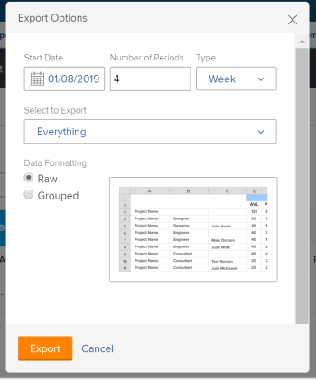

# 从资源计划员导出信息

您可以将资源规划器的任何视图的信息导出到保存在计算机上的Excel(.xlsx)文件。

>[!IMPORTANT]
>
>显示哪些信息以及可以从资源计划器导出哪些信息存在限制。 有关这些限制的信息，请参阅 [资源计划员显示限制](../../resource-mgmt/resource-planning/resource-planner-display-limitations.md)

## 访问要求

您必须具备以下条件：

<table style="table-layout:auto"> 
 <col> 
 <col> 
 <tbody> 
  <tr> 
   <td role="rowheader">Adobe Workfront计划*</td> 
   <td> 
专业及更高级别
 </td> 
  </tr> 
  <tr> 
   <td role="rowheader">Adobe Workfront许可证*</td> 
   <td> 
审阅或更高版本 <!--
      <MadCap:conditionalText data-mc-conditions="QuicksilverOrClassic.Draft mode">
       (this seems to be the case in NWE only, not classic. Waiting on Vazgen's response for this)
      </MadCap:conditionalText>
     -->
 </td> 
  </tr> 
  <tr> 
   <td role="rowheader">访问级别配置*</td> 
   <td> 
查看或更高程度地访问项目、用户和资源管理
 
<b>注释</b>

如果您仍然没有访问权限，请咨询Workfront管理员，他们是否在您的访问级别设置了其他限制。 有关Workfront管理员如何更改访问级别的信息，请参阅 <a href="../../administration-and-setup/add-users/configure-and-grant-access/create-modify-access-levels.md" class="MCXref xref">创建或修改自定义访问级别</a>.
 </td>
</tr> 
  <tr> 
   <td role="rowheader">对象权限</td> 
   <td> 
查看项目的权限或更高权限
 
有关请求其他访问权限的信息，请参阅 <a href="../../workfront-basics/grant-and-request-access-to-objects/request-access.md" class="MCXref xref">请求对对象的访问 </a>.
 </td> 
  </tr> 
 </tbody> 
</table>

&#42;要了解您拥有的计划、许可证类型或访问权限，请联系您的Workfront管理员。

## 从资源计划员导出信息

1. 单击 **主菜单** 图标  在Adobe Workfront的右上角。

1. 单击 **资源化**. 的 **计划员** 默认显示。

1. 选择计划员的视图。 您可以选择以下选项之一：

   * 按用户查看
   * 按项目查看
   * 按角色查看

1. 单击 **导出**.

   此时将显示“导出选项”对话框。

   

1. 指定以下信息：\
   **开始日期**:导出的开始日期。 导出的文件包含从一周的第一天开始的分配和可用性信息，其中包含您在此处指定的日期。\
   **期间数**:要包含在文件中的时间段数。 默认为4个句点。\
   **类型**:要在导出文件（周、月或季度）中显示信息的时间段类型。\
   以下是可导出的最长时间段：

   * 52 周
   * 36 个月
   * 12个季度

   **选择以导出**:根据您选择的视图，您可以选择导出屏幕上列出的所有对象或特定对象的可用性和预算信息。
您可以选择导出以下信息：

   * 在项目视图中，选择以导出：

      * 项目
      * 项目和角色
      * 所有内容（这是默认选项）
   * 在“用户视图”中，选择要导出的内容：

      * 用户
      * 用户和项目
      * 所有内容（这是默认选项）
   * 在角色视图中，选择以导出：

      * 角色
      * 角色和项目
      * 所有内容（这是默认选项）

   **数据格式**:根据您希望显示Excel文件的方式，选择以下选项：

   * **原始**:选择以显示可用性和分配信息，这些信息按Excel文件中它所属的对象取消分组。 （这是默认选项）
   * **分组**:选择以显示按其所属对象分组的可用性和分配信息。 这会显示导出的信息，如同它显示在屏幕上一样。

   “导出选项”(Export Options)对话框中显示了导出文件中信息外观的示例。

1. 单击 **导出** 从资源计划器导出信息。\
   仅导出您保存的信息。

1. （视情况而定）如果您在“角色”或“项目”视图中具有未保存的预算小时数，请单击 **保存并继续。**
Excel(.xlsx)文件将下载到您的计算机。
\
   准备下载文件时，无法从资源计划器导出。\
   （视情况而定）如果导出大量数据，您会收到一封电子邮件，其中包含可下载文件的链接。\
   

1. （视情况而定）当您收到包含导出文件的电子邮件时，单击 **下载** 下载文件。\
   这会将您带回Workfront，以便下载文件。\
   您必须登录Workfront才能完成下载。\
   如果在提交文件时未下载文件，则启动导出后，“下载”链接会在7天内保持活动状态。
