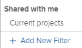

# 在资源计划器中筛选信息

<!--

(AL:*Iterate on this article: filtering by custom data. Other enhancements? Special characters caveat might change - follow the story to know when. It originally came in Beta 3 17.3.)

-->

使用过滤器，您可以根据系统中存储的所有信息修改资源计划器中显示的信息。

## 访问要求

您必须具备以下条件：

<table style="table-layout:auto"> 
 <col> 
 <col> 
 <tbody> 
  <tr> 
   <td role="rowheader">Adobe Workfront计划*</td> 
   <td> 
专业及更高级别
 </td> 
  </tr> 
  <tr> 
   <td role="rowheader">Adobe Workfront许可证*</td> 
   <td> 
审阅或更高版本<!--
      <MadCap:conditionalText data-mc-conditions="QuicksilverOrClassic.Draft mode">
        (this seems to be the case in NWE only, not classic. Waiting on Vazgen's response for this)
      </MadCap:conditionalText>
     -->
 </td> 
  </tr> 
  <tr> 
   <td role="rowheader">访问级别配置*</td> 
   <td> 
查看或更高程度地访问项目、用户和资源管理 
 
<b>注释</b>

如果您仍然没有访问权限，请咨询Workfront管理员，他们是否在您的访问级别设置了其他限制。 有关Workfront管理员如何更改访问级别的信息，请参阅 <a href="../../administration-and-setup/add-users/configure-and-grant-access/create-modify-access-levels.md" class="MCXref xref">创建或修改自定义访问级别</a>.
 </td>
</tr> 
  <tr> 
   <td role="rowheader">对象权限</td> 
   <td> 
查看项目的权限或更高权限
 
有关请求其他访问权限的信息，请参阅 <a href="../../workfront-basics/grant-and-request-access-to-objects/request-access.md" class="MCXref xref">请求对对象的访问 </a>.
 </td> 
  </tr> 
 </tbody> 
</table>

*要了解您拥有的计划、许可证类型或访问权限，请联系您的Workfront管理员。

## 资源计划器过滤器概述

为了最大限度地减少资源计划器中显示的信息量，Adobe Workfront提供了具有预配置标准的默认过滤器。 有关默认过滤器的信息，请参阅部分 [资源计划器中的默认过滤器概览](#overview-of-the-default-filter-in-the-resource-planner) 在本文中。

您还可以构建自定义过滤器。 有关在资源计划器中自定义过滤器的信息，请参阅部分 [创建资源计划器过滤器](#create-resource-planner-filters) 在本文中。

在资源计划器中使用过滤器时，请考虑以下事项：

* 您创建的过滤器仅对您可见。 您可以共享过滤器，以使其可供其他用户使用。
* 作为Workfront管理员，您只能查看您创建的或与您共享的过滤器。
* 当您为资源计划员选择其他视图时，筛选的结果不会更改。\
   有关在资源计划器中更改视图的详细信息，请参阅 [资源计划员导航概述](../../resource-mgmt/resource-planning/resource-planner-navigation.md).

* 应用过滤器不会更改项目、角色或用户的资源计划器中的分配和可用性数据。 筛选器仅更改您在资源计划器中看到的对象数。
* 筛选适用于同时显示在资源计划器中的所有对象。 例如，如果您过滤特定用户，则资源计划员仅显示以下结果：

   * 用户是资源池的一部分（用于“项目”和“角色”视图）或在项目上具有分配（用于“用户”视图）的项目
   * 与用户在这些项目中关联的角色\
      与用户关联的项目中的其他角色或用户不会显示。

## 资源计划器中的默认过滤器概览 {#overview-of-the-default-filter-in-the-resource-planner}

首次打开资源计划器时，Workfront会应用默认筛选器。 您可以编辑默认过滤器，以便仅过滤您希望显示的项目。 有关修改过滤器的信息，请参阅 [在资源计划器中编辑过滤器](#edit-a-filter-in-the-resource-planner) 在本文中。

使用默认过滤器时，请考虑以下事项：

* 默认过滤器仅从具有以下功能的项目中检索信息：

   * 在当月的第一个日期之后发生的计划完成日期
   * 在从当前日期开始的第4个月的最后一天之前发生的计划开始日期
   * 当前或计划的状态

   >[!IMPORTANT]
   >
   >“默认”筛选器从始终自当月第一天开始的四个月内发生的项目中检索信息，而不考虑您选择在资源计划器中显示的时间范围。

* 在“用户视图”中，系统中的所有用户都将显示，但只有与过滤项目关联的用户才会显示小时信息。
* 您可以在默认过滤器中编辑信息，而无需保存该过滤器。
* 您可以复制和编辑默认过滤器的副本，在其中更改所需的标准，然后将其另存为新过滤器。
* 您无法删除或共享默认过滤器。

   

## 创建资源计划器过滤器 {#create-resource-planner-filters}

<!--

(Alina: **^ This section is somewhat duplicated (format more than content) from the "Filtering Utilization Information" section in "Viewing Utilization Information for Projects, Programs, and Portfolios.")

-->

在“资源计划器”中创建过滤器对于所有视图都是相同的。

在创建过滤器之前，请确保在资源计划器中查看正确信息的先决条件已到位。\
有关满足使用资源计划员的必要先决条件的信息，请参阅 [资源计划员概述](../../resource-mgmt/resource-planning/get-started-resource-planner.md) 文章。

在创建过滤器时，请考虑以下事项：

* 一次可筛选的对象数量没有限制。
* 您可以根据应用到资源计划员的视图对象，将可用字段添加到过滤器更改中。 例如，您只能在“用户视图”中过滤“问题”或“任务”字段，因为这些对象仅在“用户视图”中显示。 如果在“用户”视图中为“问题”或“任务”构建过滤器，然后将其应用到“项目”或“角色”视图，则会忽略该过滤器，因为“项目”或“角色”视图中不存在这些字段。 在这种情况下，过滤器将不可用。

要在资源计划器中创建过滤器，请执行以下操作：

1. 单击 **主菜单** 图标  在Adobe Workfront的右上角。

1. 单击 **资源化**.

   的 **计划员** 默认显示。

   默认情况下，首次访问资源计划员时， <strong>默认过滤器</strong> 的次数。 有关默认过滤器的更多信息，请参阅 <a href="#overview-of-the-default-filter-in-the-resource-planner" class="MCXref xref">资源计划器中的默认过滤器概览</a> 章节。

1. 在的左上角，单击 **过滤器** 图标。\
   \
   或\
   展开 **过滤器** 下拉菜单，然后单击 **添加新过滤器**.\
   

1. 要使用内置条件构建过滤器，请指定以下任意字段：

   * **Portfolio**:开始键入包含要包含在资源计划器中的信息的组合名称，然后在列表中显示该名称时单击该名称。\
      重复此过程以包含来自多个项目组合的信息。

   * **项目状态**:展开项目状态下拉菜单，然后从列表中选择一个或多个可用的项目状态。
   * **团队**:开始键入一个或多个与要查看的项目中分配给任务的用户关联的团队的名称。
   * **作业角色**:开始键入一个或多个与要查看的项目中分配给任务的用户关联的作业角色的名称。
   * **池**:开始键入一个或多个与项目（用于项目视图）、用户（用于用户视图）关联或与要查看的项目和用户（用于角色视图）关联的资源池的名称。
   * **组**:开始键入一个或多个与要查看的用户（在“用户”视图中）或项目（在“项目”和“角色”视图中）关联的组的名称。

1. 单击 **添加过滤器规则**，然后开始在 **要筛选项目的类型** 框中。 如果字段可用，则会为每个可关联的对象填充该字段。

   >[!IMPORTANT]
   >
   >引用自定义字段时，必须键入字段名称，而不是字段标签。 字段标签显示在附加到对象的自定义表单上。 有关标签和自定义字段名称之间差异的信息，请参阅  [创建或编辑自定义表单](../../administration-and-setup/customize-workfront/create-manage-custom-forms/create-or-edit-a-custom-form.md) .

1. 单击字段的名称，以在过滤器出现在列表中时将其添加到过滤器。\
   有关您在列表中看到的字段的详细信息，请参阅 [Adobe Workfront术语表](../../workfront-basics/navigate-workfront/workfront-navigation/workfront-terminology-glossary.md).

1. （可选）为过滤器选择过滤器和条件修饰符。 可用的修饰符在 [过滤器和条件修饰符](../../reports-and-dashboards/reports/reporting-elements/filter-condition-modifiers.md).

   您可以使用基于用户或基于日期的通配符来筛选与已登录用户关联的信息。\
   有关过滤器中支持的通配符的信息，请参阅 [通配符过滤器变量](../../reports-and-dashboards/reports/reporting-elements/understand-wildcard-filter-variables.md).

1. 单击 **保存**&#x200B;以保存过滤器规则。
1. （可选）单击 **添加过滤器规则** 为其他对象或字段添加新规则。
1. 单击 **应用** 来应用过滤器，而不保存它。

   或

   单击 **保存过滤器** 来保存过滤器。\
   

1. （视情况而定）在您单击 **保存**，在 **过滤器名称** 框 **保存过滤器** 对话框。 这是必填字段。\
   

   >[!NOTE]
   >
   >如果您的过滤器名称包含特殊字符，则只能使用以下字符：
   >
   >* 逗号
   >* 斜线
   >* 连字符
   >* 下划线

1. 单击&#x200B;**保存**。

   现在，资源计划器中的结果将按照过滤器规则中包含的信息进行过滤。

## 应用现有过滤器

当您或有权访问资源计划员的人员保存过滤器时，该过滤器将可供使用资源计划员的每个人使用。

要应用现有过滤器，请执行以下操作：

1. 转至资源计划员。
1. 在左上角，展开 **过滤器** 下拉菜单。

   在此菜单中，您可以看到您创建的过滤器或与您创建和共享的其他过滤器。\
   

1. 在下拉菜单中选择一个过滤器。 您可以看到您或其他用户在此菜单中创建的过滤器。\
   选择过滤器时，它会自动减少在资源计划器中显示的信息量。

## 在资源计划器中编辑过滤器 {#edit-a-filter-in-the-resource-planner}

您可以通过执行以下操作之一，在资源计划器中编辑过滤器：

* [重命名过滤器](#rename-a-filter)
* [编辑过滤器中的信息](#edit-the-information-in-a-filter)
* [复制过滤器](#duplicate-a-filter)

编辑过滤器时，系统中对资源计划员具有访问权限的所有用户都会更新过滤器。

### 重命名过滤器 {#rename-a-filter}

您可以更改过滤器的名称，而不更改其条件。 我们建议让系统中的其他用户了解此更改，因为其他用户可以看到过滤器。 此更改会影响每个可以查看资源计划员的过滤器列表。

1. 转到资源计划器并展开 **过滤器** 下拉菜单，以选择保存的过滤器。
1. 展开 **过滤器** 下拉菜单。 找到要重命名的过滤器，并将鼠标悬停在其名称上。
1. 选择 **重命名过滤器** 图标。

   

1. 在 **过滤器名称** 框中。
1. 单击&#x200B;**保存**。\
   过滤器中包含的信息是相同的，并且名称会更新。

### 编辑过滤器中的信息 {#edit-the-information-in-a-filter}

您可以更改过滤器中包含的信息，而不更改其名称。 我们建议让系统中的其他用户了解此更改，因为他们可以看到过滤器。 此更改会影响每个可以查看资源计划员的过滤器列表。

1. 转到资源计划器并展开 **过滤器** 下拉菜单访问Advertising Cloud帮助。
1. 选择要编辑的现有过滤器。
1. 单击 **过滤器** 图标。\
   

1. 向过滤器中添加新字段。\
   有关构建过滤器的信息，请参阅 [创建资源计划器过滤器](#create-resource-planner-filters).

1. 将鼠标悬停在为过滤器选择的现有字段上，然后单击 **编辑** 图标以选择其他字段，或 **删除** 图标以删除字段。\
   

1. （可选）单击 **添加过滤器规则** 向过滤器中添加新字段。\
   有关定义筛选条件的更多信息，请参阅 [创建资源计划器过滤器](#create-resource-planner-filters).

1. 单击 **应用** 来应用过滤器，而不保存它。

   或

   单击 **保存** 来保存过滤器。\
   过滤器会使用相同的名称保存，但会使用新的过滤条件。

### 复制过滤器 {#duplicate-a-filter}

您可以复制现有过滤器。 原始筛选条件在复制的筛选器中保持不变，您可以按新名称保存新筛选器。

1. 转到资源计划器并展开 **过滤器** 下拉菜单访问Advertising Cloud帮助。
1. 将鼠标悬停在要复制的已保存过滤器的名称上。
1. 单击 **复制** 图标。

   \
   此时会显示“复制过滤器”框。

1. 在 **过滤器名称** 字段，为复制的过滤器指定新名称。\
   新过滤器的默认名称为 *`<Original Filter Name>`（副本）*.

1. 单击&#x200B;**保存**。将使用与原始过滤器相同的条件创建新过滤器，并且该过滤器具有新名称。

   >[!NOTE]
   >
   >尽管您可以有2个具有相同名称和相同标准的过滤器，但我们建议您在资源规划器中保存具有唯一过滤标准和名称的过滤器，以避免混淆。

## 删除过滤器

您可以删除不再需要的过滤器。 无法删除默认过滤器。

有关默认过滤器的信息，请参阅 [资源计划器中的默认过滤器概览](#overview-of-the-default-filter-in-the-resource-planner) 章节。

在删除过滤器时，该过滤器将被删除，以供所有有权访问“资源规划器”的Workfront用户使用。 在删除之前，请确保要删除的过滤器不再由在资源计划器中工作的其他人使用。 无法恢复已删除的过滤器。

要删除过滤器，请执行以下操作：

1. 转至资源计划员。
1. 展开 **过滤器** 下拉菜单。
1. 找到要删除的过滤器，并将鼠标悬停在其名称上。
1. 选择 **删除过滤器** 图标。

   

1. 单击 **删除** 在 **删除过滤器** 对话框。

1. 筛选器将从资源计划器中删除。

## 共享过滤器

您可以共享您构建的过滤器，或者您有权与其他用户共享的过滤器。 您无法共享默认过滤器，但可以复制默认过滤器并共享该副本。

>[!NOTE]
>
>所有用户(包括Workfront管理员)都只能访问已构建或已与他们共享的过滤器。 您可以与特定用户共享过滤器，以使过滤器可供所有资源计划员用户使用。

有关默认过滤器的信息，请参阅 [资源计划器中的默认过滤器概览](#overview-of-the-default-filter-in-the-resource-planner) 章节。

有关复制过滤器的信息，请参阅 [复制过滤器](#duplicate-a-filter) 章节。

1. 转至资源计划员。
1. 展开 **过滤器** 下拉菜单。
1. 找到要共享的过滤器，并将鼠标悬停在其名称上。
1. 选择 **共享过滤器** 图标。

   

   此时将显示过滤器访问对话框。

1. （可选）要使过滤器对所有资源计划员用户可用，请单击 **设置** 图标，然后选择 **在系统范围内使此可见**.

   

1. 在 **为资源计划器筛选器授予以下访问权限：** 框中，开始键入要与其共享过滤器的用户、团队、角色、组或公司的名称。
1. 从以下权限级别中进行选择：

   * 查看
   * 管理

      有关Workfront中权限的信息，请参阅 [对象共享权限概述](../../workfront-basics/grant-and-request-access-to-objects/sharing-permissions-on-objects-overview.md)

1. （可选）单击 **高级设置**&#x200B;用于通过选择每个级别的权限来添加每个级别的权限，或通过取消选中每个级别的权限来删除每个级别的权限。

   

1. 单击&#x200B;**保存**。

   该过滤器将与您选择的实体共享，并显示在 **与我共享** 的上界。

   
