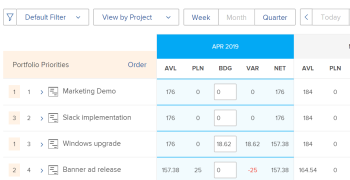

# 在资源规划者中排定项目的优先级

项目按优先级在资源规划程序中列出，最重要的项目在顶部。

## 访问要求

+++ 展开以查看本文中各项功能的访问要求。

<table style="table-layout:auto"> 
 <col> 
 <col> 
 <tbody> 
  <tr> 
   <td>Adobe Workfront包</td> 
   <td>
任何
</td>
  </tr> 
  <tr> 
   <td>Adobe Workfront许可证</td> 
   <td>
标准

       
规划
</td> 
  </tr> 
  <tr> 
   <td>访问级别配置</td> 
   <td> 
编辑对资源管理的访问权限，包括访问资源规划者中的编辑优先级和预算小时数
 
编辑对财务数据、项目和用户的访问权限
</td> 
  </tr> 
  <tr> 
   <td>对象权限</td> 
   <td> 
管理要为其预算信息的项目的权限，并具有管理财务的能力
</td>
  </tr> 
 </tbody> 
</table>

有关信息，请参阅Workfront文档中的[访问要求](/help/quicksilver/administration-and-setup/add-users/access-levels-and-object-permissions/access-level-requirements-in-documentation.md)。

+++

## 项目在资源规划者中的默认顺序

默认情况下，在考虑以下条件时，项目会列在资源规划者的项目视图中。

>[!IMPORTANT]
>
>仅当您第一次打开资源规划者时，才会根据下面的三个条件列出项目。 但是，此默认优先级会自动成为自定义优先级，并且在您执行以下操作之一时无法恢复为原始优先级：
>
>* 任何时候单击“保存”时。
>* 当您手动更改项目计划优先级时。 有关手动更改项目计划优先级的信息，请参阅本文中的[手动更改项目计划优先级](#manually-change-the-project-planning-priority)部分。
>
>项目优先级成为自定义优先级后，项目信息中的任何更改将不再影响使用这些标准的项目排序。 之后，您只能手动排列项目的优先顺序。

在项目视图中列出项目的原始默认条件如下所示，其顺序如下：

1. 按项目上的对齐分数。\
   有关项目一致性分数的详细信息，请参阅[将记分卡应用于项目并生成一致性分数](../../manage-work/projects/define-a-business-case/apply-scorecard-to-project-to-generate-alignment-score.md) 。

1. 在项目的计划开始日期之前（如果“对齐方式”字段为null或对于多个项目相同）。
1. 按字母顺序（如果“对齐方式”字段为null或相同，且多个项目的计划开始日期相同）。

在资源规划者中使用项目优先级时，请考虑以下事项：

* 只有在应用项目视图时，才能手动自定义项目优先级。 这也会更改资源规划者中项目的顺序。
* 在资源规划者中应用角色或用户视图时，项目将按照在项目视图中建立的相同优先级顺序显示。
* 您在资源规划者中的项目顺序是唯一的。 其他用户可以在资源规划程序中查看相同的项目，但查看顺序不同。 您无法报告项目计划优先级字段。 这仅在资源规划者中可见，并且充当区分项目优先级的标记。

与项目组合相关的项目可能具有项目组合级别的优先级。 除了资源规划者优先级之外，您还可以启用在资源规划者中查看项目的项目组合优先级。 您还可以根据项目组合的优先级对项目排序。

## 手动更改项目计划优先级 {#manually-change-the-project-planning-priority}

您必须具有资源管理的编辑权限和管理项目权限，才能在资源规划程序中重新排序项目。

通过为项目指定新优先级，您可以按重要性对项目进行排序。

要编辑项目计划优先级，请执行以下操作：

1. 转到&#x200B;**资源规划者**。

1. 在项目名称左侧的字段内单击（其中包含数字），然后输入数字以更改Planning优先级，然后按Enter键。\
   \
   或\
   将鼠标悬停在项目名称上，单击项目名称左侧的指示器，然后将其拖放到正确的位置以更改优先级。

   

   当您选择数字来排列项目优先顺序时，请为较高（较重要）的优先级选择较低的数字，为较低（较不重要）的优先级选择较高的数字。 当您将项目的优先级数字更改为较低的数字（更高的优先级）时，资源规划者中的所有其他项目在列表中向下移动（变得不那么重要）。\
   当您将项目的优先级数字更改为较高的数字（较低优先级）时，资源规划者中的所有其他项目在列表中上移（变得更加重要）。

1. 单击&#x200B;**保存**。\
   项目的顺序会根据您的选择进行更改，这会成为您在资源规划者中的自定义项目优先级。 其他用户无法在资源规划程序中查看项目的优先级顺序，但他们或许能够在其资源规划程序中查看相同的项目。

## 根据项目在资源规划者中的Portfolio优先级对项目排序

>[!IMPORTANT]
>
>您的公司必须具有业务或更高版本的Workfront计划才能在Portfolio Optimizer中优先处理项目。
>
>有关Workfront计划的详细信息，请参阅[我们的计划](https://business.adobe.com/cn/products/workfront/pricing.html)。
>
>有关在Portfolio Optimizer中排列项目优先顺序的信息，请参阅[在Portfolio Optimizer中排列项目优先顺序](../../manage-work/portfolios/portfolio-optimizer/prioritize-projects-in-portfolio-optimizer.md)。

1. 在&#x200B;**项目视图**&#x200B;中打开&#x200B;**资源规划者**。
1. 单击&#x200B;**设置**&#x200B;图标。
1. 启用&#x200B;**显示Portfolio优先级**&#x200B;设置，以根据项目优先级分配给的Portfolio显示项目优先级。 根据其项目组合而定的项目优先级显示在资源规划者优先级旁边。 默认情况下禁用此设置。

   <!--
   
(NOTE: check screen shot to see if this is accurate still - should say Order, and not Sort:)

   -->

   

   项目的项目组合优先级仅在资源规划者的项目视图中显示。

1. 单击&#x200B;**订单**&#x200B;以根据项目组合优先级对项目排序。

   如果您的项目属于多个项目组合，则可以在资源规划者中看到多个项目具有相同的项目组合优先级。 在本例中，项目组合优先级相同的项目按下列标准顺序列出：

   1. 一致性分数
   1. 计划开始日期
   1. 项目名称

   

1. 单击&#x200B;**保存**。

## 更改项目计划优先级对用户可用小时数的影响

项目计划优先级影响用户的可用小时数。 与具有最高优先级的项目关联的用户将根据他们的计划，在此项目的“可用小时数” (AVL)列中显示他们的最大可用性。

按优先级与第二项目关联的相同用户将显示可用小时值，该值是其全部可用小时数与预算小时数列中的第一个项目已预算值之间的差值，依此类推。 有关资源规划者中预算资源的信息，请参阅资源规划者中的[使用项目和角色视图的预算资源](../../resource-mgmt/resource-planning/budget-resources-project-role-views-resource-planner.md)。

如果用户没有为第一个项目预算小时数（按优先级排列），但为同一用户为第二个项目预算小时数，则用户将显示两个项目的全部可用小时数。

我们建议按照资源规划者中项目的顺序更新用户的预算小时数列，以确保您始终能够准确地查看用户的可用小时数。

>[!NOTE]
>
>由于项目计划优先级对每个资源管理器都是唯一的，因此对于在资源规划者中查看相同项目的另一个用户而言，您的第二个优先级项目可能是第一个优先级项目。 如果另一个资源经理为其第一个项目预算了某个资源，则根据该更改，第一个项目的该资源的可用小时数将会减少。
>
>预算小时数的用户首先分配该资源，然后减少整个系统中该资源的可用小时数。 为资源规划者中的资源保存预算小时数后，所有用户的可用小时数应立即更新。
>
>有关可用小时数的详细信息，请参阅[可用性和资源分配](../../resource-mgmt/resource-planning/resource-availability-allocation-resource-planner.md#availability-and-allocation-of-resources)。
