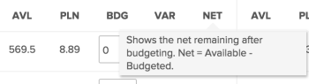

# 使用Adobe Workfront资源规划者审查资源可用性和分配

您可以在资源规划者中查看资源的可用性以及项目的计划或预算工作量。 这些值以小时数、FTE（相当于全职）或成本金额显示，并按列组织。

## 访问要求

+++ 展开以查看本文中各项功能的访问要求。

您必须具有以下权限才能执行本文中的步骤：

<table style="table-layout:auto"> 
 <col> 
 <col> 
 <tbody> 
  <tr> 
   <td role="rowheader">Adobe Workfront计划</td> 
   <td>
新建：任何

       
或

       
当前： Pro或更高版本
 </td> 
  </tr> 
  <tr> 
   <td role="rowheader">Adobe Workfront许可证</td> 
   <td>
新增：浅色或更高

       
或

       
当前：审阅或更高版本
</td>
  </tr> 
  <tr> 
   <td role="rowheader">访问级别配置</td> 
   <td> 
查看以下内容或更高访问权限：
 
    <ul> 
     <li> 
资源管理
 </li> 
     <li> 
财务数据
 </li> 
     <li> 
用户
 </li> 
     <li> 
项目
 </li> 
    </ul> </td> 
  </tr> 
  <tr> 
   <td role="rowheader">对象权限</td> 
   <td> 
查看您想在资源规划者中查看的项目或授予更高的权限
 </td> 
  </tr> 
 </tbody> 
</table>

有关此表中信息的更多详细信息，请参阅Workfront文档中的[访问要求](/help/quicksilver/administration-and-setup/add-users/access-levels-and-object-permissions/access-level-requirements-in-documentation.md)。

+++

## 先决条件

您必须满足使用资源规划者所需的所有先决条件。 有关详细信息，请参阅[资源规划者概述](../../resource-mgmt/resource-planning/get-started-resource-planner.md)。

>[!IMPORTANT]
>
>如果缺少资源规划者正确功能所需的任何先决条件，则某些数字可能为零，或者预算小时数可能灰显。

## 资源的可用性和分配

显示资源可用性和分配的列会根据您应用于资源计划员的视图而发生更改。 有关按项目、角色或用户显示资源规划者中的信息的信息，请参阅[资源规划者导航概述](../../resource-mgmt/resource-planning/resource-planner-navigation.md)。

将视图更改为资源规划者时，请考虑以下事项：

* 当您应用&#x200B;**按项目查看**&#x200B;或&#x200B;**按角色查看**&#x200B;视图时，您可以看到以下列：

  <!--
  <MadCap:conditionalText data-mc-conditions="QuicksilverOrClassic.Draft mode">
  (NOTE: Alina: (some of the information in this area is also covered in Calculating Costs in the RP - https://workfront.zendesk.com/hc/en-us/articles/115004186433 - update this article also, when changes here occur)
  </MadCap:conditionalText>
  -->

   * 可用小时数、FTE或成本
   * 计划小时数、FTE或成本
   * 预算小时数、FTE或成本
   * 小时、FTE或成本差异
   * 净小时数、FTE或成本

* 当您应用&#x200B;**按用户查看**&#x200B;视图时，您可以看到以下列：

   * 可用小时数或FTE
   * 计划小时数或FTE
   * 小时或FTE差异
   * 计划小时数分配百分比

>[!TIP]
>
>将&#x200B;**按用户查看**&#x200B;视图应用于资源规划者时，该信息不可用作成本。
>
>有关每列显示内容的详细信息，请将鼠标悬停在显示编号的列的名称上。\
>
>
>有关每列显示的数据的更多信息，请参阅以下文章：
>
>* [资源规划者的“项目”和“角色”视图中的小时数、FTE和成本信息概述](../../resource-mgmt/resource-planning/overview-of-planner-hour-fte-cost-information-in-role-project-views.md)
>* 使用用户视图时[在资源规划者中查看可用、计划和实际小时数或FTE](../../resource-mgmt/resource-planning/view-hours-fte-user-view-resource-planner.md)
>

## 按小时、FTE或成本查看信息

1. 转到资源规划者。

   默认情况下，信息按小时数显示在资源规划者中。

1. 展开下拉菜单。\
   

1. 从以下选项中选择：

   <table style="table-layout:auto"> 
    <col> 
    <col> 
    <tbody> 
     <tr> 
      <td role="rowheader">小时</td> 
      <td>以小时数显示可用性和分配信息。</td> 
     </tr> 
     <tr> 
      <td role="rowheader">FTE</td> 
      <td> 
在FTE中显示可用性和分配信息。
 
有关如何在Resource Planner中计算FTE的更多信息，请参阅<a href="../../resource-mgmt/resource-planning/calculate-hours-fte-for-users-roles-resource-planner.md" class="MCXref xref">计算Resource Planner中用户和角色的小时和FTE的概述</a>。 
 </td> 
     </tr> 
     <tr> 
      <td role="rowheader">成本</td> 
      <td> 
如果您在项目视图或角色视图中查看资源规划者，则按成本显示可用性和分配信息。 该信息以您系统的货币显示值。 Workfront管理员定义系统货币。 有关在Workfront中设置系统货币的详细信息，请参阅<a href="../../administration-and-setup/manage-workfront/exchange-rates/set-up-exchange-rates.md" class="MCXref xref">设置汇率</a>。
 
<b>注释</b>

   您必须将用户和工作角色与每小时成本费率关联，以便在资源规划者中显示成本信息。 有关将每小时成本费率与工作角色关联的详细信息，请参阅<a href="../../administration-and-setup/set-up-workfront/organizational-setup/create-manage-job-roles.md" class="MCXref xref">创建和管理工作角色</a>。 有关将每小时成本费率与用户关联的详细信息，请参阅<a href="../../administration-and-setup/add-users/create-and-manage-users/edit-a-users-profile.md" class="MCXref xref">编辑用户配置文件</a>。 有关如何在资源规划程序中计算成本的更多信息，请参阅<a href="../../resource-mgmt/resource-planning/calculate-costs-resource-planner.md" class="MCXref xref">在资源规划程序中计算成本</a>。
 </td>
   </tr> 
     <tr> 
      <td role="rowheader">自定义</td> 
      <td>创建显示在资源规划者中的列的自定义视图。 选择要在资源规划程序中显示的选项，如以下步骤所述。 </td> 
     </tr> 
    </tbody> 
   </table>

1. （视情况而定）如果您选择&#x200B;**自定义**，请指示&#x200B;**自定义显示的量度**&#x200B;框中的选项以设置自定义视图。

   

1. 在左侧的&#x200B;**视图类型**&#x200B;列中，选择以下视图之一：

   * 项目
   * 角色
   * 用户

1. 在&#x200B;**显示选定项**&#x200B;部分中，选择要显示在选定视图列中的信息类型。 下表显示了每个视图中可用的选项：

   | **选项** | 用户视图 | 项目视图 | 角色视图 |
   |---|---|---|---|
   | 可用 | ✔ | ✔ | ✔ |
   | 计划 | ✔ | ✔ | ✔ |
   | 已预算 |   | ✔ | ✔ |
   | 差异 |   | ✔ | ✔ |
   | Net |   | ✔ | ✔ |
   | 实际 | ✔ |   |   |
   | 差异 | ✔ |   |   |
   | 百分比 | ✔ |   |   |

1. 选择&#x200B;**在NET计算中使用计划(PLN)值**&#x200B;以在计算“项目”和“角色”视图中的净值时使用计划信息而不是预算信息。

   当选择此选项时，Workfront使用以下公式计算净值：

   `Net = Available - Planned`

   >[!TIP]
   >
   >**只有当您选择至少一个选项以自定义显示选定项分区中的视图时，才会应用此选项。**

1. 单击&#x200B;**保存**。

   此时会显示包含选定列的自定义视图。

   资源规划者将自定义视图列为小时下拉菜单中的自定义。

   >[!NOTE]
   >
   >您只能有一个自定义视图。

   

## 查看用户分配图表

您可以在一个图表中显示用户的计划分配及其可用性。

要在图表中显示用户的分配，请执行以下操作：

1. 转到资源规划者。

   有关访问资源规划者的详细信息，请参阅文章[资源规划者概述](../../resource-mgmt/resource-planning/get-started-resource-planner.md)中的[找到资源规划者](../../resource-mgmt/resource-planning/get-started-resource-planner.md#accessing-the-resource-planner)部分。

1. 选择&#x200B;**按用户查看**。

   >[!TIP]
   >
   >您只能在“用户视图”中查看用户分配图。

1. 单击&#x200B;**用户分配图**&#x200B;图标以显示以下信息：

   <table style="table-layout:auto"> 
    <col> 
    <col> 
    <tbody> 
     <tr> 
      <td role="rowheader">所有用户都没有过度分配的可用性百分比</td> 
      <td>这是指在某个时间段内所有用户可用工作的时间，以占其总可用时间的百分比显示。 </td> 
     </tr> 
     <tr> 
      <td role="rowheader">所有用户的过度分配百分比 </td> 
      <td> 
这是在一个时间段内用户被过度分配的时间量，以占总可用时间的百分比显示。
 
<b>注释</b>

   当计划小时数高于可用小时数时，会发生过度分配。 
 </td>
   </tr> 
     <tr> 
      <td role="rowheader">所有用户的低利用率百分比</td> 
      <td> 
这是一段时间内用户未充分利用的时间量，以占总可用时间的百分比显示。
 
<b>注释</b>

   当计划小时数小于可用小时数时，会发生利用率不足的情况。 
 </td>
   </tr> 
     <tr> 
      <td role="rowheader">在此期间，至少过度分配了一个用户</td> 
      <td>这表示在一个时间段内至少有一个用户存在过度分配，尽管在该时间段内所有用户的总时间量并未过度分配。 您必须滚动浏览用户列表，过度分配的用户的小时数会以红色突出显示。</td> 
     </tr> 
    </tbody> 
   </table>

   

1. （可选）单击图表中所有用户的&#x200B;**过度分配%**&#x200B;区域。\
   过度分配的所有用户都会以红色突出显示。
1. （可选）单击图表中所有用户的&#x200B;**低利用率百分比**&#x200B;区域。\
   未充分利用的所有用户都会以蓝色突出显示。

1. （可选）单击指示符图标，该图标显示您至少有一个用户过度分配的位置。\
   过度分配的用户以红色突出显示。

1. （可选）刷新页面以折叠图表。
