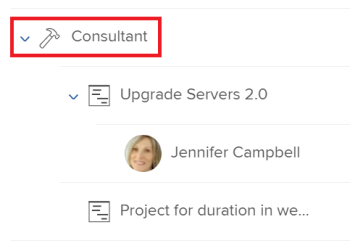

# 资源计划员导航概述

通过使用Adobe Workfront资源规划器，您可以轻松了解资源的可用性以及完成项目工作所需的计划时间。 然后，您可以管理用户在分配给他们的项目中的分配及其作业角色。

>[!TIP]
>
>您不能在资源计划员中管理分配给它们的任务的小组分配。

您必须满足充分使用资源计划员所需的先决条件。 有关资源计划员的详细信息，请参阅 [资源计划员概述](../../resource-mgmt/resource-planning/get-started-resource-planner.md).

以下各节概述了资源规划器的所有区域。

## 项目时间表

使用“资源计划器”顶部的日历，可定位您正在查看的项目的时间轴。 默认情况下，时间轴以当天的月份开始。\
有关更改在资源计划器中显示的时间轴时间范围的详细信息，请参阅部分 [时间范围选择](#timeframe-selection) 在本文中。

## 时间范围选择  {#timeframe-selection}

默认情况下，资源计划器从当月开始，一次显示3或4个月的资源信息。 显示的时间段数取决于屏幕的宽度。

>[!TIP]
>
>您一次不能在资源计划器中显示超过四个时间段。

要导览时间轴，请执行以下操作：

1. 单击向后和向前箭头可在时间轴上向后和向前移动。
1. 通过单击相应按钮，从资源计划器的以下日期范围选项中进行选择：

   <table style="table-layout:auto"> 
    <col> 
    <col> 
    <tbody> 
     <tr> 
      <td role="rowheader">周</td> 
      <td>按周显示信息。 周数显示在列标题中的日期旁边。 </td> 
     </tr> 
     <tr> 
      <td role="rowheader">月</td> 
      <td> 按月显示信息。</td> 
     </tr> 
     <tr> 
      <td role="rowheader">季度</td> 
      <td>按季度显示信息。 季度数显示在列标题中的日期旁边。 自定义季度不会显示在资源计划器中。 </td> 
     </tr> 
     <tr> 
      <td role="rowheader">今天</td> 
      <td>返回到今天的月、周或季度。</td> 
     </tr> 
    </tbody> 
   </table>

## 项目/角色/用户视图选择

您可以根据您希望信息的显示方式，在资源计划器中更改视图。

默认情况下，资源计划员会显示在“用户视图”中。 您可以将视图更改为项目视图或角色视图。 将其更改为其他视图时，您的选择将成为默认视图。

当您更改视图时，以下信息也会发生更改：

* 对象层次结构（资源计划器行中的信息）。
* 小时分配信息（资源计划员列中的信息）。

   有关根据您选择的视图在资源计划器中显示哪些列的详细信息，请参阅 [使用Adobe Workfront资源计划员复查资源可用性和分配](../../resource-mgmt/resource-planning/resource-availability-allocation-resource-planner.md).

要在资源计划器中显示准确的信息，您必须满足一组先决条件。 有关先决条件的详细信息，请参阅 [资源计划员概述](../../resource-mgmt/resource-planning/get-started-resource-planner.md) 文章。  要更改资源计划员中的视图，请执行以下操作：

1. 转到 **资源计划员**.\
   有关访问资源计划员的详细信息，请参阅 [查找资源计划员](../../resource-mgmt/resource-planning/get-started-resource-planner.md#accessing-the-resource-planner) 部分 [资源计划员概述](../../resource-mgmt/resource-planning/get-started-resource-planner.md) 文章。

1. 在&#x200B;**查看方式** 下拉菜单中，选择以下视图之一：

   * [按项目查看](#view-by-project)
   * [按角色查看](#view-by-role)
   * [按用户查看](#view-by-user)

### 按项目查看 {#view-by-project}

在资源计划器中选择项目视图时，请考虑以下事项：

* 您至少可以查看您有权查看的项目。
* 首次访问资源计划器时，您可以看到按默认筛选器过滤的项目。\
   有关在资源计划器中筛选信息的详细信息，请参阅 [在资源计划器中筛选信息](../../resource-mgmt/resource-planning/filter-resource-planner.md).

* 为了提高性能，您显示或可从项目视图导出的项目数量有限。\
   有关在“项目视图”中查看资源计划员时的限制的详细信息，请参阅 [项目视图中的限制](../../resource-mgmt/resource-planning/resource-planner-display-limitations.md#project-view-limits) 部分 [资源计划员显示限制](../../resource-mgmt/resource-planning/resource-planner-display-limitations.md) 文章。

* 项目按项目视图中项目优先级的顺序列出。\
   有关资源计划器中项目优先级的详细信息，请参阅 [项目计划优先级](#project-planning-priority) 章节。

* 展开每个项目时，您可以显示与其关联的作业角色。\
   展开每个角色时，您可以显示与其关联的用户。\
   滚动以在每个项目下加载更多角色和用户。

* 应用此视图时，角色小时数、FTE或成本加总为项目小时数、FTE或成本。\
   

* 您可以在“项目”视图中查看以下小时、FTE或成本信息：

   * 可用
   * 计划
   * 已预算
   * 差异
   * Net

      有关更多信息，请参阅 [使用“项目”和“职责”视图在资源计划员中预算资源](../../resource-mgmt/resource-planning/budget-resources-project-role-views-resource-planner.md).

### 按角色查看 {#view-by-role}

在资源计划员中选择职责视图时，请考虑以下事项：

* 您必须至少具有查看资源管理访问权限和查看项目权限，才能查看与这些项目关联的角色。
* 您可以展开每个角色以显示项目列表，然后展开每个项目以显示可在项目中履行这些角色的用户列表。
* 为了提高性能，您显示或可以从角色视图导出的项目数量有限。\
   有关在“角色”视图中查看资源计划员时的限制的详细信息，请参阅 [角色视图中的限制](../../resource-mgmt/resource-planning/resource-planner-display-limitations.md#role-view-limits) 部分 [资源计划员显示限制](../../resource-mgmt/resource-planning/resource-planner-display-limitations.md) .

* 项目按优先级顺序列在作业角色下，与项目视图中列出的项目相同。
* 应用此视图时，项目小时数、FTE或成本加总为角色小时数、FTE或成本。\
   

* 您可以在“角色”视图中查看以下小时、FTE或成本信息：

   * 可用
   * 计划
   * 已预算
   * 差异
   * Net

      有关更多信息，请参阅 [使用“项目”和“职责”视图在资源计划员中预算资源](../../resource-mgmt/resource-planning/budget-resources-project-role-views-resource-planner.md).

### 按用户查看 {#view-by-user}

您可以在“用户视图”中显示资源计划员，以了解用户的计划小时数与可用小时数或FTE之间的差异，或查看他们记录的实际小时数。

在将用户视图应用到资源计划器时，您无法对资源进行预算。 您必须使用“项目”或“角色”视图对资源进行预算，然后使用“用户”视图来复查用户与计划工作相关的分配和可用性。* *

“用户视图”是资源计划员的默认视图。

在资源计划器中选择用户视图时，请考虑以下事项：

* 您最多可以看到2000个具有查看权限的所有用户处于活动状态，且至少已登录到Adobe Workfront一次。\
   按“团队”、“作业角色”或“池”筛选用户列表，以仅查看与这些实体关联的用户。
* 如果您按项目过滤了用户列表，则只能扩展与过滤项目关联的用户并显示小时信息。\
   有关在资源计划器中筛选信息的详细信息，请参阅 [在资源计划器中筛选信息](../../resource-mgmt/resource-planning/filter-resource-planner.md) .

* 您显示或可从“用户视图”导出的项目数量有限，因此可提高性能。\
   有关在用户视图中查看资源计划时的限制的详细信息，请参阅 [用户视图中的限制](../../resource-mgmt/resource-planning/resource-planner-display-limitations.md#user-view-limits) 部分 [资源计划员显示限制](../../resource-mgmt/resource-planning/resource-planner-display-limitations.md) .

* 项目以用户名称的顺序列出，其优先级与项目视图中列出的项目相同。\
   有关资源计划器中项目优先级的详细信息，请参阅 [项目计划优先级](#project-planning-priority) 章节。

* 如果用户没有与他们关联的工作角色，则小时或FTE值将列在 **无角色** 中。
* 应用此视图时，项目小时数或FTE会累计到用户小时数或FTE。

   >[!TIP]
   >
   >您不能在“用户视图”中按成本显示用户的分配和可用性。

* 您对项目和任务的权限决定了在“用户视图”中看到的用户名称下显示的内容。\
   存在以下情形：

   * 如果您无权查看项目以及分配给资源计划员中显示的用户的任务或问题，则这些项目将列在 **无法访问的项目** 中。 的 **无法访问的项目** 在此例中，“项目”或“任务”部分将替换。

   * 如果您没有权限查看项目，但有权查看项目中的任务或问题，则项目、任务和问题将列在分配给它们的用户名下。
   * 如果您有权查看项目，但没有权限查看项目中的任何任务或问题，则会显示项目名称，并且任务和问题列在 **无法访问的项目** 中。\
      有关Workfront中权限的更多信息，请参阅 [对象共享权限概述](../../workfront-basics/grant-and-request-access-to-objects/sharing-permissions-on-objects-overview.md).

      
    

* 您可以在“用户”视图中查看以下小时和FTE信息：

   * 可用
   * 计划
   * 实际
   * 计划值与实际值之差
   * 计划分配的百分比

      有关更多信息，请参阅 [使用“用户”视图时，在资源计划器中查看可用、计划和实际工时或FTE](../../resource-mgmt/resource-planning/view-hours-fte-user-view-resource-planner.md)

## 项目名称

您可以在资源计划器中查看以下项目：

* 您至少有权查看的项目。

   您还必须在访问级别中至少拥有“查看资源管理”的访问权限。

   有关使用资源计划员所需访问权限的信息，请参阅 [在Adobe Workfront获得预算资源所需的资源](../../resource-mgmt/resource-planning/access-needed-to-budget-resources.md).

* 受应用于资源计划员的过滤器限制的项目。

   有关在资源计划器中筛选信息的详细信息，请参阅 [在资源计划器中筛选信息](../../resource-mgmt/resource-planning/filter-resource-planner.md).

   >[!NOTE]
   >
   >我们建议使用过滤器来减少您在资源计划器中显示的项目数量。

## 项目计划优先级 {#project-planning-priority}

项目按优先级顺序在资源计划器中列出，其中最重要的项目位于顶部。 优先级由项目名称前的数字表示。

您还可以启用设置，以在项目与项目组合关联时，根据其项目组合显示项目优先级。 有关在资源规划器中对项目进行优先级排序和显示组合优先级的信息，请参阅 [在资源计划器中排定项目优先级](../../resource-mgmt/resource-planning/prioritize-projects-resource-planner.md).

## 职位角色名称

资源计划员中列出了以下职务职责类别：

* 分配给任务的作业角色。
* 未分配给任务的作业角色，但是与项目的资源池关联的用户的主要作业角色。
* 分配给这些作业角色中任务的用户的辅助作业角色。
* 具有有效用户的辅助作业角色 **FTE可用性百分比** 在他们的个人资料中。\
   有关 **FTE可用性百分比** 有关作业角色，请参阅 [编辑用户的配置文件](../../administration-and-setup/add-users/create-and-manage-users/edit-a-users-profile.md) .

>[!NOTE]
>
>分配给问题的作业角色也会在 **包含问题后的小时数** 设置。 有关在资源计划器中启用发放小时数的详细信息，请参阅 [设置](#settings) 中。

## 用户名

在“资源计划器”的“项目”和“角色”视图中列出的用户属于与项目关联的资源池。\
有关使用用户填充资源池的更多信息，请参阅 [将资源池与用户关联](../../resource-mgmt/resource-planning/resource-pools/associate-resource-pools-with-users.md).

您有权访问“视图”且至少已登录过Workfront一次的所有用户都会显示在“用户视图”中。

在“项目”和“角色”视图中，用户可能显示在以下类型的作业角色下：

* 他们的主要工作角色
* 他们在以下情况下的辅助作业角色：

   * 如果辅助作业角色的有效编号为 **FTE可用性百分比** 在其用户配置文件中。
   * 如果将用户分配到这些角色中的任务。

有关 **FTE可用性百分比** 有关职务角色，请参阅 [编辑用户的配置文件](../../administration-and-setup/add-users/create-and-manage-users/edit-a-users-profile.md) .

## “无角色”和“无用户”部分

* [“无角色”部分](#no-role-section)
* [“无用户”部分](#no-user-section)

### “无角色”部分  {#no-role-section}

当用户属于与项目关联的资源池，但没有与其关联的作业角色时，它们会显示在 **无角色** ，而不是在特定的作业角色下。

您无法预算 **无角色** 中。 用户必须至少拥有一个与其关联的工作角色，才能为工作编入预算。\

### “无用户”部分  {#no-user-section}

当您将任务分配给某个团队，或者将其保留为未分配状态时，“计划小时数”将显示在 **无用户** 部分 **无角色** 部分。 使用 **按用户查看** 中。

您可以在 **无用户** 部分，但您不能为这些分配预算。

 

## 过滤器

使用过滤器，您可以限制在资源计划器中显示的信息。

有关在资源计划器中进行筛选的详细信息，请参阅 [在资源计划器中筛选信息](../../resource-mgmt/resource-planning/filter-resource-planner.md) .

## 设置 {#settings}

在“设置”区域中，您可以启用或禁用选项以在“资源计划器”中显示或隐藏信息。

要在资源计划器中启用设置，请执行以下操作：

1. 打开资源计划程序。
1. 单击 **设置** 图标。

   

   此时将显示“资源计划员设置”框。

   

1. 启用 **包含问题后的小时数** 设置以在资源计划器中显示“计划小时数”。 默认情况下，此设置处于禁用状态。

   启用此设置时，请考虑以下事项：

   * 分配给问题的用户名称显示在与问题相关联的作业角色下，您可以在“项目”和“角色”视图中为用户指定预算小时数以及作业角色。
   * 用户分配到的问题列在“用户”视图中作业角色的名称下。

      >[!IMPORTANT]
      >
      >**当问题计划起始日期和完成日期在项目时间线之外时，问题的计划小时数会根据问题日期显示。 例如，如果项目时间线在1月和3月之间，但问题的时间线在8月，则问题的计划时数将显示在8月的时间段中。**

1. （视情况而定和可选）如果您选择了“项目”视图，请启用“显示Portfolio优先级”设置，以根据项目优先级分配给的Portfolio显示项目优先级。 根据项目组合的项目优先级显示在“资源计划员”优先级旁边。 默认情况下，此设置处于禁用状态。

   有关在资源计划器中对项目进行优先级排序的信息，请参阅 [在资源计划器中排定项目优先级](../../resource-mgmt/resource-planning/prioritize-projects-resource-planner.md).

## 全屏选项

您可以全屏显示资源计划员，以增加您在屏幕上可以查看的信息量。

全屏查看信息的选项适用于资源计划员的所有视图。

要全屏显示资源计划员，请执行以下操作：

1. 转到 **资源计划员**.
1. 单击 **全屏图标** 全屏查看资源计划员。\
   \
   资源计划器将展开以占用整个浏览器窗口，并且图标将变为 **关闭全屏** 查看选项。

1. （可选）单击 **关闭全屏图标** 还原到上一个显示屏。

## 导出选项

您可以从“资源计划器”的任意视图将信息导出到Excel(.xlsx)文件。\
有关从资源计划员导出信息的信息，请参阅 [从资源计划员导出信息](../../resource-mgmt/resource-planning/export-resource-planner.md).

您可以管理导出文件的信息量和显示。\
有关可从资源计划器导出哪些信息以及如何管理导出文件的外观的信息，请参阅 [资源计划员显示限制](../../resource-mgmt/resource-planning/resource-planner-display-limitations.md).
