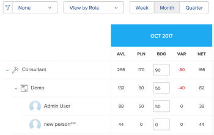

# 资源规划程序导航概述

通过使用Adobe Workfront资源规划者，您可以轻松了解资源的可用性以及完成项目工作所需的计划时间。 然后，您可以管理用户及其工作角色在分配给他们的项目中的分配。

>[!TIP]
>
>您无法在资源规划者中管理团队在分配给他们的任务上的分配。

您必须满足充分使用资源规划者所需的先决条件。 有关资源规划者的详细信息，请参阅[资源规划者概述](../../resource-mgmt/resource-planning/get-started-resource-planner.md)。

以下部分概述了资源规划者的所有区域。

## 项目时间线

使用资源规划者顶部的日历来导航您正在查看的项目的时间表。 默认情况下，时间轴从当月开始。\
有关更改在资源规划者中显示的时间线时间范围的更多信息，请参阅本文中的[时间范围选择](#timeframe-selection)部分。

## 时间范围选择  {#timeframe-selection}

默认情况下，资源规划者一次显示三或四个月的资源信息，从当月开始。 显示的时段数取决于屏幕的宽度。

>[!TIP]
>
>您不能在资源规划程序中一次显示超过四个时间段。

要导航时间线，请执行以下操作：

1. 单击后退和前进箭头，在时间轴上前后移动。
1. 通过单击相应的按钮，从资源计划程序中的以下日期范围选项中选择：

   <table style="table-layout:auto"> 
    <col> 
    <col> 
    <tbody> 
     <tr> 
      <td role="rowheader">周</td> 
      <td>按周显示信息。 星期数显示在列标题中的日期旁边。 </td> 
     </tr> 
     <tr> 
      <td role="rowheader">月</td> 
      <td> 按月显示信息。</td> 
     </tr> 
     <tr> 
      <td role="rowheader">季度</td> 
      <td>按季度显示信息。 季度编号显示在列标题中的日期旁边。 自定义季度未显示在资源规划者中。 </td> 
     </tr> 
     <tr> 
      <td role="rowheader">今天</td> 
      <td>返回到今天的月、周或季度。</td> 
     </tr> 
    </tbody> 
   </table>

## 项目/角色/用户视图选择

您可以根据您希望信息的显示方式更改资源规划者中的视图。

默认情况下，资源规划者显示在用户视图中。 您可以将视图更改为项目视图或角色视图。 将其更改为其他视图时，您的选择将变成默认视图。

在更改视图时，以下信息也会更改：

* 对象层次结构（资源规划程序行中的信息）。
* 小时分配信息（资源规划者列中的信息）。

  有关根据您选择的视图在资源规划者中显示哪些列的详细信息，请参阅[使用Adobe Workfront资源规划者查看资源可用性和分配](../../resource-mgmt/resource-planning/resource-availability-allocation-resource-planner.md)。

要在资源计划程序中显示准确的信息，您必须满足一组先决条件。 有关先决条件的更多信息，请参阅[资源规划者概述](../../resource-mgmt/resource-planning/get-started-resource-planner.md)文章中的“在资源规划者中工作的先决条件”部分。  要更改资源规划者中的视图，请执行以下操作：

1. 转到&#x200B;**资源规划者**。\
   有关访问资源规划者的详细信息，请参阅[资源规划者概述](../../resource-mgmt/resource-planning/get-started-resource-planner.md)文章中的[找到资源规划者](../../resource-mgmt/resource-planning/get-started-resource-planner.md#accessing-the-resource-planner)部分。

1. 在&#x200B;**查看方式**&#x200B;下拉菜单中，选择以下视图之一：

   * [按项目查看](#view-by-project)
   * [按角色查看](#view-by-role)
   * [按用户查看](#view-by-user)

### 按项目查看 {#view-by-project}

在资源规划者中选择项目视图时，请考虑以下事项：

* 您可以看到您有权查看的项目中的内容。
* 在首次访问资源规划者时，您可以看到按默认筛选条件筛选的项目。\
  有关在资源规划者中过滤信息的详细信息，请参阅资源规划者中的[过滤信息](../../resource-mgmt/resource-planning/filter-resource-planner.md)。

* 为了提高性能，您显示或可以从“项目视图”中导出的项数量是有限的。\
  有关在项目视图中查看资源规划者时限制的更多信息，请参阅[资源规划者显示限制](../../resource-mgmt/resource-planning/resource-planner-display-limitations.md)文章中项目视图](../../resource-mgmt/resource-planning/resource-planner-display-limitations.md#project-view-limits)部分的[限制。

* 项目按其在项目视图中的优先级顺序列出。\
  有关资源规划者中项目优先级的详细信息，请参阅本文中的[项目规划优先级](#project-planning-priority)部分。

* 展开每个项目时，您可以显示与其关联的工作角色。\
  展开每个角色时，可以显示与其关联的用户。\
  滚动以在每个项目下加载更多角色和用户。

* 应用此视图后，角色小时数、FTE或成本将合计到项目小时数、FTE或成本。\
  

* 您可以在“项目”视图中查看以下小时、FTE或成本信息：

   * 可用
   * 计划
   * 已预算
   * 差异
   * Net

     有关详细信息，请参阅使用项目和角色视图的资源规划者中的[预算资源](../../resource-mgmt/resource-planning/budget-resources-project-role-views-resource-planner.md)。

### 按角色查看 {#view-by-role}

在资源规划者中选择角色视图时，请考虑以下事项：

* 您必须至少具有资源管理的查看访问权限和项目的查看权限，才能查看与这些项目关联的角色。
* 您可以展开每个角色以显示项目列表，展开每个项目以显示可在项目中履行这些角色的用户列表。
* 为了提高性能，您显示或可以从“角色视图”中导出的项目数量是有限的。\
  有关在角色视图中查看资源规划者时限制的更多信息，请参阅[资源规划者显示限制](../../resource-mgmt/resource-planning/resource-planner-display-limitations.md)中角色视图](../../resource-mgmt/resource-planning/resource-planner-display-limitations.md#role-view-limits)部分的[限制。

* 项目在工作角色下列出，其优先顺序与项目视图中所列的顺序相同。
* 应用此视图后，项目小时数、FTE或成本将合计到角色小时数、FTE或成本。\
  

* 您可以在“角色”视图中查看以下小时、FTE或成本信息：

   * 可用
   * 计划
   * 已预算
   * 差异
   * Net

     有关详细信息，请参阅使用项目和角色视图的资源规划者中的[预算资源](../../resource-mgmt/resource-planning/budget-resources-project-role-views-resource-planner.md)。

### 按用户查看 {#view-by-user}

您可以在用户视图中显示资源规划者，以了解计划的小时数与用户的可用小时数或FTE之间的差异，或查看他们记录的实际小时数。

将用户视图应用于资源规划者时，您无法预算资源。 您必须使用“项目”或“角色”视图来预算资源，并使用“用户”视图来查看与计划工作相关的用户分配和可用性。* *

用户视图是资源规划者的默认视图。

在资源规划者中选择“用户视图”时，请考虑以下事项：

* 您可以看到您有权查看的所有用户，最多有2000个处于活动状态且至少已登录Adobe Workfront一次的用户。\
  按团队、工作角色或池筛选用户列表，以查看仅与这些实体关联的用户。
* 如果按项目过滤了用户列表，则只有与过滤的项目相关联的用户才能展开并显示小时信息。\
  有关在资源规划者中过滤信息的更多信息，请参阅[在资源规划者中过滤信息](../../resource-mgmt/resource-planning/filter-resource-planner.md) 。

* 为了提高性能，您显示或可从“用户视图”中导出的项目数量是有限的。\
  有关在用户视图中查看资源规划器时的限制的更多信息，请参阅[资源规划器显示限制](../../resource-mgmt/resource-planning/resource-planner-display-limitations.md)中用户视图](../../resource-mgmt/resource-planning/resource-planner-display-limitations.md#user-view-limits)部分的[限制。

* 项目按照与项目视图中所列顺序相同的优先级在用户名称下列出。\
  有关资源规划者中项目优先级的详细信息，请参阅本文中的[项目规划优先级](#project-planning-priority)部分。

* 如果用户没有与其关联的工作角色，则“小时数”或“FTE”值将列在&#x200B;**无角色**&#x200B;部分下。
* 应用此视图后，项目小时或FTE总计为用户小时或FTE。

  >[!TIP]
  >
  >您不能在“用户视图”中按“成本”显示用户的分配和可用性。

* 您对项目和任务的权限决定了在“用户视图”中看到的用户名称下显示的内容。\
  存在以下情况：

   * 如果您无权查看项目以及分配给资源规划者中显示的用户的任务或问题，则这些项目列在&#x200B;**无法访问的项目**&#x200B;部分下。 在这种情况下，**不可访问项**&#x200B;分区将替换项目或任务分区。

   * 如果您无权查看项目，但有权查看项目的任务或问题，则项目、任务和问题将列在分配给它们的用户的名称下。
   * 如果您有权查看项目，但没有权限查看项目中的任何任务或问题，则会显示项目名称，并且任务和问题列在&#x200B;**无法访问的项目**&#x200B;部分下。\
     有关Workfront中权限的更多信息，请参阅[对象权限共享概述](../../workfront-basics/grant-and-request-access-to-objects/sharing-permissions-on-objects-overview.md)。

     

   

* 您可以在“用户”视图中查看以下小时和FTE信息：

   * 可用
   * 计划
   * 实际
   * 计划与实际之间的差异
   * 计划分配的百分比

     有关详细信息，在使用用户视图时，请参阅资源规划者中的[查看可用、计划和实际小时数或FTE](../../resource-mgmt/resource-planning/view-hours-fte-user-view-resource-planner.md)

## 项目名称

您可以在资源规划者中看到以下项目：

* 您有权查看的项目。

  您还必须具有访问级别中查看资源管理的权限。

  有关使用资源规划者所需访问权限的信息，请参阅[在Adobe Workfront中预算资源所需的访问权限](../../resource-mgmt/resource-planning/access-needed-to-budget-resources.md)。

* 受应用于资源规划者的过滤器限制的项目。

  有关在资源规划者中过滤信息的详细信息，请参阅资源规划者中的[过滤信息](../../resource-mgmt/resource-planning/filter-resource-planner.md)。

  >[!NOTE]
  >
  >我们建议使用过滤器减少您在资源规划者中显示的项目数。

## 项目计划优先级 {#project-planning-priority}

项目按优先级在资源规划程序中列出，最重要的项目在顶部。 优先级由项目名称前面的数字表示。

您还可以启用相应设置，以便在项目与项目组合关联时，根据项目组合显示项目优先级。 有关在资源规划程序中排列项目优先顺序和显示项目组合优先级的信息，请参阅[在资源规划程序中排列项目优先顺序](../../resource-mgmt/resource-planning/prioritize-projects-resource-planner.md)。

## 职位角色名称

资源规划者中列出了以下工作角色类别：

* 分配给任务的工作角色。
* 未分配给任务但是与项目的资源池关联的用户的首要工作角色的工作角色。
* 分配给这些工作角色中任务的用户的辅助工作角色。
* 用户在其配置文件中具有有效的&#x200B;**FTE可用性百分比**&#x200B;的辅助工作角色。\
  有关工作角色的FTE可用性&#x200B;**百分比**&#x200B;的更多信息，请参阅[编辑用户的配置文件](../../administration-and-setup/add-users/create-and-manage-users/edit-a-users-profile.md) 。

>[!NOTE]
>
>启用&#x200B;**包括来自问题**&#x200B;的小时数设置时，也会列出分配给问题的工作角色。 有关在资源规划者中启用问题时数的详细信息，请参阅[设置](#settings)部分。

## 用户名

资源规划者的“项目”和“角色”视图中列出的用户属于与项目关联的资源池。\
有关使用用户填充资源池的详细信息，请参阅[将资源池与用户关联](../../resource-mgmt/resource-planning/resource-pools/associate-resource-pools-with-users.md)。

您有权查看且已登录Workfront至少一次的所有用户都将显示在“用户视图”中。

在“项目”和“角色”视图中，用户可显示在以下工作角色类型下：

* 他们的主要工作角色
* 他们的辅助工作角色，在以下场景中：

   * 如果辅助工作角色的用户配置文件中的&#x200B;**FTE可用性百分比**&#x200B;具有有效数字。
   * 如果用户被分配到这些角色中的任务。

有关工作角色的FTE可用性&#x200B;**百分比**&#x200B;的更多信息，请参阅[编辑用户配置文件](../../administration-and-setup/add-users/create-and-manage-users/edit-a-users-profile.md) 。

## “无角色”和“无用户”部分

* [“无角色”部分](#no-role-section)
* [“无用户”部分](#no-user-section)

### “无角色”部分  {#no-role-section}

当用户属于与项目关联的资源池，但没有与其关联的工作角色时，他们显示在&#x200B;**无角色**&#x200B;部分，而不是特定工作角色下。

您无法为&#x200B;**无角色**&#x200B;分区中的用户预算小时数。 用户必须具有至少一个与其关联的工作角色才能为工作编列预算。\

### “无用户”部分  {#no-user-section}

将任务分配给团队或保持未分配状态时，已计划小时数显示在资源规划者的&#x200B;**无角色**&#x200B;分区下的&#x200B;**无用户**&#x200B;分区下。 使用&#x200B;**按用户查看**&#x200B;视图时，这些任务未出现在资源规划者中。

您可以在资源规划者的&#x200B;**无用户**&#x200B;部分中看到项目上任务归因的已计划小时数，但无法对这些分配进行预算。

 

## 过滤器

通过使用过滤器，您可以限制在资源规划者中显示的信息。

有关在资源规划者中进行筛选的更多信息，请参阅[资源规划者中的筛选信息](../../resource-mgmt/resource-planning/filter-resource-planner.md) 。

## 设置 {#settings}

在“设置”区域中，可以启用或禁用在“资源规划者”中显示或隐藏信息的选项。

要在资源规划程序中启用设置，请执行以下操作：

1. 打开资源规划程序。
1. 单击&#x200B;**设置**&#x200B;图标。

   

   此时将显示资源规划者设置框。

   

1. 启用&#x200B;**包括来自问题的小时数**&#x200B;设置以显示资源规划者中来自问题的已计划小时数。 默认情况下禁用此设置。

   启用此设置时，请考虑以下事项：

   * 分配给问题的用户名称显示在问题中与其关联的工作角色下，您可以在“项目”和“角色”视图中指定用户的预算小时数和工作角色。
   * 在“用户”视图中，用户所分配到的问题列在工作角色的名称下。

     >[!IMPORTANT]
     >
     >**当问题计划的开始日期和完成日期在项目的时间表之外时，问题的计划小时数根据问题的日期显示。 例如，如果项目时间线在一月到三月之间，但问题的时间线是在八月，则问题的计划小时数将显示在八月时间段中。**

1. （有条件，可选）如果选择了“项目”视图，请启用“显示Portfolio优先级”设置，以根据项目所分配的Portfolio显示项目优先级。 根据其项目组合而定的项目优先级显示在资源规划者优先级旁边。 默认情况下禁用此设置。

   有关在资源规划程序中排列项目优先顺序的信息，请参阅[在资源规划程序中排列项目优先顺序](../../resource-mgmt/resource-planning/prioritize-projects-resource-planner.md)。

## 全屏选项

您可以全屏显示资源规划者，以放大可在屏幕上查看的信息量。

全屏查看信息的选项适用于资源规划者的所有视图。

要全屏显示资源规划者，请执行以下操作：

1. 转到&#x200B;**资源规划者**。
1. 单击&#x200B;**全屏图标**&#x200B;以全屏查看资源规划者。\
   \
   Resource Planner展开以占据整个浏览器窗口，图标将变为&#x200B;**关闭全屏**&#x200B;视图选项。

1. （可选）单击&#x200B;**关闭全屏图标**&#x200B;以还原到上一个显示。

## 导出选项

您可以从资源规划者的任何视图将信息导出到Excel (.xlsx)文件。\
有关从资源规划者导出信息的信息，请参阅[从资源规划者导出信息](../../resource-mgmt/resource-planning/export-resource-planner.md)。

您可以管理信息量和导出文件的显示。\
有关可从资源规划者导出哪些信息以及如何管理导出文件外观的信息，请参阅[资源规划者显示限制](../../resource-mgmt/resource-planning/resource-planner-display-limitations.md)。
