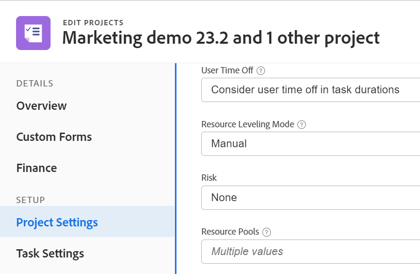

# 将资源池与项目和模板关联

<!-- drafted for bulk editing projects: keep this in yellow till this releases to ALL customers - May 1, 2023

Also - take out all the references to Preview and Prod at prod final
-->

<!--The highlighted information on this page refers to functionality not yet generally available. It is available for all customers in the Preview environment and for a select group of customers in the Production environment.-->

<!--

The sections about how to add resource pools to templates, projects are duplicated from the articles listed in those sections (Editing Projects, Creating a Template, etc).

***I decided to keep these steps here, though, because it's hard to parse through those much lunger articles for just updating this one field.)

-->

资源池是用户集合，可帮助您管理Adobe Workfront中的资源。

创建资源池后，您可以将其与项目或模板相关联，以便稍后在项目上预算资源。

我们建议您提前创建资源池，将其与项目关联，并在项目开始之前对资源进行预算。

有关资源池的信息，请参阅[资源池概述](../../../resource-mgmt/resource-planning/resource-pools/work-with-resource-pools.md)。

有关创建资源池的信息，请参阅[创建资源池](../../../resource-mgmt/resource-planning/resource-pools/create-resource-pools.md)。

## 访问要求

+++ 展开以查看本文中各项功能的访问要求。

<table style="table-layout:auto"> 
 <col> 
 <col> 
 <tbody> 
  <tr> 
   <td>Adobe Workfront包</td> 
   <td>
任何
</td> 
  </tr> 
  <tr> 
   <td>Adobe Workfront许可证</td> 
   <td>
标准

   
规划
</td>
  </tr> 
  <tr> 
   <td>访问级别配置</td> 
   <td> 
编辑对资源管理的访问权限，其中包括对管理资源池的访问权限
 
编辑对项目、模板和用户的访问权限
</td> 
  </tr> 
  <tr> 
   <td>对象权限</td> 
   <td>管理要与资源池关联的项目、模板和用户的权限</td> 
  </tr> 
 </tbody> 
</table>

有关信息，请参阅Workfront文档中的[访问要求](/help/quicksilver/administration-and-setup/add-users/access-levels-and-object-permissions/access-level-requirements-in-documentation.md)。

+++

## 将资源池与一个项目或模板关联

您可以使用与将资源池与项目关联相同的方式将资源池与模板关联。 本文介绍了如何将资源池与项目关联。

1. 转到项目，然后单击项目名称旁边的&#x200B;**更多**&#x200B;图标，然后单击&#x200B;**编辑**。

1. 单击&#x200B;**项目设置**。

1. 在&#x200B;**资源池**&#x200B;字段中开始键入资源池的名称，然后在此名称出现时从列表中选择它。\
   您可以将多个资源池与一个项目或模板关联。

   

1. 单击&#x200B;**保存**。

有关如何编辑项目并将其与资源池关联的更多信息，请参阅[编辑项目](../../../manage-work/projects/manage-projects/edit-projects.md)。

有关如何编辑模板并将其与资源池关联的更多信息，请参阅[编辑项目模板](../../../manage-work/projects/create-and-manage-templates/edit-templates.md)。

## 将资源池与多个项目或模板批量关联

您可以批量编辑多个项目或模板，并同时将同一资源池与它们的所有项目或模板相关联。

您可以使用与将资源池与项目关联相同的方式将资源池与模板关联。

要将资源池与多个项目批量关联，请执行以下操作：

1. 转到项目列表。
1. 选择多个项目，然后单击列表顶部的&#x200B;**编辑**&#x200B;图标。

1. 单击&#x200B;**设置**。
1. 在&#x200B;**资源池**&#x200B;字段中开始键入资源池的名称，然后在此名称出现时从列表中选择它。\
   您可以将多个资源池与项目或模板关联。

   >[!NOTE]
   >
   >* 批量编辑模板时，此字段仅显示所有选定模板共有的资源池。 如果所选模板没有共享资源池，则此字段为空。 您在此处指定的资源池将覆盖项目或模板的单个资源池。
   >
   >* 批量编辑项目时，如果所选项目具有不同的资源池，则显示“多个值”指示器。 如果为项目批量添加资源池，则所有池都将添加到选定项目中，并覆盖原始资源池。

   

1. 单击&#x200B;**保存更改**。\
   当资源池与项目或模板关联时，您可以在资源规划者中为项目预算用户分配。\
   有关资源规划者的详细信息，请参阅[资源规划者概述](../../../resource-mgmt/resource-planning/get-started-resource-planner.md)。

有关如何批量编辑项目的更多信息，请参阅[编辑项目](../../../manage-work/projects/manage-projects/edit-projects.md)中的“批量编辑项目”部分。

有关如何批量编辑模板的详细信息，请参阅[编辑项目模板](../../../manage-work/projects/create-and-manage-templates/edit-templates.md)中的“批量编辑模板”部分。
