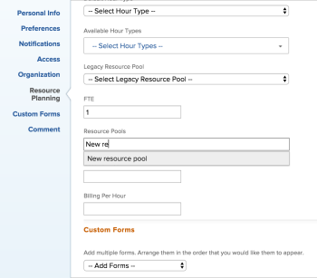

# 将资源池与用户关联

<!--

(NOTE: The info about how to add resource pools to users, are duplicated from the articles listed in those sections (Creating Users, etc). I decided to keep the steps here because those articles are too long to rummage through for updating just this one field.)

-->

资源池是用户集合，可帮助您管理Adobe Workfront中的资源。

必须先创建资源池，然后才能将其与用户关联。

在创建资源池时，可以将用户与资源池相关联。

如果创建资源池时没有向其中填充用户，则以后可以在编辑或创建新用户时将它们与用户相关联。

有关资源池的信息，请参阅[资源池概述](../../../resource-mgmt/resource-planning/resource-pools/work-with-resource-pools.md)。

有关创建资源池的信息，请参阅[创建资源池](../../../resource-mgmt/resource-planning/resource-pools/create-resource-pools.md)。

## 访问权限要求

+++ 展开可查看本文所述功能的访问权限要求。

<table style="table-layout:auto"> 
 <col> 
 <col> 
 <tbody> 
  <tr> 
   <td>Adobe Workfront 包</td> 
   <td>
“任一”
</td> 
  </tr> 
  <tr> 
   <td>Adobe Workfront许可证</td> 
   <td>
标准

   
规划
</td>
  </tr> 
  <tr> 
   <td>访问级别配置</td> 
   <td> 
编辑对资源管理的访问权限，其中包括对管理资源池的访问权限
 
编辑对项目、模板和用户的访问权限
</td> 
  </tr> 
  <tr> 
   <td>对象权限</td> 
   <td>管理要与资源池关联的项目、模板和用户的权限</td> 
  </tr> 
 </tbody> 
</table>

有关信息，请参阅Workfront文档中的[访问要求](/help/quicksilver/administration-and-setup/add-users/access-levels-and-object-permissions/access-level-requirements-in-documentation.md)。

+++

## 将资源池与一个用户关联

{{step-1-to-users}}

1. 选中列表中用户名旁边的框，然后单击&#x200B;**编辑**。
1. 单击&#x200B;**资源计划**。
1. 在&#x200B;**资源池**&#x200B;字段中开始键入要与用户关联的资源池的名称，然后在该名称出现时从列表中选择它。\
   您可以将多个资源池与一个用户关联。\
   

1. 单击&#x200B;**保存更改**。

有关编辑用户的详细信息，请参阅[编辑用户的配置文件](../../../administration-and-setup/add-users/create-and-manage-users/edit-a-users-profile.md)。

有关创建新用户的详细信息，请参阅[添加用户](../../../administration-and-setup/add-users/create-and-manage-users/add-users.md)。

## 将资源池与用户批量关联

您可以批量编辑多个用户，并同时将同一资源池与所有这些用户关联。

要将资源池与多个用户批量关联，请执行以下操作：

{{step-1-to-users}}

1. 选择列表上的多个用户，然后单击&#x200B;**编辑**。
1. 单击&#x200B;**资源计划**。
1. 在&#x200B;**资源池**&#x200B;字段中开始键入要与用户关联的资源池的名称，然后在该名称出现时从列表中选择它。\
   您可以将多个资源池与多个用户关联。

   >[!NOTE]
   >
   >只有所有选定用户通用的资源池才会显示在此字段中。 如果所选用户没有共享资源池，则此字段为空。 如果此字段为空，则在此处指定的资源池将覆盖其各自的资源池。

1. 单击&#x200B;**保存更改**。

有关如何批量编辑用户的详细信息，请参阅[批量编辑用户配置文件](../../../administration-and-setup/add-users/create-and-manage-users/edit-user-profiles-in-bulk.md)。
