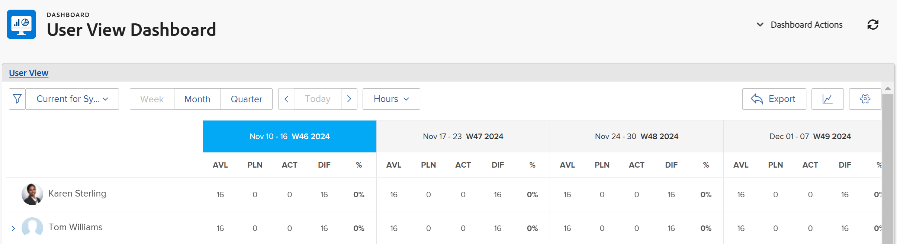

# 与链接共享资源计划员用户视图

Adobe Workfront可以为资源计划员的用户视图生成唯一URL，您可以将该URL作为外部页面嵌入到功能板中，或在新的浏览器选项卡中单独打开它。 在与可能没有直接访问“资源规划”区域的用户共享“资源规划器”信息时，此功能非常有用。

## 访问要求

您必须具备以下条件：

<table style="table-layout:auto"> 
 <col> 
 <col> 
 <tbody> 
  <tr> 
   <td role="rowheader">Adobe Workfront计划*</td> 
   <td> 
专业及更高级别
 </td> 
  </tr> 
  <tr> 
   <td role="rowheader">Adobe Workfront许可证*</td> 
   <td> 
计划 
 </td> 
  </tr> 
  <tr> 
   <td role="rowheader">访问级别配置*</td> 
   <td> 
查看或更高程度地访问资源管理、项目和用户
 
查看对财务数据的访问权限，以查看成本信息 
 
<b>注意</b> 如果您仍然没有访问权限，请咨询Workfront管理员，他们是否在您的访问级别设置了其他限制。 有关Workfront管理员如何更改访问级别的信息，请参阅 <a href="../../administration-and-setup/add-users/configure-and-grant-access/create-modify-access-levels.md" class="MCXref xref">创建或修改自定义访问级别</a>.
 </td> 
  </tr> 
  <tr> 
   <td role="rowheader">对象权限</td> 
   <td> 
查看或更高权限，以显示在资源计划器中的项目
 
有关请求其他访问权限的信息，请参阅 <a href="../../workfront-basics/grant-and-request-access-to-objects/request-access.md" class="MCXref xref">请求对对象的访问 </a>.
 </td> 
  </tr> 
 </tbody> 
</table>

&#42;要了解您拥有的计划、许可证类型或访问权限，请联系您的Workfront管理员。

在为资源计划员的用户视图生成唯一URL时，请考虑以下事项：

* 您只能为用户视图获取唯一URL。 项目或角色视图中不存在用于生成URL的选项。
* 您可以与其他用户共享该URL，包括工作和查看授权用户。\
   他们必须有权查看其他用户，才能从您与他们共享的URL中查看资源计划员中的信息。
* 当您与其他用户共享URL时，会保存以下信息：

   * 时间段的类型（周、月、季度）。
   * 您应用的过滤器。
   * 显示类型（小时或FTE）。

要在资源计划员的“用户视图”中获取唯一URL并与其他用户共享该URL，请执行以下操作：

1. 单击 **主菜单** 图标  在Adobe Workfront的右上角。

1. 单击 **资源化**.
1. 在中，选择 **按用户查看**.
1. （可选）选择您要在资源计划器中查看信息的时间范围。 从以下选项中进行选择：

   * 周
   * 月
   * 季度

1. （可选）选择是否要按 **FTE** 或 **小时**.\
   

1. （可选）将过滤器应用到资源计划器。\
   有关应用过滤器的信息，请参阅 [在资源计划器中筛选信息](../../resource-mgmt/resource-planning/filter-resource-planner.md) .

1. 单击 **超链接** 图标。\
   

1. 单击 **复制URL**.\
   此操作会将“用户视图”中资源计划员的唯一URL复制到剪贴板。

1. （可选）执行以下操作之一：  

   * 将URL粘贴到其他应用程序中，以将其发送给其他用户。\
      用户必须登录Workfront才能在“用户”视图中查看资源计划员。
   * 打开新的浏览器标签或窗口并粘贴您复制的链接，然后单击键盘上的Enter键以在新标签或窗口中打开资源计划器。
   * 执行以下操作：

      <!--   
     <MadCap:conditionalText data-mc-conditions="QuicksilverOrClassic.Draft mode">   
     (NOTE:&nbsp;turn this into a numbered list)   
     </MadCap:conditionalText>   
     -->

      1. 转到 **报表**>**功能板**>**新功能板**>**添加外部页面。**

      1. 将复制的链接粘贴到剪贴板的 **URL** 字段。
      1. 单击 **保存**，则 **保存并关闭**.\
         这会将URL嵌入到功能板中，资源计划员的“用户”视图将显示在单独的功能板中。

1. （可选）如果您将URL嵌入到功能板中，请考虑将其添加到布局模板，或将其与可能无权访问“资源管理”区域的其他用户共享。\
   有关将功能板添加到布局模板的信息，请参阅 [创建和管理布局模板](../../administration-and-setup/customize-workfront/use-layout-templates/create-and-manage-layout-templates.md) .\
   有关共享功能板的信息，请参阅 [共享功能板](../../reports-and-dashboards/dashboards/creating-and-managing-dashboards/share-dashboard.md) .\
   在查看共享URL时，用户可以查看您最初应用于资源计划员的设置的信息。 他们必须登录Workfront才能查看共享的URL。\
   
