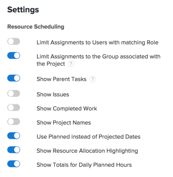

# 在“计划”区域中配置设置

>[!IMPORTANT]
>  
>自2023年1月的23.1版本开始，本文中描述的计划功能已弃用并从Adobe Workfront中删除。   
>  
>  2023年初23.1版发布后不久，也将删除本文。 此时，我们建议您相应地更新任何书签。 
> 
> 您现在可以使用负载平衡器来计划资源的工作。 
>  
> 有关使用工作负载平衡器计划资源的信息，请参阅一节 [工作负载平衡器](../../resource-mgmt/workload-balancer/workload-balancer.md). 

<!--  

>[!CAUTION] 
> 
> 
> The information in this article refers to the Adobe Workfront's Scheduling tools. The Scheduling areas have been removed from the Preview environment and will be removed from the Production environment in **January 2023**. 
>  Instead, you can schedule resources in the Workload Balancer.  
> 
>*  For information about scheduling resources using the Workload Balancer, see the section [The Workload Balancer](../../resource-mgmt/workload-balancer/workload-balancer.md). 
> 
>*  For more information about the deprecation and removal of the Scheduling tools, see [Deprecation of Resource Scheduling tools in Adobe Workfront](../../resource-mgmt/resource-mgmt-overview/deprecate-resource-scheduling.md). 
-->

您可以配置各种设置以自定义在计划时间轴中显示信息的方式和内容。

## 访问要求

您必须具有以下访问权限才能执行本文中的步骤：

<table style="table-layout:auto"> 
 <col> 
 <col> 
 <tbody> 
  <tr> 
   <td role="rowheader">Adobe Workfront计划*</td> 
   <td> 
任意
 </td> 
  </tr> 
  <tr> 
   <td role="rowheader">Adobe Workfront许可证*</td> 
   <td> 
工作或更高
 </td> 
  </tr> 
  <tr> 
   <td role="rowheader">访问级别*</td> 
   <td> 
查看对项目、任务和问题的访问权限或更高权限
 
<b>注释</b>

如果您仍然没有访问权限，请咨询Workfront管理员，他们是否在您的访问级别设置了其他限制。 有关Workfront管理员如何更改访问级别的信息，请参阅 <a href="../../administration-and-setup/add-users/configure-and-grant-access/create-modify-access-levels.md" class="MCXref xref">创建或修改自定义访问级别</a>.
 </td>
</tr> 
  <tr> 
   <td role="rowheader">对象权限</td> 
   <td> 
为项目、任务和问题提供权限或更高权限
 
有关请求其他访问权限的信息，请参阅 <a href="../../workfront-basics/grant-and-request-access-to-objects/request-access.md" class="MCXref xref">请求对对象的访问 </a>.
 </td> 
  </tr> 
 </tbody> 
</table>

*要了解您拥有的计划、许可证类型或访问权限，请联系您的Workfront管理员。

## 配置要在计划时间轴上显示的问题

<!--

(NOTE: ALL THE SECTIONS BELOW ARE LINKED TO PRODUCT. DO NOT CHANGE TITLES) 

-->

除了计划时间轴上的任务之外，您还可以配置要显示的问题。\
在团队的“计划”部分中计划资源时，默认情况下，除了任务之外，还会显示问题。 在计划项目资源时，默认情况下只显示任务。

1. 转到多个项目、单个项目或团队的计划时间轴：

   * **对于多个项目**:  单击 **主菜单** 图标  在Workfront的右上角，单击 **资源配置>工作负载平衡器**，然后选择 **计划** 中。
   * **对于单个项目**:转到项目，单击 **工作负载平衡器** ，然后选择 **计划** 从左上角的下拉菜单中。
   * **对于团队**:单击 **主菜单** 图标  在Workfront的右上角，单击 **团队**，选择团队，单击 **工作负载平衡器** 在左侧面板中，选择 **计划** 从左上角的下拉菜单中。

1. 单击 **设置** 图标。

1. 在“资源计划设置”对话框中，启用 **显示问题** 选项。\
   

1. 单击 **返回计划**. 

## 配置要在计划时间轴上显示的已完成工作

您可以配置计划时间轴，以显示已标记为“完成”的工作。 默认情况下，已完成的工作不会显示在计划时间轴上。 

1. 转到多个项目、单个项目或团队的计划时间轴：

   * **对于多个项目**:  单击 **主菜单** 图标  在Workfront的右上角，单击 **资源配置>工作负载平衡器**，然后选择 **计划** 中。
   * **对于单个项目**:转到项目，单击 **工作负载平衡器** ，然后选择 **计划** 从左上角的下拉菜单中。
   * **对于团队**:单击 **主菜单** 图标  在Workfront的右上角，单击 **团队**，选择团队，单击 **工作负载平衡器** 在左侧面板中，选择 **计划** 从左上角的下拉菜单中。

1. 单击 **设置** 图标。

1. 在“资源计划设置”对话框中，启用 **显示已完成的工作** 选项。\
   

1. 单击 **返回计划**.\
   已完成的工作在工作项的右上角显示一个复选标记。

## 配置项目名称以在计划时间轴上显示 

您可以将项目名称配置为在计划时间轴上显示每个任务和问题。 这样，查看计划时间轴的用户就可以快速查看任务或问题所在项目的名称。

在启用项目名称显示功能后，每个任务和问题都会占用计划时间轴上的更多垂直空间，从而减少在单个视图中显示的任务和问题。

默认情况下，项目名称不会显示在计划时间轴上的任务和问题上。

要在计划时间轴上显示任务和问题的项目名称，请执行以下操作：

1. 转到多个项目或团队的计划时间轴：

   * **对于多个项目**:  单击 **主菜单** 图标  在Workfront的右上角，单击 **资源配置>工作负载平衡器**，然后选择 **计划** 中。
   * **对于团队**:单击 **主菜单** 图标  在Workfront的右上角，单击 **团队**，选择团队，单击 **工作负载平衡器** 在左侧面板中，选择 **计划** 从左上角的下拉菜单中。

1. 单击 **设置** 图标。

1. 在“资源计划设置”对话框中，启用选项， **显示项目名称**.\
   

1. 单击 **返回计划**.\
   计划时间轴上的每个任务和问题都显示任务或问题所在项目的名称。\
   

## 配置要在计划时间轴上显示的预计日期

默认情况下，计划日期在计划时间轴中使用。 或者，您也可以配置计划时间轴以使用“预计日期”。

请考虑以下有关计划日期和预计日期的信息：

* 任务的计划日期可以手动设置，也可以根据任务约束和持续时间类型自动设置。 有关更多信息，请参阅 [任务约束概述](../../manage-work/tasks/task-constraints/task-constraint-overview.md) 和  [任务持续时间和持续时间类型概述](../../manage-work/tasks/taskdurtn/task-duration-and-duration-type.md) .

   问题的计划日期由用户手动设置。 但是，系统管理员可以限制用户调整问题的计划日期。

* 任务和问题的预计日期都会自动设置。 有关预计日期的详细信息，请参阅文章 [项目、任务和问题的预计完成日期概览](../../manage-work/projects/planning-a-project/project-projected-completion-date.md).

>[!NOTE]
>
>在计划时间轴上使用预计日期时，无法显示用户分配信息。 有关用户分配的更多信息，请参阅文章 [在“计划”区域中手动分配未分配的任务和问题](../../resource-mgmt/resource-scheduling/manually-assign-items-scheduling-areas.md).

要配置计划时间表以根据预计日期显示任务和问题，请执行以下操作： 

1. 转到多个项目、单个项目或团队的计划时间轴：

   * **对于多个项目**:  单击 **主菜单** 图标  在Workfront的右上角，单击 **资源配置>工作负载平衡器**，然后选择 **计划** 中。
   * **对于单个项目**:转到项目，单击 **工作负载平衡器** ，然后选择 **计划** 从左上角的下拉菜单中。
   * **对于团队**:单击 **主菜单** 图标  在Workfront的右上角，单击 **团队**，选择团队，单击 **工作负载平衡器** 在左侧面板中，选择 **计划** 从左上角的下拉菜单中。

1. 单击 **设置** 图标。

1. 在“资源计划设置”对话框中，禁用 **使用计划日期而不是预计日期** 选项。
1. 单击 **返回计划**.

## 配置用户在计划时间轴上的显示方式

>[!NOTE]
>
>此部分仅适用于计划团队资源时（从团队的计划部分中）。 在为多个项目（从“计划”选项卡）或单个项目（从“人员配备”选项卡）计划资源时，无法按字母顺序显示用户；他们总是按角色来组织。

在计划团队的资源时，您可以将用户配置为按字母顺序或按角色显示在计划时间轴上。 默认情况下，用户按字母顺序显示（不显示角色）。

1. 单击 **主菜单** 图标  在Workfront的右上角，单击“团队”。 默认情况下，会选择团队。

1. 单击 **设置** 图标。

1. 在设置对话框中，选择是否启用 **按角色分组** 选项。\
   禁用此选项时，用户将按字母顺序显示，并且角色不会显示在计划时间轴上。\
   启用此选项后，将在计划时间轴中显示角色，并将用户分组到其各自的角色中。 如果给定用户在系统中定义了多个角色，则该用户会多次出现在计划时间线中每个相应角色下方。\
   

1. 单击 **返回计划**.

## 配置是否在计划时间轴上显示父任务

<!--

(NOTE: This section is linked to the UI in a tooltip inside the Settings of the scheduler. do not rename/ remove/ edit the tag!! - Resource Scheduling (People> Scheduling>Settings>Show Parent Tasks tooltip)

-->

根据您访问的计划时间表，父任务的显示方式会有所不同。 

* [显示多个项目的父任务](#display-parent-tasks-for-multiple-projects)
* [显示项目或团队的父任务](#display-parent-tasks-for-a-project-or-a-team)

### 显示多个项目的父任务 {#display-parent-tasks-for-multiple-projects}

在“计划”部分中为多个项目计划资源时，是否显示父任务取决于以下设置：

* 项目的完成模式。
* 项目的概要完成模式。
* “计划”(Scheduling)选项卡上的“显示父任务”(Show Parent Tasks)设置。

下表概述了在“计划”选项卡中显示父任务的时间以及仅显示子任务的时间。 

| **显示父任务设置** | **项目完成模式** | **项目的汇总完成模式** | **计划时间轴上显示的任务类型** |
|---|---|---|---|
| 已禁用 | 手动 | 自动 | 仅子任务 |
| 已禁用 | 手动 | 手动 | 仅子任务 |
| 已禁用 | 自动 | 自动 | 仅子任务 |
| 已禁用 | 自动 | 手动 | 仅子任务 |
| 已启用 | 自动 | 手动 | 子任务和父任务 |
| 已启用 | 自动 | 自动 | 仅子任务 |
| 已启用 | 手动 | 手动 | 子任务和父任务 |
| 已启用 | 手动 | 自动 | 仅子任务 |

有关配置&#x200B;**完成模式** 和 **摘要完成模式** 字段，请参阅文章中的“设置”部分 [编辑项目](../../manage-work/projects/manage-projects/edit-projects.md).

您可以在“计划”部分中为多个项目手动配置显示父任务设置。 

要配置显示父任务设置，请执行以下操作： 

1. 单击 **主菜单** 图标  在Workfront的右上角，单击 **资源配置>工作负载平衡器**，然后选择 **计划** 中。
1. 单击 **设置** 图标。

1. 在“资源计划设置”对话框中，选择是否启用选项， **显示父任务。**
启用此选项后，所有项目的父任务都会根据项目的“汇总完成模式”和“完成模式”设置显示，如上表所述。 默认情况下，此选项处于启用状态。
\
   

1. 单击 **返回计划** 在左下角。

### 显示项目或团队的父任务 {#display-parent-tasks-for-a-project-or-a-team}

在项目的“人员配备”部分或“计划”部分中计划资源时，是否显示父任务取决于以下设置：

* 项目的完成模式。
* 项目的概要完成模式。

有关配置 **完成模式** 和 **摘要完成模式** 字段，请参阅文章中的“设置”部分 [编辑项目](../../manage-work/projects/manage-projects/edit-projects.md).

下表概述了在项目的“人员配备”部分或“计划”部分中显示父任务的时间，以及仅显示子任务的时间。 

| 项目完成模式 | 项目的汇总完成模式 | 计划部分中显示的任务类型 | “团队计划”部分中显示的任务类型 |
|---|---|---|---|
| 手动 | 自动 | 仅子任务 | 仅子任务 |
| 手动 | 手动 | 子任务和父任务 | 仅子任务 |
| 自动 | 自动 | 仅子任务 | 仅子任务 |
| 自动 | 手动 | 子任务和父任务 | 仅子任务 |
| 自动 | 手动 | 子任务和父任务 | 仅子任务 |
| 自动 | 自动 | 仅子任务 | 仅子任务 |
| 手动 | 手动 | 子任务和父任务 | 仅子任务 |
| 手动 | 自动 | 仅子任务 | 仅子任务 |

## 配置计划时间表上是否显示每日计划时数

要配置计划时间表以显示每个用户的计划小时数的每日合计，请执行以下操作： 

1. 转到多个项目、单个项目或团队的计划时间轴：

   * **对于多个项目**:  单击 **主菜单** 图标  在Workfront的右上角，单击 **资源配置>工作负载平衡器**，然后选择 **计划** 中。
   * **对于单个项目**:转到项目，单击 **工作负载平衡器** ，然后选择 **计划** 从左上角的下拉菜单中。
   * **对于团队**:单击 **主菜单** 图标  在Workfront的右上角，单击 **团队**，选择团队，单击 **工作负载平衡器** 在左侧面板中，选择 **计划** 从左上角的下拉菜单中。

1. 单击 **设置** 图标。

1. 在设置对话框中，启用以下选项：

   *  **显示每日计划时数的合计**:显示每个用户的每日计划小时总数。
   * **显示资源分配突出显示**:突出显示用户的任务和问题分配情况，以及用户被过度分配的日期。\
      默认情况下，这些选项处于禁用状态。\
      

1. 单击 **返回计划**.\
   分配给用户的计划小时总数每天显示。\
   用户被过度分配的日期的计划小时数以红色突出显示。\
   有关用户分配的更多信息，请参阅文章 [在“计划”区域中手动分配未分配的任务和问题](../../resource-mgmt/resource-scheduling/manually-assign-items-scheduling-areas.md).

## 配置是否在计划时间轴上显示所有用户任务

>[!NOTE]
>
>此选项仅在计划单个项目的资源时才适用（从项目的计划部分）。 在计划多个项目的资源（从“计划”部分）或团队（从团队的“计划”部分）时，此选项不可用。

要配置分配给每个用户的所有任务（而不仅仅是与您正在查看的项目关联的任务）是否显示在计划时间轴上，请执行以下操作：

1. 转到要在其中配置计划时间轴以显示分配给每个用户的所有任务的项目。
1. 单击 **工作负载平衡器** 部分(可能位于 **显示更多**)，然后选择 **计划** 从左上角的下拉菜单中。
1. 单击 **设置** 图标。

1. 在“设置”区域，选择是否启用选项， **显示所有用户任务**.\
   启用此选项后，分配给每个用户的所有任务都会显示在计划时间轴上，而不管任务所在的项目是什么。\
   默认情况下，此选项处于禁用状态。\
   

1. 单击 **返回计划**.
