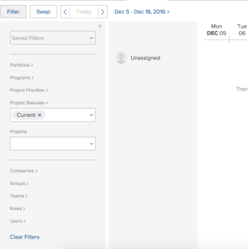

# 在“计划”区域中筛选信息

>[!IMPORTANT]
>  
>自2023年1月的23.1版本开始，本文中描述的计划功能已弃用并从Adobe Workfront中删除。   
>  
>  2023年初23.1版发布后不久，也将删除本文。 此时，我们建议您相应地更新任何书签。 
> 
> 您现在可以使用负载平衡器来计划资源的工作。 
>  
> 有关使用工作负载平衡器计划资源的信息，请参阅一节 [工作负载平衡器](../../resource-mgmt/workload-balancer/workload-balancer.md). 

<!-- 

>[!CAUTION] 
> 
> 
> The information in this article refers to the Adobe Workfront's Scheduling tools. The Scheduling areas have been removed from the Preview environment and will be removed from the Production environment in **January 2023**.   
>  Instead, you can schedule resources in the Workload Balancer.  
> 
>*  For information about scheduling resources using the Workload Balancer, see the section [The Workload Balancer](../../resource-mgmt/workload-balancer/workload-balancer.md). 
> 
>*  For more information about the deprecation and removal of the Scheduling tools, see [Deprecation of Resource Scheduling tools in Adobe Workfront](../../resource-mgmt/resource-mgmt-overview/deprecate-resource-scheduling.md). 
-->

<!--

(SEVERAL SECTIONS BELOW LINKED TO THE PRODUCT. SEE NOTES

-->

使用“资源计划”区域中的过滤器，可以确定在计划时间轴上显示哪些工作项。 这包括在“未分配”区域中显示哪些任务和问题，以及显示哪些用户。

在开始按照本节所述过滤内容之前，请熟悉资源计划在Adobe Workfront中的工作方式。\
有关Workfront中资源计划的信息，请参阅文章 [资源计划入门](../../resource-mgmt/resource-scheduling/get-started-resource-scheduling.md).\
有关计划时间轴的更多信息，请参阅文章 [资源计划入门](../../resource-mgmt/resource-scheduling/get-started-resource-scheduling.md).

您可以为您是资源管理员的任何项目计划资源或单个团队，或为其计划资源或团队。

## 访问要求

您必须具备以下条件：

<table style="table-layout:auto"> 
 <col> 
 <col> 
 <tbody> 
  <tr> 
   <td role="rowheader">Adobe Workfront计划*</td> 
   <td> 
任意
 </td> 
  </tr> 
  <tr> 
   <td role="rowheader">Adobe Workfront许可证*</td> 
   <td> 
工作或更高
 </td> 
  </tr> 
  <tr> 
   <td role="rowheader">访问级别*</td> 
   <td> 
查看对项目、任务和问题的访问权限或更高权限
 
<b>注释</b>

如果您仍然没有访问权限，请咨询Workfront管理员，他们是否在您的访问级别设置了其他限制。 有关Workfront管理员如何更改访问级别的信息，请参阅 <a href="../../administration-and-setup/add-users/configure-and-grant-access/create-modify-access-levels.md" class="MCXref xref">创建或修改自定义访问级别</a>.
 </td>
</tr> 
  <tr> 
   <td role="rowheader">对象权限</td> 
   <td> 
查看项目、任务和问题的权限或更高权限
 
有关请求其他访问权限的信息，请参阅 <a href="../../workfront-basics/grant-and-request-access-to-objects/request-access.md" class="MCXref xref">请求对对象的访问 </a>.
 </td> 
  </tr> 
 </tbody> 
</table>

*要了解您拥有的计划、许可证类型或访问权限，请联系您的Workfront管理员。

<!--

(NOTE: sections below - LINKED TO THE ui. DO NOT RENAME/ DELETE)

-->

## 在“计划”部分中创建过滤器（适用于团队）

您在筛选器中定义的项目、用户和角色中的任务和问题将显示在“工作原因”选项卡的计划时间线中。 使用筛选器中的选项来确定在计划时间轴中表示的项目、用户和角色。

>[!NOTE]
>
>无法在“工作”选项卡中保存过滤器（适用于团队）。 刷新页面或从页面导航离开页面时，过滤器会还原为默认设置。

要在团队的工作方式选项卡上为计划时间轴创建过滤器，请执行以下操作：

1. 单击 **主菜单** 图标  在Workfront的右上角，单击 **团队**，选择团队，单击 **工作负载平衡器** 在左侧面板中，选择 **计划** 从左上角的下拉菜单中。
1. 单击 **过滤器**.
1. 通过指定以下信息，确定哪些项目在“未分配”区域中表示：

   <!--
   
(NOTE: Alina: there was a note that [This step is linked to from the context-sensitive help] but I could not find from where in the UI it is linked.)&nbsp;

   -->

   * **项目优先级：** 选择要在计划时间表中显示的项目的优先级。 具有您选择的优先级的项目中的任务和问题将显示在计划时间表中。\
      只有包含分配给团队的任务或问题的项目中的优先级才能从此菜单中选择。
   * **项目状态：** 选择要在计划时间表中显示的项目的状态。 具有您选择的状态的项目中的任务和问题将显示在计划时间轴上。\
      只有包含分配给团队的任务或问题的项目中的状态才能从此菜单中选择。
   * **项目：** 选择要在计划时间表中显示的任何项目。 您选择的项目中的任务和问题将显示在计划时间轴上。\
      您在以前字段中所做的选择决定了可供选择的项目。\
      只有包含分配给团队的任务或问题的项目才可从此菜单中选择。

1. 通过指定以下信息来确定在计划时间轴上显示哪些用户。 默认情况下，将显示所有团队成员。

   <!--
   
(NOTE: this step is linked in the UI.)

   -->

   * **角色：** 选择要在计划时间轴中表示的角色。\
      只有分配给该角色的任务才会显示在“未分配”区域中。 只会显示具有您选择的角色且能够分配这些任务的用户。\
      用户显示在按作业角色组织的计划时间轴上。
   * **用户：** 选择要在计划时间轴上显示的个人用户。\
      无论用户是否具有与“未分配”区域中任务的角色分配相匹配的角色分配，都只会显示您选择的用户。\
      此选项不影响“未分配”区域中显示的任务和问题。

      <!--   
     
(NOTE: Alina: [! Users with Plan, Work, or Review licenses are available. Users with Request licenses are not available. - This is what it used to say. I think now instead you select specific users, not license types.])
   
     -->

1. （可选）要进一步修改计划时间轴（例如更改日期范围），并修改用户分配，请参阅文章 [在“计划”区域中手动分配未分配的任务和问题](../../resource-mgmt/resource-scheduling/manually-assign-items-scheduling-areas.md).

<!--

(NOTE: below - LINKED TO THE UI, DO NOT RENAME/ DELETE/ CHANGE)

-->

## 在“计划”部分中创建和修改过滤器（适用于多个项目）

您可以创建新过滤器、应用之前创建的过滤器、修改之前创建的过滤器或删除过滤器。 您无法与其他用户共享您创建的过滤器。

* [在“计划”部分（针对项目）中创建过滤器](#create-a-filter-in-the-scheduling-section-for-projects)
* [应用保存的过滤器](#apply-a-saved-filter)
* [修改保存的过滤器](#modify-a-saved-filter)
* [删除保存的过滤器](#delete-a-saved-filter)

### 在“计划”部分（针对项目）中创建过滤器 {#create-a-filter-in-the-scheduling-section-for-projects}

<!--

(NOTE: *****LINKED TO THE PRODUCT FROM THE GLOBAL SCHEDULER >> BOTH THE FIRST AND THE SECOND AREAS) 

-->

您在筛选器中定义的项目、用户和角色中的任务和问题将显示在“计划”选项卡的计划时间线上。 使用筛选器中的选项来确定在计划时间轴中表示的项目、用户和角色。

要在“计划”选项卡上为多个项目的计划时间轴创建过滤器，请执行以下操作：

1. 单击 **主菜单** 图标  在Workfront的右上角，单击 **资源配置>工作负载平衡器**，然后选择 **计划** 中。
1. 单击 **过滤器**.\
   

1. 离开 **保存的过滤器** 字段。
1. 通过指定以下信息，确定哪些项目在“未分配”区域中表示：

   <!--
   
(NOTE: Alina: this step is linked in the UI.) 

   -->

   * **Portfolio:** 选择包含您希望在计划时间表中显示的项目和项目的任何项目组合。

      只有您选择的项目组合中的项目才能在 **项目** 字段。

   * **程序：** 选择包含您希望在计划时间表中显示的项目的任何项目。\
      在 **Portfolio** 字段会确定可供选择的项目。\
      只有您选择的项目中的项目才能在 **项目** 字段。

   * **项目优先级：** 选择要在计划时间表中显示的项目的优先级。\
      只有具有您选择的优先级的项目才会显示出来。

   * **项目状态：** 选择要在计划时间表中显示的项目的状态。\
      只有具有您选择的状态的项目才会显示。

   * **项目公司：** 仅当任务和问题属于与您选择的公司匹配的项目时，它们才会显示在计划时间轴上。

   * **项目组：** 仅当任务和问题属于与您选择的组匹配的项目时，它们才会显示在计划时间轴上。

   * **项目：** 选择要在计划时间表中显示的任何项目。 您选择的项目中的任务和问题将显示在计划时间轴上。\
      您在以前字段中所做的选择决定了可供选择的项目。\
      您选择的项目中的任务和问题将显示在计划时间轴上。 只有包含分配给团队的任务或问题的项目才可从此菜单中选择。

1. 通过指定以下信息，确定在计划时间线上显示哪些用户：(默认情况下，只显示有资格从“未分配”区域分配任务或问题的用户。 选择单个用户时，无论用户是否有资格从“未分配”区域分配任务或问题，这些用户都会显示在计划时间轴上。) 

   <!--
   
(NOTE: Alina: this step had a note that it is linked in the UI but I could not find from where.) 

   -->

   * **用户公司：** 利用此字段，可限制其他公司的用户在计划时间线上显示。\
      如果希望添加任何公司的用户，请将此字段留空。 如果指定单个公司，则只能将这些公司的用户添加到计划时间轴。 指定公司不会自动将该公司的用户添加到计划时间轴。 请改用下面的字段来添加特定用户。\
      此选项不影响“未分配”区域中显示的任务和问题。****

   * **用户组：** 您指定的任何用户组中的所有用户都将显示在计划时间线上。

   * **团队：** 您指定的任何团队的所有用户都会显示在计划时间线上。\
      此选项不影响“未分配”区域中显示的任务和问题。

   * **角色：** 选择要在计划时间轴中表示的角色。\
      只有分配给该角色的任务才会显示在“未分配”区域中。 只会显示具有您选择的角色且能够分配这些任务的用户。\
      用户显示在按作业角色组织的计划时间轴上。

   * **用户：** 选择要在计划时间轴上显示的个人用户。\
      无论用户是否具有与“未分配”区域中任务的角色分配相匹配的角色分配，都只会显示您选择的用户。\
      此选项不影响“未分配”区域中显示的任务和问题。
   <!--
   
NOTE: [! Users with Plan, Work, or Review licenses are available. Users with Request licenses are not available. - This is what it used to say. I think now instead you select specific users, not license types.]) 

   -->

1. 单击 **保存新过滤器**.\
   您的数据显示在计划时间轴上。

1. （可选）要进一步修改计划时间轴（例如更改日期范围），并修改用户分配，请参阅文章 [在“计划”区域中手动分配未分配的任务和问题](../../resource-mgmt/resource-scheduling/manually-assign-items-scheduling-areas.md).

### 应用保存的过滤器 {#apply-a-saved-filter}

>[!NOTE]
>
>此选项仅在计划多个项目的资源时才适用（从“计划”选项卡）；在计划团队资源时（从“工作地点”选项卡），或在计划单个项目的资源时（从“人员配备”选项卡），您无法应用保存的过滤器。

您可以应用之前创建的过滤器。

要对多个项目应用保存的过滤器，请执行以下操作：

1. 单击 **主菜单** 图标  在Workfront的右上角，单击 **资源配置>工作负载平衡器**，然后选择 **计划** 中。
1. 单击 **过滤器**.
1. 在 **保存的过滤器** 字段中，选择要应用的过滤器。\
   您的数据显示在计划时间轴上。

1. （可选）要进一步修改计划时间轴（例如更改日期范围），并修改用户分配，请参阅文章 [在“计划”区域中手动分配未分配的任务和问题](../../resource-mgmt/resource-scheduling/manually-assign-items-scheduling-areas.md).

### 修改保存的过滤器 {#modify-a-saved-filter}

>[!NOTE]
>
>此选项仅在计划多个项目的资源时才适用（从“计划”选项卡）；在计划团队的资源（从“工作”选项卡）或计划单个项目的资源（从“人员配备”选项卡）时，您无法修改保存的过滤器。

您可以修改之前创建的过滤器。

要修改多个项目的已保存过滤器，请执行以下操作：

1. 单击 **主菜单** 图标  在Workfront的右上角，单击 **资源配置>工作负载平衡器**，然后选择 **计划** 中。
1. 单击 **过滤器**.
1. 在 **保存的过滤器** 字段，请从下拉列表中选择要修改的过滤器。
1. 指定要在计划时间轴上显示的数据。
1. 单击&#x200B;**保存**。\
   您的数据显示在计划时间轴上。

1. （可选）要进一步修改计划时间轴（例如更改日期范围），并修改用户分配，请参阅文章 [在“计划”区域中手动分配未分配的任务和问题](../../resource-mgmt/resource-scheduling/manually-assign-items-scheduling-areas.md).

### 删除保存的过滤器 {#delete-a-saved-filter}

>[!NOTE]
此选项仅在计划多个项目的资源时才适用（从“计划”选项卡）；在计划团队的资源时（从“工作”选项卡）或计划单个项目的资源时（从“人员配备”选项卡），您无法删除保存的过滤器。

您可以删除之前创建的过滤器。

1. 单击 **主菜单** 图标  在Workfront的右上角，单击 **资源配置>工作负载平衡器**，然后选择 **计划** 中。
1. 单击 **过滤器**.
1. 在 **保存的过滤器** 字段中，在下拉列表中，单击要删除的过滤器旁边的(x)。 

## 在“计划”部分中创建和修改过滤器（适用于单个项目）

<!--

(NOTE: **** LINKED FROM THE PRODUCT FROM THE PROJECT> STAFFING> SCHEDULING AREA) 

-->

您在过滤器中定义的用户、团队和角色的任务和问题将显示在“人员配备”选项卡的计划时间线上。 使用筛选器中的选项来确定在计划时间轴中表示的用户、团队和角色。

>[!NOTE]
您无法在“人员配备”选项卡中保存过滤器（用于单个项目）。 刷新页面或从页面导航离开页面时，过滤器会还原为默认设置。

要在“人员配备”选项卡上为单个项目的计划时间表创建过滤器，请执行以下操作：

1. 转到项目，单击 **工作负载平衡器** ，然后选择 **计划** 从左上角的下拉菜单中。
1. 通过指定以下信息，确定在计划时间线上显示哪些用户：(默认情况下，只显示有资格从“未分配”区域分配任务或问题的用户。 选择单个用户时，无论用户是否有资格从“未分配”区域分配任务或问题，这些用户都会显示在计划时间轴上。) 

   <!--
   
(NOTE: Alina: [This step is linked to from the context-sensitive help])  

   -->

   * **用户公司：** 利用此字段，可限制其他公司的用户在计划时间线上显示。\
      如果希望添加任何公司的用户，请将此字段留空。 如果指定单个公司，则只能将这些公司的用户添加到计划时间轴。 指定公司不会自动将该公司的用户添加到计划时间轴。 请改用下面的字段来添加特定用户。\
      此选项不影响“未分配”区域中显示的任务和问题。

   * **用户组：** 您指定的任何用户组中的所有用户都将显示在计划时间线上。

   * **团队：** 您指定的任何团队的所有用户都会显示在计划时间线上。\
      此选项不影响“未分配”区域中显示的任务和问题。

   * **角色：** 选择要在计划时间轴中表示的角色。\
      只有分配给该角色的任务才会显示在“未分配”区域中。 只会显示具有您选择的角色且能够分配这些任务的用户。\
      用户显示在按作业角色组织的计划时间轴上。

   * **用户：** 选择要在计划时间轴上显示的个人用户。\
      无论用户是否具有与“未分配”区域中任务的角色分配相匹配的角色分配，都只会显示您选择的用户。\
      此选项不影响“未分配”区域中显示的任务和问题。
   <!--
   
(NOTE: [! Users with Plan, Work, or Review licenses are available. Users with Request licenses are not available. - This is what it used to say. I think now instead you select specific users, not license types.]) 

   -->
