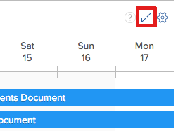

# 资源计划入门

>[!IMPORTANT]
>  
>自2023年1月的23.1版本开始，本文中描述的计划功能已弃用并从Adobe Workfront中删除。   
>  
>  2023年初23.1版发布后不久，也将删除本文。 此时，我们建议您相应地更新任何书签。 
> 
> 您现在可以使用负载平衡器来计划资源的工作。 
>  
> 有关使用工作负载平衡器计划资源的信息，请参阅一节 [工作负载平衡器](../../resource-mgmt/workload-balancer/workload-balancer.md). 

<!--  

>[!CAUTION] 
> 
> 
> The information in this article refers to the Adobe Workfront's Scheduling tools. The Scheduling areas have been removed from the Preview environment and will be removed from the Production environment in **January 2023**.   
>  Instead, you can schedule resources in the Workload Balancer.  
> 
>*  For information about scheduling resources using the Workload Balancer, see the section [The Workload Balancer](../../resource-mgmt/workload-balancer/workload-balancer.md). 
> 
>*  For more information about the deprecation and removal of the Scheduling tools, see [Deprecation of Resource Scheduling tools in Adobe Workfront](../../resource-mgmt/resource-mgmt-overview/deprecate-resource-scheduling.md). 
-->

<!--

(NOTE: LINKED TO THE PRODUCT FROM: ALL SCHEDULING TOOLS: GLOBAL, TEAM, PROJECT STAFFING *** LINKED TO LOTS OF ARTICLES, AS WELL!) 

(NOTE: Alina: this article should be divided in multiple articles, but CAREFULLY because some sections are linked to the UI)

-->

在Adobe Workfront中使用资源计划功能时，您可以更轻松地将任务和问题分配给相应的用户。 您可以考虑作业角色和用户可用性，确定哪些用户能够完成任务或问题。

以下各节提供了有关在Workfront中使用计划区域的更多详细信息。

## 在Workfront中使用计划工具的先决条件

>[!IMPORTANT]
>
>本文中介绍的先决条件仅适用于Workfront的计划区域。 有关使用工作负载平衡器的最佳实践的信息，请参阅 [工作负载平衡器概述](../../resource-mgmt/workload-balancer/overview-workload-balancer.md).

要成功使用Workfront中的资源计划功能，您必须首先确保您、您的项目以及任务和问题满足以下先决条件：

* [用户先决条件](#user-prerequisites)
* [项目先决条件](#project-prerequisites)
* [任务和问题先决条件](#task-and-issue-prerequisites)

### 用户先决条件 {#user-prerequisites}

在满足以下每个条件时，您可以使用“计划”选项卡、“人员配备”选项卡或“工作方式”选项卡中提供的资源计划工具：

**在将资源计划为资源管理器时（从“计划”选项卡）：**

* 对于要为其管理资源的项目，您将被指定为资源管理器。

   有关为项目指定资源管理器的详细信息，请参阅文章 [为项目或模板指定资源管理器](../../manage-work/projects/planning-a-project/designate-resource-managers-for-projects-and-templates.md).

* 您是拥有计划许可证的用户。

默认情况下，仅当用户在系统中定义了作业角色（主作业角色或辅助作业角色），并且该作业角色与分配给当前在 **未分配** 的上方。 您可以禁用此功能，以便允许将任务和问题分配给任何用户，而不管该用户在其用户配置文件中定义的角色是否与分配给他们的任务或问题的角色分配相匹配。 有关更多信息，请参阅文章 [在“计划”区域中，不考虑角色和组成员资格，允许用户分配](../../resource-mgmt/resource-scheduling/assignments-regardless-of-role-or-group-scheduling-areas.md).

默认情况下，只能为在其用户配置文件中定义了与分配给任务或问题的角色分配相匹配的角色的用户分配分配。

**在将资源安排为项目团队成员时（从项目的“人员配备”选项卡）：**

* 您有权查看、贡献或管理项目
* 您拥有计划或工作许可证

<!--
<note type="note">  If Workfront has not removed the Use New Scheduling Area option from your Scheduling settings, users must have a Plan license and Manage permissions to the project to view the Scheduling timeline. For more information about the removal of the Use New Scheduling Area option, see the article
<a href="../../product-announcements/announcements/announcement-archive/replace-flash-tools.md" class="MCXref xref">Replacement of Flash-based tools in Adobe Workfront</a>.
</note>
-->

**在将资源安排为团队成员时（从“工作方式”选项卡）：**

* 您是团队成员\
   团队的所有成员都显示在计划时间线上。 分配给团队且未分配给用户的任务和问题将显示在“未分配”区域中。 分配给团队和团队中的用户的任务和问题显示在分配给他们的用户的行中。

### 项目先决条件 {#project-prerequisites}

本节中描述的项目先决条件仅在从计划时间轴将资源计划为资源管理器时适用。

您管理的项目必须处于以下状态之一（或状态等于其中一种状态），才能在计划时间轴上显示这些项目中的工作项目：计划、当前或已批准。 默认情况下，仅显示处于“当前”状态的项目。

有关项目状态的更多信息，请参阅文章 [创建或编辑状态](../../administration-and-setup/customize-workfront/creating-custom-status-and-priority-labels/create-or-edit-a-status.md).

<!--

(NOTE: [! I assume this doesn't apply when using the Staffing tab on a single project? The project can be in whatever status?]) 

-->

### 任务和问题先决条件 {#task-and-issue-prerequisites}

为了在Workfront中使用资源计划工具时最有效，请确保系统中的任务和问题已定义以下标准：

* 持续时间
* 计划开始日期
* 计划小时\
   要修改用户分配，需要计划小时数，如文章中所述 [在“计划”区域中管理用户分配](../../resource-mgmt/resource-scheduling/manage-allocations-scheduling-areas.md).

   >[!NOTE]
   >
   >“资源计划”卡中的“计划小时数”字段实际显示所有workPerDay值的总和，而不是任务上的“计划小时数”。 workPerDay值是通过将计划小时数值除以任务持续时间来计算的。 对于非零持续时间，值通常与任务的计划小时数匹配，但可能会因舍入而出现一些小差异。 当持续时间为0天时，“计划小时数”显示为0小时。

* 角色分配

## 在计划区域中查看信息

* [在“计划”区域中查找和查看信息](#locate-and-view-information-in-the-scheduling-areas)
* [查看资源分配和详细信息](#view-resource-assignments-and-details)
* [最大限度地减少计划区域中的任务和问题](#minimize-tasks-and-issues-on-the-scheduling-areas)
* [调整计划区域的日期范围](#adjust-the-date-range-of-the-scheduling-areas)

### 在“计划”区域中查找和查看信息 {#locate-and-view-information-in-the-scheduling-areas}

根据您计划资源的位置，您可以在Workfront的以下区域中访问计划时间轴：

* 对于多个项目，在“计划”区域
* 对于“计划”部分中的项目
* 对于团队，在计划部分

1. 转到多个项目、单个项目或团队的计划时间轴：

   * **对于多个项目**:  单击 **主菜单** 图标  在Workfront的右上角，单击 **资源配置>工作负载平衡器**，然后选择 **计划** 中。
   * **对于单个项目**:转到项目，单击 **工作负载平衡器** ，然后选择 **计划** 从左上角的下拉菜单中。
   * **对于团队**:单击 **主菜单** 图标  在Workfront的右上角，单击 **团队**，选择团队，单击 **工作负载平衡器** 在左侧面板中，选择 **计划** 从左上角的下拉菜单中。

1. （可选）单击 **全屏** 图标（位于计划时间轴的右上角）。\
   \
   计划时间轴以全屏模式显示。 以全屏模式查看计划时间轴时，计划时间轴占据整个屏幕；所有其他信息都是隐藏的（包括任何团队或项目信息、全局导航栏和浏览器信息）。

1. （可选）要退出全屏模式，请执行以下任一操作：

   * 单击 **全屏** 图标。
   * 按Esc键。

### 查看资源分配和详细信息 {#view-resource-assignments-and-details}

您可以查看当前资源分配以及有关计划时间轴上各个任务和问题的其他详细信息。

1. 转到多个项目、单个项目或团队的计划时间轴：

   * **对于多个项目**:  单击 **主菜单** 图标  在Workfront的右上角，单击 **资源配置>工作负载平衡器**，然后选择 **计划** 中。
   * **对于单个项目**:转到项目，单击 **工作负载平衡器** ，然后选择 **计划** 从左上角的下拉菜单中。
   * **对于团队**:单击 **主菜单** 图标  在Workfront的右上角，单击 **团队**，选择团队，单击 **工作负载平衡器** 在左侧面板中，选择 **计划** 从左上角的下拉菜单中。

1. （可选）要自定义在计划时间轴上显示的内容，请创建过滤器，如 [在“计划”区域中筛选信息](../../resource-mgmt/resource-scheduling/filter-scheduling-area.md).
1. 展开任务或问题以查看以下信息：

   * **项目：** 任务所在项目的名称和链接。

   * **日期：** 与任务关联的开始日期和到期日期。

   * **计划时数：** 与任务关联的计划小时数。\
      仅当任务被分配给用户或作业角色时，才会显示计划小时数。

   * **前置图标：** 任何与任务关联的前任。 仅当存在与任务关联的前置任务时，才会显示前置任务图标。 前置任务完成且任务准备就绪后，前置任务图标将绿色。

   * **分配：** 与任务关联的任何用户或作业角色分配。 职务角色分配显示在用户分配旁边的括号中。\
      未显示团队分配。\
      如果您对任务或问题具有Contribute访问权限，则可以修改任务或问题持续时间内每天分配用户的小时数。 有关修改用户分配的详细信息，请参阅文章 [在“计划”区域中管理用户分配](../../resource-mgmt/resource-scheduling/manage-allocations-scheduling-areas.md).

### 最大限度地减少计划区域中的任务和问题 {#minimize-tasks-and-issues-on-the-scheduling-areas}

最大限度地减少任务和问题允许您在单个屏幕上查看大量用户的用户分配。\
默认情况下，计划时间轴上的所有任务和问题都将最小化。

当任务和问题最小化时，您可以：

* 查看任务持续时间
* 查看项目颜色
* 将“未分配”区域中的任务分配给计划时间轴上的用户

当任务和问题最小化时，您无法：

* 查看任务名称
* 将已分配给用户的任务拖动并重新分配它们
* 展开任务以查看详细信息

如果启用“显示每日计划时间的总计”设置，则在任务和问题最小化时，您只能：

* 查看每个用户的每日计划小时总数。

当您按照本节所述最小化任务和问题时，这些更改将仅向您显示。 任务和问题在您展开之前或在您结束浏览器会话之前保持最小化。 （刷新页面不会将最小化的任务和问题还原到扩展状态。）

在计划时间轴上，您可以最大限度地减少为单个用户、作业角色或所有用户显示的任务和问题。

* [最大限度地减少单个用户的任务和问题](#minimize-tasks-and-issues-for-individual-users)
* [最小化作业角色的任务和问题](#minimize-tasks-and-issues-for-a-job-role)
* [最大限度地减少所有用户的任务和问题](#minimize-tasks-and-issues-for-all-users)

#### 最大限度地减少单个用户的任务和问题 {#minimize-tasks-and-issues-for-individual-users}

1. 单击计划时间轴上用户旁边的脱字符号，您希望最小化其任务和问题。\
   \
   任务和问题的显示方式取决于以下设置：

   * 如果启用 **显示每日计划时数的合计** 适用以下条件：

      * 仅显示用户的计划小时数
      * 任务和问题是隐藏的
   * 如果启用 **显示每日计划时数的合计** 用户的任务和问题将最小化。\
      

#### 最小化作业角色的任务和问题 {#minimize-tasks-and-issues-for-a-job-role}

您可以最大限度地减少与特定作业角色关联的所有用户的任务和问题。

1. 在计划时间轴上单击作业角色旁边的脱字符号，其中包含要最小化其任务和问题的用户。\
   \
   如果禁用 **显示每日计划时数的合计** 设置。\
   任务和问题将处于隐藏状态，并且只有启用此设置时，才会显示用户的计划时数。\
   

#### 最大限度地减少所有用户的任务和问题 {#minimize-tasks-and-issues-for-all-users}

1. 单击 **全部折叠** ，您可以在Advertising Cloud中找到该页面。\
   \
   或\
   按住Shift键的同时，单击计划时间轴上任何用户或作业角色旁边的脱字符号。\
   \
   如果禁用 **显示每日计划时数的合计** 如果启用，则会隐藏任务和问题。\
   如果 **显示每日计划时数的合计** 仅为用户显示的计划小时数启用。 对于“未分配”区域，任务和问题仍保持最小化。\
   

### 调整计划区域的日期范围 {#adjust-the-date-range-of-the-scheduling-areas}

默认情况下，从当天开始，计划时间轴中会显示连续14天（包括周末）。

使用以下任意选项修改计划时间轴上显示数据的日期范围：

* **日期范围选项：** 单击当前日期范围，然后选择要在时间轴上显示的周数。 您可以显示“日”（单日）、“1周”（7天）、“2周”（14天）、“3周”（21天）、“4周”（28天）或“6周”（42天）。\
   调整计划时间轴的日期范围时，请考虑以下事项：

   * 您选择的日期范围选项将在您下次访问计划时间轴时保留。

      <!--   
     
(NOTE: [! Not sure if this is going to apply to all 3 scheduling areas...]) 
   
     -->

   * 在“日”视图中查看计划时间轴时，不显示用户分配。\
      

* **日历：** 单击当前日期范围，然后单击当前日期之前或之后的日期。 当天与选定日期之间的时间是新范围。\
   

* **今天：** 单击此选项可显示当天。 然后，在日期范围的最左侧显示当天。\
   单击左箭头和右箭头可查看过去或未来日期。

   >[!NOTE]
   >
   >刷新页面时，将保留您选择的时间范围。

   

* **拖放日期范围：** 将日期范围拖动到计划时间轴的顶部。\
   

## 在“计划”区域中配置设置

默认情况下，某些信息会显示在计划时间轴中。 您还可以配置设置以显示其他信息。

有关在计划时间轴中配置设置的信息，请参阅以下文章：

[在“计划”区域中配置设置](../../resource-mgmt/resource-scheduling/configure-settings-scheduling-areas.md)

[在“计划”区域中，不考虑角色和组成员资格，允许用户分配](../../resource-mgmt/resource-scheduling/assignments-regardless-of-role-or-group-scheduling-areas.md)

[在“计划”区域中自动分配未分配的任务和问题](../../resource-mgmt/resource-scheduling/automatically-assign-items-scheduling-areas.md)

## 在计划区域中筛选信息

您可以通过创建过滤器来定义计划时间轴上显示的内容。

有关更多信息，请参阅文章 [在“计划”区域中筛选信息](../../resource-mgmt/resource-scheduling/filter-scheduling-area.md).

## 修改用户分配和分配

* [修改用户分配](#modify-user-assignments)
* [修改用户分配](#modify-user-allocations)

### 修改用户分配 {#modify-user-assignments}

您可以通过使用交换工具或直接从计划时间轴修改任务和问题，从“计划”选项卡（在计划项目资源时）修改用户分配。 您可以通过直接从计划时间轴修改任务和问题，从“工作”选项卡（为团队计划资源时）修改用户分配。

有关更多信息，请参阅文章 [在“计划”区域中手动分配未分配的任务和问题](../../resource-mgmt/resource-scheduling/manually-assign-items-scheduling-areas.md).

### 修改用户分配 {#modify-user-allocations}

您可以确定如何将任务或问题的计划时间分配给用户。 计划时数可按以下方式划分：

* 在分配给任务或问题的用户中。
* 任务或问题的整个持续时间。

有关更多信息，请参阅文章 [在“计划”区域中管理用户分配](../../resource-mgmt/resource-scheduling/manage-allocations-scheduling-areas.md).
