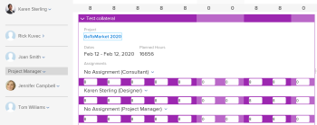

# 在“计划”区域中手动分配未分配的任务和问题

>[!IMPORTANT]
>  
>自2023年1月的23.1版本开始，本文中描述的计划功能已弃用并从Adobe Workfront中删除。   
>  
>  2023年初23.1版发布后不久，也将删除本文。 此时，我们建议您相应地更新任何书签。 
> 
> 您现在可以使用负载平衡器来计划资源的工作。 
>  
> 有关使用工作负载平衡器计划资源的信息，请参阅一节 [工作负载平衡器](../../resource-mgmt/workload-balancer/workload-balancer.md). 

<!-- 

>[!CAUTION] 
> 
> 
> The information in this article refers to the Adobe Workfront's Scheduling tools. The Scheduling areas have been removed from the Preview environment and will be removed from the Production environment in **January 2023**.   
>  Instead, you can schedule resources in the Workload Balancer.  
> 
>*  For information about scheduling resources using the Workload Balancer, see the section [The Workload Balancer](../../resource-mgmt/workload-balancer/workload-balancer.md). 
> 
>*  For more information about the deprecation and removal of the Scheduling tools, see [Deprecation of Resource Scheduling tools in Adobe Workfront](../../resource-mgmt/resource-mgmt-overview/deprecate-resource-scheduling.md). 
-->

使用计划时间轴，除了指定每个用户为工作项分配的时间外，您还可以管理用户分配。

## 访问要求

您必须具备以下条件：

<table style="table-layout:auto"> 
 <col> 
 <col> 
 <tbody> 
  <tr> 
   <td role="rowheader">Adobe Workfront计划*</td> 
   <td> 
任意
 </td> 
  </tr> 
  <tr> 
   <td role="rowheader">Adobe Workfront许可证*</td> 
   <td> 
工作或更高
 </td> 
  </tr> 
  <tr> 
   <td role="rowheader">访问级别*</td> 
   <td> 
查看或更高程度地访问项目、任务和问题
 
<b>注释</b>

如果您仍然没有访问权限，请咨询Workfront管理员，他们是否在您的访问级别设置了其他限制。 有关Workfront管理员如何更改访问级别的信息，请参阅 <a href="../../administration-and-setup/add-users/configure-and-grant-access/create-modify-access-levels.md" class="MCXref xref">创建或修改自定义访问级别</a>.
 </td>
</tr> 
  <tr> 
   <td role="rowheader">对象权限</td> 
   <td> 
对项目、任务和问题拥有权限
 
有关请求其他访问权限的信息，请参阅 <a href="../../workfront-basics/grant-and-request-access-to-objects/request-access.md" class="MCXref xref">请求对对象的访问 </a>.
 </td> 
  </tr> 
 </tbody> 
</table>

*要了解您拥有的计划、许可证类型或访问权限，请联系您的Workfront管理员。

## 在计划时间轴中分配任务和问题之前的先决条件

在开始按照本节所述管理用户分配之前，请熟悉资源计划在Workfront中的工作方式，如 [资源计划入门](../../resource-mgmt/resource-scheduling/get-started-resource-scheduling.md).

要按照本节所述成功管理用户分配，您必须首先确保您、您的项目以及任务和问题满足 [在Workfront中使用计划工具的先决条件](../../resource-mgmt/resource-scheduling/get-started-resource-scheduling.md#prerequisites) 章节 [资源计划入门](../../resource-mgmt/resource-scheduling/get-started-resource-scheduling.md).

以下各节介绍如何手动、自动或通过按用户或角色交换分配来修改用户分配。

## 手动为用户分配未分配的任务或问题

计划时间表提供了用户能够完成任务或问题的所需可见性。\
有关计划时间轴的更多信息，请参阅 [资源计划入门](../../resource-mgmt/resource-scheduling/get-started-resource-scheduling.md).

您可以从Workfront的以下区域在计划时间轴上为用户分配单个任务和问题：

* 资源调度下的“计划”部分（为多个项目计划资源时）。
* 项目下的“计划”部分（为单个项目计划资源时）。
* 团队下的“计划”部分（为团队安排资源时）。

在计划时间轴顶部的“未分配”区域中显示的信息会因您使用资源计划的Workfront区域(与“计划”部分（为多个项目计划资源时）、“计划”部分（为单个项目计划资源时）或“计划”部分（为团队计划资源时）不同。 有关更多信息，请参阅 [“计划”区域中可用的功能](../../resource-mgmt/resource-scheduling/overview-scheduling-areas.md#functionality-available-in-the-scheduling-area) 在文章中 [计划区域概述](../../resource-mgmt/resource-scheduling/overview-scheduling-areas.md).

根据您在Workfront中查看计划时间轴的区域，只有某些用户有资格被分配工作。 有关更多信息，请参阅 [计划区域概述](../../resource-mgmt/resource-scheduling/overview-scheduling-areas.md).

要在计划时间线上向用户分配未分配的任务或问题，请执行以下操作：

1. 转到多个项目、单个项目或团队的计划时间轴：

   * **对于多个项目**:  单击 **主菜单** 图标  在Workfront的右上角，单击 **资源配置>工作负载平衡器**，然后选择 **计划** 中。
   * **对于单个项目**:转到项目，单击 **工作负载平衡器** ，然后选择 **计划** 从左上角的下拉菜单中。
   * **对于团队**:单击 **主菜单** 图标  在Workfront的右上角，单击 **团队**，选择团队，单击 **工作负载平衡器** 在左侧面板中，选择 **计划** 从左上角的下拉菜单中。

   

1. （可选）创建过滤器以自定义在计划时间轴上显示的内容，如 [在“计划”区域中筛选信息](../../resource-mgmt/resource-scheduling/filter-scheduling-area.md) . [在“计划”区域中筛选信息](../../resource-mgmt/resource-scheduling/filter-scheduling-area.md). 例如，对于计划时间轴上显示的问题，您必须创建一个过滤器。

1. （可选）修改计划时间线上显示的日期范围，如 [调整计划区域的日期范围](../../resource-mgmt/resource-scheduling/get-started-resource-scheduling.md#adjusting-the-date-range-for-which-data-is-displayed) in [资源计划入门](../../resource-mgmt/resource-scheduling/get-started-resource-scheduling.md).

1. 执行以下操作以分配未分配的任务或问题：

   * 将任务或问题拖到要分配的用户行中。\
      给定用户每天最多显示10个任务。 您可以展开列表以查看当前分配给该用户的所有任务。 （在计划时间轴上进行分配后，可能会临时显示10个以上的任务。）\
      拖动项目时，会在释放任务或问题并完成分配之前显示以下信息：

   * 如果在计划时间轴上启用了用户分配，则如果完成分配会导致用户被过度分配，则会显示红色的过度分配指示器。\
      有关超额分配指标的更多信息，请参阅部分 [分配指标](../../resource-mgmt/resource-scheduling/manage-allocations-scheduling-areas.md#understanding-allocation-indicators) 在文章中 [在“计划”区域中管理用户分配](../../resource-mgmt/resource-scheduling/manage-allocations-scheduling-areas.md).

      如果 **将分配限制为具有匹配角色的用户** 选项，则不符合分配条件的用户将变灰。 如果禁用此选项，则所有用户都可以接收分配。 默认情况下，选项处于启用状态。\
      有关此选项的更多信息，请参阅  in [在“计划”区域中，不考虑角色和组成员资格，允许用户分配](../../resource-mgmt/resource-scheduling/assignments-regardless-of-role-or-group-scheduling-areas.md)

      用户的行中会显示一个拖放指示器。 这样，您就可以在进行分配之前，查看物料的分配位置。

      展开要分配的任务或问题，单击 **分配** 字段中，开始键入要分配的用户名称，然后在下拉列表中单击该用户的名称。\
      

1. （视情况而定）在将未分配的任务或问题分配给用户后，您可能需要调整计划时间表上用户之间的任务和问题的现有分配。 在计划项目资源时（在“计划”选项卡或“人员配备”选项卡上），只有具有相同任务角色的用户才能接收分配。\
   要将任务或问题重新分配给其他用户，请将任务从一个用户的行拖到另一个用户的行。
1. （可选）配置每个分配的用户分配到任务或问题的小时数，如 [在“计划”区域中管理用户分配](../../resource-mgmt/resource-scheduling/manage-allocations-scheduling-areas.md) .
