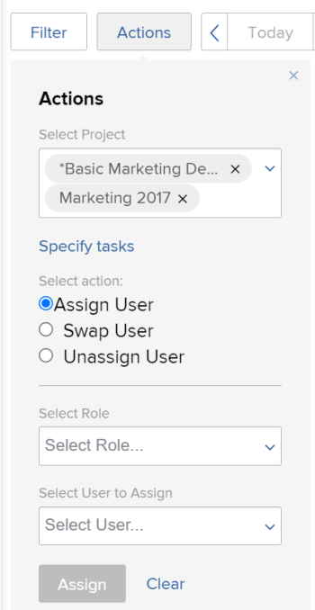

# 将多个用户分配修改为“计划”区域中的任务

>[!IMPORTANT]
>  
>自2023年1月的23.1版本开始，本文中描述的计划功能已弃用并从Adobe Workfront中删除。   
>  
>  2023年初23.1版发布后不久，也将删除本文。 此时，我们建议您相应地更新任何书签。 
> 
> 您现在可以使用负载平衡器来计划资源的工作。 
>  
> 有关使用工作负载平衡器计划资源的信息，请参阅一节 [工作负载平衡器](../../resource-mgmt/workload-balancer/workload-balancer.md). 

<!--   

>[!CAUTION] 
> 
> 
> The information in this article refers to the Adobe Workfront's Scheduling tools. The Scheduling areas have been removed from the Preview environment and will be removed from the Production environment in **January 2023**.  
>  Instead, you can schedule resources in the Workload Balancer.  
> 
>*  For information about scheduling resources using the Workload Balancer, see the section [The Workload Balancer](../../resource-mgmt/workload-balancer/workload-balancer.md). 
> 
>*  For more information about the deprecation and removal of the Scheduling tools, see [Deprecation of Resource Scheduling tools in Adobe Workfront](../../resource-mgmt/resource-mgmt-overview/deprecate-resource-scheduling.md). 

This article refers to modifying user assignments for multiple tasks using the Scheduling area of Adobe Workfront. Also see the following articles for modifying assignments on multiple tasks in other areas:

* For information about modifying assignments on multiple tasks in a task list, see [Modify multiple user assignments in a task list](../../manage-work/tasks/assign-tasks/modify-multiple-assignments-in-task-list.md). 
* For information about scheduling resources using the new Workload Balancer, see the section [The Workload Balancer](../../resource-mgmt/workload-balancer/workload-balancer.md).
-->
使用资源调度程序时，可以同时将用户分配给多个任务。

>[!NOTE]
>
>本文仅适用于为多个项目（从“计划”部分）或单个项目（从“计划”部分）计划资源时；在计划团队的资源时，您无法按此部分所述管理多个任务的用户分配（从“计划”部分）。

## 访问要求

您必须具备以下条件：

<table style="table-layout:auto"> 
 <col> 
 <col> 
 <tbody> 
  <tr> 
   <td role="rowheader">Adobe Workfront计划*</td> 
   <td> 
任意
 </td> 
  </tr> 
  <tr> 
   <td role="rowheader">Adobe Workfront许可证概述*</td> 
   <td> 
工作或更高
 </td> 
  </tr> 
  <tr> 
   <td role="rowheader">访问级别*</td> 
   <td> 
查看或更高程度地访问项目、任务和问题
 
<b>注意</b> 如果您仍然没有访问权限，请咨询Workfront管理员，他们是否在您的访问级别设置了其他限制。 有关Workfront管理员如何更改访问级别的信息，请参阅 <a href="../../administration-and-setup/add-users/configure-and-grant-access/create-modify-access-levels.md" class="MCXref xref">创建或修改自定义访问级别</a>.
 </td> 
  </tr> 
  <tr> 
   <td role="rowheader">对象权限</td> 
   <td> 
为更新的项目、任务和问题提供权限或更高权限
 
有关请求其他访问权限的信息，请参阅 <a href="../../workfront-basics/grant-and-request-access-to-objects/request-access.md" class="MCXref xref">请求对对象的访问 </a>.
 </td> 
  </tr> 
 </tbody> 
</table>

*要了解您拥有的计划、许可证类型或访问权限，请联系您的Workfront管理员。

## 在计划区域中进行多个分配的注意事项

您可以快速管理一个或多个项目中多个任务和问题的用户分配（更改随后会反映在计划时间轴中）。

您可以将用户分配到当前分配给作业角色的所有任务，在用户之间交换用户分配，或从所有任务中取消分配用户。

例如：

* 资源管理器负责对新项目进行用户分配。 项目最初创建为模板，并且作业角色已分配给项目中的各种任务。 资源管理器希望将特定用户分配给当前分配给作业角色的所有任务。
* Jackie Simms分配了3个不同项目的45项任务。 Jackie离开了组织，现在资源管理器需要将她的任务重新分配给其他用户。

>[!NOTE]
>
>在管理多个任务的用户分配时，请考虑以下限制：
>
>* 在为多个项目计划资源时，您管理的项目必须处于以下状态之一（或状态等于其中一种状态）：计划、当前或已批准。 有关项目状态的更多信息，请参阅 [创建或编辑状态](../../administration-and-setup/customize-workfront/creating-custom-status-and-priority-labels/create-or-edit-a-status.md).
>* 在计划单个项目的资源时，项目状态不会影响此功能的可用性。
>* 您可以使用以下许可证对用户进行资源更改：计划、工作和审阅。 您无法对具有请求许可证的用户进行资源更改。
>

## 管理一个或多个项目的用户分配

1. 转到多个项目或单个项目的计划时间轴：

   * **对于多个项目**:  单击 **主菜单** 图标  在Workfront的右上角，单击 **资源配置>工作负载平衡器**，然后选择 **计划** 中。
   * **对于单个项目**:转到项目，单击 **工作负载平衡器** ，然后选择 **计划** 从左上角的下拉菜单中。

1. 单击 **操作**.\
   

1. 在 **选择项目** 字段，根据您是查看多个项目（从“计划”选项卡）的计划时间轴，还是单个项目（从“人员配备”选项卡）的计划时间轴，执行以下任一操作：

   * **对于多个项目：** 开始键入要更改分配的项目名称，然后在下拉列表中显示该名称时单击该名称。 或者，单击下拉箭头从项目列表中进行选择。 重复此过程，以在多个项目中更改分配。\
      将此字段留空，以便对您担任资源管理器的所有项目进行分配更改。

      >[!NOTE]
      >
      >只有在以下情况下，才可选择项目：
      >
      >   
      >   
      >   * 您被指定为项目的资源经理\
         >     有关更多信息，请参阅 [为项目或模板指定资源管理器](../../manage-work/projects/planning-a-project/designate-resource-managers-for-projects-and-templates.md).
      >   
      >   * 项目处于以下状态之一（或状态等于其中一种状态）：计划、当前或已批准\
         >     有关项目状态的更多信息，请参阅 [创建或编辑状态](../../administration-and-setup/customize-workfront/creating-custom-status-and-priority-labels/create-or-edit-a-status.md).
      >   
      >   * 您是拥有计划许可证的用户。

   * **对于单个项目：** 的 **选择项目** 字段。 的 **选择项目** 字段始终包含您正在查看的项目名称。

1. （可选）单击 **指定任务** 修改单个任务的分配更改。 指定单个任务时，您在 **选择项目** 字段。\
   在 **选择任务** 字段中，开始键入要更改分配的任务名称。 重复此步骤，对其他任务进行分配更改。\
   如果将此字段留空，则您在步骤3中选择的项目中的所有任务都将受到影响。\
   当您对单个任务进行分配更改时，更改将应用于您指定任务的所有子任务。 如果将问题配置为在计划时间线上显示，则更改也会应用于与任务相关的所有问题，如 [您可以配置各种设置以自定义在计划时间轴中显示信息的方式和内容。](../../resource-mgmt/resource-scheduling/configure-settings-scheduling-areas.md#configuring-issues-to-display-on-the-scheduling-timeline) in [在“计划”区域中配置设置](../../resource-mgmt/resource-scheduling/configure-settings-scheduling-areas.md).

1. 继续以下任何部分：

   * [分配用户](#assign-a-user)
   * [交换用户](#swap-a-user)
   * [取消分配用户](#unassign-a-user)

### 分配用户 {#assign-a-user}

您可以将用户分配到选定项目中当前分配给特定角色的所有任务。

以这种方式分配用户时，不会将用户分配到以下类型的任务：

* 已分配给用户的任务的分配
* 已完成的任务

要将用户分配到选定项目或任务中的任务，请执行以下操作：

1. 选择 **分配用户** 在 **选择操作** 中。\
   

1. 在 **选择角色** 字段中，单击下拉箭头可从角色列表中进行选择。 只显示当前分配给指定项目中任务的角色。\
   当您分配用户时，用户将替换您在此处选择的角色。

1. 在 **选择要分配的用户** 字段中，单击下拉箭头可从用户列表中进行选择。\
   如果 **将分配限制为具有匹配角色的用户** 选项，则仅当用户在其用户设置中为其分配了所选角色（作为主角色或其他角色）时，才可选择该选项。 如果禁用此选项，您可以开始键入要分配的另一个用户的名称，即使该用户在系统中未定义匹配角色也是如此。 默认情况下，选项处于启用状态。\
   有关此选项的更多信息，请参阅 [在“计划”区域中，不考虑角色和组成员资格，允许用户分配](../../resource-mgmt/resource-scheduling/assignments-regardless-of-role-or-group-scheduling-areas.md). 默认情况下，只能为在其用户配置文件中定义了与分配给任务或问题的角色分配相匹配的角色的用户分配分配。

1. 单击 **分配**.\
   您在一个操作中最多可以进行1,000个分配。 如果您所做的选择将更改1,000个以上的分配，则必须重新调整您的选择，然后重试。

### 交换用户 {#swap-a-user}

您可以将用户的任务分配与选定项目中另一个用户的任务分配或选定任务的任务分配进行交换。

如本节所述，交换用户的任务分配时，任何已标记为“完成”的分配都不会交换。

要将用户的任务分配与另一个用户的任务分配进行交换，请执行以下操作：

1. 选择 **交换用户** 在 **选择操作** 中。\
   

1. 在 **选择用户** 字段中，单击下拉箭头从用户列表中进行选择（或开始键入要交换的用户名称，然后在下拉列表中显示该名称时单击）。\
   仅当用户被分配到指定项目中的一个或多个未完成任务时，才会显示用户。

1. （视情况而定） **选择角色** 仅当您选择的用户被分配到具有不同角色的多个任务时，才会显示字段。 (要查看在任务中为用户设置的作业角色，请参阅 **被分派人的角色** 列，如 [创建高级分配](../../manage-work/tasks/assign-tasks/create-advanced-assignments.md))。\
   在 **选择角色** 字段中，选择角色以确定要交换的任务类型。 只有为用户分配了此角色的任务才会分配给新用户。\
   例如，Hanna Marin被分配给项目上的5项任务。 在2项任务中，她的工作职责被定义为“工程师”。 在其余的3项任务中，她的工作角色被定义为“设计师”。 如果在“选择角色”字段中选择“设计人员”，则表示您要更改Hanna的所有3个任务中的分配，其中其工作角色被定义为“设计人员”。 将其职务定义为“工程师”的2项任务保持不变。\
   

1. 在 **选择要分配的用户** 字段中，单击下拉箭头可从用户列表中进行选择。 仅当用户的角色（如其用户设置中定义）与分配给您替换的用户的工作的角色匹配时，才可为用户分配角色。\
   如果 **将分配限制为具有匹配角色的用户** 选项，则仅当用户的角色（如其用户设置中所定义）与分配给您替换的用户的工作的角色匹配时，才可为用户分配角色。 如果禁用此选项，您可以开始键入要分配的另一个用户的名称，即使该用户在系统中未定义匹配角色也是如此。 默认情况下，选项处于启用状态。\
   有关此选项的更多信息，请参阅 [在“计划”区域中，不考虑角色和组成员资格，允许用户分配](../../resource-mgmt/resource-scheduling/assignments-regardless-of-role-or-group-scheduling-areas.md). 默认情况下，只能为在其用户配置文件中定义了与分配给任务或问题的角色分配相匹配的角色的用户分配分配。\
   如果要替换的用户在选定项目的任务中被分配到多个角色，并在 **选择角色** 字段， **选择要分配的用户** 字段仅显示具有所有指定角色的用户。

1. 单击 **交换**.\
   您在一个操作中最多可以进行1,000个分配。 如果您所做的选择将更改1,000个以上的分配，则必须重新调整您的选择，然后重试。

### 取消分配用户 {#unassign-a-user}

您可以从选定项目或选定任务中为用户分配的所有任务中取消分配用户。 取消分配用户时，分配给该用户的任何任务都将在分配该用户之前还原为分配状态。

如果用户在系统中定义了主角色，并且您取消分配了该用户，则在您取消分配该用户时，系统会自动将该任务分配给用户的主角色。 或者，在为用户分配之前，会将其分配到已分配的角色。

如果用户没有在系统中定义主角色，并且您取消分配用户，则在您取消分配用户时，该任务将进入未分配状态。

标记为“已完成”的任务不能未分配。

要从选定项目中的任务或选定任务中取消分配用户，请执行以下操作：

1. 选择 **取消分配用户** 在 **选择操作** 中。\
   

1. 在 **选择用户** 字段中，单击下拉箭头从用户列表中进行选择（或开始键入要取消分配的用户名称，然后在下拉列表中显示该名称时单击该名称）。 一次只能取消分配一个用户。
1. （视情况而定） **选择角色** 仅当您选择的用户被分配到具有不同角色的多个任务时，才会显示字段。 (要查看在任务中为用户设置的作业角色，请参阅 **被分派人的角色** 列，如 [创建高级分配](../../manage-work/tasks/assign-tasks/create-advanced-assignments.md))。\
   在 **选择角色** 字段中，选择角色以确定要取消分配的任务类型。 只有分配了此角色的用户的任务才会被取消分配。\
   例如，Hanna Marin被分配给一个项目的5项任务。 在2项任务中，她的工作职责被定义为工程师。 在其余的3项任务中，她的工作角色被定义为设计人员。 如果在“选择角色”(Select Role)字段中选择“设计人员”(Designer)，则表示要取消分配Hanna对其将其工作角色定义为“设计人员”(Designer)的所有3个任务。 将其职务定义为工程师的2项任务将保持不变。\
   

1. 单击 **取消分配**.\
   您在一个操作中最多可以进行1,000个分配。 如果您所做的选择将更改1,000个以上的分配，则必须重新调整您的选择，然后重试。
