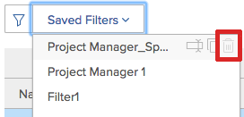

# 查看资源利用率信息

<!-- Audited: 01/2024 -->

<!--

(NOTE:&nbsp;this is linked to the UI from the Utilization report. ALWAYS keep this information. DO NOT DELETE!!)

-->

您可以在“利用率”报表中查看资源的利用率。

<!--

(NOTE: Vazgen's response about these hours ie below and he asked us to NOT document them:

It queries Assignments first to get the tasks, issues, projects to display in the view. And then from those gets the hours.

In some cases, like for Planned Hours, it takes them from Assignments

But Budgeted Hours come from projects.

And Actual Hours are their own object - Hour)

-->

<!--

This report displays information about the assignments on work items for projects in your environment, like Planned, Actual, and Budgeted Hours, FTE, or Cost.&nbsp;These are hours,&nbsp;FTE, or costs associated with the assignments and not with the tasks and issues themselves.(PRIVATE NOTE:&nbsp;Vazgen's response about these hours: It queries Assignments first to get the tasks, issues, projects to display in the view. And then from those gets the hours. In some cases, like for Planned Hours, it takes them from Assignments; But Budgeted Hours come from projects. And Actual Hours are their own object - Hour.)

-->

## 访问要求

+++ 展开以查看本文中各项功能的访问要求。

要访问“利用率”报告，您必须具备以下条件：

<table style="table-layout:auto"> 
 <col> 
 <col> 
 <tbody> 
  <tr> 
   <td role="rowheader">Adobe Workfront计划</td> 
   <td>
新建：任何

       
或

       
当前： Pro或更高版本
 </td> 
  </tr> 
  <tr> 
   <td role="rowheader">Adobe Workfront许可证</td> 
   <td>
新增：标准

       
或

       
当前：计划
 </td> 
  </tr> 
  <tr> 
   <td role="rowheader">访问级别配置</td> 
   <td> 
查看以下内容或更高访问权限：
 
    <ul> 
     <li> 
资源管理 
 </li> 
     <li> 
项目
 </li> 
     <li> 
项目组合
 </li> 
     <li> 
项目群
 </li> 
     <li> 
财务数据（如果要按成本查看信息）
 </li> 
    </ul> </td> 
  </tr> 
  <tr> 
   <td role="rowheader">对象权限</td> 
   <td> 
查看对项目、项目组合和程序的访问权限，以访问“资源”区域中的“利用率”部分
 
  
 
管理对项目的访问权限以访问项目的“利用率”部分
 
  </td> 
  </tr> 
 </tbody> 
</table>

有关此表中信息的更多详细信息，请参阅Workfront文档中的[访问要求](/help/quicksilver/administration-and-setup/add-users/access-levels-and-object-permissions/access-level-requirements-in-documentation.md)。

+++

<!--

You must have View access to the projects you want to view utilization information for as described in this section. If you are still unable to access this information, contact your Workfront administrator. (NOTE:&nbsp;replaced with above table)

-->

<!--

<h2>Prerequisites for accessing utilization information</h2>

(NOTE: drafted, replaced with above table)

To access utilization information as described in this section, ensure that the following conditions are met:

<ul>
<li>You have at least&nbsp;View access to the project, program, or portfolio for which you want to view the utilization information.</li>
<li>Your Workfront administrator must grant you at least View access to&nbsp;Financial&nbsp;Data in your Access Level to be able to view cost and revenue information in the Utilization report. The Workfront administrator must enable both View Role Billing & Cost Rates as well as View User Billing &&nbsp;Cost Rates when they grant you the View access to Financial Data. For information about granting access to&nbsp;Financial&nbsp;Data, see <a href="../../administration-and-setup/add-users/configure-and-grant-access/grant-access-financial.md" class="MCXref xref">Grant access to financial data</a>. </li>
<li>

(NOTE:&nbsp;drafted. No longer the case.) 

The Utilization tab is included on any layout template that is assigned to you and that is applied to either the projects you view or to the Reporting area. 

The Utilization section is included on any layout template that is assigned to you and that is applied to either the projects you view or to the Resourcing area. 

</li>
<li>

The Utilization tab is available by default in the Reporting area if the system administrator has not assigned a custom layout template to you. 

The Utilization section is available by default in the Resourcing area if the system administrator has not assigned a custom layout template to you. 

</li>
</ul>

-->

## 利用率报表概览 {#overview-of-the-utilization-report}

利用率报表允许您在单个报表中查看项目、项目群或项目组合的进度、成本或收入。 您还可以比较收入和成本。

您可以在“资源”区域中查看“利用率”报告，以显示多个项目之间的利用率；或者在一个项目级别查看报告，以显示与该项目关联的单个资源（工作角色和用户）的利用率。

有关访问和使用利用率报告的信息，请参阅本文中的[使用利用率报告跟踪进度、成本和收入](#track-progress-cost-and-revenue-with-the-utilization-report)部分。

### 跟踪小时数（进度） {#track-hours-progress}

您可以通过查看预算和计划小时数与实际小时数的比较来跟踪进度。

在跟踪项目、项目群或项目组合的进度时，任务和问题的进度都包含在利用率报告中。

在跟踪小时数时，“利用率”报表中提供了以下信息：

<table style="table-layout:auto"> 
 <col> 
 <col> 
 <thead> 
  <tr> 
   <th>查看小时数时<strong>列标题</strong> </th> 
   <th><strong>函数</strong> </th> 
  </tr> 
 </thead> 
 <tbody> 
  <tr> 
   <td scope="col"><strong>预算小时数</strong> </td> 
   <td scope="col"> 
包含的项目上的总预算小时数。 您可以查看所包含项目的整体生命周期的预算小时总数，也可以仅查看指定日期范围内的预算小时总数（您可以指定单独的周或月）。 
 
预算小时数由业务案例或资源规划者<em>.</em>的资源预算区域中的可用信息填充
 
预算小时数显示在利用率报表的以下任意行中：
 
    <ul> 
     <li> 预算小时数在利用率报告中按工作角色和单个用户汇总，如下所示： <strong>单个用户：</strong>预算小时数在利用率报告中按每个用户汇总。 这些预算小时数与用户在所包含项目上分配到的任务和问题相关联。 （您可以展开相应工作角色的行，以查看具有该工作角色的用户列表。） <strong>工作角色：</strong>预算小时数按工作角色汇总在利用率报告中。由于以下任意方案， 预算小时数显示在特定工作角色中：
     <ul>
     <li>工作角色被定义为分配给与预算小时数关联的任务或问题的用户的主要工作角色。 </li> 
       <li>在查看单个项目的利用率信息时，将使用分配了小时数的用户的工作角色，无论任务或问题中是否分配了工作角色，是否分配了未分配工作角色的另一个用户，是否分配了另一个具有不同工作角色的另一个用户，或是否分配了另一个团队。</li> 
       <li>查看多个项目、项目群或项目组合的利用率信息时，仅当为项目中的任务或问题分配角色时，才会使用分配了小时数的用户的工作角色。 </li> 
       <li>工作角色已分配给与预算小时数关联的任务或问题，而分配给任务或问题的用户未在系统中定义工作角色。</li> 
      </ul></li> 
    </ul> 
    <ul> 
     <li> 
<strong>未分配小时数</strong>：当预算小时数与任务或问题关联，并且没有分配给任务或问题的用户或角色时，预算小时数显示在未分配小时数的利用率报告中。 仅当项目上的小时数与此描述匹配时，以及当项目查看利用率报告时，或项目查看利用率报告时，才会显示此部分。 
 
仅当项目中的小时数与此描述匹配时，仅当按项目查看利用率报告时，或从项目查看利用率报告时，才会显示此部分。 
 </li> 
    </ul> 
有关预算小时数的详细信息，请参阅<a href="/help/quicksilver/manage-work/projects/project-finances/budgeted-labor-cost.md#locate-the-budgeted-hours-of-a-project">在<a href="/help/quicksilver/manage-work/projects/project-finances/budgeted-labor-cost.md">了解项目的预算劳力成本和预算小时数</a>中查找项目的预算小时数</a>。
 </td> 
  </tr> 
  <tr> 
   <td scope="col"><strong>计划小时数</strong> </td> 
   <td scope="col">

与每个任务和问题的工作分配关联的已包含项目上的已计划小时数。 您可以查看所包含项目整个生命周期中项目上所有分配的总计划小时数，也可以仅查看指定日期范围内的总计划小时数（您可以指定单个周或月）。

<strong>提示</strong>

持续时间为0的项目的已计划小时数未考虑在内。 

利用率报表中的已计划小时数会考虑已计划小时数是否已跨任务或问题的持续时间重新分配。 

当使用工作负载均衡器修改了用户每日分配小时数时，如果在利用率报表中选择的日期仅包含任务或问题的持续时间的一部分，则利用率报表中的数据可能会受到影响。 

有关修改用户分配的信息，请参阅<a href="../workload-balancer/manage-user-allocations-workload-balancer.md">在工作负载均衡器</a>中管理用户分配。

计划小时数显示在利用率报表的以下任意行中：

<ul>

<li>在利用率报表中，按工作角色和单个用户汇总计划小时数，如下所示： 
<ul>

<li><strong>单个用户</strong>：在利用率报告中汇总了每个用户的计划小时数。 这些已计划小时数与已包含项目中分配给用户的任务和问题相关联。 （您可以展开相应工作角色的行，以查看具有该工作角色的用户列表。）

<li><strong>工作角色</strong>：在单个项目的利用率报告中，按工作角色汇总了计划小时数。由于以下任意情况， 计划小时数显示在特定工作角色中：  
<ul>

<li>工作角色被定义为分配给与计划小时数关联的任务或问题的用户的主要工作角色。

<li>在查看单个项目的利用率信息时，在以下方案中，与工作角色关联的小时数不显示给工作角色：   
<ul>

<li>任务或问题无分派

<li>分配的用户没有工作角色分配

<li>用户被分配了不同的工作角色

<li>团队已分配给任务或问题
</li>   
</ul>

<li>查看多个项目、项目群或项目组合的利用率信息时，仅当为项目中的任务或问题分配角色时，才会使用分配了小时数的用户的工作角色。 查看多个项目的利用率报告时，工作角色小时数不单独显示。

<li>工作角色已分配给与计划小时数关联的任务或问题，且分配给任务或问题的用户未在系统中定义工作角色。
</li>  
</ul>

<li><strong>未分配小时数</strong>：当计划小时数与任务或问题关联，并且没有分配给任务或问题的用户或角色时，计划小时数显示在未分配小时数的利用率报告中。 仅当项目中的小时数符合此描述以及查看单个项目的利用率报告时，才会显示此部分。  有关计划小时数的详细信息，请参阅<a href="../../manage-work/tasks/task-information/planned-hours.md">计划小时数概述</a>。
</li> 
</ul>
</li> 
</ul> </td> 
  </tr> 
  <tr> 
   <td><strong>实际小时数</strong> </td> 
   <td> 
 在任务、问题和项目上为包含的项目记录的总小时数。 您可以查看包含的项目在整个生命周期中的总实际小时数，也可以仅查看指定日期范围内的总实际小时数（您可以指定单独的周或月）。 
 
<strong>警告：</strong>利用率报告包括登录到项目的小时数、子任务、问题和至少具有一个分配的父任务。 它不包括已记录到无分配的父任务的小时数。 我们建议您不要将父任务用作工作任务，而只将子任务分配给资源。 
 
实际小时数显示在利用率报表的以下任意行中：
 
    <ul> 
     <li> 实际小时数在项目的利用率报告中按工作角色和单个用户汇总，如下所示： <strong>单个用户：</strong>实际小时数显示在利用率报告中记录小时数的用户的行中。 （您可以展开相应工作角色的行，以查看具有该工作角色且已记录小时数的用户的列表。） <strong>工作角色：</strong>与这些角色关联的用户记录的实际小时数汇总在相应工作角色行的利用率报告中。 实际小时数由于以下任意情况出现在特定工作角色中： 
      <ul> 
       <li>工作角色被定义为记录小时数的用户的主要工作角色</li> 
       <li>任务或问题无分派</li> 
       <li>分配了另一个用户，但未分配工作角色</li> 
       <li>另一个用户被分配了不同的工作角色</li> 
       <li> 
已分配团队
 </li> 
      </ul></li>  
     
如果记录小时数的用户没有与其配置文件关联的工作角色，则用于利用率报告的工作角色是分配给记录了小时数的任务或问题的工作角色，或与任务或问题的主要所有者关联的工作角色。 
 
     <li><strong>其他小时数：</strong>实际小时数显示在利用率报告的“其他小时数”部分（登录小时数的用户的行）中。当记录小时数的用户未在系统中定义工作角色时，此部分会显示 小时。 仅当项目上的小时数与此描述匹配时，才会显示此部分。 </li> 
    </ul> </td> 
  </tr> 
  <tr> 
   <td><strong>预算差异（小时）</strong> </td> 
   <td> 
总预算小时数减去所包含项目的总实际小时数。 您可以查看所包含项目整个生命周期的预算差异合计，也可以仅查看指定日期范围内的预算差异合计（您可以指定单个周或月）。 
 
如果该值为正，则以绿色显示。 这表示总预算小时数大于实际小时数。
 
如果该值为负，则以红色显示。 这表示总预算小时数小于实际小时数。
 
  
 </td> 
  </tr> 
  <tr> 
   <td><strong>计划差异（小时）</strong> </td> 
   <td> 
总计划小时数减去所包含项目的总实际小时数。 您可以查看所包含项目整个生命周期的计划差异合计，也可以仅查看指定日期范围内的计划差异合计（您可以指定单个周或月）。
 
如果该值为正，则以绿色显示。 这表示总计划小时数大于实际小时数。
 
如果该值为负，则以红色显示。 这表示总计划小时数小于实际小时数。
 </td> 
  </tr> 
 </tbody> 
</table>

### 跟踪成本 {#track-cost}

您可以通过查看预算成本和计划成本与实际成本的比较来跟踪成本。

在跟踪项目、项目群或项目组合的成本时，“利用率”报告中的信息来自任务。 任务中的成本信息始终在利用率报表中可用。 根据任务的成本类型计算任务的成本。 有关任务的成本类型的信息，请参阅[跟踪成本](/help/quicksilver/manage-work/projects/project-finances/track-costs.md)中的[Workfront如何计算任务的成本类型](/help/quicksilver/manage-work/projects/project-finances/track-costs.md#how-workfront-calculates-cost-types-for-tasks)。

您可以通过以下方式在“利用率”报表中显示成本信息：

* 对于给定的周或月，或者对于整个项目、项目群或项目组合
* 按角色或个人，用于项目

利用率报告上的币种由项目上设置的币种确定。 有关如何调整项目货币的信息，请参阅[更改项目货币](../../manage-work/projects/project-finances/change-project-currency.md)。

在跟踪成本时，“利用率”报表中提供了以下信息：

<table style="table-layout:auto"> 
 <col> 
 <col> 
 <thead> 
  <tr> 
   <th>查看成本时<strong>列标题</strong> </th> 
   <th> 
<strong>函数</strong> 
 </th> 
  </tr> 
 </thead> 
 <tbody> 
  <tr> 
   <td scope="col"><strong>预算成本</strong> </td> 
   <td scope="col"> 
已包含项目的预算成本。 您可以查看所包含项目的整个生命周期的总预算成本，也可以仅查看指定日期范围内的总预算成本（您可以指定单个周或月）。
 
由于利用率报表中的预算成本侧重于按角色列出的成本，因此该计算与Workfront其他区域中的预算劳力成本相同。 有关如何计算预算劳力成本的信息，请参阅<a href="../../manage-work/projects/project-finances/budgeted-labor-cost.md" class="MCXref xref">了解项目的预算劳力成本和预算小时数</a>。
 </td> 
  </tr> 
  <tr> 
   <td scope="col"><strong>计划成本</strong> </td> 
   <td scope="col"> 
包含的项目上的总计划成本。 您可以查看所包含项目整个使用期的计划成本合计，也可以仅查看指定日期范围内的计划成本合计（您可以指定单个周或月）。
 
请注意，对于周、月和季度视图，当工作角色或用户的成本率生效时，计划成本计算为所选期间的平均值。

有关如何计算项目计划成本的信息，请参阅<a href="/help/quicksilver/manage-work/projects/project-finances/track-costs.md">跟踪成本</a>中的<a href="/help/quicksilver/manage-work/projects/project-finances/track-costs.md#how-workfront-calculates-planned-budgeted-and-actual-costs">Workfront如何计算计划、预算和实际成本</a>。
 </td>
  </tr> 
  <tr> 
   <td scope="col"><strong>实际成本</strong> </td> 
   <td scope="col"> 
所包含项目的总实际成本。 您可以查看所包含项目整个使用期的实际成本合计，也可以仅查看指定日期范围内的实际成本合计（您可以指定单个周或月）。
 
有关如何计算项目实际成本的信息，请参阅<a href="/help/quicksilver/manage-work/projects/project-finances/track-costs.md">跟踪成本</a>中的<a href="/help/quicksilver/manage-work/projects/project-finances/track-costs.md#how-workfront-calculates-planned-budgeted-and-actual-costs">Workfront如何计算计划、预算和实际成本</a>。
 </td>
  </tr> 
  <tr> 
   <td><strong>预算差异（成本）</strong> </td> 
   <td scope="col"> 
总预算成本减去所包含项目的总实际成本。 您可以查看所包含项目整个生命周期的预算差异合计，也可以仅查看指定日期范围内的预算差异合计（您可以指定单个周或月）。
 
如果该值为正，则以绿色显示。 这表示总预算成本大于实际成本。
 
如果该值为负，则以红色显示。 这表示总预算成本小于实际成本。
 </td>
  </tr> 
  <tr> 
   <td><strong>计划差异（成本）</strong> </td> 
   <td> 
总计划成本减去所包含项目的总实际成本。 您可以查看所包含项目整个生命周期的计划差异合计，也可以仅查看指定日期范围内的计划差异合计（您可以指定单个周或月）。 
 
如果该值为正，则以绿色显示。 这表示总计划成本大于实际成本。
 
如果该值为负，则以红色显示。 这表示总计划成本小于实际成本。
 </td> 
  </tr> 
 </tbody> 
</table>

### 跟踪收入 {#track-revenue}

您可以通过查看预算和计划收入与实际收入的比较来跟踪收入。

在跟踪项目、项目群或项目组合的收入时，“利用率”报表中仅包含来自任务的收入。

在跟踪收入时，“利用率”报表中提供了下表中的信息。

有关特定字段以及Workfront如何计算这些字段的信息，另请参阅[跟踪成本](../../manage-work/projects/project-finances/track-costs.md)和[账单和收入概览](../../manage-work/projects/project-finances/billing-and-revenue-overview.md)。

<table style="table-layout:auto"> 
 <col> 
 <col> 
 <thead> 
  <tr> 
   <th>查看收入时<strong>列标题</strong> </th> 
   <th> <strong>函数</strong></th> 
  </tr> 
 </thead> 
 <tbody> 
  <tr> 
   <td scope="col"><strong>预算收入</strong> </td> 
   <td scope="col"> 
总预算小时数乘以所包含项目中的角色记帐费率。 您可以查看所包含项目的整个生命周期的预算收入合计，也可以仅查看指定日期范围内的预算收入合计（您可以指定单个周或月）。
 </td> 
  </tr> 
  <tr> 
   <td scope="col"><strong>计划收入</strong> </td> 
   <td scope="col"> 
利用率报表中的计划收入是与分配给项目任务的资源的计划小时数关联的收入。
 
Workfront使用以下公式计算利用率报表的项目计划收入：
 
<code>Project Planned Revenue = SUM (All Tasks Planned Revenue)</code> 
 
   
<b>注释</b>
   
利用率报表中显示的项目计划收入与项目详细信息区域和项目报表中显示的计划收入不同。 
 
项目详细信息区域中的计划收入反映任务收入和项目的固定收入。 利用率报表中的计划收入仅显示与项目中的任务关联的计划收入。 
 
     
Example: </b>">  
      
如果项目有1个时数为10的任务，分配给顾问时费率为$20，并且项目有$100的固定收入，则利用率报表显示计划收入$200（与任务小时数关联的计划收入）。 项目详细信息部分显示$300（任务的计划收入和项目的固定收入）。 
 
     
 
有关利用率报告之外的任务和项目计划收入的更多信息，请参阅<a href="../../manage-work/projects/project-finances/billing-and-revenue-overview.md" class="MCXref xref">账单和收入概览</a>。
 
 
利用率报表计算和显示所包含项目的计划收入的方式考虑到了在任务上设置的收入类型。 
 
根据项目中每个任务的收入类型，存在以下方案： 
 
<strong>固定收入：</strong>无论任务分配如何，任务的收入始终使用在任务上指定的固定金额进行计算。
 
<b>重要</b>

与Workfront的其他区域不同，利用率报表通过将固定收入平均除以任务的计划小时数，来计算固定收入任务的计划收入。 
 
例如，一项任务的收入为$200。 如果任务中有4个计划小时数，则每小时费用为50美元。 该权限在用户和角色级别上分发。 此分布对于利用率报表是唯一的。
 
<b>注释</b>

如果您有“固定收入”任务并且该任务没有计划小时数，则收入不会显示在利用率报表中，因为无法将其分配给小时数。 如果您的任务具有固定收入且没有分配的计划小时数，则收入显示为未分配收入。 
 
<strong>每小时角色数：</strong>任务收入的计算方法是使用为特定角色设置的记帐费率乘以与该角色关联的已计划小时数。 Workfront使用以下公式：
 
<code>角色每小时计划收入= SUM（所有任务上角色的计划小时数） *角色记帐费率</code>

<b>注意：</b>公式中的记帐小时费率会考虑该费率的任何日期有效更改。
   
<strong>每小时用户数：</strong>任务收入的计算方法是使用为特定用户设置的记帐费率乘以与该用户关联的已计划小时数。 Workfront使用以下公式：
 
<code>用户小时计划收入= SUM（所有任务上用户的计划小时数） *用户记帐费率</code> 
 
<b>注意：</b>公式中的记帐小时费率会考虑该费率的任何日期有效更改。
 
<b>角色小时或用户小时加固定</b> 
 
<b>重要信息</b>

与Workfront的其他区域不同，利用率报表通过将固定收入平均除以任务的计划小时数来计算计划收入。 
 
存在以下情况： 

<ul>
<li> 
<strong>角色小时加固定：</strong>使用为特定角色设置的记帐费率乘以与该角色关联的计划小时数来计算任务收入。 此外，在任务上指定的固定数量会添加到角色费率。 Workfront使用以下公式：
 
<code>角色小时加固定计划收入= [SUM（所有任务上角色的计划小时数） *角色记帐费率] + SUM（任务的上限或固定金额/任务的计划小时数）</code> 
 </li>
<li> 
<strong>用户小时加固定：</strong>为特定用户设置的记帐费率乘以该用户任务的已计划小时数。 此外，在任务中指定的固定金额会添加到用户费率中。 Workfront使用以下公式：
 
<code>用户小时加固定计划收入= [SUM（所有任务上用户的计划小时数） *用户记帐费率] + SUM（任务的上限或固定金额/任务的计划小时数）</code> 
 </li>
</ul> 
<b>角色或用户小时，受限时间</b> 
 
<b>重要信息</b>

与Workfront的其他区域不同，如果计划收入超过上限，则超过上限金额的金额被视为固定收入。 计划收入的计算方法是：将固定收入平均除以任务的计划小时数，然后加上上限金额和角色或用户小时收入。 
 
存在以下情况： 

<ul>
<li> 
<strong>受限角色小时：</strong>任务将按角色小时中的方式按小时计费，但它们具有您可以指定的最大上限金额。 Workfront使用以下公式：
 
<code>具有上限计划收入的角色小时= [SUM（所有任务和问题的角色计划小时数） *角色记帐费率] +任务的上限金额+ SUM（超过任务上限金额/计划小时数的金额）</code> 
 </li>
<li> 
<strong>受限用户小时：</strong>任务按用户小时计费，但它们具有您可以指定的上限金额。 Workfront使用以下公式： 
 
<code>计划收入达到上限的用户小时= [SUM（所有任务上用户的计划小时数） *用户记帐费率] +任务的上限金额+ SUM（超过任务上限金额/计划小时数的金额）</code> 
 </li>
</ul> 
有关在计算计划收入时考虑哪个角色或用户的更多信息，请参阅<a href="../../manage-work/projects/project-finances/billing-and-revenue-overview.md" class="MCXref xref">账单和收入概述</a>。
 </td>
</tr> 
  <tr> 
   <td><strong>实际收入</strong> </td>
   <td> 
实际收入是与任务和项目的实际小时数关联的收入。 有关实际收入的更多信息，请参阅<a href="/help/quicksilver/manage-work/projects/project-finances/billing-and-revenue-overview.md">帐单和收入概览</a>中的<a href="/help/quicksilver/manage-work/projects/project-finances/billing-and-revenue-overview.md#track-revenue-amounts">跟踪收入金额</a>。

根据任务上设置的收入类型，“利用率”报表计算所包含项目的实际收入的方式有所不同，如下所示：
 
<strong>固定收入：</strong>无论任务分配如何，任务的收入始终使用在任务上指定的固定金额进行计算。
 
<b>重要</b>

与Workfront的其他区域不同，“利用率”报表通过将固定收入平均除以任务记录的小时数来计算实际收入。 
 
 
 
例如，一项任务的实际收入为$200。 如果任务有4个实际小时数，则每个小时为$50。 该权限在用户和角色级别上分发。 此分布对于利用率报表是唯一的。
 
<b>注释</b>

如果您有“固定收入”任务，并且该任务中没有“实际小时数”，则“实际收入”不会显示在“利用率报表”中，因为无法分配小时数。 
 
<strong>角色小时：</strong>任务收入的计算方法是使用为特定角色设置的记帐费率乘以实际小时数。
 
Workfront使用以下公式：
 
<code>角色每小时实际收入= SUM（所有任务上角色的实际小时数） *角色记帐费率</code> 
 
<b>注意：</b>公式中的记帐小时费率会考虑该费率的任何日期有效更改。
 
<strong>每小时用户数：</strong>任务收入的计算方法是使用为特定用户设置的记帐费率乘以该用户对该任务记录的小时数。 Workfront使用以下公式：
 
<code>用户小时实际收入= SUM（所有任务中用户的实际小时数） *用户记帐费率</code>
 
<b>注意：</b>公式中的记帐小时费率会考虑该费率的任何日期有效更改。
 
<b>角色或用户小时加固定</b> 
 
<b>重要信息</b>

与Workfront的其他区域不同，“利用率”报表通过将固定收入平均除以任务记录的小时数来计算实际收入。 
 
存在以下情况： 

<ul>
<li> 
<strong>角色小时加固定：</strong>为特定角色设置的记帐费率乘以使用该角色的用户对该任务记录的小时数。 此外，在任务上指定的固定数量会添加到角色费率。 
 
Workfront使用以下公式：
 
<code>角色小时加固定实际收入= [SUM（所有任务上角色的实际小时数） *角色记帐费率] + SUM（任务的上限或固定金额/任务的实际小时数）</code> 
 </li>
<li> 
<strong>用户小时加固定：</strong>为特定用户设置的记帐费率乘以该用户对该任务记录的小时数。 此外，在任务中指定的固定金额会添加到用户费率中。 
 
Workfront使用以下公式：
 
<code>用户小时加固定实际收入= [SUM（所有任务上角色的实际小时数） *用户记帐费率] + SUM（任务的上限或固定金额/任务的用户小时数）</code> 
 </li>
</ul> 
<b>角色或用户小时，受限时间</b> 
 
<b>重要信息</b>

与Workfront的其他区域不同，如果计划收入超过上限，则超过上限金额的金额被视为固定收入。 计划收入的计算方法是：将固定收入平均除以任务的计划小时数，然后加上上限金额和角色或用户小时收入。 
 
存在以下情况：

<ul>
<li> 
<strong>受限角色小时：</strong>任务将按角色小时中的方式按小时计费，但它们具有您可以指定的最大上限金额。 Workfront使用以下公式：
 
<code>具有上限的实际收入的角色小时= [SUM（所有任务和问题的角色的实际小时数） *角色记帐费率] +任务的上限金额+ SUM（超过任务上限金额/实际小时数的金额）</code>
 </li>
<li> 
<strong>受限用户小时：</strong>任务按用户小时计费，但它们具有您可以指定的上限金额。
 
 Workfront使用以下公式：
 
<code>包含上限实际收入的用户小时= [SUM（所有任务和问题的角色的实际小时数） *用户记帐费率] +任务的上限金额+ SUM（超过任务上限金额/实际小时数的金额）</code> 
 </li>
</ul>

<strong>项目收入</strong>：计算与项目记录的小时数关联的收入时，将考虑记录时间的用户的主要工作角色的每小时计费金额。 我们建议不要在该项目上记录时间。 

<b>注释</b>

如果用户未与工作角色关联，或者如果主要角色的每小时计费为零，则Workfront使用用户的每小时计费金额计算实际收入。 如果用户档案中没有每小时计费金额，则实际收入为零。 

</td> 
  </tr> 
  <tr> 
   <td><strong>预算差异（收入）</strong> </td> 
   <td> 
包含的项目中的实际收入减去预算收入的总数。 您可以查看所包含项目整个生命周期的总预算差异，也可以仅查看指定日期范围内的总预算差异（您可以指定单个周或月）。
 
如果该值为正，则以绿色显示。 这表示总预算收入大于实际收入。
 
如果该值为负，则以红色显示。 这表示总预算收入小于实际收入。
 </td>
  </tr> 
  <tr> 
   <td><strong>计划差异（收入）</strong> </td> 
   <td> 
实际收入总额减去所包含项目的计划收入总额。 您可以查看所包含项目整个生命周期的计划差异合计，也可以仅查看指定日期范围内的计划差异合计（您可以指定单个周或月）。 
 
如果该值为正，则以绿色显示。 这表示总计划收入大于实际收入。
 
如果该值为负，则以红色显示。 这表示总计划收入小于实际收入。
 </td>
  </tr> 
 </tbody> 
</table>

<!--Note from the table about Actual revenue: 
     
Actual Revenue is displayed in the Utilization report only after the task is marked as Complete or Done (or a status that equates with Complete).

    -->

<!--More notes from the table: 
     
(NOTE:&nbsp;the note below is duplicated in this article: /Content/Manage work/Projects/Project Finances/billing-and-revenue-overview.html and in the glossary)

   -->

### 将收入与计划成本和实际成本进行比较 {#compare-revenue-against-planned-and-actual-costs}

您可以查看计划或实际成本以及计划收入。 系统还会显示毛利(%)（毛利的计算方法为收入 — 成本/收入）。

在将收入与计划成本和实际成本进行比较时，“利用率”报表中提供了以下信息：

<table style="table-layout:auto"> 
 <col> 
 <col> 
 <thead> 
  <tr> 
   <th>查看收入与成本（计划）时的<strong>列标题</strong> </th> 
   <th> <strong>函数</strong></th> 
  </tr> 
 </thead> 
 <tbody> 
  <tr> 
   <td scope="col"><strong>计划成本</strong> </td> 
   <td scope="col"> 包含的项目上的总计划成本。 您可以查看所包含项目整个使用期的计划成本合计，也可以仅查看指定日期范围内的计划成本合计（您可以指定单个周或月）。 </td> 
  </tr> 
  <tr> 
   <td scope="col"><strong>计划收入</strong> </td> 
   <td scope="col"> 
计划收入是与任务的计划小时数关联的收入。 
 
利用率报表计算和显示所包含项目的计划收入的方式因任务上设置的收入类型而异，如本文中的<a href="#track-revenue" class="MCXref xref">跟踪收入</a>部分所述。
 </td> 
  </tr> 
  <tr> 
   <td scope="col"><strong>利润</strong> </td> 
   <td scope="col"> 
毛利百分比计算如下：
 
<code>Planned Revenue - Planned Cost / Planned Revenue * 100. </code>
 
<b>注释</b>

如果计划收入等于0，则毛利显示为0。 
 </td>
</tr> 
  <tr> 
   <td scope="col"> 
查看收入与成本时<strong>列标题（实际）</strong> 
  </td> 
   <td scope="col">
<strong>功能</strong>
</td> 
  </tr> 
  <tr> 
   <td scope="col"><strong>实际成本</strong> </td> 
   <td scope="col"> 
所包含项目的总实际成本。 您可以查看所包含项目整个使用期的实际成本合计，也可以仅查看指定日期范围内的实际成本合计（您可以指定单个周或月）。
 </td> 
  </tr> 
  <tr> 
   <td scope="col"><strong>实际收入</strong> </td> 
   <td> 
实际收入是与任务的实际小时数关联的收入。
 
仅当任务标记为“完成”或“完成”（或等同于“完成”的状态）后，“实际收入”才会显示在“利用率”报表中。
 
根据任务上设置的收入类型，利用率报表计算包含项目实际收入的方式有所不同，如本文中的<a href="#track-revenue" class="MCXref xref">跟踪收入</a>部分所述。 
 </td> 
  </tr> 
  <tr> 
   <td scope="col"><strong>利润</strong> </td> 
   <td> 
毛利百分比计算如下：
 
实际收入 — 实际成本/实际收入x 100。 
 
<b>注释</b>

如果实际收入等于0，则毛利显示为0。 
 </td>
</tr> 
 </tbody> 
</table>

<!--Note from the table from above "Function" header in the middle of the table; right after the "Planned Revenue"/"Margin" definition: 
     
(NOTE: This needs to be either split in two tables of formatted differently)

    -->

## 使用利用率报告跟踪进度、成本和收入 {#track-progress-cost-and-revenue-with-the-utilization-report}

您可以跟踪项目、项目群或项目组合的进度或成本。

您可以显示在给定周或月的利用率报告上或项目整个生命周期中的信息。

要使用利用率报告跟踪一个或多个项目的进度或成本，请执行以下操作：

1. 根据您查看的是单个项目、多个项目、项目群还是项目组合的利用率信息，执行以下操作之一：

   * 要查看单个项目的利用率信息，请执行以下操作：

      1. 转到要查看其利用率信息的项目，然后单击&#x200B;**显示更多>利用率**。
      1. 查看单个项目时会自动显示利用率信息，并且不需要应用过滤器。\
         如果要筛选利用率报告，可以应用筛选器，然后单击&#x200B;**运行**。\
         有关如何筛选利用率报告的信息，请参阅本文中的[筛选利用率信息](#filter-utilization-information)。\
         显示单个用户和角色（用户在其关联的角色中分组）的利用率信息。

   * 要查看多个项目的利用率信息，请执行以下操作：

     {{step1-to-utilization-report}}

      1. 将过滤器应用于利用率报告，然后单击&#x200B;**运行**。
在运行利用率报告之前，必须在筛选器中指定一个或多个项目。 有关如何筛选利用率报告的信息，请参阅本文中的[筛选利用率信息](#filter-utilization-information)。\
         显示单个角色和项目（角色在其关联项目中分组）的利用率信息。

   * 要查看方案的利用率信息，请执行以下操作：

     {{step1-to-utilization-report}}

      1. 单击&#x200B;**显示**>**程序**。
      1. 将过滤器应用于利用率报告，然后单击&#x200B;**运行**。\
         运行“Utilization”报告之前，必须在过滤器中指定一个或多个程序。 有关如何筛选利用率报告的信息，请参阅本文中的[筛选利用率信息](#filter-utilization-information)。\
         显示单个项目和方案（项目在其关联方案中分组）的利用率信息。

   * 要查看项目组合的利用率信息，请执行以下操作：

     {{step1-to-utilization-report}}

      1. 单击&#x200B;**显示**>**Portfolio**。
      1. 将过滤器应用于利用率报告，然后单击&#x200B;**运行**。\
         在运行利用率报告之前，必须在过滤器中指定一个或多个项目组合。 有关如何筛选利用率报告的信息，请参阅本文中的[筛选利用率信息](#filter-utilization-information)。\
         显示单个项目、项目和项目组合的利用信息（项目在其关联的项目群中进行分组，项目群在其关联的项目群中进行分组）。

1. 在利用率报告的右上角，单击&#x200B;**查看**，然后在菜单中选择以下选项：

   * **成本**
   * **小时**
   * **收入**
   * **收入与成本（计划）**
   * **收入vs成本（实际）**

   您选择的选项决定了报告中可用的列和信息。
   

1. （可选）选择显示利用率信息的日期范围。 您可以在&#x200B;**Overall**&#x200B;列的左侧显示给定周或月的信息。 整个项目、项目群或项目组合的信息始终显示在&#x200B;**整体**&#x200B;列中。\
   有关详细信息，请参阅[调整本文中显示信息的日期范围](#adjust-the-date-range-for-which-information-is-displayed)。

1. （可选）单击任意列标题以按该列中的信息对利用率报告进行排序。 仅当您的报表中包含多个项目时，排序才有效。 例如，当查看多个项目（或项目组合或项目群）时，您可以对报告结果进行排序。 当您一次只查看一个项目（或一个项目组合或一个项目群）时，无法对结果进行排序。
1. 使用本文[利用率报告概述](#overview-of-the-utilization-report)部分中的信息了解利用率报告中的每一列。

## 筛选器利用率信息 {#filter-utilization-information}

您可以筛选在项目的利用率报告中显示的内容。 您可以按任务、问题、角色和自定义数据进行过滤。 应用过滤器时，“利用率”报表包含基于所选标准的信息。

您可以创建新过滤器，或应用之前创建的过滤器。

### 创建或修改筛选器 {#create-or-modify-a-filter}

创建过滤器时，所有有权访问“利用率”报表的Workfront用户也都有权访问您创建的过滤器。 同样，在修改现有过滤器时，也会为所有有权访问利用率报告的用户修改该过滤器。

要创建或修改过滤器，请执行以下操作：

1. 打开“利用率”报表。
查看[使用利用率报告](#track-progress-cost-and-revenue-with-the-utilization-report)跟踪进度、成本和收入以执行此操作。

1. 单击&#x200B;**筛选器**&#x200B;图标以显示筛选器选项。
1. （视情况而定）要修改现有筛选器，请单击&#x200B;**筛选器**&#x200B;下拉菜单，然后选择要修改的筛选器。
1. 指定以下信息以创建或修改过滤器：

   * **Portfolio：**&#x200B;开始键入包含要包括在利用率报告中的信息的项目组合的名称，然后当该名称出现在下拉列表中时，单击该名称\
     重复此过程以在利用率报告中包含来自多个项目组合的信息。\
     要在您的筛选器中包括您系统中的所有项目组合，请单击&#x200B;**全部添加**。 （仅当系统中拥有的项目组合少于10个时，此选项才可用。）

   * **程序：**&#x200B;开始键入包含要包括在利用率报告中的信息的程序名称，然后在下拉列表中出现该名称时单击该名称。\
     重复此过程以在利用率报告中包含多个任务的信息。\
     如果您已在筛选器中指定了任何项目组合，则您指定的项目组合必须来自已包含在筛选器中的项目组合。 如果不包含，则程序中的数据不会包含在利用率报表中。\
     若要将系统中的所有程序包含在筛选器中，请单击“全部添加”****。 （仅当系统中程序少于20个时，此选项才可用。）

   * **项目：**&#x200B;开始键入包含要包含在利用率报告中的信息的项目名称，然后在名称出现在下拉列表中时单击该名称。\
     重复此过程以在利用率报告中包含来自多个项目的信息。\
     如果您已在筛选器中指定了任何项目组合或程序，则指定的项目必须来自已包含在筛选中的项目组合或程序之一。 如果不包含，则项目中的数据不会包含在利用率报表中。\
     若要在筛选器中包含系统中的所有项目，请单击“全部添加”****。 （仅当系统中拥有的项目少于250个时，此选项才可用。）

   * **任务：**&#x200B;开始键入包含要包含在利用率报告中的信息的任务名称，然后在名称出现在下拉列表中时单击该名称。\
     重复此过程以在利用率报告中包含多个任务的信息。\
     如果您已在筛选器中指定了任何项目组合、项目群或项目，则您指定的任务必须来自筛选器中已包含的某个项目组合、项目群或项目。 如果不包含，则任务中的数据不会包含在利用率报表中。

   * **问题：**&#x200B;开始键入包含要包含在利用率报告中的信息的问题的名称，然后在名称出现在下拉列表中时单击该名称。\
     重复此过程以在利用率报告中包含多个问题的信息。\
     如果您已在筛选器中指定了任何项目组合、项目群或项目，则指定的问题必须来自已包含在筛选中的项目组合、项目群或项目群之一。 如果不包含，则问题中的数据不会包含在利用率报表中。\
     问题的成本信息并不总是包含在利用率报告中。 有关问题的成本信息何时包含在利用率报告中的详细信息，请参阅本文中的[使用利用率报告跟踪进度、成本和收入](#track-progress-cost-and-revenue-with-the-utilization-report)。

   * **角色：**开始键入要在利用率报表中显示的角色的名称，然后在该名称出现在下拉列表中时单击该名称。 重复此过程以包含其他角色。
利用率报告仅包含指定角色的信息。 例如，一项任务包含10个实际小时数。 其中6个小时来自Designer角色，4个小时来自开发人员角色。 如果您按角色过滤Designer的利用率报表，则报表中将排除来自开发人员角色的四个小时。

   * **添加筛选器规则：**&#x200B;单击&#x200B;**添加筛选器规则**，在文本字段中单击，然后开始键入要筛选的字段名称。 如果该字段可用，则会填充每个可关联该字段的对象。 单击字段名称以将其添加到过滤器。

     >[!IMPORTANT]
     >
     >您必须键入字段名称，而不是字段标签。 字段标签显示在附加到对象的自定义表单上。 有关标签与自定义字段名称之间差异的信息，请参阅[创建或编辑自定义表单](../../administration-and-setup/customize-workfront/create-manage-custom-forms/create-or-edit-a-custom-form.md)。

     有关您在列中看到的字段的更多信息，请参阅[Adobe Workfront术语词汇表](../../workfront-basics/navigate-workfront/workfront-navigation/workfront-terminology-glossary.md)。\
     选择过滤器的过滤器和条件修饰符。 可用的修饰符在[筛选器和条件修饰符](../../reports-and-dashboards/reports/reporting-elements/filter-condition-modifiers.md)中描述。

1. 要创建新筛选器，请单击&#x200B;**保存筛选器**。\
   或\
   要修改现有筛选器，请单击&#x200B;**保存筛选器**&#x200B;按钮旁边的箭头，然后单击&#x200B;**保存新筛选器**。
在**筛选器名称**&#x200B;字段中，键入筛选器的名称，然后单击&#x200B;**保存**。
“利用率”区域使用您在过滤器中包括的信息进行过滤。

### 应用已保存的过滤器 {#apply-a-saved-filter}

1. 打开“利用率”报表。
查看[使用利用率报告](#track-progress-cost-and-revenue-with-the-utilization-report)跟踪进度、成本和收入以执行此操作。

1. 单击&#x200B;**保存的筛选器**，然后从下拉列表中选择要应用的筛选器。

### 复制筛选器 {#duplicate-a-filter}

1. 打开“利用率”报表。
查看[使用利用率报告](#track-progress-cost-and-revenue-with-the-utilization-report)跟踪进度、成本和收入以执行此操作。

1. 单击&#x200B;**保存的筛选器**，将鼠标悬停在要复制的筛选器上，然后单击&#x200B;**复制**&#x200B;图标。

   

   此时将显示“复制筛选器”对话框。

1. 在&#x200B;**筛选器名称**&#x200B;字段中，键入新筛选器的名称，然后单击&#x200B;**保存**。

### 重命名筛选器 {#rename-a-filter}

在重命名过滤器时，所有有权访问“利用率”报告的Workfront用户都会看到您输入的新名称。

要重命名筛选器，请执行以下操作：

1. 打开“利用率”报表。
查看[使用利用率报告](#track-progress-cost-and-revenue-with-the-utilization-report)跟踪进度、成本和收入以执行此操作。

1. 单击&#x200B;**保存的筛选器**，将鼠标悬停在要重命名的筛选器上，然后单击&#x200B;**重命名**&#x200B;图标。

   

   将显示“重命名筛选器”对话框。

1. 在&#x200B;**筛选器名称**&#x200B;字段中，键入新筛选器的名称，然后单击&#x200B;**保存**。

### 删除筛选器 {#delete-a-filter}

当您删除某个过滤器时，将会为所有有权访问“利用率”报告的Workfront用户删除该过滤器。

要删除过滤器，请执行以下操作：

1. 打开“利用率”报表。
查看[使用利用率报告](#track-progress-cost-and-revenue-with-the-utilization-report)跟踪进度、成本和收入以执行此操作。

1. 单击&#x200B;**保存的筛选器**，将鼠标悬停在要删除的筛选器上，然后单击&#x200B;**删除**&#x200B;图标。

   

1. 在提示是否要删除筛选器时，单击&#x200B;**删除**。

## 调整显示信息的日期范围 {#adjust-the-date-range-for-which-information-is-displayed}

您可以调整显示利用率信息的日期范围。 您可以选择过去或未来的日期。 您所做的更改仅对您可见。

1. 打开“利用率”报表。
查看[使用利用率报告](#track-progress-cost-and-revenue-with-the-utilization-report)跟踪进度、成本和收入以执行此操作。

1. 单击&#x200B;**导出**&#x200B;按钮旁边的日期范围。

   默认情况下会选择本周。

1. 从以下选项中进行选择：

   * **周：**&#x200B;选择此选项可选择给定的周（从星期日到星期六）。
   * **月：**&#x200B;选择此选项可选择给定的月。

   您选择的日期范围将显示在利用率报告中&#x200B;**Overall**&#x200B;列的左侧。\
   Workfront会记住您是要查看周视图还是月视图。 下次访问利用率报告时，将会根据您选择的选项显示本周或当月。

## 导出利用率信息

您可以从Workfront导出项目、项目群或项目组合的利用率信息。 信息只能以XLSX、TSV和PDF格式导出。

在Microsoft Excel中查看时，负数显示在括号中。

要导出利用率信息，请执行以下操作：

1. 打开“利用率”报表。
查看[使用利用率报告](#track-progress-cost-and-revenue-with-the-utilization-report)跟踪进度、成本和收入以执行此操作。

1. 单击报告左上角的&#x200B;**导出**。

1. 从以下选项中选择：

   * **PDF：**&#x200B;以PDF格式导出报告。 如果您计划打印报表，则建议使用此格式。\
     选择&#x200B;**Letter - Portrait**、**Letter - Landscape**&#x200B;或&#x200B;**Other Sizes**(提供用于导出到法律行业(8.5&quot; x 14&quot;)、分类帐(11&quot; x 17&quot;)和A4的选项)。
根据您使用的操作系统，您可以选择打开或保存文件。 使用关联的应用程序打开文件或将其保存到计算机。

   * **Excel：**以XLSX格式导出报告。 如果您打算在Excel中进一步分析数据，则建议使用此格式。
根据您使用的操作系统，您可以选择打开或保存文件。 使用关联的应用程序打开文件或将其保存到计算机。

   * **制表符分隔：**以TSV格式导出报告。 如果您计划将数据导入第三方软件以进行进一步分析，则建议使用此格式。
根据您使用的操作系统，您可以选择打开或保存文件。 使用关联的应用程序打开文件或将其保存到计算机。

1. 阅读[导出数据](../../reports-and-dashboards/reports/creating-and-managing-reports/export-data.md)一文中的信息以了解如何使用导出的文件。

## 在图表中查看利用率信息

您可以在图表视图中可视化利用率报告中的数据。

1. 打开“利用率”报表。
查看[使用利用率报告](#track-progress-cost-and-revenue-with-the-utilization-report)跟踪进度、成本和收入以执行此操作。

1. 在利用率报告的右上角，单击&#x200B;**图表**&#x200B;图标。

   

   利用率报告以图表视图显示。

1. （可选）通过从&#x200B;**显示**&#x200B;下拉菜单中选择相应的选项，将图表配置为显示项目、程序或Portfolio。
1. （可选）将鼠标悬停在报表上的特定时间点上可查看该时间点的数据。

   

1. （可选）调整筛选器以更改图表中显示的信息。 有关调整筛选器的信息，请参阅本文中的[筛选器利用率信息](#filter-utilization-information)。
1. （可选）配置图表报表的时间范围，如[调整本文中显示信息的日期范围](#adjust-the-date-range-for-which-information-is-displayed)中所述。
