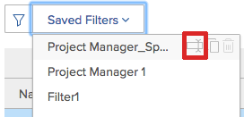

# 查看资源利用信息

<!--

(NOTE:&nbsp;this is linked to the UI from the Utilization report. ALWAYS keep this information. DO NOT DELETE!!)

-->

您可以使用“利用率”报告查看资源的利用率。

<!--

(NOTE: Vazgen's response about these hours ie below and he asked us to NOT document them:

It queries Assignments first to get the tasks, issues, projects to display in the view. And then from those gets the hours.

In some cases, like for Planned Hours, it takes them from Assignments

But Budgeted Hours come from projects.

And Actual Hours are their own object - Hour)

-->

<!--

This report displays information about the assignments on work items for projects in your environment, like Planned, Actual, and Budgeted Hours, FTE, or Cost.&nbsp;These are hours,&nbsp;FTE, or costs associated with the assignments and not with the tasks and issues themselves.(PRIVATE NOTE:&nbsp;Vazgen's response about these hours: It queries Assignments first to get the tasks, issues, projects to display in the view. And then from those gets the hours. In some cases, like for Planned Hours, it takes them from Assignments; But Budgeted Hours come from projects. And Actual Hours are their own object - Hour.)

-->

## 访问要求

您必须具有以下权限才能访问“利用率”报告：

<table style="table-layout:auto"> 
 <col> 
 <col> 
 <tbody> 
  <tr> 
   <td role="rowheader">Adobe Workfront计划*</td> 
   <td> 
专业或更高
 </td> 
  </tr> 
  <tr> 
   <td role="rowheader">Adobe Workfront许可证*</td> 
   <td> 
计划 
 </td> 
  </tr> 
  <tr> 
   <td role="rowheader">访问级别配置*</td> 
   <td> 
查看或更高权限访问以下内容：
 
    <ul> 
     <li> 
资源管理 
 </li> 
     <li> 
项目
 </li> 
     <li> 
项目组合
 </li> 
     <li> 
项目群
 </li> 
     <li> 
财务数据（如果要按成本查看信息）
 </li> 
    </ul> 
<b>注释</b>

如果您仍然没有访问权限，请咨询Workfront管理员，他们是否在您的访问级别设置了其他限制。 有关Workfront管理员如何更改访问级别的信息，请参阅 <a href="../../administration-and-setup/add-users/configure-and-grant-access/create-modify-access-levels.md" class="MCXref xref">创建或修改自定义访问级别</a>.
 </td>
</tr> 
  <tr> 
   <td role="rowheader">对象权限</td> 
   <td> 
查看对项目、项目组合和项目的访问权限，以访问“资源”区中的“利用”部分
 
  
 
管理对项目的访问权限以访问项目的“利用率”部分
 
  
 
有关请求其他访问权限的信息，请参阅 <a href="../../workfront-basics/grant-and-request-access-to-objects/request-access.md" class="MCXref xref">请求对对象的访问 </a>.
 </td> 
  </tr> 
 </tbody> 
</table>

*要了解您拥有的计划、许可证类型或访问权限，请联系您的Workfront管理员。

<!--

You must have View access to the projects you want to view utilization information for as described in this section. If you are still unable to access this information, contact your Workfront administrator. (NOTE:&nbsp;replaced with above table)

-->

以下各节介绍了如何查看和使用利用率信息。

<!--

<h2>Prerequisites for accessing utilization information</h2>

(NOTE: drafted, replaced with above table)

To access utilization information as described in this section, ensure that the following conditions are met:

<ul>
<li>You have at least&nbsp;View access to the project, program, or portfolio for which you want to view the utilization information.</li>
<li>Your Workfront administrator must grant you at least View access to&nbsp;Financial&nbsp;Data in your Access Level to be able to view cost and revenue information in the Utilization report. The Workfront administrator must enable both View Role Billing & Cost Rates as well as View User Billing &&nbsp;Cost Rates when they grant you the View access to Financial Data. For information about granting access to&nbsp;Financial&nbsp;Data, see <a href="../../administration-and-setup/add-users/configure-and-grant-access/grant-access-financial.md" class="MCXref xref">Grant access to financial data</a>. </li>
<li>

(NOTE:&nbsp;drafted. No longer the case.) 

The Utilization tab is included on any layout template that is assigned to you and that is applied to either the projects you view or to the Reporting area. 

The Utilization section is included on any layout template that is assigned to you and that is applied to either the projects you view or to the Resourcing area. 

</li>
<li>

The Utilization tab is available by default in the Reporting area if the system administrator has not assigned a custom layout template to you. 

The Utilization section is available by default in the Resourcing area if the system administrator has not assigned a custom layout template to you. 

</li>
</ul>

-->

## 利用率报告概述 {#overview-of-the-utilization-report}

使用“利用率”报表，您可以在单个报表中查看项目、项目群或项目组合的进度、成本或收入。 您还可以将收入与成本进行比较。

您可以在“资源”区域中查看“利用率”报表以显示多个项目的利用率，也可以在一个项目的级别查看“利用率”报表，以显示与该项目关联的单个资源（作业角色和用户）的利用率。

有关访问和使用“利用率”报告的信息，请参阅 [使用“利用率”报表跟踪进度、成本和收入](#track-progress-cost-and-revenue-with-the-utilization-report) 章节。

* [跟踪小时数（进度）](#track-hours-progress)
* [跟踪成本](#track-cost)
* [跟踪收入](#track-revenue)
* [将收入与计划成本和实际成本进行比较](#compare-revenue-against-planned-and-actual-costs)

### 跟踪小时数（进度） {#track-hours-progress}

您可以通过查看预算小时数和计划小时数与实际小时数的比较来跟踪进度。

在跟踪项目、项目群或项目组合的进度时，针对任务和问题的进度将包含在“利用率”报告中。

跟踪小时数时，“利用率”报表中提供以下信息：

<table style="table-layout:auto"> 
 <col> 
 <col> 
 <thead> 
  <tr> 
   <th><strong>查看小时数时的列标题</strong> </th> 
   <th><strong>功能</strong> </th> 
  </tr> 
 </thead> 
 <tbody> 
  <tr> 
   <td scope="col"><strong>预算小时</strong> </td> 
   <td scope="col"> 
所包括项目的总预算小时数。 您可以查看已包含项目的整个生命周期的预算小时总数，也可以仅查看指定日期范围内的预算小时总数（您可以指定单个周或月）。 
 
预算小时数由“业务案例”或“资源计划员”的新“资源预算”区域中提供的信息填充<em>.</em>
 
“预算小时数”显示在“利用率”报表的以下任意行中：
 
    <ul> 
     <li> 在“利用率”报表中，预算小时数按职务角色和个人用户汇总如下： <strong>单个用户：</strong> 利用率报表中为每个用户汇总预算的小时数。 这些预算小时数与用户在包含的项目中分配到的任务和问题相关联。 （您可以展开相应作业角色的行，以查看具有该作业角色的用户列表。） <strong>作业角色：</strong> 预算小时数按使用情况报告中的职务角色进行汇总。 由于出现以下任何情况，预算小时数显示在特定职务角色中： 
     <li>职务角色被定义为分配给任务或与预算小时数相关联的问题的用户的主要职务角色。 </li> 
       <li>在查看单个项目的利用率信息时，无论任务或问题上没有分配，都会使用分配小时的用户的作业角色，分配的另一个用户没有作业角色分配，分配的另一个用户具有不同的作业角色，或分配的另一个团队。</li> 
       <li>在查看多个项目、项目群或项目组合的利用率信息时，仅当在项目中的任务或问题上分配了该角色时，才会使用分配了小时的用户的作业角色。 </li> 
       <li>作业角色被分配给与预算小时数相关联的任务或问题，而分配给任务或问题的用户在系统中没有定义作业角色。</li> 
      </ul></li> 
    </ul> 
    <ul> 
     <li> 
<strong>未分配小时数</strong>:当预算小时数与任务或问题相关联，并且没有为任务或问题分配用户或角色时，预算小时数会显示在“未分配小时数”部分的利用率报表中。 仅当项目上存在与此描述匹配的小时，以及查看项目的利用率报表时或从项目查看利用率报表时，才会显示此部分。 
 
仅当项目上存在与此描述匹配的小时，以及查看项目的利用率报表时或从项目查看利用率报表时，才会显示此部分。 
 </li> 
    </ul> 
有关预算小时数的详细信息，请参阅 <a href="../../manage-work/projects/project-finances/budgeted-labor-cost.md" class="MCXref xref">了解项目的预算人工成本和预算工时</a> 文章。
 </td> 
  </tr> 
  <tr> 
   <td scope="col"><strong>计划小时</strong> </td> 
   <td scope="col"> <!-- Yay, no errors, warnings, or alerts! -->

与每个任务和问题上的分配关联的已包含项目的计划时间。 您可以查看项目上所有分配在包含项目的整个生命周期内的总计划小时数，也可以仅查看指定日期范围内的总计划小时数（您可以指定单个周或月）。 

<strong>笔尖 </strong>

不考虑持续时间为0的项目的计划小时数。 

“利用率”报表中的“计划小时数”考虑在任务或问题的持续时间内是否重新分配了计划小时数。 

当使用工作负载平衡器修改了用户的小时日分配时，如果在“利用率”报表中选择的日期只包含任务或问题的持续时间的一部分，则“利用率”报表中的数据可能会受到影响。 

有关修改用户分配的信息，请参阅 <a href="../workload-balancer/manage-user-allocations-workload-balancer.md">在工作负载平衡器中管理用户分配</a>.

“计划小时数”显示在以下任意行的“利用率”报表中：

<ul>

<li>计划小时数按作业角色和利用率报表中的单个用户进行汇总，如下所示： 
<ul>

<li><strong>个人用户</strong>:利用率报表中汇总了每个用户的计划小时数。 这些计划小时数与用户在包含的项目中分配到的任务和问题相关联。 （您可以展开相应作业角色的行，以查看具有该作业角色的用户列表。）

<li><strong>作业角色</strong>:在单个项目的利用率报告中，按职务角色汇总计划小时数。 计划小时数会由于以下任何情况而显示在特定作业角色中：  
<ul>

<li>作业角色被定义为分配给任务或与计划小时数相关联的问题的用户的主要作业角色。

<li>在查看单个项目的利用率信息时，与作业角色关联的小时数在以下情况下不会显示作业角色：   
<ul>

<li>任务或问题上没有分配

<li>为用户分配的作业角色没有分配

<li>为用户分配了不同的作业角色

<li>已为团队分配任务或问题
</li>   
</ul>

<li>在查看多个项目、项目群或项目组合的利用率信息时，仅当在项目中的任务或问题上分配了该角色时，才会使用分配了小时的用户的作业角色。 查看多个项目的利用率报表时，作业角色小时数不会单独显示。

<li>作业角色被分配给与计划小时数相关联的任务或问题，而分配给任务或问题的用户没有在系统中定义作业角色。
</li>  
</ul>

<li><strong>未分配小时数</strong>:当计划小时数与任务或问题相关联，并且没有为任务或问题分配用户或角色时，“未分配小时数”部分的“未分配小时数”报表中会显示“计划小时数”。仅当项目上存在与此说明匹配的小时数，并且查看单个项目的利用率报表时，才会显示此部分。  有关计划时间的更多信息，请参阅 <a href="../../manage-work/tasks/task-information/planned-hours.md">计划时数概述</a>.
</li> 
</ul>
</li> 
</ul> </td> 
  </tr> 
  <tr> 
   <td><strong>实际小时数</strong> </td> 
   <td> 
 任务、问题、 在项目上 的项目。 您可以查看所包含项目整个生命周期的实际总小时数，也可以仅查看指定日期范围内的实际总小时数（您可以指定单个周或月）。 
 
警告：利用率报告包括记录到项目的小时数、子任务、问题以及至少具有一个分配的父任务。 它不包括记录到未分配的父任务的小时数。 我们建议您不要将父任务用作工作任务，而只将子任务分配给资源。 
 
实际小时数显示在以下任何行的利用率报表中：
 
    <ul> 
     <li> 实际工时按任务角色和单个用户在项目利用率报告中的汇总如下： <strong>单个用户：</strong> 实际小时数显示在记录该小时的用户行的利用率报表中。 （您可以展开相应作业角色的行，以查看具有该作业角色且已记录小时的用户列表。） <strong>作业角色：</strong> 与这些角色关联的用户记录的实际小时数在相应作业角色行的利用率报表中汇总。 由于出现以下任何情况，实际工时会显示在特定作业角色中： 
      <ul> 
       <li>作业角色被定义为记录小时的用户的主要作业角色。</li> 
       <li>任务或问题上没有分配</li> 
       <li>分配了另一个用户，但没有分配任务角色</li> 
       <li>为另一个用户分配了不同的作业角色</li> 
       <li> 
已分配团队。
 </li> 
      </ul></li>  
     
如果记录小时的用户没有与其配置文件相关联的作业角色，则用于“利用率”报表的作业角色是分配给任务或问题的作业角色，其中记录了小时或与任务或问题的主要所有者相关联的作业角色。 
 
     <li><strong>其他时间：</strong> 实际小时数显示在“其他小时”部分的使用率报表中，显示在登录该小时的用户的行中。 当在系统中未定义记录小时的用户的作业角色时，“小时”会显示在此部分中。 仅当项目上存在与此描述匹配的小时时，才会显示此部分。 </li> 
    </ul> </td> 
  </tr> 
  <tr> 
   <td><strong>预算差异（小时）</strong> </td> 
   <td> 
预算总时数减去所包括项目的实际总时数。 您可以查看已包括项目整体生命周期的预算差异总数，也可以仅查看指定日期范围的预算差异总数（您可以指定单个周或月）。 
 
如果值为正，则以绿色显示。 这表示预算小时总数大于实际小时数。
 
如果值为负数，则将以红色显示。 这表示预算总小时数小于实际小时数。
 
  
 </td> 
  </tr> 
  <tr> 
   <td><strong>计划差异（小时）</strong> </td> 
   <td> 
总计划小时数减去所包含项目的实际总小时数。 您可以查看已包括项目的整个生命周期的计划差异总数，也可以仅查看指定日期范围的计划差异总数（您可以指定单个周或月）。
 
如果值为正，则以绿色显示。 这表示总计划小时数大于实际小时数。
 
如果值为负数，则将以红色显示。 这表示总计划小时数小于实际小时数。
 </td> 
  </tr> 
 </tbody> 
</table>

### 跟踪成本 {#track-cost}

您可以通过查看预算成本和计划成本与实际成本的比较情况来跟踪成本。

在跟踪项目、项目群或项目组合的成本时，“利用率”报表中的信息来自任务。 任务中的成本信息始终可在“利用率”报表中使用。 任务的成本是根据任务的成本类型计算的。 有关任务成本类型的信息，请参阅 [跟踪成本](../../manage-work/projects/project-finances/track-costs.md).

您可以通过以下方式在“利用率”报表中显示成本信息：

* 针对给定的周或月，或针对整个项目、项目或项目组合。
* 按角色或个人对项目。

利用率报表中使用的货币由项目中设置的货币决定。 有关如何调整项目货币的信息，请参阅 [更改项目货币](../../manage-work/projects/project-finances/change-project-currency.md).

跟踪成本时，“利用率”报表中提供了以下信息：

<table style="table-layout:auto"> 
 <col> 
 <col> 
 <thead> 
  <tr> 
   <th><strong>查看成本时的列标题</strong> </th> 
   <th> 
<strong>功能</strong> 
 </th> 
  </tr> 
 </thead> 
 <tbody> 
  <tr> 
   <td scope="col"><strong>预算成本</strong> </td> 
   <td scope="col"> 
已包括项目的预算成本。 您可以查看已包括项目的整个生命周期的预算成本总额，也可以仅查看指定日期范围内的预算成本总额（您可以指定单个周或月）。
 
由于“利用率报表中的预算成本”是按职责分列的成本，因此其计算方式与Workfront其他地区的预算人工成本相同。 有关如何计算预算人工成本的信息，请参阅 <a href="../../manage-work/projects/project-finances/budgeted-labor-cost.md" class="MCXref xref">了解项目的预算人工成本和预算工时</a>.
 </td> 
  </tr> 
  <tr> 
   <td scope="col"><strong>计划成本</strong> </td> 
   <td scope="col"> 
已包括项目的计划成本总额。 您可以查看已包括项目的整个生命周期的总计划成本，也可以仅查看指定日期范围内的总计划成本（您可以指定单个周或月）。
 
有关如何计算项目的计划成本的信息，请参阅文章中的“Workfront如何计算计划、预算和实际成本”部分 <a href="../../manage-work/projects/project-finances/track-costs.md" class="MCXref xref">跟踪成本</a>.
 </td> 
  </tr> 
  <tr> 
   <td scope="col"><strong>实际成本</strong> </td> 
   <td scope="col"> 
已包括项目的实际总成本。 您可以查看已包括项目的整个生命周期的实际成本总额，也可以仅查看指定日期范围内的实际成本总额（您可以指定单个周或月）。
 
有关如何计算项目实际成本的信息，请参阅文章中的“Workfront如何计算计划、预算和实际成本”部分 <a href="../../manage-work/projects/project-finances/track-costs.md" class="MCXref xref">跟踪成本</a>.
 </td> 
  </tr> 
  <tr> 
   <td><strong>预算差异（成本）</strong> </td> 
   <td scope="col"> 
预算成本总额减去已包括项目的实际成本总额。 您可以查看已包括项目整体生命周期的预算差异总数，也可以仅查看指定日期范围的预算差异总数（您可以指定单个周或月）。
 
如果值为正，则以绿色显示。 这表示预算成本总额大于实际成本。
 
如果值为负数，则将以红色显示。 这表示预算成本总额小于实际成本。
 </td> 
  </tr> 
  <tr> 
   <td><strong>计划差异（针对成本）</strong> </td> 
   <td> 
计划成本总额减去已包括项目的实际成本总额。 您可以查看已包括项目的整个生命周期的计划差异总数，也可以仅查看指定日期范围的计划差异总数（您可以指定单个周或月）。 
 
如果值为正，则以绿色显示。 这表示总计划成本大于实际成本。
 
如果值为负数，则将以红色显示。 这表示总计划成本小于实际成本。
 </td> 
  </tr> 
 </tbody> 
</table>

### 跟踪收入 {#track-revenue}

您可以通过查看预算收入和计划收入与实际收入的比较情况来跟踪收入。

跟踪项目、项目群或项目组合的收入时，“利用率”报表中仅包含来自任务的收入。

跟踪收入时，“利用率”报表中提供了下表中的信息。

有关特定字段以及Workfront如何计算这些字段的信息，另请参阅以下文章：

* [跟踪成本](../../manage-work/projects/project-finances/track-costs.md)
* [账单和收入概述](../../manage-work/projects/project-finances/billing-and-revenue-overview.md)

<table style="table-layout:auto"> 
 <col> 
 <col> 
 <thead> 
  <tr> 
   <th><strong>查看收入时的列标题</strong> </th> 
   <th> <strong>功能</strong></th> 
  </tr> 
 </thead> 
 <tbody> 
  <tr> 
   <td scope="col"><strong>预算收入</strong> </td> 
   <td scope="col"> 
预算小时数总数乘以所包括项目的职责开单费率。 您可以查看已包括项目的整个生命周期的预算收入总额，也可以仅查看指定日期范围内的预算收入总额（可以指定单个周或月）。
 </td> 
  </tr> 
  <tr> 
   <td scope="col"><strong>计划收入</strong> </td> 
   <td scope="col"> 
“利用率”报表中的“计划收入”是与分配给项目任务的资源的计划小时数相关联的收入。
 
Workfront使用以下公式计算“利用率”报表的项目计划收入：
 
<code>Project Planned Revenue = SUM&nbsp;(All Tasks Planned Revenue)</code> 
 
   
<b>注释</b>
   
“利用率”报表中显示的项目计划收入与“项目详细信息”区域和项目报表中显示的计划收入不同。 
 
“项目详细信息”区域中的“计划收入”反映了任务收入以及项目的固定收入。 “利用率报表”中的“计划收入”显示仅与项目中的任务关联的计划收入。 
 
     
Example: </b>">  
      
如果项目有1个任务，10小时，该任务分配给顾问，每小时费率为$20，而项目有$100的固定收入，则“利用率”报表会显示“计划收入”为$200（与任务小时数关联的计划收入）。 “项目详细信息”部分显示$300（任务的计划收入和项目的固定收入）。 
 
     
 
有关“利用率”报表外的任务和项目计划收入的详细信息，请参阅 <a href="../../manage-work/projects/project-finances/billing-and-revenue-overview.md" class="MCXref xref">账单和收入概述</a>.
 
 
利用率报表计算和显示已包括项目的计划收入的方式考虑了在任务中设置的收入类型。 
 
根据项目中每项任务的收入类型，存在以下方案： 
 
<strong>固定收入：</strong> 无论任务分配如何，任务的收入始终使用任务上指定的固定金额来计算。
 
<b>重要信息</b>

与Workfront的其他区域不同，利用率报表通过将固定收入平均除以任务上的计划小时数来计算固定收入任务的计划收入。 
 
例如，某项任务的收入为$200。 如果任务上有4个计划小时，则每小时将为50美元。 该工作流在用户和角色级别上分发。 此分配对于“利用率”报表是唯一的。
 
<b>注释</b>

如果您有“固定收入”任务，并且该任务没有“计划小时数”，则“收入”不会显示在“利用率报表”中，因为无法将其分配到小时数。 如果您对具有固定收入且没有分配的任务有计划小时数，则收入将显示为“未分配收入”。 
 
<strong>角色每小时：</strong> 任务的收入使用为特定职责设置的开单费率乘以与该职责关联的计划小时数来计算。 Workfront使用以下公式：
 
职责每小时计划收入= SUM（所有任务中职责的计划小时数）*职责开单费率</code>
 
<strong>用户每小时：</strong> 任务的收入使用为特定用户设置的开单费率乘以与该用户关联的计划小时数来计算。 Workfront使用以下公式：
 
用户每小时计划收入= SUM（所有任务中用户的计划小时数）x用户开单费率</code> 
 
<b>每小时或用户每小时加固定的角色</b> 
 
<b>重要信息</b>

与Workfront的其他区域不同，利用率报表通过将固定收入平均除以任务上的计划小时数来计算计划收入。 
 
存在以下情况： 

<ul>
<li> 
<strong>角色每小时加固定：</strong> 任务的收入使用为特定职责设置的开单费率乘以与职责关联的计划小时数来计算。 此外，在任务上指定的固定金额会添加到角色费率中。 Workfront使用以下公式：
 
职责每小时加上固定计划收入= [SUM（所有任务中角色的计划小时数）*角色开单费率] + SUM（任务的上限或固定金额/任务的计划小时数）</code> 
 </li>
</ul>
<ul>
<li> 
<strong>用户每小时加固定：</strong> 为特定用户设置的开单费率乘以该用户任务上的计划小时数。 此外，在任务上指定的固定金额会添加到用户费率中。 Workfront使用以下公式：
 
用户每小时加固定计划收入= [SUM（所有任务中用户的计划小时数）*用户开单费率] + SUM（任务的上限或固定金额/任务的计划小时数）</code> 
 </li>
</ul> 
<b>角色或用户每小时（含上限）</b> 
 
<b>重要信息</b>

与Workfront的其他地区不同，如果计划收入超过上限，则超过上限金额的金额将被视为固定收入。 “计划收入”的计算方法是：将固定收入平均除以任务上的计划小时数，然后将上限金额和角色或用户每小时收入相加。  
 
存在以下情况： 

<ul>
<li> 
<strong>每小时角色（含上限）：</strong> 任务按小时在角色中按小时计费，但您可以指定任务的最大上限额。 Workfront使用以下公式：
 
每小时角色（含计划收入上限）= [SUM（所有任务和问题上的角色计划小时数）*角色开单费率] +任务的上限金额+ SUM（任务上限金额/计划小时数之比的金额）</code> 
 </li>
</ul>
<ul>
<li> 
<strong>用户每小时（含上限）：</strong> 任务按小时在用户每小时中计费，但您可以指定任务的最大上限额。 Workfront使用以下公式： 
 
具有计划收入上限的用户每小时= [SUM（所有任务中用户的计划小时数）*用户开单费率] +任务的上限金额+ SUM（任务上限金额/计划小时数之比的金额）</code> 
 </li>
</ul> 
有关在计算计划收入时考虑的角色或用户的详细信息，请参阅 <a href="../../manage-work/projects/project-finances/billing-and-revenue-overview.md" class="MCXref xref">账单和收入概述</a>.
 </td>
</tr> 
  <tr> 
   <td><strong>实际收入</strong> </td> 
   <td> 
实际收入是与任务的实际小时数关联的收入 和项目. 有关实际收入的更多信息，请参阅文章中的“跟踪收入金额”一节 <a href="../../manage-work/projects/project-finances/billing-and-revenue-overview.md" class="MCXref xref">账单和收入概述</a>.

利用率报表计算包含项目的实际收入的方式因任务上设置的收入类型而异，如下所示：
 
<strong>固定收入：</strong> 无论任务分配如何，任务的收入始终使用任务上指定的固定金额来计算。
 
<b>重要信息</b>

与Workfront的其他区域不同，利用率报表通过将固定收入平均除以任务记录的小时数来计算实际收入。 
 
 
 
例如，某项任务的实际收入为$200。 如果任务上有4个实际小时，则每小时将为$50。 该工作流在用户和角色级别上分发。 此分配对于“利用率”报表是唯一的。
 
<b>注释</b>

如果您有“固定收入”任务，并且该任务没有“实际小时数”，则“实际收入”不会显示在“利用率报表”中，因为无法分配小时数。 
 
<strong>角色每小时：</strong> 任务的收入使用特定职责的开单费率乘以计划小时数来计算。
 
Workfront使用以下公式：
 
职责每小时实际收入= SUM（所有任务职责中的实际小时数）x职责开单费率</code> 
 
<strong>用户每小时：</strong> 任务的收入使用为特定用户设置的开单费率乘以该用户针对任务记录的小时数来计算。 Workfront使用以下公式：
 
用户每小时实际收入= SUM（所有任务上用户的实际小时数）x用户开单费率</code>
 
<b>角色或用户每小时加固定</b> 
 
<b>重要信息</b>

与Workfront的其他区域不同，利用率报表通过将固定收入平均除以任务记录的小时数来计算实际收入。 
 
存在以下情况： 

<ul>
<li> 
<strong>角色每小时加固定：</strong> 为特定角色设置的计费费率，乘以具有该角色的用户针对该任务记录的小时数。 此外，在任务上指定的固定金额会添加到角色费率中。 
 
Workfront使用以下公式：
 
每小时角色加上固定实际收入= [SUM（所有任务中角色的实际小时数）*角色开单费率] + SUM（任务的上限或固定金额/任务的实际小时数）</code> 
 </li>
</ul>
<ul>
<li> 
<strong>用户每小时加固定：</strong> 为特定用户设置的计费费率乘以该用户针对任务记录的小时数。 此外，在任务上指定的固定金额会添加到用户费率中。 
 
Workfront使用以下公式：
 
用户每小时加固定实际收入= [SUM（所有任务中角色的实际小时数）*用户开单费率] + SUM（任务的上限或固定金额/任务的用户小时数）</code> 
 </li>
</ul> 
<b>角色或用户每小时（含上限）</b> 
 
<b>重要信息</b>

与Workfront的其他地区不同，如果计划收入超过上限，则超过上限金额的金额将被视为固定收入。 “计划收入”的计算方法是：将固定收入平均除以任务上的计划小时数，然后将上限金额和角色或用户每小时收入相加。  
 
存在以下情形：

<ul>
<li> 
<strong>每小时角色（含上限）：</strong> 任务按小时在角色中按小时计费，但您可以指定任务的最大上限额。 Workfront使用以下公式：
 
每小时角色（含上限）实际收入= [SUM（所有任务和问题上的角色实际小时数）*角色开单费率] +任务的上限金额+ SUM（超过上限金额/任务的实际小时数的金额）</code>
 </li>
</ul>
<ul>
<li> 
<strong>用户每小时（含上限）：</strong> 任务按小时在用户每小时中计费，但您可以指定任务的最大上限额。
 
 Workfront使用以下公式：
 
用户每小时（含上限）实际收入= [SUM（所有任务和问题上的实际小时数）*用户开单费率] +任务的上限金额+ SUM（超过上限金额/任务的实际小时数的金额）</code> 
 </li>
</ul>

<strong>项目收入</strong>:与项目上记录的小时数关联的收入会计算，其中考虑了记录该时间的用户的主要作业角色的每小时帐单金额。 我们不建议在项目上记录时间。 

<b>注释</b>

如果用户未与职务角色关联，或者如果主要角色的每小时开单为零，则Workfront会使用用户的每小时开单金额计算实际收入。 如果用户的配置文件中没有每小时计费金额，则实际收入为零。 

 </td>
</tr> 
  <tr> 
   <td><strong>预算差异（收入）</strong> </td> 
   <td> 
已包括项目的实际收入减去预算收入后的总收入。 您可以查看已包括项目整体生命周期的预算差异总数，也可以仅查看指定日期范围的预算差异总数（您可以指定单个周或月）。
 
如果值为正，则以绿色显示。 这表示总预算收入大于实际收入。
 
如果值为负数，则将以红色显示。 这表示总预算收入小于实际收入。
 </td> 
  </tr> 
  <tr> 
   <td><strong>计划差异（用于收入）</strong> </td> 
   <td> 
实际收入总额减去已包括项目的计划收入总额。 您可以查看已包括项目的整个生命周期的计划差异总数，也可以仅查看指定日期范围的计划差异总数（您可以指定单个周或月）。 
 
如果值为正，则以绿色显示。 这表示总计划收入大于实际收入。
 
如果值为负数，则将以红色显示。 这表示总计划收入小于实际收入。
 </td> 
  </tr> 
 </tbody> 
</table>

<!--Note from the table about Actual revenue: 
     
Actual Revenue is displayed in the Utilization report only after the task is marked as Complete or Done (or a status that equates with Complete).

    -->

<!--More notes from the table: 
     
(NOTE:&nbsp;the note below is duplicated in this article: /Content/Manage work/Projects/Project Finances/billing-and-revenue-overview.html and in the glossary)

   -->

### 将收入与计划成本和实际成本进行比较 {#compare-revenue-against-planned-and-actual-costs}

您可以查看计划成本或实际成本以及计划收入。 此外，还会显示毛利(%)（毛利按收入 — 成本/收入计算）。

在比较收入与计划成本和实际成本时，“利用率”报表中提供了以下信息：

<table style="table-layout:auto"> 
 <col> 
 <col> 
 <thead> 
  <tr> 
   <th><strong>查看收入与成本（计划）时的列标题</strong> </th> 
   <th> <strong>功能</strong></th> 
  </tr> 
 </thead> 
 <tbody> 
  <tr> 
   <td scope="col"><strong>计划成本</strong> </td> 
   <td scope="col"> 已包括项目的计划成本总额。 您可以查看已包括项目的整个生命周期的总计划成本，也可以仅查看指定日期范围内的总计划成本（您可以指定单个周或月）。 </td> 
  </tr> 
  <tr> 
   <td scope="col"><strong>计划收入</strong> </td> 
   <td scope="col"> 
计划收入是与任务的计划小时数关联的收入。 
 
利用率报表计算和显示包含项目的计划收入的方式因任务上设置的收入类型而异，如 <a href="#track-revenue" class="MCXref xref">跟踪收入</a> 章节。
 </td> 
  </tr> 
  <tr> 
   <td scope="col"><strong>边距</strong> </td> 
   <td scope="col"> 
毛利百分比的计算方式如下：
 
<code>Planned Revenue - Planned Cost / Planned Revenue * 100. </code>
 
<b>注释</b>

如果计划收入等于0，则毛利将显示为0。 
 </td>
</tr> 
  <tr> 
   <td scope="col"> 
<strong>查看收入与成本时的列标题（实际）</strong> 
  </td> 
   <td scope="col">
<strong>功能</strong>
</td> 
  </tr> 
  <tr> 
   <td scope="col"><strong>实际成本</strong> </td> 
   <td scope="col"> 
已包括项目的实际总成本。 您可以查看已包括项目的整个生命周期的实际成本总额，也可以仅查看指定日期范围内的实际成本总额（您可以指定单个周或月）。
 </td> 
  </tr> 
  <tr> 
   <td scope="col"><strong>实际收入</strong> </td> 
   <td> 
实际收入是与任务的实际小时数相关联的收入。
 
实际收入仅在任务标记为完成或完成（或等于完成的状态）后才会显示在“利用率”报表中。
 
利用率报表计算包含项目的实际收入的方式因任务上设置的收入类型而异，如 <a href="#track-revenue" class="MCXref xref">跟踪收入</a> 章节。 
 </td> 
  </tr> 
  <tr> 
   <td scope="col"><strong>边距</strong> </td> 
   <td> 
毛利百分比的计算方式如下：
 
实际收入 — 实际成本/实际收入x 100。 
 
<b>注释</b>

如果实际收入等于0，则毛利将显示为0。 
 </td>
</tr> 
 </tbody> 
</table>

<!--Note from the table from above "Function" header in the middle of the table; right after the "Planned Revenue"/"Margin" definition: 
     
(NOTE: This needs to be either split in two tables of formatted differently)

    -->

## 使用“利用率”报表跟踪进度、成本和收入 {#track-progress-cost-and-revenue-with-the-utilization-report}

您可以跟踪项目、项目群或项目组合的进度或成本。

您可以在“利用率”报表中显示给定周或月的信息，或显示项目整个生命周期的信息。

要使用“利用率”报表跟踪一个或多个项目的进度或成本，请执行以下操作：

1. 根据您查看的是单个项目、多个项目、项目或项目组合的利用率信息，执行以下任一操作：

   * 要查看单个项目的利用率信息，请执行以下操作：

      1. 转到要查看其利用率信息的项目，然后单击 **显示更多>利用率**.
      1. 在查看单个项目时，会自动显示利用率信息，并且不需要应用过滤器。\
         如果要过滤“利用率”报表，可以应用过滤器，然后单击 **运行**.\
         有关如何过滤利用率报表的信息，请参阅部分 [筛选利用信息](#filter-utilization-information) 在本文中。\
         系统会为单个用户和角色显示利用率信息（将用户分组到其关联的角色中）。
   * 要查看多个项目的利用率信息，请执行以下操作：

      1. 单击 **主菜单** 图标  在Workfront的右上角，单击 **资源化**，则 **利用率** 中。
      1. 将过滤器应用于“利用率”报表，然后单击 **运行**.\
         在运行“利用率”报表之前，必须在过滤器中指定一个或多个项目。 有关如何过滤利用率报表的信息，请参阅部分 [筛选利用信息](#filter-utilization-information) 在本文中。\
         系统会为各个角色和项目显示利用率信息（角色将分组到其关联的项目中）。
   * 要查看程序的利用率信息，请执行以下操作：

      1. 单击 **主菜单** 图标  在Workfront的右上角，单击 **资源化**，则 **利用率** ，然后单击 **显示**>**程序**.
      1. 将过滤器应用于“利用率”报表，然后单击 **运行**.\
         在运行“利用率”报告之前，必须在筛选器中指定一个或多个程序。 有关如何过滤利用率报表的信息，请参阅部分 [筛选利用信息](#filter-utilization-information) 在本文中。\
         显示各个项目和项目群的利用情况信息（项目在其关联项目群中分组）。
   * 要查看组合的利用率信息，请执行以下操作：

      1. 单击 **主菜单** 图标  在Workfront的右上角，单击 **资源化**，则 **利用率** ，然后单击 **显示**>**Portfolio**.
      1. 将过滤器应用于“利用率”报表，然后单击 **运行**.\
         在运行“利用率”报表之前，必须在过滤器中指定一个或多个项目组合。 有关如何过滤利用率报表的信息，请参阅部分 [筛选利用信息](#filter-utilization-information) 在本文中。\
         将显示单个项目、项目和项目组合的利用率信息（项目在其关联项目中分组，项目在其关联项目组合中分组）。

1. 在“Utilization（利用率）”报表的右上角，单击 **查看** 下拉菜单中，然后从以下位置选择：

   * **成本**
   * **小时**
   * **收入**
   * **收入和成本（计划）**
   * **收入与成本（实际）**.

   您选择的选项可确定报表中哪些列和信息可用。 有关每列可用信息的更多详细信息，请参阅步骤5中的表。\
   

1. （可选）选择显示利用率信息的日期范围。 您可以在左侧显示给定周或月的信息 **整体** 列。 有关整个项目、项目群或项目组合的信息始终显示在 **整体** 列。\
   有关更多信息，请参阅 [调整显示信息的日期范围](#adjust-the-date-range-for-which-information-is-displayed) 在本文中。

1. （可选）单击任意列标题，按该列中的信息对利用率报表进行排序。 只有在报表中包含多个项目时，才会进行排序。 例如，当您查看多个项目（或项目组合或项目群）时，可以对报表的结果进行排序。 一次只查看一个项目（或一个项目组合或一个项目）时，无法对结果进行排序。
1. 使用部分中的信息 [利用率报告概述](#overview-of-the-utilization-report) 请参阅本文，了解“ Utilization ”报表中的每一列。

## 筛选利用信息 {#filter-utilization-information}

您可以过滤项目“利用率”报表中显示的内容。 您可以过滤任务、问题、角色和自定义数据。 将过滤器应用到“利用率”报表时，“利用率”报表包含基于您选择的标准的信息。

您可以创建过滤器，也可以应用之前创建的过滤器。

* [创建或修改过滤器](#create-or-modify-a-filter)
* [应用保存的过滤器](#apply-a-saved-filter)
* [复制过滤器](#duplicate-a-filter)
* [重命名过滤器](#rename-a-filter)
* [删除过滤器](#delete-a-filter)

### 创建或修改过滤器 {#create-or-modify-a-filter}

创建过滤器时，所有有权访问“利用率”报表的Workfront用户也有权访问您创建的过滤器。 同样，在修改现有过滤器时，对于所有有权访问“利用率”报表的用户，都会修改该过滤器。

要创建或修改过滤器，请执行以下操作：

1. 要筛选单个项目的利用率信息，请转到要筛选其利用率信息的项目，然后单击 **显示更多>利用率** 中。

   或

   要筛选多个项目、项目或项目组合的利用率信息，请单击主菜单图标  在Workfront的右上角， **资源化**, **利用率** 在左侧面板中，然后 **显示**>**程序** 或 **Portfolio** 或&#x200B;**项目**.

1. 单击 **过滤器** 图标来显示过滤器选项。

1. （视情况而定）要修改现有过滤器，请单击 **过滤器** 下拉菜单，然后选择要修改的过滤器。
1. 指定以下信息以创建或修改过滤器：

   * **Portfolio:** 开始键入包含要包含在“利用率”报表中的信息的组合名称，然后在下拉菜单中显示该名称时单击该名称。\
      重复此过程，以在“利用率”报表中包含来自多个项目组合的信息。\
      要将系统中的所有项目组合包含在过滤器中，请单击 **全部添加**. （仅当您的系统中的项目组合少于10个时，此选项才可用。）

   * **程序：** 开始键入包含要包含在“利用率”报表中的信息的程序名称，然后在下拉菜单中显示该名称时单击该名称。\
      重复此过程，以在“利用率”报告中包含来自多个任务的信息。\
      如果您已在过滤器中指定任何项目组合，则您指定的程序必须来自过滤器中已包含的项目组合。 如果未包含，则来自程序的数据不会包含在“利用率”报表中。\
      要将系统中的所有程序包含在过滤器中，请单击 **全部添加**. （此选项仅在系统中的程序少于20个时才可用。）

   * **项目：** 开始键入包含要包含在“利用率”报表中的信息的项目名称，然后在下拉菜单中显示该名称时单击该名称。\
      重复此过程，以在“利用率”报告中包含来自多个项目的信息。\
      如果您已在筛选器中指定了任何项目组合或项目群，则您指定的项目必须来自筛选器中已包含的项目组合或项目群之一。 如果未包含，则项目数据不会包含在利用率报表中。\
      要将系统中的所有项目包含到过滤器中，请单击 **全部添加**. （仅当系统中的项目少于250个时，此选项才可用。）

   * **任务：** 开始键入包含要包含在“利用率”报表中的信息的任务名称，然后在下拉菜单中显示该名称时单击该名称。\
      重复此过程，以在“利用率”报告中包含来自多个任务的信息。\
      如果您已在筛选器中指定了任何项目组合、项目群或项目，则您指定的任务必须来自筛选器中已包含的项目组合、项目群或项目之一。 如果未包含，则任务中的数据不会包含在“利用率”报表中。

   * **问题：** 开始键入包含要包含在“利用率”报表中的信息的问题名称，然后在下拉菜单中显示该名称时单击该名称。\
      重复此过程，以在“利用率”报告中包含来自多个问题的信息。\
      如果已在筛选器中指定任何项目组合、项目或项目，则您指定的问题必须来自筛选器中已包含的项目组合、项目组或项目之一。 如果未包含，则问题中的数据不会包含在利用率报表中。\
      问题的成本信息并非总是包含在利用率报表中。 有关何时将问题的成本信息包含在利用率报告中的详细信息，请参阅部分 [使用“利用率”报表跟踪进度、成本和收入](#track-progress-cost-and-revenue-with-the-utilization-report) 在本文中。

   * **角色：** 开始键入要在“利用率报表”中表示的角色的名称，然后在下拉菜单中显示该名称时单击该名称。 重复此过程以包含其他角色。\
      利用率报表仅包含您指定的角色的信息。 例如，任务包含10个实际小时。 其中6个小时来自设计人员角色，4个小时来自开发人员角色。 如果按Designer角色过滤“利用率报表”，则“开发人员”角色产生的4小时将从报表中排除。

   * **添加过滤器规则：** 单击 **添加过滤器规则**，单击第一个字段，然后开始键入要过滤的字段名称。 如果字段可用，则会为每个可关联的对象填充该字段。 单击字段的名称以将其添加到过滤器。

      >[!IMPORTANT]
      >
      >必须键入字段名称，而不是字段标签。 字段标签显示在附加到对象的自定义表单上。 有关标签和自定义字段名称之间差异的信息，请参阅  [创建或编辑自定义表单](../../administration-and-setup/customize-workfront/create-manage-custom-forms/create-or-edit-a-custom-form.md).

      有关您在列中看到的字段的详细信息，请参阅 [Adobe Workfront术语表](../../workfront-basics/navigate-workfront/workfront-navigation/workfront-terminology-glossary.md).\
      为过滤器选择过滤器和条件修饰符。 可用的修饰符在 [过滤器和条件修饰符](../../reports-and-dashboards/reports/reporting-elements/filter-condition-modifiers.md).

1. 要创建新过滤器，请单击 **保存过滤器**.\
   或\
   要修改现有过滤器，请单击 **保存过滤器** 按钮，然后单击 **保存新过滤器**.\
   在 **过滤器名称** 字段，指定过滤器的名称，然后单击 **保存**.\
   “利用率”区域会使用过滤器中包含的信息进行过滤。

### 应用保存的过滤器 {#apply-a-saved-filter}

1. 要对单个项目的利用率报表应用过滤器，请转到要过滤的项目，然后单击 **显示更多>利用率** 中。

   或

   要对多个项目、项目或项目组合的利用率报表应用过滤器，请单击 **主菜单** 图标  在Workfront的右上角， **资源化**, **利用率** 在左侧面板中，然后 **显示**>**程序** 或&#x200B;**Portfolio** 或&#x200B;**项目**.

1. 单击 **保存的过滤器**，然后从下拉菜单中选择要应用的过滤器。

### 复制过滤器 {#duplicate-a-filter}

1. 要在单个项目的利用率报表上复制过滤器，请转到要为其复制过滤器的项目，然后单击 **显示更多>利用率** 中。

   或

   要在“利用率报表”上复制多个项目、项目或项目组合的过滤器，请单击 **主菜单** 图标  在Workfront的右上角，单击 **资源化**，则 **利用率** 中。

1. 单击 **保存的过滤器**，将鼠标悬停在下拉菜单中要复制的过滤器上，然后单击 **复制** 图标。

   \
   此时将显示“复制过滤器”对话框。

1. 在 **过滤器名称** 字段，为新过滤器指定名称，然后单击 **保存**.

### 重命名过滤器 {#rename-a-filter}

在重命名过滤器时，所有有权访问“利用率”报表的Workfront用户都会看到您选择的新名称。

要重命名过滤器，请执行以下操作：

1. 要对单个项目的“利用率报表”中的过滤器进行重命名，请转到要为其重命名过滤器的项目，然后单击 **显示更多>利用率** 中。

   或

   要为多个项目、项目或项目组合的“利用率报表”重命名过滤器，请单击 **主菜单** 图标  在Workfront的右上角，单击 **资源化**，则 **利用率** 中。

1. 单击 **保存的过滤器**，将鼠标悬停在下拉菜单中要复制的过滤器上，然后单击 **重命名** 图标。\
   \
   此时将显示“重命名过滤器”对话框。

1. 在 **过滤器名称** 字段，为新过滤器指定名称，然后单击 **保存**.

### 删除过滤器 {#delete-a-filter}

删除过滤器时，对于所有有权访问“利用率”报表的Workfront用户，都会删除该过滤器。

要删除过滤器，请执行以下操作：

1. 要删除单个项目的“利用率报表”上的过滤器，请转到要删除该过滤器的项目，然后单击 **显示更多>利用率** 中。

   或

   要删除多个项目、项目或项目组合的利用率报表上的过滤器，请单击 **主菜单** 图标  在Workfront的右上角，单击 **资源化**，则 **利用率** 中。

1. 单击 **保存的过滤器**，将鼠标悬停在下拉菜单中要复制的过滤器上，然后单击 **删除** 图标。

   

1. 单击 **删除** 提示您是否要删除过滤器时。

## 调整显示信息的日期范围 {#adjust-the-date-range-for-which-information-is-displayed}

您可以调整显示利用率信息的日期范围。 您可以选择过去或将来的日期。 您所做的更改仅对您可见。

1. 要调整单个项目的利用率报表的日期范围，请转到要调整其日期范围的项目，然后单击 **显示更多>利用率** 中。

   或

   要调整多个项目、项目或项目组合的“利用率”报表的日期范围，请单击 **主菜单** 图标  在Workfront的右上角，单击 **资源化**，则 **利用率** 中。

1. 单击 **导出** 按钮。

   默认情况下，会选择当前周。

1. 从以下选项中进行选择：

   * **周：** 选择此选项可选择给定的周（从星期日到星期六）。
   * **月：** 选择此选项以选择给定月份。

   您选择的日期范围显示在 **整体** 列。\
   Workfront会记住您是要查看一周还是月视图。 下次访问利用率报表时，将根据您选择的选项显示当前周或当月。

## 导出利用率信息

您可以从Workfront导出项目、项目群或项目组合的利用率信息。 信息只能以XLSX、TSV和PDF格式导出。

在Microsoft Excel中查看时，负数显示在括号中。

要导出利用率信息，请执行以下操作：

1. 要导出单个项目的利用率信息，请转到要导出其利用率信息的项目，然后单击 **利用率** 选项卡(根据布局设置，该选项卡可能位于 **更多** 选项卡。

   或

   要导出多个项目、项目或项目组合的利用率信息，请单击 **主菜单** 图标  在Workfront的右上角，单击 **资源化**，则 **利用率** 中。

1. 单击 **导出**，位于 **利用率** 选项卡。

1. 从以下选项中进行选择：

   * **PDF:** 以PDF格式导出报表。 如果您计划打印报表，则建议使用此格式。\
      选择 **信件 — 纵向**, **字母 — 横向**&#x200B;或 **其他大小** (提供用于在法律（8.5英寸x 14英寸）、分类帐（11英寸x 17英寸）和A4中导出的选项。\
      根据您使用的操作系统，您可能可以选择打开或保存文件。 使用关联的应用程序打开文件或将其保存到硬盘。

   * **Excel:** 以XLSX格式导出报表。 如果您计划在Excel中进一步分析数据，建议使用此格式。\
      根据您使用的操作系统，您可能可以选择打开或保存文件。 使用关联的应用程序打开文件或将其保存到硬盘。

   * **制表符分隔：** 以TSV格式导出报表。 如果您计划将数据导入第三方软件以供进一步分析，则建议采用此格式。\
      根据您使用的操作系统，您可能可以选择打开或保存文件。 使用关联的应用程序打开文件或将其保存到硬盘。

1. 阅读文章中的信息 [导出数据](../../reports-and-dashboards/reports/creating-and-managing-reports/export-data.md) 以了解如何使用导出的文件。

## 在图表中查看利用率信息

您可以在图表视图中显示“利用率”报表中的数据。

1. 要以图表格式查看单个项目的利用率报表，请转到要查看的项目，然后单击 **显示更多>利用率** 中。

   或

   要以图表格式查看多个项目、项目或项目组合的利用率报表，请单击 **报表** 在全局导航栏中，转到报表区域，然后单击 **利用率** 选项卡。

1. 在“Utilization（利用率）”报表的右上角，单击 **图表** 图标。\
   \
   “利用率”报表显示在图表视图中。

1. （可选）通过从 **显示** 下拉菜单。
1. （可选）将鼠标悬停在报表上的特定时间点上可查看该时间点的数据。

   

1. （可选）调整过滤器以确定图表中显示的信息。 有关调整过滤器的信息，请参阅 [筛选利用信息](#filter-utilization-information) 在本文中。
1. （可选）配置图表报表的时间范围，如 [调整显示信息的日期范围](#adjust-the-date-range-for-which-information-is-displayed) 在本文中。
