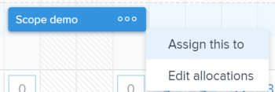

# 在工作负载均衡器中分配工作概述

作为资源管理器，您可以使用Adobe Workfront工作负载均衡器查看尚未分配给用户的工作项，并将这些项目分配给用户。

有关工作负载均衡器的常规信息，请参见 [工作负载均衡器概述](../../resource-mgmt/workload-balancer/overview-workload-balancer.md).

您可以将工作项（任务和问题）分配给Workfront其他区域中的用户。 但是，通过使用工作负载均衡器，您可以轻松了解用户的可用性，并在为他们分配更多工作之前清楚地看到他们分配到的所有其他项目。

有关在Workfront的其他区域中分配工作项的信息，请参阅以下文章：

* [分配任务](../../manage-work/tasks/assign-tasks/assign-tasks.md)
* [分配问题](../../manage-work/issues/manage-issues/assign-issues.md)

## 工作负载均衡器中的用户可用性

您可以在工作负载均衡器中分配工作以匹配用户的可用时间。 要确保您分配正确的工作量而不是过度分配用户，分配给用户的工作项的计划小时总数必须与用户每日或每周分配相匹配。

您必须了解Workfront如何计算用户的可用时间。

Workfront使用以下信息在工作负载均衡器中计算用户的容量：

* 资源管理首选项。 Workfront管理员通过在“设置”的“资源管理”区域中选择使用下列选项之一，确定系统可用时间的计算方式：

   * Workfront系统的默认计划和用户的FTE。
   * 用户的计划，如用户配置文件区域中所示。

     这会计算用户的每日和每周可用性。 所选计划的任何计划例外都会反映在工作负载均衡器的用户容量中。

  有关更多信息，请参阅 [配置资源管理首选项](../../administration-and-setup/set-up-workfront/configure-system-defaults/configure-resource-mgmt-preferences.md).

  有关时间表的信息，请参阅 [创建计划](../../administration-and-setup/set-up-workfront/configure-timesheets-schedules/create-schedules.md)

* 用户的休息时间。 这指示用户计划起飞的日期。

  有关更多信息，请参阅 [配置个人休息时间](../../workfront-basics/manage-your-account-and-profile/configuring-your-user-profile/personal-time-overview.md).

* 用户的工作时间。 这表示用户可用于执行实际项目相关工作（不包括间接费用）的FTE时间百分比。 将“工作时间”值设置为1，表示用户可用于其整个全职等效项目相关工作。

## 在工作负载均衡器中分配工作

您可以在工作负载均衡器中分配尚未分配给用户的工作项，或重新分配已分配给用户的项。

可以通过以下方式在工作负载均衡器中分配工作：

* 通过手动分配每个项目，一次分配一个项目。

  在手动分配项目时，您可以一次分配一个项目，以进行“高级分配”。

  有关更多信息，请参阅 [使用工作负载均衡器手动分配工作](../../resource-mgmt/workload-balancer/assign-work-in-workload-balancer-manually.md).

* 通过将工作项拖放到需要分配的用户，逐项检查。

  有关更多信息，请参阅 [通过拖放在工作负载均衡器中分配工作](../../resource-mgmt/workload-balancer/assign-work-in-workload-balancer-by-drag-and-drop.md).

* 使用“批量分配”选项，一次分配多个项目。 您可以定义规则，通过规则一次将项目分配给多个用户。

  有关更多信息，请参阅 [使用工作负载均衡器批量分配工作](../../resource-mgmt/workload-balancer/assign-work-in-workload-balancer-in-bulk.md).

有关取消分配工作的信息，请参阅 [在工作负载均衡器中取消分配工作](../../resource-mgmt/workload-balancer/unassign-work-in-workload-balancer.md).

## 工作负载均衡器中的任务区域

您可以在项目或团队级别使用“资源”区域的工作负载均衡器将工作分配给用户。 有关工作负载均衡器在Workfront中的位置的更多信息，请参阅 [找到工作负载均衡器](../../resource-mgmt/workload-balancer/locate-workload-balancer.md).

在工作负载均衡器中有两个区域可以查看工作项：

* **未分配的工作**：显示未分配给用户的项目。
* **已分派工作**：显示分配给用户的项目。

下表描述了哪些项会根据其分配显示在每个区域中：

<table style="table-layout:auto"> 
 <col> 
 <col> 
 <col> 
 <tbody> 
  <tr> 
   <td><strong>任务类型</strong> </td> 
   <td colspan="2"><strong>任务可见的区域</strong> </td> 
  </tr> 
  <tr> 
   <td> </td> 
   <td>未分派工作 </td> 
   <td>已分派工作 </td> 
  </tr> 
  <tr data-mc-conditions=""> 
   <td>未分配项目 </td> 
   <td>✔ </td> 
   <td> </td> 
  </tr> 
  <tr> 
   <td>团队</td> 
   <td>✔</td> 
   <td> </td> 
  </tr> 
  <tr data-mc-conditions=""> 
   <td>角色 </td> 
   <td>✔ </td> 
   <td> </td> 
  </tr> 
  <tr> 
   <td>角色和团队</td> 
   <td>✔</td> 
   <td> </td> 
  </tr> 
  <tr> 
   <td>用户</td> 
   <td> </td> 
   <td>✔</td> 
  </tr> 
  <tr> 
   <td>用户和团队</td> 
   <td> 
 
 </td> 
   <td>✔</td> 
  </tr> 
  <tr> 
   <td>用户、角色和团队</td> 
   <td>✔*</td> 
   <td>✔**</td> 
  </tr> 
  <tr data-mc-conditions=""> 
   <td> 
用户和角色
 </td> 
   <td>✔*</td> 
   <td>✔**</td> 
  </tr> 
 </tbody> 
</table>

&#42;将工作项分配给用户和角色后，仅当该角色是主要被分配人时，它才会显示在“未分配的工作”区域中。

&#42;&#42;将工作项分配给用户和另一个实体时，仅当用户是主要被分配人时，它才会显示在已分配的工作区域中。

有关工作负载均衡器的未分配和已分配区域的详细信息，请参见 [导航工作负载均衡器](../../resource-mgmt/workload-balancer/navigate-the-workload-balancer.md).

## 向工作角色、团队和用户进行多个分配的注意事项

将多个资源分配给工作项时，请考虑以下事项：

* 用户可以有多个与其配置文件关联的工作角色。 有关将用户与工作角色关联的信息，请参阅 [编辑用户配置文件](../../administration-and-setup/add-users/create-and-manage-users/edit-a-users-profile.md).

* 任务或问题通常首先分配给一个或多个工作角色或团队。 当项目准备好开始时，可能需要将它们也分配给用户。\
  如果已将任务或问题分配给一个或多个角色，并且您还分配了用户，则Adobe Workfront将根据以下规则确定要与其他用户（如果有）关联的工作角色：

   * 如果只分配了一个工作角色，并且该工作角色与用户的主要角色匹配，则任务或问题仅被分配给履行其主要角色的用户。
   * 如果分配了多个角色，并且至少有一个角色与用户的辅助角色匹配，则将任务或问题分配给履行其中一个其他角色(如果存在多个匹配，则Workfront会随机选择其他角色)以及分配的任何其他角色的用户。
   * 如果分配了一个或多个工作角色，但没有与用户的角色匹配，则任务或问题将同时分配给该角色和用户。

* 如果将任务或问题分配给团队并且您还分配了用户，则任务或问题仍会分配给团队和用户。

<!--

<h2 data-mc-conditions="QuicksilverOrClassic.Quicksilver"> Manually assign one item at a time</h2>

(NOTE: Moved manual assignment and drag-and-drop to their own articles) 

<ol>
<li value="1">Go to the Workload Balancer.</li>
<li value="2"> 
Go to the <strong>Unassigned Work</strong> area and apply a filter to view work items
 
Or
 
Go to the <strong>Assigned Work</strong> area and expand the name of a user to view the work items assigned to them.
 <note type="important">
You cannot view and assign issues from the Unassigned Work area. You can only reassign issues already assigned to users in the Assigned Work area. Otherwise, you can assign issues from a list or at the issue level. For information, see
<a href="../../manage-work/issues/manage-issues/assign-issues.md" class="MCXref xref">Assign issues</a>.
</note> </li>
<li value="3"> 
Click the <strong>More menu</strong>  on the bar of a work item, then click <strong>Assign this to</strong>. 
 
  
 <note type="tip">

You can also use the following shortcuts to assign tasks or issues: 

<ul>
<li>In Windows: CTRL+click the task or issue bar. </li>
<li>In&nbsp;Mac: CMD+click the task or issue bar. </li>
</ul>
</note> </li>
<li value="4"> 
Start typing the name of a user, job role, or team that you want to assign to the item in the <strong>Search people, role or teams</strong> field, select it when it displays in the list, then click&nbsp;<strong>Save</strong>. 
 
  
 
This assigns or reassigns the work item to the specified assignees.
 
If you assign an item to just a team or a job role, the item displays only in the Unassigned Work area. You must assign work items to users in order to display them in the Assigned Work area of the Workload Balancer.
 <note type="tip">

You can assign multiple users or job roles, and you can assign only one team. You can assign only active users, job roles, and teams.

If a user, job role, or a team was assigned before they were deactivated, they remain assigned to the work item. In this case, we recommend the following: 

<ul>
<li> 
Reassign the work item to active resources. 
 </li>
<li> 
Associate the users in a deactivated team with an active team and reassign the work item to the active team. 
 </li>
</ul>
</note> </li>
<li value="5"> 
(Optional) Click the <strong>Show allocations icon</strong> , then click the <strong>More menu</strong>  > <strong>Edit allocations</strong>.
 
Or
 
Double-click a daily or weekly allocation to modify the amount of time the user is allocated to the work item.
 
For information about modifying user allocations in the Workload Balancer, see the "Modify user allocations"&nbsp;section in the article <a href="../../resource-mgmt/workload-balancer/manage-user-allocations-workload-balancer.md" class="MCXref xref">Manage user allocations in the Workload Balancer</a>.
 </li>
</ol>

<h2>Assign an item by dragging and dropping</h2>

(NOTE: consider retitling this to "Assign one item at a time by dragging and dropping" when bulk assignments will come???)&nbsp;

You can assign an item from the Unassigned Work area to a user, or you can reassign an already assigned item to another user in the Assigned Work area.

<ol>
<li value="1">Go to the Workload Balancer.</li>
<li value="2"> 
Go to the <strong>Unassigned Work</strong> area and apply a filter to view work items.
 <note type="important">
You cannot view and assign issues from the Unassigned Work area.
</note> </li>
<li value="3"> 
Click the bar of a work item that indicates either the planned or the projected timeline and drag it over the name of a user in the <strong>Assigned</strong> area.
 
The user you hover over to drop the work item to is highlighted.
 <note type="tip">
The Planned Hours for the user you're hovering over update in real time with the number of daily Planned Hours from the work item, to indicate what the impact of adding a new item might be to their overall allocation.
</note> 
  
 </li>
<li value="4"> 
When you are ready, drop the selected work item in the same line as the user's name in the Assigned Area. The item is assigned and the allocated Planned Hours are updated for the user with the new hours from the work item.
 <note type="tip">

If you enabled Group by Project in the Settings area, the assigned task displays under the corresponding project. If the setting is disabled, the assigned task displays in the user area. 

The item displays according to the Workload Balancer criteria for sorting work items.&nbsp;For more information, see <a href="../../resource-mgmt/workload-balancer/navigate-the-workload-balancer.md" class="MCXref xref">Navigate the Workload Balancer</a>.

</note> </li>
<li value="5"> 
(Optional) Click the <strong>Show allocations icon</strong> , then click the <strong>More menu</strong>  > <strong>Edit allocations</strong>. (NOTE: make sure these are still called this, and that the icon has not changed)
 
Or
 
Double-click a daily or weekly allocation to modify the amount of time the user is allocated to the work item.
 
For information about modifying user allocations in the Workload Balancer, see the "Modify user allocations"&nbsp;section in the article <a href="../../resource-mgmt/workload-balancer/manage-user-allocations-workload-balancer.md" class="MCXref xref">Manage user allocations in the Workload Balancer</a>.
 </li>
</ol> 

<h2>Assign items in bulk</h2>

(NOTE: This is also a separate article. Should we keep this section or the separate article?) 

&nbsp;

-->

<!--

<h2>Unassign work items in the Workload Balancer</h2>

(NOTE: moved this section to a new article. Draft here at release to preview) 

You can either unassign items from users and move them to the Unassigned Work area, or reassign them to other users. 

To unassign work items from users: 

<ol>
<li value="1">In the Workload Balancer, go to the <strong>Assigned Work</strong> area and expand a user.</li>
<li value="2">Do 
<MadCap:conditionalText data-mc-conditions="QuicksilverOrClassic.Draft mode">
one of
</MadCap:conditionalText>
the following:
<ul>
<li class="preview" data-mc-conditions="QuicksilverOrClassic.Draft mode">
Find the item you want to unassign in a user's area, click it, drag and drop it in the Unassigned area or in another user's area. 
</li>
<li>
Click the <strong>More</strong> icon  to the right of the name of a work item, click&nbsp;<strong>Assign this to</strong> , then remove the name of the entities assigned to the work item or enter another name and click&nbsp;<strong>Save</strong>.

</li>
</ul>
The item displays in the Unassigned Work area if it matches the filtering criteria for that area and it is not assigned to any users or it displays in the user area if it is assigned to that user. 
<note type="tip">
Unassigned issues do not display in the Unassigned area.
</note>
For information about filtering information in the Workload Balancer, see <a href="../../resource-mgmt/workload-balancer/filter-information-workload-balancer.md" class="MCXref xref">Manage filters in the Workload Balancer</a>. 
</li>
</ol>

-->
