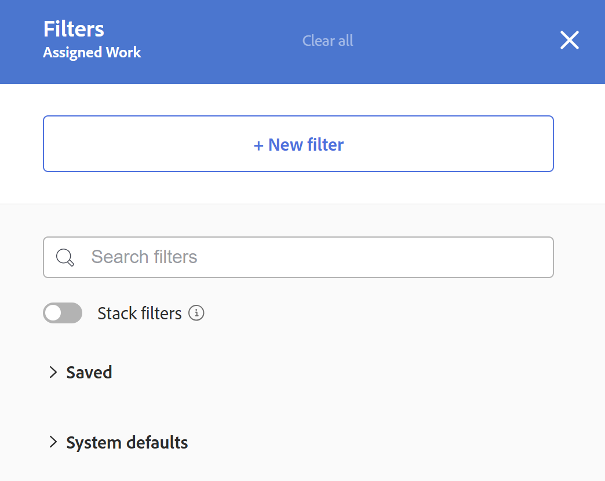
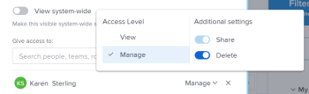

# 工作负载均衡器中的过滤器信息

<!--
(when they add custom fields to fitlering, add the caveat you added for the Resource Planner : only field NAMES and not LABELS are to be found in the drop-down >> ADD THIS IN THE STEP BELOW WHEN ADDING A FILTER)
-->

作为资源管理器，您可以使用工作负载均衡器查看和管理用户的工作负载。 有关工作负载均衡器的更多常规信息，请参阅以下文章：

* [工作负载均衡器概述](../../resource-mgmt/workload-balancer/overview-workload-balancer.md)
* [导航工作负载均衡器](../../resource-mgmt/workload-balancer/navigate-the-workload-balancer.md)

>[!IMPORTANT]
>
>为了高效地查找工作项并专注于您管理的用户或项，我们强烈建议您在工作负载均衡器中使用过滤器。 这允许您在开始管理资源分配之前显示正确的信息。
>
>当保存并应用新过滤器，然后导航离开工作负载均衡器时，即使您注销并重新登录，过滤器也会保留。

本文包含有关工作负载均衡器中的过滤器的信息。 有关Workfront中筛选器的信息，请参阅[筛选器概述](../../reports-and-dashboards/reports/reporting-elements/filters-overview.md)。

## 访问要求

+++ 展开以查看本文中各项功能的访问要求。

您必须具有以下权限才能执行本文中的步骤：

<table style="table-layout:auto"> 
 <col> 
 </col> 
 <col> 
 </col> 
 <tbody> 
  <tr> 
   <td role="rowheader">Adobe Workfront计划</td> 
   <td> 
任何
 </td> 
  </tr> 
  <tr> 
   <td role="rowheader">Adobe Workfront许可证</td> 
   <td>
新增：标准

       
或

       
当前：计划，在资源区域使用工作负载均衡器时； 
       工作，使用团队或项目的工作负载均衡器时
</td>
  </tr>
  <tr> 
   <td role="rowheader">访问级别配置</td> 
   <td> 
查看以下内容或更高访问权限：
 
    <ul> 
     <li>资源管理</li> 
     <li>项目</li> 
     <li>任务</li> 
     <li>问题</li>
     <li>筛选器、视图和分组</li>
    </ul>
    
在构建或编辑筛选器时编辑对筛选器、视图和分组的访问权限 
 </td>
  </tr> 
  <tr> 
   <td role="rowheader">对象权限</td> 
   <td> 
查看或更高权限的项目、任务、问题

   
管理要编辑或删除的筛选器的权限

   </td> 
  </tr> 
 </tbody> 
</table>

有关此表中信息的更多详细信息，请参阅Workfront文档中的[访问要求](/help/quicksilver/administration-and-setup/add-users/access-levels-and-object-permissions/access-level-requirements-in-documentation.md)。

+++

## 工作负载均衡器中的过滤器概述

在工作负载均衡器中使用过滤器时，请考虑以下事项：

* 根据您从何处访问工作负载均衡器，Workfront可能已经在为您过滤信息。 有关预应用的筛选器的信息，请参阅本文的工作负载均衡器[&#128279;](#pre-applied-filters-in-the-workload-balancer)中的预应用的筛选器部分。
* 您可以创建和应用筛选器而不保存它，也可以保存筛选器以供以后重复使用。
* 应用筛选器而不保存它时，可以通过刷新页面还原为原始列表。
* 您可以查看您创建的过滤器，或其他用户创建并与您共享的过滤器。
* 在删除或编辑共享过滤器时，也会删除或编辑与其共享该过滤器的每个人的过滤器。
* 在一个区域的工作负载均衡器中创建过滤器时，它们在其他区域不可用。

  例如，在资源区域中创建的过滤器在项目或团队的工作负载均衡器中不可用。

  有关在何处查找工作负载均衡器的信息，请参阅[查找工作负载均衡器](../../resource-mgmt/workload-balancer/locate-workload-balancer.md)。

* 您只能查看与所选过滤器匹配，且与工作负载均衡器屏幕上显示的时间线内的日期匹配的项目。

## 工作负载均衡器中预应用的过滤器 {#pre-applied-filters-in-the-workload-balancer}

工作负载均衡器在两个单独的区域中显示信息：

* **未分配的工作区**：尚未分配给用户的工作项。
* **已分配的工作区**：已分配给用户的工作项。

  有关每个区域中所显示内容的信息，请参阅[导航工作负载均衡器](../../resource-mgmt/workload-balancer/navigate-the-workload-balancer.md)。

>[!IMPORTANT]
>
>工作负载均衡器的每个区域都有其自己的过滤器集，这些过滤器可以相互独立地工作。 您必须配置这两个过滤器，以指示要在每个区域查看哪些信息。

工作负载均衡器显示用户及其工作项。
分配给用户的工作项仅在项日期与屏幕上显示的时间范围匹配时显示。

根据从何处访问工作负载均衡器，已按照特定条件过滤了未分配和已分配区域，如下表所述：

<table style="table-layout:auto"> 
 <col> 
 <col> 
 <col> 
 <tbody> 
  <tr> 
   <td role="rowheader"><strong>您访问工作负载均衡器的Workfront区域</strong></td> 
   <td>默认情况下，<b>项显示在“未分配的工作”区域中</b> </td> 
   <td>默认情况下，<b>项显示在已分配的工作区域中</b> </td> 
  </tr> 
  <tr> 
   <td role="rowheader">资源区域</td> 
   <td>默认情况下，此处不显示任何项目。 必须自定义筛选器才能查看此区域中的工作项。</td> 
   <td>您任何团队的成员及其工作项目的用户。 </td> 
  </tr> 
  <tr> 
   <td role="rowheader">团队</td> 
   <td>分配给团队或团队的工作项以及工作角色。 </td> 
   <td> 
属于所选团队及其工作项的用户。
 </td> 
  </tr> 
  <tr> 
   <td role="rowheader">项目</td> 
   <td> 
未分配的工作项或分配给选定项目中的团队或工作角色的项将显示在此区域中。
 </td> 
   <td> 
当系统默认筛选器<b>此项目的工作项</b>被选中时，为选定项目及其工作项至少分配了一个工作项的用户。 

取消选择系统默认筛选器<b>该项目的工作项</b>时，项目的“已分配工作”区域显示分配给选定项目上至少一个项的用户的所有工作项。  
 默认情况下，此筛选器处于取消选中状态。

<b>注释</b>

您可以在项目的工作负载均衡器中启用显示所有用户选项以显示系统中的所有用户。 有关详细信息，请参阅<a href="../workload-balancer/navigate-the-workload-balancer.md" class="MCXref xref">导航工作负载均衡器</a>

</td> 
  </tr> 
 </tbody> 
</table>

## 创建工作负载均衡器过滤器

无论从何处访问工作负载均衡器，为工作负载均衡器中的未分配工作和分配的工作区域创建过滤器的过程都是相同的。 有关定位工作负载均衡器的信息，请参阅[定位工作负载均衡器](../../resource-mgmt/workload-balancer/locate-workload-balancer.md)。

您可以从头开始创建过滤器，或编辑某个预定义过滤器。 有关可编辑的现有筛选器的信息，请参阅本文的工作负载均衡器[&#128279;](#edit-an-existing-filter-in-the-workload-balancer)部分中的编辑现有筛选器。

1. 转到工作负载均衡器。

   有关访问工作负载均衡器的信息，请参阅[导航工作负载均衡器](../../resource-mgmt/workload-balancer/navigate-the-workload-balancer.md)。

1. 单击&#x200B;**未分配的工作**&#x200B;或&#x200B;**已分配的工作**&#x200B;区域的右上角的&#x200B;**筛选器**&#x200B;图标。

   右侧将显示过滤器生成器框。 您为其创建过滤器的区域的名称将显示在框的标题中。

   

1. （可选且视情况而定）如果您在资源区域访问工作负载均衡器，则预定义的默认过滤器可能已应用于已分配的工作区域。 您可以编辑并保存默认筛选器的副本。

   >[!TIP]
   >
   >默认筛选器显示属于您的任何团队的用户及其工作项。 您可以编辑此筛选器的副本。

   如果从项目访问[!UICONTROL 工作负载均衡器]，则可能已应用“[!UICONTROL 此项目的工作项]”筛选器。 此项仅显示分配给此项目中的用户的工作项。 您可以复制并保存此筛选器的副本。

   默认情况下，项目的[!UICONTROL 工作负载均衡器]显示分配给项目中所有用户的所有工作项。

1. 单击&#x200B;**新建筛选器。**

1. 要创建过滤器，请执行以下操作：

   1. 在第一个下拉菜单中选择字段名称，或单击&#x200B;**浏览字段**&#x200B;开始键入默认不显示的字段名称。

      >[!IMPORTANT]
      >
      >引用自定义字段时，必须键入字段名称而非字段标签。 字段标签显示在附加到对象的自定义表单上。 有关标签与自定义字段名称之间差异的信息，请参阅[创建自定义表单](/help/quicksilver/administration-and-setup/customize-workfront/create-manage-custom-forms/form-designer/design-a-form/design-a-form.md)。

   1. （视情况而定）如果您单击&#x200B;**浏览字段**，请在&#x200B;**搜索**&#x200B;字段中键入字段的名称，并在该字段显示在列表中时将其选定。

      

      >[!TIP]
      >
      >您可以从以下部分中选择字段：
      >
      >* **最近选择**：您最近筛选的字段。
      >* **建议**：最常用的字段。

   1. 从第二个下拉菜单中选择一个修饰符。 有关Workfront筛选器修饰符的信息，请参阅[筛选器和条件修饰符](../../reports-and-dashboards/reports/reporting-elements/filter-condition-modifiers.md)。
   1. 为要过滤的字段选择或键入值。

      >[!NOTE]
      >
      > 如果要显示特定项目组合中的工作对象，可以应用以下过滤器：“Portfolio ID等于&lt;项目组合的名称>”。
      >
      >
      >
      >要排除处于“暂挂”状态的项目，必须应用以下过滤器：“项目：状态不等于“暂挂”。 这会阻止保留项目中的工作项显示在工作负载均衡器中。
      >
      >

   1. （可选）单击&#x200B;**删除**&#x200B;图标以删除筛选条件。

1. （可选）单击&#x200B;**添加筛选器**&#x200B;以添加其他筛选器条件，然后重复步骤4中的操作。

   <!--(NOTE: ensure this stays correct)-->

1. 单击&#x200B;**应用**&#x200B;以将过滤器的结果应用到所选的工作负载均衡器区域而不保存它。

   左侧的工作项列表将更新。

   >[!IMPORTANT]
   >
   >当添加的所有过滤器语句同时为true时，结果将显示在工作负载均衡器中。

   该过滤器会一直保留，直到您刷新页面为止。

   **应用**&#x200B;按钮已替换为&#x200B;**另存为新按钮**。

1. 单击&#x200B;**另存为新筛选器**&#x200B;以保存筛选器以供将来使用。

   

   >[!TIP]
   >
   >随时单击&#x200B;**取消**&#x200B;将带您返回过滤器构建区域。

1. 单击&#x200B;**无标题的筛选器**&#x200B;字段，然后输入新筛选器的名称。
1. （可选）从&#x200B;**图标**&#x200B;下拉菜单中选择新筛选器的图标。

   

1. （可选）添加过滤器描述以指示其独特之处。 描述显示在筛选器列表中的筛选器名称下。
1. 单击&#x200B;**保存**。

   保存的筛选器显示在筛选器框的“我的筛选器”区域中。

   有关应用已保存过滤器的信息，请参阅本文中的[删除工作负载均衡器中的已保存过滤器](#delete-a-saved-filter-in-the-workload-balancer)部分。

1. （视情况而定）将鼠标悬停在&#x200B;**未分配的工作**&#x200B;或&#x200B;**已分配的工作**&#x200B;区域的右上角的&#x200B;**过滤器图标** 上，以显示包含当前应用的过滤器名称或数量的工具提示。

   

## 复制筛选器

您可以复制并编辑过滤器以创建新过滤器。

1. 转到工作负载均衡器。

   有关访问工作负载均衡器的信息，请参阅[导航工作负载均衡器](../../resource-mgmt/workload-balancer/navigate-the-workload-balancer.md)。

1. 单击&#x200B;**未分配的工作**&#x200B;或&#x200B;**已分配的工作**&#x200B;区域的右上角的&#x200B;**筛选器**&#x200B;图标。

   右侧将显示过滤器生成器框。 您为其创建过滤器的区域的名称将显示在框的标题中。

1. 将鼠标悬停在现有筛选器上，单击&#x200B;**更多**&#x200B;菜单，然后单击&#x200B;**复制**。

   

   >[!TIP]
   >
   > 编辑筛选器时，您可以单击“编辑筛选器”框左下角的&#x200B;**更多**&#x200B;菜单，然后单击&#x200B;**复制**。

1. 为复制的过滤器编辑以下信息：

   * 名称

     默认情况下，新筛选器名称为“（原始筛选器名称）副本”。

   * 图标
   * 描述
   * 任何字段、修饰符或值。

1. （可选）单击&#x200B;**添加过滤器**&#x200B;以将更多语句添加到重复的过滤器。
1. 单击“保存”**&#x200B;**&#x200B;以将复制的筛选器保存在&#x200B;**我的筛选器**&#x200B;区域。

   原始筛选器保持不变，复制的筛选器另存为新筛选器。

## 在工作负载均衡器中编辑现有过滤器 {#edit-an-existing-filter-in-the-workload-balancer}

您可以在工作负载均衡器中编辑已保存的过滤器。

>[!TIP]
>
>在编辑与他人共享的过滤器时，他们也会看到您所做的更改。

1. 转到工作负载均衡器。

   有关访问工作负载均衡器的信息，请参阅[导航工作负载均衡器](../../resource-mgmt/workload-balancer/navigate-the-workload-balancer.md)。

1. 单击&#x200B;**未分配**&#x200B;或&#x200B;**已分配的工作**&#x200B;区域右上角的&#x200B;**过滤器图标** 。\
   筛选器生成器将显示在右侧。

1. 将鼠标悬停在要编辑的筛选器上，然后单击&#x200B;**编辑** 。

   

1. 执行下列操作之一：

   * 修改任何filter语句
   * 单击&#x200B;**添加筛选器**&#x200B;以添加新的筛选器语句
   * 单击&#x200B;**删除**&#x200B;图标以删除现有的筛选器语句。

1. （可选）单击&#x200B;**应用**。

   结果将在左侧的工作负载均衡器中更新，以说明您对过滤器所做的更改。

1. 单击&#x200B;**保存。**

   结果在左侧的工作负载均衡器中更新，过滤器使用您选择的新信息更新。

## 删除工作负载均衡器中保存的过滤器 {#delete-a-saved-filter-in-the-workload-balancer}

删除过滤器前，请考虑以下事项：

* 无法恢复已删除的筛选器。
* 您无法删除预定义过滤器。
* 您无法删除未保存的筛选器。 注销并重新登录到Workfront后，会自动删除它们。
* 删除共享筛选器时，也会删除与其共享该筛选器的所有用户的该筛选器。
* 删除所有保存的过滤器后，工作负载均衡器会根据原始默认值显示。

>[!NOTE]
>
>当您删除与他人共享的过滤器时，该过滤器也会被其他人删除。

1. 转到工作负载均衡器
1. 单击&#x200B;**未分配的工作**&#x200B;或&#x200B;**已分配的工作**&#x200B;区域右上角的&#x200B;**过滤器图标** 。\
   右侧将显示过滤器生成器框。

1. 将鼠标悬停在筛选器上，然后单击&#x200B;**更多**&#x200B;菜单，然后单击&#x200B;**删除**。
   

   >[!TIP]
   >
   >编辑筛选器时，您可以单击“编辑筛选器”框左下角的&#x200B;**更多**&#x200B;菜单，然后单击&#x200B;**删除**。

1. （可选）单击&#x200B;**取消**&#x200B;以避免删除并返回筛选器列表。
1. 单击&#x200B;**删除**&#x200B;以确认删除。

   该过滤器将为您以及拥有其权限的所有用户删除。

## 在工作负载均衡器中共享过滤器

您可以共享您创建的过滤器或其他用户与您共享的过滤器。

在工作负载均衡器共享过滤器时，请考虑以下事项：

* 您可以与活动用户、团队、角色和公司共享过滤器，也可以让这些过滤器对Workfront实例中的每个人可见。
* 在资源区域共享的过滤器在项目或团队的工作负载均衡器中不可见。
* 您与他人共享的工作负载均衡器过滤器在Workfront的其他区域中不可见。

要共享过滤器，请执行以下操作：

1. 转到工作负载均衡器
1. 单击&#x200B;**未分配的工作**&#x200B;或&#x200B;**已分配的工作**&#x200B;区域右上角的&#x200B;**过滤器图标** 。\
   右侧将显示过滤器生成器框。

1. 将鼠标悬停在筛选器上，然后单击&#x200B;**更多**&#x200B;菜单，然后单击&#x200B;**共享。**

   

   >[!TIP]
   >
   > 编辑筛选器时，您可以单击“编辑筛选器”框左下角的&#x200B;**更多**&#x200B;菜单，然后单击&#x200B;**共享**。

   此时将显示筛选器共享框。

1. 启用&#x200B;**查看系统范围**&#x200B;设置。 这将授予Workfront中的任何人查看筛选器的权限。

   或

   在&#x200B;**授予对**&#x200B;的访问权限字段中开始键入要与其共享筛选器的用户、团队、角色、组或公司的名称。

   

1. （可选）单击实体名称旁边的右箭头以编辑其对筛选器的权限，然后启用&#x200B;**查看**&#x200B;或&#x200B;**管理**&#x200B;选项。

   

1. （可选）通过执行以下操作之一，启用或禁用实体的其他权限：

   1. 单击&#x200B;**查看**&#x200B;并禁用&#x200B;**共享**&#x200B;选项。 默认情况下处于启用状态。

   1. 单击&#x200B;**管理**&#x200B;并禁用&#x200B;**共享**&#x200B;或&#x200B;**删除**&#x200B;选项。 默认情况下启用它们。

   >[!TIP]
   >
   >用户获得的权限不能高于其访问级别。 如果他们无权在其访问级别编辑“筛选器”，则他们将无权管理筛选器。 Workfront对这些用户禁用了“管理”选项，并且该选项呈灰显状态。

1. 单击 **Share**。该筛选器将与您指定的实体共享。

   您共享的筛选器显示在筛选器框的&#x200B;**与我共享**&#x200B;区域中。

   

<!--   

## Add a filter to your favorites list

You can mark a filter as a favorite for quicker access to it. 

The filters that you mark as a favorite do not count towards your system Favorites list. There is no limit for how many filters you can favorite. 

1. Go to the Workload Balancer
1. Click the **Filter** icon  in the upper-right corner of the **Unassigned Work** or **Assigned Work** areas. The filter builder box displays on the right. 
1. Mouse over a filter, then click the **Favorite** . 
(NOTE: insert screen shot here with Favorite as part of this menu - same as above ones but with Favorite)
1. The filter is listed in the **Favorited** section inside the filter panel. 
1. (Optional) Click the **Favorite** icon again to remove the filter from the list of favorite filters
(I logged bugs for "Favorited" and "Unfavorite" wordings - make sure these have not updated)
-->
