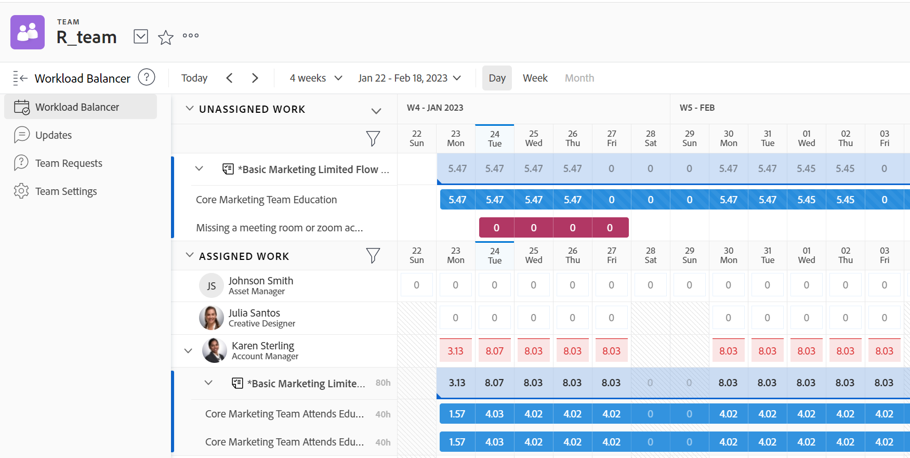

# 找到工作负载平衡器

您可以使用工作负载平衡器来计划工作资源或查看其可用性和当前分配。

您可以通过以下方式访问工作负载平衡器：

* 从Adobe Workfront预定义的多个区域
* 通过将其添加到自定义部分

本文介绍了可以访问工作负载平衡器的区域。

>[!NOTE]
>
>无论您使用何种方法访问工作负载平衡器，都会导览它并管理资源。
>
>有关工作负载平衡器以及如何使用它来管理和计划资源以用于工作的信息，请参阅以下文章：
>
>* [工作负载平衡器概述](../../resource-mgmt/workload-balancer/overview-workload-balancer.md)
>* [导航工作负载平衡器](../../resource-mgmt/workload-balancer/navigate-the-workload-balancer.md)
>* [工作负载平衡器中分配工作的概述](../../resource-mgmt/workload-balancer/assign-work-in-workload-balancer.md)
>* [在工作负载平衡器中管理用户分配](../../resource-mgmt/workload-balancer/manage-user-allocations-workload-balancer.md)
>

## 访问要求

您必须具有以下访问权限才能执行本文中的步骤：

<table style="table-layout:auto"> 
 <col> 
 <col> 
 <tbody> 
  <tr> 
   <td role="rowheader">Adobe Workfront计划*</td> 
   <td> 
任意 
 </td> 
  </tr> 
  <tr> 
   <td role="rowheader">Adobe Workfront许可证*</td> 
   <td> 
在为团队或在“资源”区域使用工作负载平衡器时进行计划 

   
使用项目的负载平衡器时工作 

 </td> 
  </tr> 
  <tr> 
   <td role="rowheader">访问级别*</td> 
   <td> 
查看或更高权限访问以下内容：
 
    <ul> 
     <li> 
资源管理
 </li> 
     <li> 
项目
 </li> 
     <li> 
任务
 </li> 
     <li> 
问题
 </li> 
    </ul> 
<b> 注释</b>

如果您仍然没有访问权限，请咨询Workfront管理员，他们是否在您的访问级别设置了其他限制。 有关Workfront管理员如何更改访问级别的信息，请参阅 <a href="../../administration-and-setup/add-users/configure-and-grant-access/create-modify-access-levels.md" class="MCXref xref">创建或修改自定义访问级别</a>.
 </td>
</tr> 
  <tr> 
   <td role="rowheader">对象权限</td> 
   <td> 
查看项目、任务和问题的权限或更高权限 
 
有关请求其他访问权限的信息，请参阅 <a href="../../workfront-basics/grant-and-request-access-to-objects/request-access.md" class="MCXref xref">请求对对象的访问 </a>.
 </td> 
  </tr> 
 </tbody> 
</table>

*要了解您拥有的计划、许可证类型或访问权限，请联系您的Workfront管理员。

## 在预定义区域中访问工作负载平衡器

以下各节说明在Workfront中可以访问工作负载平衡器的位置。

### 访问资源区中多个项目的负载平衡器

1. 单击 **主菜单** 图标 ，然后单击 **资源化**.
1. 单击 **工作负载平衡器** 中。

   

   默认情况下，工作负载平衡器在“资源”区域中按信息显示以下内容：

   * **未分配的工作**:没有未分配的工作项。
   * **分配的工作**:系统中所有活动用户。

      我们建议在“已分配的工作”区域中显示用户时使用过滤器。 有关更多信息，请参阅 [在工作负载平衡器中筛选信息](../workload-balancer/filter-information-workload-balancer.md).

### 访问团队的工作负载平衡器

1. 单击 **主菜单** 图标 ，然后单击“团队”。
此时会显示您的主团队的页面。

   默认情况下，将显示该团队的工作负载平衡器。

   

   默认情况下，团队的工作负载平衡器显示以下信息：

   * **未分配的工作**:分配给团队且未分配给用户的项目。
   * **分配的工作**:团队的所有成员都有其所有任务。

      >[!TIP]
      >
      >可以将团队成员分配给也会分配给团队的工作，或分配给其他团队或角色的工作。

### 访问项目的工作负载平衡器

1. 单击 **主菜单** 图标 ，然后单击 **项目**.
1. 单击项目名称以打开项目页面。
1. 单击 **工作负载平衡器** 中。 您可能需要单击 **显示更多**，则 **工作负载平衡器**.

   此时将显示项目的工作负载平衡器。

   

   默认情况下，项目的负载平衡器会显示以下信息：

   * **未分配的工作**:项目中分配给作业角色或团队且未分配给用户的项目。
   * **分配的工作**:分配给项目中项目的用户。

      >[!TIP]
      >
      >您可以通过启用显示所有用户选项来显示系统中的所有用户，而不是仅显示项目中的用户（在“已分配的工作区域”中）。 有关信息，请参阅 [导航工作负载平衡器](../workload-balancer/navigate-the-workload-balancer.md).

## 将工作负载平衡器添加到自定义部分

您可以将工作负载平衡器添加到任何自定义部分。

在将负载平衡器添加到自定义部分时，将保留已应用于该负载平衡器的大多数自定义设置。

1. 通过转到以下任一区域访问负载平衡器：

   * 资源区
   * 团队
   * 项目

1. 获取可共享链接，并将其复制到剪贴板，如 [使用链接共享工作负载平衡器](../../resource-mgmt/workload-balancer/share-link-for-workload-balancer.md).
1. 使用外部页面创建功能板，如 [在功能板中嵌入外部网页](../../reports-and-dashboards/dashboards/creating-and-managing-dashboards/embed-external-web-page-dashboard.md). 将您在步骤2中获得的可共享链接用于外部页面。

   <!--
      (NOTE: ensure this stays correct)
      -->

1. 创建自定义部分，如 [创建自定义选项卡或区域](../../workfront-basics/manage-your-account-and-profile/configuring-your-user-profile/create-custom-tabs.md) 将功能板置于自定义选项卡上。

   从自定义部分访问工作负载平衡器时，您可以像直接从步骤1中列出的工作负载平衡器原始区域之一访问它一样查看它。

   <!--
      (NOTE: ensure this stays correct)
     -->

1. （可选）在布局模板中共享自定义选项卡，如  [使用布局模板自定义左侧面板](../../administration-and-setup/customize-workfront/use-layout-templates/customize-left-panel.md) .

<!--
For a team:

* From the Workload Balancer section of a team.

  You can adjust allocations and review or assign work from multiple projects to individual team members.

For a project:

  You can do the following when you use the Workload Balancer within a project:

   * Assign work on the project to users already assigned other work on the project.
   * Assign work to any user that might not be on the project.

   * View additional work that users are assigned to on other projects.
   * Adjust user allocations to work items.-->