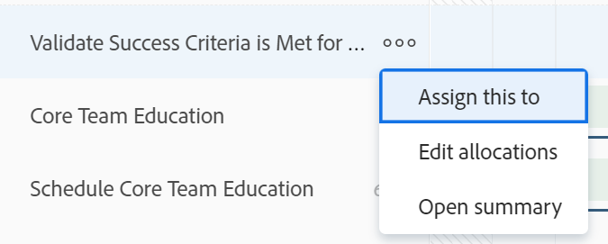

# 在工作负载平衡器中管理用户分配

作为资源管理员，您可以向用户分配工作，并从工作负载平衡器中管理其每日、每周或每月分配，以确保为他们分配符合其可用计划的小时数。

## 访问要求 {#access-requirements}

您必须具备以下条件：

<table style="table-layout:auto"> 
 <col> 
 <col> 
 <tbody> 
  <tr> 
   <td role="rowheader">Adobe Workfront计划*</td> 
   <td> <p>任意 </p> </td> 
  </tr> 
  <tr> 
   <td role="rowheader">Adobe Workfront许可证*</td> 
   <td> <p>在资源区中使用负载平衡器时进行计划</p>
   <p>使用团队或项目的负载平衡器时工作</p>
 </td> 
  </tr> 
  <tr> 
   <td role="rowheader">访问级别配置*</td> 
   <td> <p>编辑对以下项的访问权限：</p> 
    <ul> 
     <li> <p>资源管理</p> </li> 
     <li> <p>项目</p> </li> 
     <li> <p>任务</p> </li> 
     <li> <p>问题</p> </li> 
    </ul> <p>如果您仍然没有访问权限，请咨询Workfront管理员，他们是否在您的访问级别设置了其他限制。 有关Workfront管理员如何更改访问级别的信息，请参阅 <a href="../../administration-and-setup/add-users/configure-and-grant-access/create-modify-access-levels.md" class="MCXref xref">创建或修改自定义访问级别</a>.</p> </td> 
  </tr> 
  <tr> 
   <td role="rowheader">对象权限</td> 
   <td> <p>包含对要管理其分配的任务和问题进行分配的参与权限或更高权限。 </p> <p>或 </p> <p>除了更新分配之外，还管理要更新计划时数的任务的权限。 有关在工作负载平衡器中更新计划小时数的信息，请参阅 <a href="#update-task-planned-hours-when-managing-user-allocations">管理用户分配时更新任务计划小时数</a> 章节。 </p> <p>有关任务权限的信息，请参阅 <a href="../../workfront-basics/grant-and-request-access-to-objects/share-a-task.md">共享任务 </a><span> 和有关问题权限的信息，请参阅</span> <span href="../../workfront-basics/grant-and-request-access-to-objects/share-an-issue.md"><a href="../../workfront-basics/grant-and-request-access-to-objects/share-an-issue.md">共享问题 </a></span>. </p> <p>有关请求其他访问权限的信息，请参阅 <a href="../../workfront-basics/grant-and-request-access-to-objects/request-access.md">请求对对象的访问 </a>.</p> </td> 
  </tr> 
 </tbody> 
</table>

*要了解您拥有的计划、许可证类型或访问权限，请联系您的Workfront管理员。

## 了解用户分配

用户分配是指用户在某一给定日或工作日、周或月内完成工作项所应花费的时间的小时数。 它们包含在工作项的“计划时间”中。

本文介绍了如何为分配给任务或问题的用户更新每日、每周或每月每小时的分配。 有关管理用户和任务作业角色的总体分配的信息，请参阅 [管理任务的用户和角色分配小时数](../../manage-work/tasks/assign-tasks/manage-allocation-hours-on-tasks.md) .

* [用户分配概述](#user-allocation-overview)
* [重置用户分配的标准](#criteria-that-reset-user-allocations)

### 用户分配概述 {#user-allocation-overview}

您可以在工作负载平衡器中以小时或百分比值显示用户分配。 您可以调整小时数或百分比。

用户分配包含在工作项的计划小时数中。 有关计划时数的信息，请参阅 [计划时数概述](../../manage-work/tasks/task-information/planned-hours.md).

任务“计划小时数”在任务持续时间内分配给任务的用户的所有天之间平均分配。 例如，如果任务的持续时间为5天，总计为10个计划小时，则任务的每日分配数为2小时。 每周分配10小时。 这意味着，用户被分配每天处理任务2小时。 但是，您可以使用工作负载平衡器手动更改用户的每日分配。

>[!CAUTION]
>
>工作负载平衡器仅显示每个工作项的最多1000个计划小时和一个项目持续时间的最多1000天。 在达到1000小时或1000天限制后，工作负载平衡器中的分配将显示为零。 我们建议将任务划分为较小的子任务，以适应计划小时数较大或持续时间超过1000天的情况。

在工作负载平衡器中查找任务或问题的每日、每周或每月分配时，请考虑以下事项：

* 您可以查看用户对其工作项的每日、每周和每月分配。 启用“周”或“月”视图可显示每周或每月分配。
* 您可以使用负载平衡器修改用户对任务或问题的每日、每周或每月分配。 有关调整工作负载平衡器视图的信息，请参阅 [导航工作负载平衡器](../../resource-mgmt/workload-balancer/navigate-the-workload-balancer.md).

   >[!NOTE]
   >
   >我们建议您在管理用户分配时，决定要始终使用哪个时间范围（每日、每周或每月），而不要在这两个时间范围之间为同一工作项切换。 更新您之前为其更新每日分配的同一用户的每周分配，会更改该用户的每日分配。

* 您可以更新工作日和非工作日的分配。
* 当Workfront自动计算任务的每日分配时，工作项的计划起始日期和计划完成日期以及项目计划的时间戳非常重要。

>[!INFO]
>
> 例如，某任务的持续时间可能为2天，计划时间为2小时，计划开始时间在持续时间的第一天为12:00 PM，而项目计划则在下午5点结束。 用户第一天的容量为5小时。 用户第二天的容量为8小时（如果计划在上午9点开始）。
>
>Workfront使用以下公式计算持续时间的2天内2小时的分配：
>
>
```
>
>   Daily allocation hours = (Total Planned Hours / Total of available hours) * Daily available hours
>```
>
>  例如，每天的日分配小时数为：
>   
>  (2 / 13)* 5 =第一天的分配时数为0.77
>
>  (2 / 13)* 8 =第二天的分配时数为1.23小时
>
>  在上述计算中，13是任务的总可用小时数：5 + 8 = 13


* 处于不同时区的两个用户，或处于不同时区的计划（与已分配的用户不同）中的两个用户，可能会导致分配数量在查看相同工作项的两个用户中显示不同。

* 当用户安排了休息时间时，日期或一天中的某个部分会显示在灰色背景中。 如果Workfront管理员在“设置”区域中启用了“用户关机时间”设置以考虑用户的休机时间，则分配的小时数将移至时间轴中的下一个可用日期。 如果禁用该设置，则分配的小时数将保留在标记为超时的当天，并且用户将显示为“超量分配”。 有关更多信息，请参阅 [配置系统范围的项目首选项](../../administration-and-setup/set-up-workfront/configure-system-defaults/set-project-preferences.md).

   >[!TIP]
   >
   >如果在将用户分配到工作项目后标记了休息时间，则必须重新计算项目的时间轴以显示已移动的分配。 有关信息，请参阅 [重新计算项目时间表](../../manage-work/projects/manage-projects/recalculate-project-timeline.md).

* 如果有多个用户分配到该任务，则首先将计划小时数的数量平均分配给每个用户，然后在任务的持续时间内将计划小时数的数量平均分配给每天。 此分配将成为每个用户对任务的分配。

   例如，可能存在以下情况：

   * 对于持续时间为2天且为一个用户分配了10个计划小时的任务，默认情况下，该用户的每日分配为每天5小时。
   * 对于持续时间为2天且为两个用户分配了10个计划小时的任务，默认情况下，每个用户的每日分配为每天2.5小时。

* 如果任务或问题在计划完成日期之前完成，则剩余天数的已分配小时数将经过，不会计入用户的整体分配。 仅当同时启用了“显示分配”图标和“显示预计日期”设置时，才会显示此设置。 有关在工作负载平衡器中启用设置的详细信息，请参阅 [导航工作负载平衡器](../../resource-mgmt/workload-balancer/navigate-the-workload-balancer.md).

   

* 当用户被过度分配时，其分配的小时数在用户字段中以红色背景显示。
* 当用户被分配不足或分配到其计划可用时间的小时数时，小时数将显示为蓝色背景。
* 您可以在用户行的图表视图中显示用户的分配。 有关启用图表视图以进行用户分配的信息，请参阅文章中的“导航工作负载平衡器”部分 [导航工作负载平衡器](../../resource-mgmt/workload-balancer/navigate-the-workload-balancer.md).

   

### 重置用户分配的标准 {#criteria-that-reset-user-allocations}

并非所有任务更改都会触发修改后的分配以进行重新分发。 但是，某些操作可能会重置资源上已调整的分配，并将它们平均地重新分配给每个受分配者在工作项目期间的所有日期。

>[!NOTE]
>
>如果未修改工作项上分配的自动分配，则当工作项上的分配数量、任务持续时间或计划小时数发生更改时，小时数在所有分配者之间平均重新分配。

* [重置调整分配的操作](#actions-that-reset-adjusted-allocations)
* [未重置调整分配的操作](#actions-that-do-not-reset-adjusted-allocations)

#### 重置调整分配的操作 {#actions-that-reset-adjusted-allocations}

按照 [修改用户分配](#modify-user-allocations) 本文章节：

* 当缩短工作项的长度，从而缩短其持续时间内的天数时，将从丢失天数开始调整的分配小时数将添加到工作项最后一天的分配量。
* 当您更改分配或工作项上的计划小时数时，新的计划小时数将在工作项的整个持续时间内统一重新分配。
* 当您向工作项添加或删除工作负责人，并且这会导致任务的“计划小时数”发生更改时，调整后的值会一致重新分配。

#### 未重置调整分配的操作 {#actions-that-do-not-reset-adjusted-allocations}

对工作项的以下更改不会触发要重置或修改的调整分配：

* 当您移动工作项的天数但持续时间中的天数不变时，调整的分配值将保持不变并移至新日期。
* 如果增加工作项的持续时间，从而增加其持续时间中的天数，则调整后的分配小时数与调整后的天数相同。 工作项目中会添加额外的天数（分配的小时数为0）。
* 在工作项中添加或删除代理人时，如果这不会导致项目的“计划小时数”发生更改，则调整后的值将保持不变。

## 在工作负载平衡器中查找计划小时数

您可以使用负载平衡器通过查找分配给用户的任务或问题的计划时间来修改对任务或问题的用户分配。

在工作负载平衡器中查看计划时间时，请考虑以下事项：

* 任务或问题的总计划时数显示在负载平衡器左侧的任务或问题名称旁边。

* 项目的计划总时数显示在负载平衡器左侧的项目名称旁边。 这表示在负载平衡器中项目下列出的所有任务和问题的计划小时总数，而不是项目的所有计划小时数。
* 仅当您手动启用“显示分配”设置时，才会显示所有任务和所有项目的每日或每周分配的时间。 有关在工作负载平衡器中启用设置的信息，请参阅 [导航工作负载平衡器](../../resource-mgmt/workload-balancer/navigate-the-workload-balancer.md).

## 修改用户分配 {#modify-user-allocations}

在为用户分配工作时，您可以修改工作负载平衡器中的用户分配，以确保它们永远不会被过度分配，或确保资源之间的小时数准确平衡。 有关识别用户是否被过度分配的信息，请参阅部分 [用户分配概述](#user-allocation-overview) 在本文中。

1. 确保您的任务和问题已分配给用户。 有关在工作负载平衡器中为用户分配工作的信息，请参阅 [工作负载平衡器中分配工作的概述](../../resource-mgmt/workload-balancer/assign-work-in-workload-balancer.md).
1. 转到工作负载平衡器。
1. （可选）单击 **周** 或 **月** 管理用户的每周或每月分配。

   

1. 在 **分配的工作** 区域，找到要手动修改分配的用户，然后单击用户名左侧的向右箭头以展开用户。

   

1. 单击项目名称左侧的向右箭头可展开项目并显示用户分配到的工作项目。

   >[!TIP]
   >
   >您只能修改任务和问题的用户分配。 您无法修改项目的用户分配。

1. （可选）单击 **显示分配图标**  以显示所有工作项的分配。

   任务和项目的名称将替换为任务或项目的用户分配。

1. （可选）单击 **设置** 图标  ，然后选择以下任意选项：

   1. **包括来自问题的小时数**. 这样，除了任务分配之外，您还可以管理问题分配。
   1. **显示已完成工作** . 这会显示已完成并在您管理分配的时间轴期间计划的项目。
   1. **显示剩余时间** 选项。 每个用户（在用户行中）发生更改的总小时数。 启用此设置后，工作负载平衡器会显示每个用户可用的工作小时数，而不是他们分配的小时数。

      >[!TIP]
      >
      >启用此设置后修改分配会减少用户行中的总数。

   1. **项目** 在 **选择颜色主题** 中。 这会以独特的颜色显示每个项目及其各自的工作项目，并且更便于了解哪些项目属于哪个项目。
   1. **百分比** 在 **在** 中。 这会将分配显示为百分比值。 根据计划，用户的容量被认为是100%。 例如，如果用户与每天8小时的计划相关联，则8小时等于100%的容量。 如果要将用户分配到一天4小时的工作，您应将其分配更新为50%。

      >[!NOTE]
      >
      >Workfront管理员可决定在整个系统中使用哪个计划来计算“设置”的“资源管理”区域的用户能力。 有关更多信息，请参阅 [配置资源管理首选项](../../administration-and-setup/set-up-workfront/configure-system-defaults/configure-resource-mgmt-preferences.md).


1. 单击 **更多** 菜单  ，然后单击 **编辑分配**.



或

双击任务或问题栏中的日、周或月。

分配框将变得可编辑。

1. 在每日、每周或每月分配的框中单击以手动更新您希望用户每天、每周或每月分配的小时数或百分比值，然后单击 **保存** 图标 .

   >[!TIP]
   >
   >单击 **取消** 图标  删除您调整的分配。

   

   用户更新的分配。

   >[!TIP]
   >
   >如果任务或问题在计划完成日期之前完成，则剩余天数的已分配小时数将经过，不会计入用户的整体分配。 仅当同时启用了“显示分配”图标和“显示预计日期”设置时，才会显示此设置。

   存在以下情形：

   * 对于持续时间类型不为“简单”或“问题”的任务，分配总数必须与任务“计划小时数”匹配，然后您才能单击复选标记图标。
   * 对于具有简单持续时间类型的任务，分配的总数可以高于或低于计划小时数，并且您可以单击复选标记图标，即使它们不匹配。 这还会更新任务的计划小时数。 您必须拥有正确的权限和访问权限，才能从负载平衡器更新任务的计划时间。

      >[!TIP]
      >
      >当您开始调整分配以指示任务具有“简单持续时间类型”时，任务名称的右侧会显示锁图标。

      
   有关在工作负载平衡器中更新计划小时数时需要满足的条件的详细信息，请参阅本文的以下部分： [管理用户分配时更新任务计划小时数](#update-task-planned-hours-when-managing-user-allocations). 有关任务持续时间类型的信息，请参阅 [任务持续时间和持续时间类型概述](../../manage-work/tasks/taskdurtn/task-duration-and-duration-type.md).

1. （视情况而定）如果任务分配给多个用户，则对分配给该任务的每个用户重复这些步骤，以更新每个用户的分配。

   任何有权查看工作负载平衡器并查看相同用户以及您管理的相同项目的人员，现在都可以查看您管理的用户的更新分配。

## 管理用户分配时更新任务计划小时数 {#update-task-planned-hours-when-managing-user-allocations}

在任务的工作负载平衡器中管理用户分配时，可以更新任务的计划小时数。 如果更新的已分配小时总数与任务的原始计划小时总数不匹配，则会发生这种情况。

>[!IMPORTANT]
>
>* 更新任务的计划时数可能会影响项目进度。
>* 在将来从任务中删除分配时，通过更改每日分配来人工更新计划小时数可能会对计划小时数产生影响。 有关更多信息，请参阅 [计划时数概述](../../manage-work/tasks/task-information/planned-hours.md).
>
>* 无法通过更新负载平衡器中的分配来更新问题的计划时间。
>


当存在以下条件时，可以执行此操作：

* 您拥有从工作负载平衡器管理计划时间的正确权限和访问权限。 这些功能包括：

   * 管理任务的权限。
   * 在“访问级别”的“资源管理”区域的“工作负载平衡器”访问中更新计划小时数。

   有关使用工作负载平衡器所需的访问权限的详细信息，请参阅本文中的以下部分： [访问要求](#access-requirements) .

* 任务的“持续时间类型”为“简单”。

   <!--
  <p data-mc-conditions="QuicksilverOrClassic.Draft mode">(NOTE:&nbsp;the statement above might include other duration types in the future)</p>
  -->
