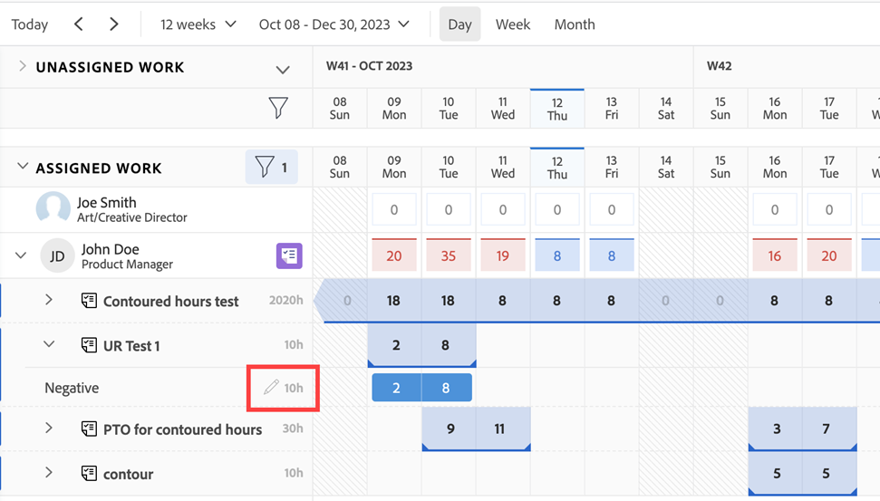

# 管理工作负载均衡器中的用户分配

<!-- Audited: 01/2024 -->

此页面上高亮显示的信息是指尚未普遍可用的功能。 它只能在“预览”环境中用于所有客户，或者在“生产”环境中用于启用快速版本的客户。

有关快速版本的信息，请参阅 [为您的组织启用或禁用快速发布](/help/quicksilver/administration-and-setup/set-up-workfront/configure-system-defaults/enable-fast-release-process.md).

有关当前版本的信息，请参阅 [2024年第二季度发行版概述](/help/quicksilver/product-announcements/product-releases/24-q2-release-activity/24-q2-release-overview.md).

作为资源管理器，您可以将工作分配给用户，并通过工作负载均衡器管理用户的每日、每周或每月分配，以确保为他们分配的小时数符合其可用计划。

## 访问要求 {#access-requirements}

您必须具备以下条件：

<table style="table-layout:auto"> 
 <col> 
 <col> 
 <tbody> 
  <tr> 
   <td role="rowheader">Adobe Workfront计划</td> 
   <td> 
任何 
 </td> 
  </tr> 
  <tr> 
   <td role="rowheader">Adobe Workfront许可证</td> 
   <td>
   
在资源区域使用工作负载均衡器时，您需要：

   
新增：标准

   
或

   
当前：计划

   
使用团队或项目的工作负载均衡器时，您需要：

   
新增：标准

   
或

   
当前：工作

 </td> 
  </tr> 
  <tr> 
   <td role="rowheader">访问级别配置</td> 
   <td> 
编辑对以下内容的访问权限：
 
    <ul> 
     <li> 
资源管理
 </li> 
     <li> 
项目
 </li> 
     <li> 
任务
 </li> 
     <li> 
问题
 </li> 
    </ul> </td> 
  </tr> 
  <tr> 
   <td role="rowheader">对象权限</td> 
   <td> 
Contribute权限或更高，包括“分配至要为其管理分配的任务和问题”。 
 
或 
 
管理要为其更新计划小时数和更新分配的任务的权限。 有关在工作负载均衡器中更新已计划小时数的信息，请参见 <a href="#update-task-planned-hours-when-managing-user-allocations">管理用户分派时更新任务已计划小时数</a> 部分。
 </td> 
  </tr> 
 </tbody> 
</table>

有关此表中信息的更多详细信息，请参见 [Workfront文档中的访问要求](/help/quicksilver/administration-and-setup/add-users/access-levels-and-object-permissions/access-level-requirements-in-documentation.md).

## 了解用户分配

用户分配是指用小时数表示用户在某一给定的日期或工作日、周或月完成工作项目所花费的时间。 它们包含在工作项的计划小时数中。

本文介绍了如何更新分配给任务或问题的用户的每日、每周或每月小时分配。 有关管理用户和任务职位角色的总体分配的信息，请参阅 [在任务中管理用户和角色分配小时数](../../manage-work/tasks/assign-tasks/manage-allocation-hours-on-tasks.md).

### 用户分配概述 {#user-allocation-overview}

可以在工作负载均衡器中将用户分配显示为小时数或百分比值。 您可以调整小时数或百分比。

用户分配包含在工作项的已计划小时数中。 有关计划小时数的信息，请参阅 [计划小时数概述](../../manage-work/tasks/task-information/planned-hours.md).

任务已计划小时数在任务持续时间内的所有天之间平均分配，分配给任务的用户。 例如，如果任务的工期为5天，计划小时总数为10小时，则任务的每日分配数为2小时。 每周分配时间为10小时。 这意味着用户会被分配每天工作2小时。 但是，您可以使用工作负载均衡器手动更改用户的每日分配。

>[!CAUTION]
>
>工作负载均衡器仅显示每个工作项最多1000个已计划小时数和每个工作项最多1000天的持续时间。 达到1000小时或1000天限制后，工作负载均衡器中的分配显示为零。 我们建议将任务划分为较小的子任务，以适应较多的计划小时数或超过1000天的持续时间。

在工作负载均衡器中找到任务或问题的每日、每周或每月分配时，请考虑以下事项：

* 您可以查看用户对其工作项的每日、每周和每月分配。 启用“周”或“月”视图以显示每周或每月分配。
* 您可以使用工作负载均衡器修改每日、每周或每月将用户分配给任务或问题。 有关调整工作负载均衡器视图的信息，请参见 [导航工作负载均衡器](../../resource-mgmt/workload-balancer/navigate-the-workload-balancer.md).

  >[!NOTE]
  >
  >我们建议您决定要在管理用户分配时始终使用哪个时间范围（每天、每周或每月），而不是为相同的工作项在它们之间切换。 对于先前更新了每日分配的同一用户，更新其每周分配将更改该用户的每日分配。

* 您可以更新工作日和非工作日的分配。
* 当Workfront自动计算任务的每日分配时，工作项的计划起始日期和计划完成日期的时间戳以及项目的计划非常重要。

  >[!INFO]
  >
  > 例如，任务的工期为2天，计划时间为2小时，任务的计划开始时间为工期第一天中午12:00，项目计划于下午5点结束。 用户第一天的容量为5小时。 用户第二天的产能为8小时（如果计划从上午9点开始）。
  >
  >Workfront使用以下公式计算工期2天内2小时的分配情况：
  >
  >`Daily allocation hours = (Total Planned Hours / Total of available hours) * Daily available hours`
  >
  >例如，每天的每日分配小时数为：
  >   
  >(2 / 13) * 5 =第一天的0.77分配小时
  >
  >(2 / 13) * 8 =第二天的1.23分配小时
  >
  >在上面的计算中，13是任务的总可用小时数：5 + 8 = 13

* 如果两个用户处于与分配用户处于不同时区的不同时区或计划，则会导致分配金额对于查看相同工作项目的两个用户显示得不同。

* 当用户有计划的休息时间时，一天或一天中的部分时间以灰色背景显示。 如果Workfront管理员在设置区域中启用了用户休息时间设置以考虑用户的休息时间，则分配的小时数将移至时间轴中的下一个可用日期。 如果禁用该设置，则分配的小时数将保留在标记为休息日的当天，并且用户显示为过度分配。 有关更多信息，请参阅 [配置系统范围的项目首选项](../../administration-and-setup/set-up-workfront/configure-system-defaults/set-project-preferences.md).

  >[!TIP]
  >
  >如果在将用户分配给工作项后标记了空闲时间，则必须重新计算项目的时间表以显示移动的分配。 有关信息，请参阅 [重新计算项目时间表](../../manage-work/projects/manage-projects/recalculate-project-timeline.md).

* 如果有多个用户分配到任务，则计划小时数首先平均分配给每个用户，然后平均分配给任务持续时间内的每一天。 此分配成为每个用户向任务的分配。

  例如，可能存在以下场景：

   * 对于工期为2天且分配给一个用户的10个已计划小时数的任务，默认情况下，该用户的每日分配为每天5小时。
   * 对于工期2天且分配给两个用户10个已计划小时数的任务，默认情况下，每个用户的每日分配为2.5小时。

* 如果任务或问题在计划完成日期之前完成，剩余天数的分配小时数将被清除，并且不计入用户的整体分配。 仅当同时启用显示分配图标和显示预计日期设置时，才会显示此字段。 有关启用工作负载均衡器中的设置的详细信息，请参见 [导航工作负载均衡器](../../resource-mgmt/workload-balancer/navigate-the-workload-balancer.md).

  

* 当用户分配过多时，其分配小时数在用户字段中以红色背景显示。
* 当用户未充分分配或分配了相等数量的小时数到其计划的可用时间时，小时数将以蓝色背景显示。
* 您可以在用户线中的图表视图中显示用户的分配。 有关为用户分配启用图表视图的信息，请参阅文章中的“导航工作负载均衡器”部分 [导航工作负载均衡器](../../resource-mgmt/workload-balancer/navigate-the-workload-balancer.md).

  

### 重置用户分配的标准 {#criteria-that-reset-user-allocations}

并非所有任务更改都会触发修改后的分配进行重新分配。 但是，有些行动可以重置资源上已调整的分配，并在每个受让人的工作项目持续时间的所有天平均重新分配这些分配。

>[!NOTE]
>
>如果尚未修改工作项分配的自动分配，则在工作项中的受分配人数量、任务持续时间或计划小时数数量发生更改时，小时数会在所有受分配人之间平均重新分配。

#### 重置已调整分配的操作 {#actions-that-reset-adjusted-allocations}

在手动调整用户的每日、每周或每月分配后，以下操作会重置或修改这些分配，如 [修改用户分配](#modify-user-allocations) 部分：

* 当缩短工作项的长度以缩短其持续时间中的天数时，来自丢失天的调整分配小时数将添加到该工作项最后一天的分配数量。
* 当您更改分配或工作项上的计划小时数金额时，新的计划小时数会在工作项的整个持续时间中统一重新分配。
* 当您将被分配者添加到工作项或从中移除被分配者时，这将导致任务的计划小时数发生更改，则调整后的值将均匀地重新分配。

#### 不会重置已调整分配的操作 {#actions-that-do-not-reset-adjusted-allocations}

对工作项的以下更改不会触发已调整分配以重置或修改：

* 当您移动工作项的天数，但持续时间中的天数未更改时，调整的分配值保持不变，并移动到新日期。
* 如果增加工作项的持续时间而增加其持续时间中的天数，则调整后的分配小时数在调整后的天数中保持不变。 额外的天数会添加到分配了0小时的工作项。
* 当您将被分配人添加到工作项或从中移除时，但这不会导致该工作的计划小时数发生更改，则调整后的值将保持不变。

## 在工作负载均衡器中找到计划的小时数

您可以使用工作负载均衡器修改用户对任务或问题的分配，方法是查找分配给用户的任务或问题的已计划小时数。

在工作负载均衡器查看已计划小时数时，请考虑以下事项：

* 任务或问题的总已计划小时数显示在工作负载均衡器的左侧任务或问题名称旁边。

* 项目的总计划小时数显示在工作负载均衡器的左侧的项目名称旁边。 这表示工作负载均衡器中在项目下列出的所有任务和问题的计划小时数总数，而不是项目的所有计划小时数。
* 仅当您手动启用“显示分配”设置时，才会显示所有任务和所有项目的每日或每周分配时间。 有关启用工作负载均衡器中的设置的信息，请参见 [导航工作负载均衡器](../../resource-mgmt/workload-balancer/navigate-the-workload-balancer.md).

## 修改用户分配 {#modify-user-allocations}

作为向用户分配工作的一部分，您可以修改工作负载均衡器中的用户分配，以确保不会过度分配用户分配，或确保资源之间的小时数准确平衡。 有关标识用户是否分配过量的信息，请参阅部分 [用户分配概述](#user-allocation-overview) 本文章中。

1. 确保您已将任务和问题分配给用户。 有关在工作负载均衡器中将工作分配给用户的信息，请参阅 [在工作负载均衡器中分配工作概述](../../resource-mgmt/workload-balancer/assign-work-in-workload-balancer.md).
1. 转到工作负载均衡器。
1. （可选）单击 **周** 或 **月** 管理用户的每周或每月分配。

   

1. 在 **已分派工作** 区域，找到要手动修改分配的用户，然后单击用户名左侧的右箭头展开该用户。

   

1. 单击项目名称左侧的向右箭头可展开项目并显示用户所分配的工作项。

   >[!TIP]
   >
   >您只能修改任务和问题的用户分配。 您无法修改项目的用户分配。

1. （可选）单击 **显示分派项** 图标  以显示所有工作项的分配。

   任务名称和项目名称会替换为任务或项目的用户分配。

1. （可选）单击 **设置** 图标  并选择以下任一选项：

   1. **包括来自问题的小时数**. 这样，除了任务分派之外，您还能管理问题分派。
   1. **显示已完成工作**. 它显示在您管理分配的时间线内已完成并计划的项目。
   1. **显示剩余时间**. 每个用户（在用户行中）的更改总小时数。 启用此设置后，工作负载均衡器显示每个用户可用于工作的小时数，而不是他们被分配的小时数。

      >[!TIP]
      >
      >启用此设置后修改分配会减少用户行中的总数。

   1. **项目** 在 **选择颜色主题** 部分。 这将以独特的颜色显示每个项目及其各自的工作项，并使您更容易了解哪些项属于哪个项目。
   1. **百分比** 在 **在中显示用户分配** 部分。 这会将分配显示为百分比值。 根据时间表，用户的容量被认为是100%。 例如，如果用户与每天8小时的时间表关联，则8小时等于100%的容量。 如果要将用户分配到每天工作4小时，则将其分配百分比更新为50%。

      >[!NOTE]
      >
      >在“设置”的“资源管理”区域，Workfront管理员可决定在整个系统中使用哪个计划来计算用户的容量。 有关更多信息，请参阅 [配置资源管理首选项](../../administration-and-setup/set-up-workfront/configure-system-defaults/configure-resource-mgmt-preferences.md).

1. 单击 **更多** 菜单  对于工作项，然后单击 **编辑分派项**.

   

   或

   双击任务或问题栏中的日、周或月。

   分配框变为可编辑。

1. 单击每个每日、每周或每月分配的框，以手动更新希望为其分配用户的每天、每周或每月的小时数或百分比值，然后单击 **保存** 图标 .

   >[!TIP]
   >
   >单击 **取消** 图标  以删除已调整的分配。

   

   用户分配将更新。

   >[!TIP]
   >
   >如果任务或问题在计划完成日期之前完成，剩余天数的分配小时数将被清除，并且不计入用户的整体分配。 仅当同时满足以下条件时，才会显示 **显示分派项** 图标和 **显示预计日期** 设置已启用。

   存在以下情况：

   * 对于持续时间类型不为简单或问题的任务，分配总数必须与任务已计划小时数匹配，然后才能单击复选标记图标。
   * 对于具有简单持续时间类型的任务，分配总数可以高于或低于计划小时数，并且您可以单击复选标记图标，即使它们不匹配。 这也会更新任务的已计划小时数。 您必须具有正确的权限和访问权限，才能从工作负载均衡器更新任务的已计划小时数。

     >[!TIP]
     >
     >当您开始调整分配时，任务名称的右侧将显示一个锁定图标，以指示该任务具有“简单持续时间类型”。

     

   有关在工作负载均衡器中更新已计划小时数需要满足的条件的更多信息，请参阅 [管理用户分派时更新任务已计划小时数](#update-task-planned-hours-when-managing-user-allocations) 部分。 有关任务持续时间类型的信息，请参阅 [任务工期和工期类型概览](../../manage-work/tasks/taskdurtn/task-duration-and-duration-type.md).

1. （视情况而定）如果任务被分配给多个用户，请对分配给任务的每个用户重复这些步骤，以更新每个用户的分配。

   有权查看工作负载均衡器并查看相同用户和您管理的相同项目的任何用户现在都会查看您管理的用户的更新分配。

>[!TIP]
>
>工作项名称的右侧将显示一个铅笔图标，指示已手动调整该工作项。

## 管理用户分派时更新任务已计划小时数 {#update-task-planned-hours-when-managing-user-allocations}

在任务的工作负载均衡器中管理用户分配时，您可以更新任务的已计划小时数。 当更新的已分配小时数总计与任务的已计划小时数的原始总计不匹配时，会发生这种情况。

>[!IMPORTANT]
>
>* 更新任务的计划小时数可能会影响项目的进度。
>* 在将来的任务中移除分配时，通过更改每日分配来手动更新计划小时数可能会对计划小时数产生影响。 有关更多信息，请参阅 [计划小时数概述](../../manage-work/tasks/task-information/planned-hours.md).
>
>* 无法通过更新工作负载均衡器中的分配来更新问题的规划小时数。

当存在以下条件时，这是可能的：

* 您具有从工作负载均衡器管理已计划小时数的正确权限和访问权限。 这些功能包括：

   * 管理任务的权限。
   * 在访问级别的资源管理区域的工作负载均衡器访问中更新已计划的小时数。

  有关使用工作负载均衡器所需访问的更多信息，请参见 [访问要求](#access-requirements) 部分。

* 任务的持续时间类型为“简单”。

