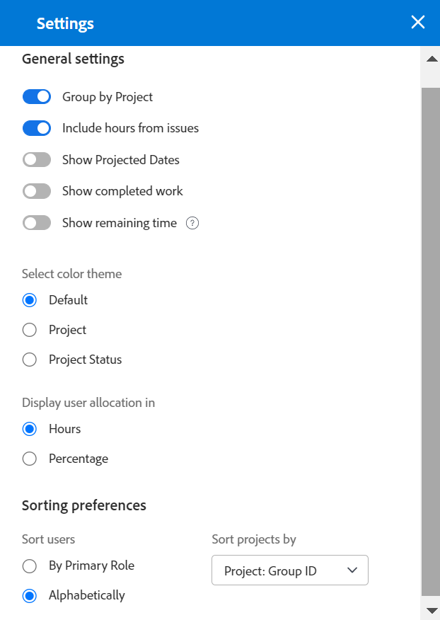

# 导航工作负载平衡器

使用Adobe Workfront中的工作负载平衡器，根据用户的可用性将工作分配给用户。 本文介绍了如何使用设置和选项来导航工作负载平衡器并显示与您相关的信息。 此处列出的其他文章介绍了如何使用负载平衡器管理资源及其分配工作。

工作负载平衡器可在Adobe Workfront的多个区域中使用。 在所有区域中导航都类似。

有关工作负载平衡器所在位置的详细信息，请参阅 [找到工作负载平衡器](https://experienceleague.adobe.com/docs/workfront/using/manage-resources/the-workload-balancer/locate-workload-balancer.html?lang=en).

## 访问要求

<!--drafted - replace table for P&P:

<table style="table-layout:auto"> 
 <col> 
 <col> 
 <tbody> 
  <tr> 
   <td role="rowheader">Adobe Workfront plan*</td> 
   <td> 
Any 
 </td> 
  </tr> 
  <tr> 
   <td role="rowheader">Adobe Workfront license*</td> 
<td>
Current license: Standard 

    Or 

Legacy license:

    <ul>
    <li>
Plan, when using the Workload Balancer for a team or in the Resourcing area 
</li>
    <li>
Work, when using the Workload Balancer of a project 
</li>
    </ul>
 </td> 
  </tr> 
  <tr> 
   <td role="rowheader">Access level configurations*</td> 
   <td> 
View or higher access to the following:
 
    <ul> 
     <li> 
Resource Management
 </li> 
     <li> 
Projects
 </li> 
     <li> 
Tasks
 </li> 
     <li> 
Issues
 </li> 
    </ul> 
If you still don't have access, ask your Workfront administrator if they set additional restrictions in your access level. For information on how a Workfront administrator can change your access level, see <a href="../../administration-and-setup/add-users/configure-and-grant-access/create-modify-access-levels.md" class="MCXref xref">Create or modify custom access levels</a>.
 </td> 
  </tr> 
  <tr> 
   <td role="rowheader">Object permissions</td> 
   <td> 
View or higher permissions to the projects, tasks, and issues 
 
For information on requesting additional access, see <a href="../../workfront-basics/grant-and-request-access-to-objects/request-access.md" class="MCXref xref">Request access to objects </a>.
 </td> 
  </tr> 
 </tbody> 
</table>
-->

您必须具有以下访问权限才能执行本文中的步骤：

<table style="table-layout:auto"> 
 <col> 
 <col> 
 <tbody> 
  <tr> 
   <td role="rowheader">Adobe Workfront计划*</td> 
   <td> 
任意 
 </td> 
  </tr> 
  <tr> 
   <td role="rowheader">Adobe Workfront许可证*</td> 
   <td> 
在为团队或在“资源”区域使用工作负载平衡器时进行计划 

   
使用项目的负载平衡器时工作 

 </td> 
  </tr> 
  <tr> 
   <td role="rowheader">访问级别配置*</td> 
   <td> 
查看或更高权限访问以下内容：
 
    <ul> 
     <li> 
资源管理
 </li> 
     <li> 
项目
 </li> 
     <li> 
任务
 </li> 
     <li> 
问题
 </li> 
    </ul> 
如果您仍然没有访问权限，请咨询Workfront管理员，他们是否在您的访问级别设置了其他限制。 有关Workfront管理员如何更改访问级别的信息，请参阅 <a href="../../administration-and-setup/add-users/configure-and-grant-access/create-modify-access-levels.md" class="MCXref xref">创建或修改自定义访问级别</a>.
 </td> 
  </tr> 
  <tr> 
   <td role="rowheader">对象权限</td> 
   <td> 
查看项目、任务和问题的权限或更高权限 
 
有关请求其他访问权限的信息，请参阅 <a href="../../workfront-basics/grant-and-request-access-to-objects/request-access.md" class="MCXref xref">请求对对象的访问 </a>.
 </td> 
  </tr> 
 </tbody> 
</table>

*要了解您拥有的计划、许可证类型或访问权限，请联系您的Workfront管理员。

## 查看工作负载平衡器中项目的注意事项

查看工作负载平衡器时请考虑以下事项：

* 工作负载平衡器根据工作项的分配，在两个不同的区域中显示工作项。 工作项和用户将显示在以下区域：

   * **未分配的工作**:没有分配或仅分配给作业角色或团队的项目。
   * **分配的工作**:分配给至少一个用户的项目。 分配的项目显示在分配的用户名称下。

   >[!NOTE]
   >
   >* 分配给职务角色或团队（也分配给作为主要代理人的用户）的项目不会显示在“未分配的工作”区域中。
   >
   >* 分配给用户的项目和选择了作业角色作为项目主要代理人的作业角色，将显示在“未分配的工作”区域中。
   >* 分配给多个用户的项目将显示在“已分配的工作”区域的所有用户名称下。

* 当项目在一段时间内没有任务时，项目级别的栏将变为灰色。

   

* 当您无权查看某些项目时，它们将显示为 **无法访问的工作项** 或 **无法访问的项目**.

   

* 工作项的名称会显示在左侧，其时间轴会显示在右侧。
* 每个工作项的计划小时总数显示在工作项名称的右侧以及表示工作项时间轴的栏的左侧。
* 每个项目的计划时数总计显示在项目名称的右侧，以及表示项目时间轴的栏的左侧。

   项目的“计划小时数”信息是工作负载平衡器中列出的所有项目的“计划小时数”总和，而不是项目上的“计划小时数”总和。

有关在工作负载平衡器中查看信息的详细信息，另请参阅以下文章：

* [找到工作负载平衡器](../workload-balancer/locate-workload-balancer.md)
* [在工作负载平衡器中筛选信息](../workload-balancer/filter-information-workload-balancer.md)
* [使用链接共享工作负载平衡器](../workload-balancer/share-link-for-workload-balancer.md)
* [使用摘要更新工作负载平衡器中的工作项](../workload-balancer/update-items-in-summary-panel-in-workload-balancer.md)

有关使用负载平衡器管理资源的信息，另请参阅以下文章：

* [工作负载平衡器中分配工作的概述](https://experienceleague.adobe.com/docs/workfront/using/manage-resources/the-workload-balancer/assign-work-in-workload-balancer.html?lang=en)
* [在工作负载平衡器中管理用户分配](https://experienceleague.adobe.com/docs/workfront/using/manage-resources/the-workload-balancer/manage-user-allocations-workload-balancer.html?lang=en)

## 在“资源”区域中为多个项目导航工作负载平衡器

在您从哪些区域访问负载平衡器时，导航该负载平衡器的方式都类似。

以下子部分介绍如何在负载平衡器中查看多个项目的信息。

您可以调整工作负载平衡器中的许多设置和选项，以显示您需要在对您最有意义的时间范围内重点关注的信息。

选择要应用于视图的设置后，工作负载平衡器会在您每次从任何浏览器或设备访问时都记住这些设置。

### 访问资源区中多个项目的负载平衡器

要导航多个项目的工作负载平衡器，请执行以下操作：

1. 单击 **主菜单** 图标  在Workfront的右上角，单击 **资源化**.
1. 单击 **工作负载平衡器** 中。

   

   工作负载平衡器在以下两个区域中显示从当前周开始的工作分配信息：

   * 的 **未分配的工作** 区域显示以下工作项：

      * 分配给角色、团队或未分配的工作项（任务和问题）会在应用过滤器后显示。
默认情况下，“未分配的工作”区域不显示任何工作项。 我们建议使用过滤器来显示此区域中的相关信息。

         有关使用过滤器的信息，请参阅 [在工作负载平衡器中筛选信息](../workload-balancer/filter-information-workload-balancer.md).

      * 仅当您启用按项目分组设置时，才会显示项目。 有关信息，请参阅 [自定义视图](#customize-the-view) 在本文中。
   * 的 **分配的工作** 区域显示以下工作项：

      * 默认情况下，系统中的所有活动用户都会显示在此区域。 我们建议使用过滤器限制此区域中的信息量。 如果用户被分配到项目，则工作项目也会显示在其名称下。

      * 分配给至少一个用户的任务和问题将以用户名显示。

         “已分配的工作”区域中用户名称下的工作项按以下顺序按以下标准排序：

         1. 计划开始日期（最早的）
         1. 计划完成日期（最早）
         1. 按项目字母顺序（仅当前两个标准对于多个工作项是相同的时）

            >[!TIP]
            >
            >* 您可以通过从“项目排序依据”设置中选择一个选项来自定义项目排序。
            >
            >* 仅当您启用“按项目分组”设置时，才会显示项目。

            > 
            >有关自定义设置的信息，请参阅部分 [自定义视图](#customize-the-view) 在本文中。

1. （可选）单击 **过滤器** 图标  在 **分配的工作** 区域，然后选择 **默认过滤器** 在 **建议** 框的下方。

   应用默认过滤器时，将显示属于您的任何团队的用户及其工作项。 您可以编辑此过滤器的副本。

   >[!TIP]
   >
   >“默认”筛选器仅在“资源”区域的“工作负载平衡器”中可用。

1. 继续执行以下步骤以导航工作负载平衡器：

   * [在工作负载平衡器中选择时间范围](#select-a-time-frame-in-the-workload-balancer)
   * [自定义视图](#customize-the-view)
   * [分配工作项并调整用户分配](#assign-work-items-and-adjust-user-allocations)
   * [在图表中查看分配](#view-allocations-in-a-chart)

### 在工作负载平衡器中选择时间范围

1. 访问 **资源化** 区域，如 [访问资源区中多个项目的负载平衡器](#access-the-workload-balancer-for-multiple-projects-in-the-resourcing-area) 在本文中。

   工作负载平衡器显示从当前周开始的工作分配信息。

1. 使用水平滚动查看超出屏幕限制的工作项的时间轴。
1. 单击 **向前或向前** 图标  在左上角导航时间轴，然后单击 **今天** 返回到当前周。
1. 单击 **时间范围下拉菜单** 在工具栏中，单击要显示的时段的开始日期。 默认情况下，日历上选择的第一周是您导航到的周。

   

1. 从以下选项中选择要在工作负载平衡器中一次显示的周数：
   * 1 周
   * 2 周
   * 4 周. 这是默认设置。
   * 6 周
   * 3 个月

   

1. 单击工具栏中的以下选项之一，按不同的时间范围显示信息：
   * **日**:默认情况下，按天显示从今天开始的四周的信息。
   * **周**:按周显示四周的信息。
   * **月**:按月显示三个月的信息。

1. 按照以下各节所述，继续导航工作负载平衡器。

### 自定义视图

1. 访问 **资源化** 区域，如 [访问资源区中多个项目的负载平衡器](#access-the-workload-balancer-for-multiple-projects-in-the-resourcing-area) 在本文中。

   工作项的名称在左侧列出，并由负载平衡器右侧的栏表示。 条的长度表示工作项的时间轴。

1. （可选和推荐）在“未分配”和“已分配”工作区中使用过滤器，只显示与您相关的工作项或用户。

   有关更多信息，请参阅 [在工作负载平衡器中筛选信息](../workload-balancer/filter-information-workload-balancer.md).

   默认情况下，蓝色条表示项目和任务的时间轴，而红色条表示问题。

   选择颜色主题以匹配项目时，您可以更改项目和任务的栏的颜色。 有关详细信息，请继续阅读此过程。

   “已分配的工作”区域中的工作项按以下标准按项目排序：
   1. 计划开始日期（最早的）
   1. 计划完成日期（最早）
   1. 按项目字母顺序（仅当前两个标准对于多个工作项是相同的时）

1. 单击 **向右箭头** 在“未分配”或“已分配”区域的左侧，可展开项目名称下（在“未分配”区域）和用户名下（在“已分配”区域）的所有项目。

   >[!TIP]
   >
   >仅当您启用“按项目分组”设置时，工作项才会列在“未分配”区域的项目名称下。

1. 单击 **向下箭头** 在“未分配”或“已分配”区域的左侧，可折叠项目名称下（在“未分配”区域）和用户名下（在“已分配”区域）的所有项目。

1. 拖放 **分离线** 在左侧面板和时间轴区域之间以调整左侧面板的大小。

   

1. 单击 **设置** 图标 .

   “设置”面板将显示在右侧。

   

   从下面列出的选项中选择，以更新您在工作负载平衡器中查看的信息，然后单击 **X图标** 来关闭它。

   * **按项目分组**:选择此选项后，“未分配”和“已分配的工作”区域中的项目将按项目分组。 默认情况下，此选项处于选中状态。

   * **包括问题发生后的小时数**:选择此选项后，分配给用户的问题将显示在“已分配的工作”区域的用户名下，而未分配给用户的问题则显示在“未分配的工作”区域中。 从问题开始的计划小时数计入“已分配工作”区域中项目和用户的计划小时数。
   * **显示预计日期**:选择此选项后，除计划时间轴外，还会显示工作项的预计时间轴。 请注意以下事项：
      * 项目、任务和问题的预计时间线显示为任务、问题和项目栏上方的深蓝线。
      * 计划时间轴以外的投影时间轴以浅蓝色显示，即使您更新颜色主题时也是如此，如下所述。
      * 您无权查看的项目的投影时间线以浅灰色显示，下面有一行。
      * 当任务或问题在到期计划完成日期之前完成时，剩余天数的分配编号将被划过，且不计入用户的分配。 仅当同时启用了显示预计日期设置和显示分配图标时，才会显示此设置。

      >[!TIP]
      >
      >请注意，当在选定的时间范围内出现工作项目的计划时间或预计时间表（不一定同时出现）时，工作项目会显示在工作负载平衡器中。

   * **显示已完成的工作**:启用此功能后，已完成的任务和问题将显示在“已分配的工作”区域中。 默认情况下，此设置处于启用状态。

      完成任务或问题栏的右上角会显示绿色复选标记图标。 完成项目选定时间范围的任务或问题后，将为项目显示相同的图标。
   * **显示剩余时间**:启用此功能后，Workfront会显示用户根据计划可工作的每日时间与用户在“已分配的工作”区域中分配的小时数之间的差。 默认情况下处于禁用状态，并且默认情况下会显示分配的时间。
   * 在 **选择颜色主题** 选项。

      >[!TIP]
      >
      >选择颜色主题的设置不会影响问题栏的颜色。 问题始终以红色条显示。

      从以下选项中进行选择：
      * **默认**:所有项目及其工作项的栏以蓝色显示。
      * **项目**:与每个项目及其任务关联的栏会根据项目名称而发生更改。 属于项目的所有任务都会以与项目颜色匹配的条形显示。 项目栏以较浅的阴影显示，以区分任务和项目栏。 选择不显示分配时，项目栏还包含一个项目图标。
      * **项目状态**:与每个项目及其工作项关联的栏会更改为项目状态的颜色。

         项目状态是与项目组关联的状态。 如果组没有特定于组的状态，则工作项栏的颜色为系统级别项目状态的颜色。 系统和自定义状态都会显示。 有关组状态的信息，请参阅 [创建或编辑群组状态](../../administration-and-setup/manage-groups/manage-group-statuses/create-or-edit-a-group-status.md).
   * 在 **在** 部分，从以下内容中选择：
      * **小时**:将分配的时间显示为小时。 这是默认设置。
      * **百分比**:显示已分配时间占总可用时间的百分比
   * 在 **排序首选项** 部分中，选择希望如何在负载平衡器中对项目进行排序。 从以下选项中进行选择：
      * **按主要角色对用户排序**:用户在“已分配的工作”区域中按其主要角色的字母顺序显示。
      * **按字母顺序对用户排序**:用户在“已分配的工作”区域中按其名字的字母顺序显示。
      * **项目排序依据**:从下拉菜单中选择一个项目字段，以在“未分配”或“已分配的工作”区域中按该字段的字母顺序对项目进行排序。

   >[!TIP]
   >
   >只有在启用了按项目分组设置后，才能按项目排序。 否则，此设置将变暗。

1. （可选和视情况而定）将颜色主题更改为“项目状态”时，将鼠标悬停在左侧的项目名称上可查看项目的状态。

   

### 分配工作项并调整用户分配

1. 按照一节中所述，在资源区中访问工作负载平衡器 [访问资源区中多个项目的负载平衡器](#access-the-workload-balancer-for-multiple-projects-in-the-resourcing-area) 在本文中。
1. 单击 **显示分配图标**  查看工作项的每日或每周计划小时数。

   这会将工作项栏中的名称替换为“未分配”和“已分配”工作区中的每日或每周计划小时数。 默认情况下，此设置处于禁用状态。

   显示超量分配的天数以红色显示。

   >[!TIP]
   >
   >* “显示分配”选项仅影响项目、任务、问题和不可访问项目显示的内容。 默认情况下，用户的每日计划时数会显示，且无法隐藏。
   >* 您必须启用“按项目分组”设置来显示项目的每日计划时数。
   >* 按周查看工作负载平衡器时，显示的小时数是每周计划小时数。

1. （可选）将鼠标悬停在用户行中分配的时间上，可了解用户的容量和分配情况。 容量是用户根据其时间表的可用性。

   

1. （可选）单击 **隐藏分配图标**  以在工作项的栏中显示任务和问题的名称。
1. 单击 **“更多”菜单** 图标  在任务或问题名称的右侧，单击下面的选项之一。

   

   * **将其分配给**，然后开始键入要在 **搜索人员、角色或团队** 字段。

      您还可以使用以下快捷键来分配任务或问题：

      * 在Windows中：按住Ctrl并单击任务或问题栏。
      * 在Mac:按住CMD并单击任务或问题栏。

      有关在工作负载平衡器中为用户分配工作项的详细信息，请参阅 [工作负载平衡器中分配工作的概述](../workload-balancer/assign-work-in-workload-balancer.md).

      >[!TIP]
      >
      >如果您的Workfront或组管理员在您的环境中启用了委派，请使用“分配”选项卡将用户分配到该任务或问题。 有关委派工作的信息，请参阅 [管理任务和问题委派](../../manage-work/delegate-work/how-to-delegate-work.md).

   * **编辑分配**，然后编辑用户的每日或每周分配。 有关管理用户分配的信息，请参阅 [在工作负载平衡器中管理用户分配](../workload-balancer/manage-user-allocations-workload-balancer.md).

   * **打开摘要**. 将在右侧打开“摘要”面板，然后单击“工作总揽”字段，并在 **搜索人员、角色或团队** 字段来分配项目。 有关更多信息，请参阅 [显示有关任务和问题的更多信息](#display-more-information-about-tasks-and-issues) 在本文中。

1. （可选）双击工作项栏内用户的每日或每周分配，以编辑已分配的小时数，然后单击 **保存** 图标  保存分配或 **取消** 图标   删除您调整的分配。

   >[!TIP]
   >
   >“保存”和“取消”图标在任务或问题的时间轴栏的末尾显示。
   >
   >

   有关管理用户分配的信息，请参阅 [在工作负载平衡器中管理用户分配](../workload-balancer/manage-user-allocations-workload-balancer.md).

1. 单击 **批量分配** 批量分配工作项。

   有关更多信息，请参阅 [使用工作负载平衡器批量分配工作](../workload-balancer/assign-work-in-workload-balancer-in-bulk.md).
1. 从 **未分配的工作** 区域或从用户中拖放到其他用户上以进行分配。

   有关更多信息，请参阅 [通过拖放在工作负载平衡器中分配工作](../workload-balancer/assign-work-in-workload-balancer-by-drag-and-drop.md).

### 在图表中查看分配

您可以在图表中查看分配，而不是以每日或每周数字查看分配。

1. 按照一节中所述，在资源区中访问工作负载平衡器 [访问资源区中多个项目的负载平衡器](#access-the-workload-balancer-for-multiple-projects-in-the-resourcing-area) 在本文中。
1. 单击 **图表图标**  以图表格式显示用户分配。

   用户被过度分配的天数显示为红色块，用户被未充分分配的天数或用户的容量显示为蓝色块。

   块的大小表示分配的数量：框越大，用户被分配到当天或周的工作项目的时间就越多。

   

### 显示有关任务和问题的更多信息

您可以在负载平衡器中查看有关任务和问题的详细信息。

1. 按照一节中所述，在资源区中访问工作负载平衡器 [访问资源区中多个项目的负载平衡器](#access-the-workload-balancer-for-multiple-projects-in-the-resourcing-area) 在本文中。
1. 要在“摘要”面板中查看更多信息，请执行以下操作之一：

   * 单击任务或问题栏以打开右侧的“摘要”面板。
   * 单击 **打开摘要** 图标 ，然后单击任务或问题栏以打开“摘要”面板。
   * 单击 **更多** 菜单，然后单击 **打开摘要**.

   有关在工作负载平衡器的“摘要”中更新任务信息的信息，请参阅 [使用摘要更新工作负载平衡器中的工作项](../workload-balancer/update-items-in-summary-panel-in-workload-balancer.md).

1. 将鼠标悬停在任务或问题的名称上可查看有关该任务或问题的更多信息。 任务或问题上方会显示一个框，其中包含以下信息：

   * 任务或问题的名称。
   * 项目的名称。
   * 计划的开始和完成日期。
   * 计划小时数。
   * 对于任务，前置编号。
   * 对于任务，框上角的指示器，指示任务是否已准备就绪，可供处理。

   

1. 单击左侧的工作项名称以访问该工作项。 在新的浏览器选项卡中打开工作项。

### 全屏显示工作负载平衡器

1. 按照一节中所述，在资源区中访问工作负载平衡器 [访问资源区中多个项目的负载平衡器](#access-the-workload-balancer-for-multiple-projects-in-the-resourcing-area) 在本文中。

1. 单击 **全屏** 图标  全屏显示工作负载平衡器。

   工作负载平衡器占据整个屏幕。 从视图中排除浏览器窗口和选项卡。

1. 单击 **退出全屏** 图标  返回到默认屏幕并在浏览器选项卡中查看工作负载平衡器。

## 导航团队的工作负载平衡器

导航团队的工作负载平衡器与导航多个项目的工作负载平衡器类似。 有关信息，请参阅 [导航多个项目的工作负载平衡器](#navigate-the-workload-balancer-for-multiple-projects-in-the-resourcing-area) 在本文中。

1. 单击 **主菜单** 图标 ，然后单击 **团队**.
默认情况下，将显示您的“Home Team”（主团队）的页面。
1. 单击 **工作负载平衡器** 中。 默认情况下，应显示团队的工作负载平衡器。

   

   默认情况下，团队的工作负载平衡器显示以下信息：

   * 在 **未分配的工作** 区域：分配给团队或团队和工作角色的工作项，以及未分配给用户的工作项。
   * 在 **分配的工作** 区域：分配给用户的工作项显示在用户名下。

1. 按照 [在“资源”区域中为多个项目导航工作负载平衡器](#navigate-the-workload-balancer-for-multiple-projects-in-the-resourcing-area) 本文章的章节。

## 导航单个项目的工作负载平衡器

1. 单击 **主菜单** 图标 ，然后单击 **项目**.
1. 单击项目名称以打开项目页面。
1. 单击 **工作负载平衡器** 中。 您可能需要单击 **显示更多**，则 **工作负载平衡器**.

   

   默认情况下，项目的工作负载平衡器会显示以下信息：

   * 在 **未分配的工作** 区域：项目中分配给角色或团队的工作项，但未分配给用户。
   * 在 **分配的工作** 区域：项目中分配给至少一个用户的工作项。

   我们建议使用过滤器来仅显示对您很重要的用户。

   例如，您可以考虑仅显示属于您的团队或群组的用户。 有关更多信息，请参阅 [在工作负载平衡器中筛选信息](../workload-balancer/filter-information-workload-balancer.md).

1. （可选）单击 **过滤器** 图标  在“已分配的工作”区域中，选择 **此项目的工作项目** 选项 **建议** 的上界。 默认情况下，此过滤器处于取消选中状态。

   选择此选项后，将仅显示分配给选定项目用户的项目。

   未选择选项时，将显示分配给项目用户的所有项目，而不管这些项目属于什么项目。

1. （可选和推荐）在“已分配的工作”区域中应用过滤器，以显示对您重要但可能未分配给项目项目的用户，然后单击 **显示所有用户** 图标 .

   通过显示所有用户，您可以显示Workfront中尚未分配给项目工作或其他角色的所有用户。

   您可以先应用过滤器，以减少显示的用户数量。

   例如，您可能希望首先过滤属于您的团队或群组的用户，然后显示所有这些用户。

   有关如何构建过滤器的信息，请参阅 [在工作负载平衡器中筛选信息](../workload-balancer/filter-information-workload-balancer.md).

   >[!NOTE]
   >
   > “显示所有用户”选项仅适用于项目的工作负载平衡器。

1. （可选）单击 **显示角色分配** 图标 .

   此时会显示“角色分配”面板。

   您可以从方案计划员中查看与项目上的任务职责关联的计划小时数，以及与链接到项目的方案相关联的任务职责的信息。

   有关更多信息，请参阅 [协调项目和举措之间的资源分配的概述](../../scenario-planner/overview-reconcile-allocations-between-projects-initiatives.md).

   >[!NOTE]
   >
   >如果贵组织尚未为Workfront方案计划员购买许可证，则您无法查看方案任务职责信息。 在这种情况下，您只能查看与项目中的作业角色关联的计划时间。 有关更多信息，请参阅 [使用方案计划员所需的访问权限](../../scenario-planner/access-needed-to-use-sp.md).

1. 按照 [导航多个项目的工作负载平衡器](#navigate-the-workload-balancer-for-multiple-projects-in-the-resourcing-area) 本文章的章节。

<!--old content below - this used to be a one-large-procedure article - outdated, and rewrote it above with several smaller procedures: 

# Navigate the Workload Balancer

<!-drafted note for 22.4 release: remove all production/ preview references at Prod release>

The highlighted information on this page refers to functionality not yet generally available. It is available only in the Preview environment. 

Use the Workload Balancer to understand the availability of your resources as well as to assign work to your users. This article walks you through using the icons and settings available to update the view for and navigate the Workload Balancer.

>[!NOTE]
>
>The Workload Balancer is a resource scheduling tool that will eventually replace the current resource scheduling tools which are currently deprecated. 
>
>For more information about removing the resource scheduling tools and replacing them with the Workload Balancer, see [Deprecation of Resource Scheduling tools in Adobe Workfront](../../resource-mgmt/resource-mgmt-overview/deprecate-resource-scheduling.md).
>
>We recommend that you use the Workload Balancer for scheduling your resources.

The Workload Balancer is available in multiple areas of Adobe Workfront. Navigating it is similar in all areas. This article describes how to navigate the Workload Balancer for multiple projects in the Resourcing area. For more information about where the Workload Balancer is located, see [Locate the Workload Balancer](../../resource-mgmt/workload-balancer/locate-workload-balancer.md).

For information about managing resources using the Workload Balancer, also consider reading the following articles:

* [Overview of assigning work in the Workload Balancer](../../resource-mgmt/workload-balancer/assign-work-in-workload-balancer.md)
* [Manage user allocations in the Workload Balancer](../../resource-mgmt/workload-balancer/manage-user-allocations-workload-balancer.md)

## Access requirements

You must have the following access to perform the steps in this article:

<table style="table-layout:auto"> 
 <col> 
 <col> 
 <tbody> 
  <tr> 
   <td role="rowheader">Adobe Workfront plan*</td> 
   <td> 
Any 
 </td> 
  </tr> 
  <tr> 
   <td role="rowheader">Adobe Workfront license*</td> 
   <td> 
Plan, when using the Workload Balancer in all areas in the Production environment

   
Work, when using the Workload Balancer of a project, in the Preview environment 
 </td> 
  </tr> 
  <tr> 
   <td role="rowheader">Access level configurations*</td> 
   <td> 
View or higher access to the following:
 
    <ul> 
     <li> 
Resource Management
 </li> 
     <li> 
Projects
 </li> 
     <li> 
Tasks
 </li> 
     <li> 
Issues
 </li> 
    </ul> 
If you still don't have access, ask your Workfront administrator if they set additional restrictions in your access level. For information on how a Workfront administrator can change your access level, see <a href="../../administration-and-setup/add-users/configure-and-grant-access/create-modify-access-levels.md" class="MCXref xref">Create or modify custom access levels</a>.
 </td> 
  </tr> 
  <tr> 
   <td role="rowheader">Object permissions</td> 
   <td> 
View or higher permissions to the projects, tasks, and issues 
 
For information on requesting additional access, see <a href="../../workfront-basics/grant-and-request-access-to-objects/request-access.md" class="MCXref xref">Request access to objects </a>.
 </td> 
  </tr> 
 </tbody> 
</table>

*To find out what plan, license type, or access you have, contact your Workfront administrator.

## Considerations for viewing items in the Workload Balancer

Consider the following when viewing the Workload Balancer:

* Projects display in the Workload Balancer only when the Group by Project setting is enabled. This setting is enabled by default.
* Mousing over a task or an issue displays the following additional information about the task or issue:

  * Project name

  * Task or issue name

  * Parent task

  * Planned Start and Completion Dates

  * Number of Planned Hours

  * Ready to start or Not ready status

  

* When a project has no tasks during a period of time, the bar at the project level becomes a dimmed color.

  

* When you don't have permissions to see certain items, they display as **Inaccessible work items** or **Inaccessible projects**.

  

* The names of the work items display on the left and within the timeline selected on the right. 
* The total of Planned Hours for each work item displays to the right of the name of the work items on the left. 
* The total of the Planned Hours for each project displays to the right of the name of the project on the left.

  The Planned Hours information for the project is a total of Planned Hours from all items listed in the Workload Balancer, and not a total of Planned Hours on the project.

## Overview of the Unassigned Work and Assigned Work areas

The Workload Balancer displays work items in two separate areas, depending on their assignments.

The two areas of the Workload Balancer display the following information:

<table style="table-layout:auto"> 
 <col> 
 <col> 
 <tbody> 
  <tr> 
   <td role="rowheader">Unassigned Work</td> 
   <td> 
This area displays tasks and issues unassigned to users. 
 
Projects display when the Group by Project setting is enabled.
 
This area does not display any work items by default. We recommend using filters to display relevant information for you in this area.
 
After you apply a filter, this area displays the following work items:
 
    <ul> 
     <li>unassigned</li> 
     <li>assigned to a team </li> 
     <li>assigned to a job role</li> 
     <li> 
assigned to a team and a role at the same time
 </li> 
    </ul> 
Tip: Items assigned to a user as the primary assignee do not display in the Unassigned Work area. 
 </td> 
  </tr> 
  <tr> 
   <td role="rowheader">Assigned Work</td> 
   <td> 
 All active users in the system display in this area by default. We recommend using filters to limit the amount of information in this area.  
 
Both tasks and issues display in the Assigned Work area. 
 
Projects display when the Group by Project setting is enabled.
 
The work items that the users are assigned to display under their names. 
 
If a work item is assigned to multiple users, the item displays under each assigned user. 
 </td> 
  </tr> 
 </tbody> 
</table>

For information about applying a filter in the Workload Balancer, see [Filter information in the Workload Balancer](../../resource-mgmt/workload-balancer/filter-information-workload-balancer.md).

## Navigate the Workload Balancer

You can update the view in the Workload Balancer to display exactly the information you need to focus on in the time frame that makes the most sense to you.

After selecting the settings you want to apply to your view, the Workload Balancer remembers these settings every time you access it from any browser or device.

1. Click the **Main Menu** icon  in the upper-right corner of Workfront, then click **Resourcing**.
1. Click **Workload Balancer** in the left panel.

   The Workload Balancer displays work assignment information starting with the current week. The names of work items are listed on the left side as well as represented by bars on the right side of the of the Workload Balancer within their respective timelines. By default, blue bars represent the timelines of projects and tasks and maroon bars represent issues.

   >[!TIP]
   >
   >You can change the color of the bars for projects and tasks when you select your color scheme to match the project. For more information, continue reading this procedure.

   The work items that display under the name of users in the Workload Balancer are sorted by the following criteria, in this order:

   1. Planned Start Date (oldest first)
   1. Planned Completion Date (oldest first)
   1. Alphabetical by project (only when the first two criteria are identical for multiple work items)

1. Click the right-pointing arrow to the left of the Unassigned or Assigned areas to expand all items under the project names (in the Unassigned area) and under the user names (in the Assigned area).
1. Click the down-pointing arrow to the left of the Unassigned or Assigned areas to collapse all items under the project names (in the Unassigned area) and under the user names (in the Assigned area).
1. Use the horizontal scroll to navigate the timelines of work items that extends beyond the limits of the screen. 
1. Use the vertical scroll to display additional users and work items. 
1. Drag and drop the separation line between the left panel and the timeline areas to adjust the size of the left panel.

   

1. Click the **Filter icon**  in the upper-right corner of the **Unassigned Work** or the **Assigned Work** areas to select the type of information to display in the Workload Balancer.

   For information about filtering information in the Workload Balancer, see [Manage filters in the Workload Balancer](../../resource-mgmt/workload-balancer/filter-information-workload-balancer.md). 

1. Click the right-pointing arrow next to **Unassigned Work** to expand this area or the down-pointing arrow to collapse it.

   >[!TIP]
   >
   >No items display in this area by default. You must apply a filter to view unassigned work items.

1. Drag and drop the separation line between the **Unassigned Work** and **Assigned Work** areas to adjust their size.

   

1. Click the back or forward icons  to navigate the timeline, then click **Today** to return to the current week. 

1. Click the **time frame drop-down menu** on the toolbar, then click the beginning date of the period you want to display. By default, the first week selected on the calendar is the week you navigated to.

   

1. Click one of the following options in the toolbar to display information by different time frames:

   <table style="table-layout:auto"> 
    <col> 
    <col> 
    <tbody> 
     <tr> 
      <td role="rowheader">Day</td> 
      <td>Displays information by day for four weeks starting with today's date, by default. </td> 
     </tr> 
     <tr> 
      <td role="rowheader">Week</td> 
      <td>Displays information by week for four weeks. </td> 
     </tr> 
     <tr data-mc-conditions=""> 
      <td role="rowheader">Month</td> 
      <td> 
Displays information by month for three months. 
 </td> 
     </tr> 
    </tbody> 
   </table>

1. Select the number of weeks you want to display at one time in the Workload Balancer from the following options:

   * 1 week
   * 2 weeks
   * 4 weeks. This is the default setting.
   * 6 weeks
   * 3 months
        

1. Click the **Settings** icon .

   The Settings panel displays.

   

   Select from the options listed below to update the information you view in the Workload Balancer, then click the **X icon** in the upper-right of the Settings box to close it.

   * **Group by Project**: When this is selected, the items in the Unassigned and Assigned Work areas are grouped by project. This is selected by default.

     

   * **Include hours from issues**: When this is selected, issues assigned to users display under the user's name in the Assigned Work area and issues that are not assigned to users display in the Unassigned Work area. The Planned Hours from the issues count towards the Planned Hours for the project and for the user in the Assigned Work area. 

        

   
      * **Show Projected Dates**: When this is selected, the projected timeline of work items displays in addition to the planned timeline. Notice the following:

         * The projected timeline of project, tasks, and issues displays as a dark blue line above the task, issue, and project bars.
         * The projected timeline that is outside of the planned timeline displays in light blue, even when you update the color theme, as described below.
         * The projected timeline for the items that you have no access to view displays in light gray with a line underneath.
         * When a task or issue completes before the due Planned Completion Date the allocation numbers for the remaining days are struck through and do not count towards the user's allocation. This displays only when both the Show Projected Dates setting and the Show allocation icon are enabled.

         

         >[!TIP]
         >
         >Notice that work items display in the Workload Balancer when either their planned or the projected timelines (not necessarily both at the same time) occur during the timeframe selected.

   * **Show completed work**: When this is enabled, tasks and issues that are completed display in the Assigned Work area. This is enabled by default.

     A green checkmark icon  displays to the upper-right corner of a task or issue bar when they are completed. The same icon displays for a project when the tasks or issues for the selected time frame of the project are completed. 
   
   * **Show remaining time**: When this is enabled, Workfront displays the difference between the daily time for which the user is available to work based on their schedules and the hours for which they are allocated in the Assigned Work area for the users. This is disabled by default and allocated time displays by default.

   * In the **Select color theme** section, select the color that you want for the project and task bars.  

      >[!NOTE]
      >
      >The setting for selecting the color theme  does not affect the color of the issue bars. Issues always display in a maroon-color bar. 

      Select from the following:

      * **Default**: The bars for all projects and their work items display in blue.  
      * **Project**: The bars associated with each project and its tasks change according to the name of the project. All tasks that belong to the project display in bars that match the color of the project. The project bars display in a lighter shade to distinguish them from the tasks. The project bars also include a project icon when choosing not to display allocations.
      * **Project Status**: The bars associated with each project and its work items change to the color of the status of the project.

        >[!TIP]
        >
        >* The project status is that associated with the Group of the project. If the Group does not have group-specific statuses, the color of the work item bars is that of the system-level project status. Both system as well as custom statuses display. For information about group statuses, see [Create or edit a group status](../../administration-and-setup/manage-groups/manage-group-statuses/create-or-edit-a-group-status.md).
        
   * In the **Display user allocation in** section, select from the following:

      * **Hours**: Displays allocated time as hours. This is the default. 
      * **Percentage**: Displays allocated time as a percentage of the total available time

   * In the **Sorting preferences** section, select how you want the items to be sorted in the Workload Balancer. Select from the following options: 

      * **Sort users by Primary Role**: Users display in the alphabetical order of their Primary Roles in the Assigned Work area.

      * **Sort users alphabetically**: Users display in the alphabetical order of their first names in the Assigned Work area.

      * **Sort projects by**: Select a project field from the drop-down menu to sort projects alphabetically by that field in the Unassigned or Assigned Work areas. 

      >[!TIP]
      >
      >You can sort by projects only when the Group by Project setting is enabled. Otherwise, this setting is dimmed.

1. (Optional and conditional) If you changed the color theme to Project Status, hover over the name of a project on the left to view the status of the project.

   

1. (Conditional and recommended) In the Workload Balancer of a project, apply a filter in the Assigned Work area to display users that are important to you but might not be assigned to items on the project, then click the **Show all users** icon . This displays other users in the system that are not yet assigned on the project. For information about how to build a filter, see [Manage filters in the Workload Balancer](../workload-balancer/filter-information-workload-balancer.md).

 
   >[!TIP]
   >
   >The Show all users icon is available only for the Workload Balancer of a project. 

1. Click the **Chart icon**  to display the user allocation in a chart format. Days where the user is overallocated display as red blocks, and days where the user is underallocated or at capacity display as blue blocks. The size of the blocks indicates the amount of the allocation: the larger the box, the more time the user is allocated to work items for that day or week.

   

1. Click the **Show allocations icon**  to view the daily or weekly Planned Hours for work items.

   This replaces the name in the bars of the work items with the amount of daily or weekly Planned Hours in the Unassigned and Assigned Work areas. This setting is disabled by default.

   >[!TIP]
   >
   >* The Show allocations setting only affects what displays for projects, tasks, issues and inaccessible items. Daily Planned Hours for users display by default and cannot be hidden.
   >* You must enable the Group by Project setting to display daily Planned Hours for projects. 
   >* When you view the Workload Balancer by week, the hours displayed are the weekly Planned Hours. 

   Days that show overallocations display in red. 

1. (Optional) Hover over the allocated time in the user line to understand what the capacity and allocation of the user. The capacity is the availability of the user according to their schedule.

   

1. (Optional) Click the **Hide allocations icon**  to display the name of the tasks in the bars of the work items. 
1. Click the **More menu** icon  to the right of a task or issue name, then click one of options below. 

   

      * **Assign this to**, then start typing the name of a user, role, or team you want to assign the work item to in the **Search people, role, or teams** field.
    
      >[!TIP]
      >
      >You can also use the following shortcuts to assign tasks or issues:
      >
      >* In Windows: CTRL+click the task or issue bar.
      >* In Mac: CMD+click the task or issue bar.

      For more information about assigning work items to users in the Workload Balancer, see [Overview of assigning work in the Workload Balancer](../../resource-mgmt/workload-balancer/assign-work-in-workload-balancer.md). 

      >[!TIP]
      >
      >If your Workfront or group administrator enabled delegations in your environment, use the Assignments tab to assign users to the task or issue. For information about delegating work, see [Manage task and issue delegation](../../manage-work/delegate-work/how-to-delegate-work.md).

   * **Edit allocations**, then edit the daily or weekly allocations for the user. For information about managing user allocations, see [Manage user allocations in the Workload Balancer](../../resource-mgmt/workload-balancer/manage-user-allocations-workload-balancer.md).

1. Click the bar of a task or issue to open the Summary panel on the right

   Or

   Click **Open Summary** icon , then click the bar of a task or issue to open the Summary panel

   Or

   Click the **More** menu  to the right of a task or issue, then click **Open Summary**.

   For information about updating task information in the Summary in the Workload Balancer, see [Update work items in the Workload Balancer using the Summary](../../resource-mgmt/workload-balancer/update-items-in-summary-panel-in-workload-balancer.md).

    The Summary panel opens on the right. 

1. Click **Bulk Assignments** to assign work items in bulk.

   For more information, see [Assign work in bulk using the Workload Balancer](../../resource-mgmt/workload-balancer/assign-work-in-workload-balancer-in-bulk.md). 

1. Click the **Full screen** icon  to display the Workload Balancer in full screen, then click the **Exit full screen** icon  to return to the default screen. 
1. (Optional) Double-click a daily or weekly allocation for a user inside the bar of a work item to edit the number of allocated hours, then click the **Save** icon  to save the allocations or the **Cancel** icon  to remove the allocations you adjusted.

   >[!TIP]
   >
   >The Save and Cancel icons display towards the end of a task or an issue's timeline bar.

   For information about managing user allocations, see [Manage user allocations in the Workload Balancer](../../resource-mgmt/workload-balancer/manage-user-allocations-workload-balancer.md). 

1. Click the name of a work item on the left to access it. 
1. Click the **Shareable link icon**  to copy the direct URL for the Workload Balancer to your clipboard. 
1. (Optional) Share the link with any user who does not have direct access to the Workload Balancer.

   For information about sharing the Workload Balancer with a link, see [Share the Workload Balancer with a link](../../resource-mgmt/workload-balancer/share-link-for-workload-balancer.md). 

1. (Conditional) From the Workload Balancer of a project, click the **Show role allocations** icon .

   The Role Allocation panel displays. You can view information about Planned Hours associated with job roles on the project and job roles associated with initiatives from the Scenario Planner. For more information, see [Overview of reconciling resource allocations between projects and initiatives](../../scenario-planner/overview-reconcile-allocations-between-projects-initiatives.md).

   >[!TIP]
   >
   >You cannot view initiative job role information if your organization has not purchased a license for the Workfront Scenario Planner. In this case, you can only view the planned hours associated with job roles on the project. For more information, see [Access needed to use the Scenario Planner](../../scenario-planner/access-needed-to-use-sp.md).

-->