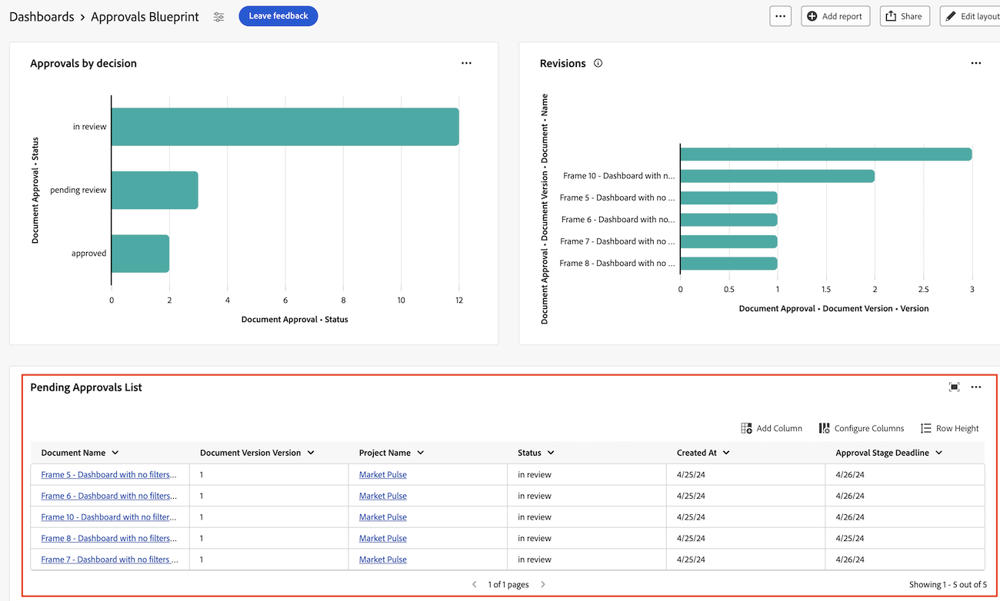

# 创建用于审阅和审批的报告仪表板

您可以在“画布功能板”区域中创建报告功能板，以显示有关具有统一审批功能的审阅和审批的高级信息和详细信息。

>[!IMPORTANT]
>
>此功能仅适用于使用统一审批服务并注册了画布功能板测试版的客户。

## 创建信息板

{{step1-to-dashboards}}

1. 在左侧面板中，单击&#x200B;**画布功能板**。
1. 单击&#x200B;**新仪表板**。
1. 命名您的仪表板。
1. （可选）添加说明。
1. 单击&#x200B;**创建**。
   

创建功能板后，即可开始添加KPI、图表和表格。 有关更多信息，请参阅以下部分：

* [使用KPI和图表添加高级审阅和批准信息](#add-high-level-review-and-approval-information-with-kpis-and-charts)
* [使用表格添加详细的审阅和批准信息](#add-detailed-review-and-approval-information-with-tables)

## 使用KPI和图表添加高级审阅和批准信息

您可以通过KPI和图表查看有关文档审批的高级信息。 深入分析信息当前在Beta版中不可用。

### KPI

#### 待处理审批

1. [创建仪表板](#create-a-dashboard)，如上节所述。
1. 在&#x200B;**KPI**&#x200B;卡中，单击&#x200B;**添加**。
1. 在&#x200B;**KPI标题**&#x200B;文本框中键入&#x200B;_待处理_。
1. 在&#x200B;**KPI标题**&#x200B;文本框中键入&#x200B;_待处理审批_。 此文本描述KPI所显示的内容。
1. 单击页面顶部的&#x200B;**选择KPI字段**。
1. 向下滚动并找到&#x200B;**文档审批文件夹**。
1. 选择&#x200B;**状态**，然后从下拉菜单中选择&#x200B;**计数**。
1. 单击&#x200B;**编辑筛选器** > **添加条件**。
   1. 单击进入空条件筛选器，单击&#x200B;**选择字段**，然后选择&#x200B;**状态**。
   1. 将运算符保留为&#x200B;**Equal**，并在文本框中键入&#x200B;_等待审阅_。
      
1. 单击屏幕右上角的&#x200B;**完成**。

#### 逾期审批

1. [创建仪表板](#create-a-dashboard)，如上节所述。
1. 在&#x200B;**KPI**&#x200B;卡中，单击&#x200B;**添加**。
1. 在&#x200B;**KPI标题**&#x200B;文本框中键入&#x200B;_Overdue_。
1. 在&#x200B;**KPI题注**&#x200B;文本框中键入&#x200B;_过去审批阶段截止日期_。 此文本描述KPI显示的内容。
1. 在页面顶部，单击&#x200B;**选择KPI字段**。
1. 向下滚动并找到&#x200B;**文档批准文件夹**。
1. 选择&#x200B;**状态**，然后从下拉菜单中选择&#x200B;**计数**。
1. 单击&#x200B;**编辑筛选器** > **添加条件**：
   1. 单击进入空条件筛选器，单击&#x200B;**选择字段**，然后选择&#x200B;**截止日期**。
   1. 将运算符更改为&#x200B;**小于**，并切换相对日期为“开启”，然后在文本框中键入&#x200B;_$$TODAY_。
      
1. 单击&#x200B;**添加条件**：
   1. 单击进入空条件筛选器，单击&#x200B;**选择字段**，然后选择&#x200B;**状态**。
   1. 将运算符更改为&#x200B;**Not Contains**，然后在文本框中键入&#x200B;_approved_。
      
1. 单击屏幕右上角的&#x200B;**完成**。

#### 已完成的审批

1. [创建仪表板](#create-a-dashboard)，如上节所述。
1. 在&#x200B;**KPI**&#x200B;卡中，单击&#x200B;**添加**。
1. 在&#x200B;**KPI标题**&#x200B;文本框中键入&#x200B;_已完成_。
1. 在&#x200B;**KPI标题**&#x200B;文本框中键入&#x200B;_审批状态计数_。 此文本描述KPI所显示的内容。
1. 单击页面顶部的&#x200B;**选择KPI字段**。
1. 向下滚动并找到&#x200B;**文档审批文件夹**。
1. 选择&#x200B;**状态**，然后从下拉菜单中选择&#x200B;**计数**。
1. 单击&#x200B;**编辑筛选器** > **添加条件**：
   1. 单击进入空条件筛选器，单击&#x200B;**选择字段**，然后选择&#x200B;**状态**。
   1. 将运算符更改为&#x200B;**包含**，并在文本框中键入&#x200B;_approved_。
      
1. 单击&#x200B;**添加条件**：
   1. 单击&#x200B;**和**&#x200B;将其更改为&#x200B;**或**。
   1. 单击空条件筛选器，单击&#x200B;**选择字段**，然后选择&#x200B;**状态**。
   1. 将运算符更改为&#x200B;**等于**，然后在文本框中键入&#x200B;_review_。
      
1. 单击屏幕右上角的&#x200B;**完成**。

#### 放弃的审批

1. [创建仪表板](#create-a-dashboard)，如上节所述。
1. 在&#x200B;**KPI**&#x200B;卡中，单击&#x200B;**添加**。
1. 在&#x200B;**KPI标题**&#x200B;文本框中键入&#x200B;_放弃的_。
1. 在&#x200B;**KPI标题**&#x200B;文本框中键入&#x200B;_超过2周的审批截止日期_。 此文本描述KPI所显示的内容。
1. 单击页面顶部的&#x200B;**选择KPI字段**。
1. 向下滚动并查找&#x200B;**文档审批阶段文件夹**。
1. 选择&#x200B;**截止日期**，然后从下拉菜单中选择&#x200B;**计数**。
1. 单击&#x200B;**编辑筛选器** > **添加条件**：
   1. 单击进入空条件筛选器，单击&#x200B;**选择字段**，然后选择&#x200B;**状态**。
   1. 将运算符更改为&#x200B;**Not Contains**，并在文本框中键入&#x200B;_approved_。
      
1. 单击&#x200B;**添加条件**：
   1. 单击进入空条件筛选器，单击&#x200B;**选择字段**，然后选择&#x200B;**截止日期**。
   1. 将运算符更改为&#x200B;**小于**，然后切换“相对日期为”为“开启”，然后在文本框中键入&#x200B;_$$TODAY-2w_。
      
1. 单击屏幕右上角的&#x200B;**完成**。

### 图表

#### 按决策条形图显示的审批

1. [创建仪表板](#create-a-dashboard)，如上节所述。
1. 在&#x200B;**图表**&#x200B;卡中，单击&#x200B;**添加**。
1. 在&#x200B;**名称**&#x200B;文本框中键入&#x200B;_按决定_&#x200B;审批。
1. （可选）在&#x200B;**描述**&#x200B;文本框中键入描述。 此文本将作为工具提示显示在图表名称旁边。
1. 单击&#x200B;**打开图表详细信息**。
1. 在&#x200B;**图表类型**&#x200B;下拉菜单中，保持选中&#x200B;**条形图**。
1. 在&#x200B;**条形图类型**&#x200B;下拉菜单中，保持选择&#x200B;**简单**。
1. 单击&#x200B;**底部(X)轴**&#x200B;的&#x200B;**更新字段**，然后依次选择第一个&#x200B;**文件批准**&#x200B;文件夹和&#x200B;**状态**。
1. 将聚合类型设置为&#x200B;**计数**。
1. 单击&#x200B;**左(Y)轴**&#x200B;的&#x200B;**更新字段**，然后选择第一个&#x200B;**文档审批**&#x200B;选项和&#x200B;**状态**。
1. 单击过滤器选项卡。
1. 单击&#x200B;**编辑筛选器** > **添加条件**：
   1. 单击进入空条件筛选器，单击&#x200B;**选取一个字段**，然后选择&#x200B;**文档版本**。
   1. 将运算符更改为&#x200B;**Is Not Null**。
      
1. 单击屏幕右上角的&#x200B;**完成**。

#### 修订条状图

1. [创建仪表板](#create-a-dashboard)，如上节所述。
1. 在&#x200B;**图表**&#x200B;卡中，单击&#x200B;**添加**。
1. 在&#x200B;**名称**&#x200B;文本框中键入&#x200B;_修订版_。
1. 在&#x200B;**Description**&#x200B;文本框中，键入&#x200B;_本月底之前计划的决策不完整的文档的修订数_。 此文本将作为工具提示显示在图表名称旁边。
1. 单击&#x200B;**打开图表详细信息**。
1. 在&#x200B;**图表类型**&#x200B;下拉菜单中，保留&#x200B;**条形图**&#x200B;处于选中状态。
1. 在&#x200B;**栏类型**&#x200B;下拉菜单中，保留&#x200B;**简单**&#x200B;选项。
1. 单击&#x200B;**底部(X)轴**&#x200B;的&#x200B;**更新字段**，然后选择第一个&#x200B;**文档审批**&#x200B;文件夹，然后&#x200B;**文档版本** > **版本**。
1. 将聚合类型设置为&#x200B;**计数**。
1. 单击&#x200B;**左(Y)轴**&#x200B;的&#x200B;**更新字段**，然后选择第一个&#x200B;**文档审批**&#x200B;选项，然后选择&#x200B;**文档版本** > **文档** > **名称**。
1. 单击过滤器选项卡。
1. 单击&#x200B;**编辑筛选器** > **添加条件**：
   1. 单击进入空条件筛选器，单击&#x200B;**选择字段**，然后选择&#x200B;**审批阶段参与者决策日期**。
   1. 将运算符更改为&#x200B;**Is Null**。
      
1. 单击&#x200B;**编辑筛选器** > **添加条件**：
   1. 单击进入空条件筛选器，单击&#x200B;**选择字段**，然后选择&#x200B;**审批阶段截止日期**。
   1. 将运算符更改为&#x200B;**小于或等于**，然后切换“设置相对日期为”并在文本框中键入&#x200B;_$$TODAYem_。
      
1. 单击屏幕右上角的&#x200B;**完成**。

## 使用表格添加详细的审阅和批准信息

### 待处理审批列表

1. [创建仪表板](#create-a-dashboard)，如上节所述。
1. 在&#x200B;**表**&#x200B;卡中，单击&#x200B;**添加**。
1. 在&#x200B;**名称**&#x200B;文本框中键入&#x200B;_待处理审批_。
1. （可选）在&#x200B;**描述**&#x200B;文本框中键入描述。 此文本将作为工具提示显示在图表名称旁边。
1. 单击&#x200B;**打开列设置**。
1. 单击&#x200B;**添加列**，向下滚动并单击第一个&#x200B;**Document Approvals**&#x200B;文件夹，然后选择&#x200B;**状态**。
1. 添加以下列：

   <table>
    <tr>
    <td><strong>项目名称</strong></td>
    <td>文档版本&gt;文档&gt;项目&gt;名称</td>
    </tr>
    <tr>
    <td><strong>文档名称</strong></td>
    <td>文档版本&gt;文档&gt;在搜索框中键入_Name_。</td>
    </tr>
    <tr>
    <td><strong>文档版本</strong></td>
    <td>文档版本&gt;文档&gt;版本</td>
    </tr>
    <tr>
    <td><strong>截止日期</strong></td>
    <td>文档&gt;审批阶段&gt;截止日期</td>
    </tr>
    <tr>
    <td><strong>请求者</strong></td>
    <td>文档&gt;审批阶段&gt;审批阶段参与者* &gt;请求者&gt;在搜索框中键入_Name_。</td>
    </tr>
     <tr>
    <td><strong>请求的日期</strong></td>
    <td>文档&gt;审批阶段&gt;审批阶段参与者* &gt;创建于</td>
    </tr>
     <tr>
    <td><strong>审批者</strong></td>
    <td>文档&gt;审批阶段&gt;审批阶段参与者* &gt;参与者用户&gt;在搜索框中键入_Name_。</td>
    </tr>
    <table>

   *批准阶段参与者将被截断为批准阶段Pa。

1. 继续[在](#add-the-required-filter)下添加所需的筛选器。

#### 添加所需的待处理审批过滤器

1. 单击过滤器选项卡。
1. 单击&#x200B;**编辑筛选器** > **添加条件**：
   1. 单击进入空条件筛选器，单击&#x200B;**选择字段**，然后选择&#x200B;**状态**。
   1. 将运算符更改为&#x200B;**等于**，然后键入&#x200B;_待审批_。
      
1. 添加如下所述的可选筛选器，或单击屏幕右上角的&#x200B;**完成**。

**可选筛选器**

要根据您的用例查看更多具体信息，您可以添加其他筛选条件。 您可能需要重新创建表并根据用例添加新的筛选条件。

+++ 展开以查看其他筛选器选项

**我的项目**

1. 单击&#x200B;**编辑筛选器** > **添加条件**：
   1. 单击进入空条件筛选器，单击&#x200B;**选取字段**，然后在搜索框中选择&#x200B;**文档版本** > **文档** > **项目** > **所有者** >键入&#x200B;_名称_。
   1. 将运算符更改为&#x200B;**等于**，然后选择&#x200B;**我（已登录的用户）**以在Workfront中显示您标记为项目所有者的项目。
      
1. 单击屏幕右上角的&#x200B;**完成**。

**我已提交的审批**

1. 单击&#x200B;**编辑筛选器** > **添加条件**：
   1. 单击进入空条件筛选器，单击&#x200B;**选择字段**，然后在搜索框中选择&#x200B;**审批阶段** > **审批阶段参与者** > **请求者** >键入&#x200B;_名称_。
   1. 将运算符更改为&#x200B;**等于**，然后选择&#x200B;**我（已登录的用户）**以在Workfront中显示您标记为项目所有者的项目。
      
1. 单击屏幕右上角的&#x200B;**完成**。

+++

### 逾期审批列表

1. [创建仪表板](#create-a-dashboard)，如上节所述。
1. 在表卡中，单击&#x200B;**添加**。
1. 在&#x200B;**名称**&#x200B;文本框中键入&#x200B;_逾期审批_。
1. （可选）在&#x200B;**描述**&#x200B;文本框中键入描述。 此文本将作为工具提示显示在图表名称旁边。
1. 单击&#x200B;**打开列设置**。
1. 单击&#x200B;**添加列**，向下滚动并单击第一个&#x200B;**Document Approvals**&#x200B;文件夹，然后选择&#x200B;**状态**。
1. 添加以下列：

   <table>
    <tr>
    <td><strong>项目名称</strong></td>
    <td>文档版本&gt;文档&gt;项目&gt;名称</td>
    </tr>
    <tr>
    <td><strong>文档名称</strong></td>
    <td>文档版本&gt;文档&gt;在搜索框中键入_Name_。</td>
    </tr>
    <tr>
    <td><strong>文档版本</strong></td>
    <td>文档版本&gt;文档&gt;版本</td>
    </tr>
    <tr>
    <td><strong>截止日期</strong></td>
    <td>文档&gt;审批阶段&gt;截止日期</td>
    </tr>
    <tr>
    <td><strong>请求者</strong></td>
    <td>文档&gt;审批阶段&gt;审批阶段参与者* &gt;请求者&gt;在搜索框中键入_Name_。</td>
    </tr>
     <tr>
    <td><strong>请求的日期</strong></td>
    <td>文档&gt;审批阶段&gt;审批阶段参与者* &gt;创建于</td>
    </tr>
     <tr>
    <td><strong>审批者</strong></td>
    <td>文档&gt;审批阶段&gt;审批阶段参与者* &gt;参与者用户&gt;在搜索框中键入_Name_。</td>
    </tr>
    <table>

   *批准阶段参与者将被截断为批准阶段Pa。

1. 继续[在](#add-the-required-filter-1)下添加所需的筛选器。

#### 添加所需的逾期审批过滤器

1. 单击过滤器选项卡。
1. 单击&#x200B;**编辑筛选器** > **添加条件**：
   1. 单击进入空条件筛选器，单击&#x200B;**选择字段**，然后选择&#x200B;**审批阶段** > **截止日期**。
   1. 将运算符更改为&#x200B;**小于**，将&#x200B;**设置相对日期**&#x200B;切换为On，然后键入&#x200B;_$$TODAY_。
      
1. 添加如下所述的可选筛选器，或单击屏幕右上角的&#x200B;**完成**。

**可选筛选器**

要根据您的用例查看更多具体信息，您可以添加其他筛选条件。 您可能需要重新创建该表，并根据用例添加新的可选筛选条件。

+++ 展开以查看其他筛选器选项

**我的项目**

1. 单击&#x200B;**编辑筛选器** > **添加条件**：
   1. 单击进入空条件筛选器，单击&#x200B;**选取字段**，然后在搜索框中选择&#x200B;**文档版本** > **文档** > **项目** > **所有者** >键入&#x200B;_名称_。
   1. 将运算符更改为&#x200B;**等于**，然后选择&#x200B;**我（已登录的用户）**以在Workfront中显示您标记为项目所有者的项目。
      
1. 单击屏幕右上角的&#x200B;**完成**。

**我已提交的审批**

1. 单击&#x200B;**编辑筛选器** > **添加条件**：
   1. 单击进入空条件筛选器，单击&#x200B;**选择字段**，然后在搜索框中选择&#x200B;**审批阶段** > **审批阶段参与者** > **请求者** >键入&#x200B;_名称_。
   1. 将运算符更改为&#x200B;**等于**，然后选择&#x200B;**我（已登录的用户）**以在Workfront中显示您标记为项目所有者的项目。
      
1. 单击屏幕右上角的&#x200B;**完成**。

**我的团队**

1. 单击&#x200B;**编辑筛选器** > **添加条件**：
   1. 单击进入空条件筛选器，单击&#x200B;**选择字段**，然后选择&#x200B;**审批阶段** > **审批阶段参与者** > **参与者团队** >在搜索框中键入&#x200B;_姓名_。
   1. 将运算符更改为&#x200B;**等于**，然后选择&#x200B;**我的默认团队（登录用户）**&#x200B;或&#x200B;**我的其他团队（登录用户）**以显示分配给您的默认团队或您所在的其他团队的项目。
      
1. 单击屏幕右上角的&#x200B;**完成**。
+++
